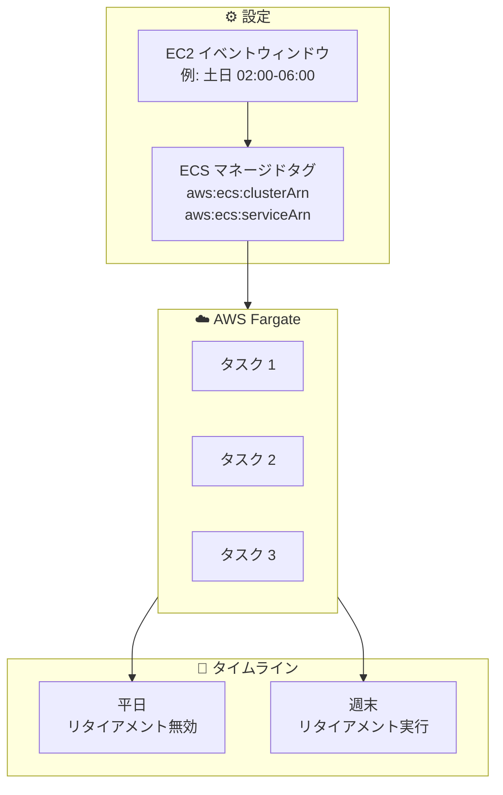

# Amazon ECS - Fargate タスクリタイアメントの週次イベントウィンドウ

**リリース日**: 2025 年 12 月 18 日
**サービス**: Amazon Elastic Container Service (ECS)
**機能**: AWS Fargate タスクリタイアメントの週次イベントウィンドウ

## 概要

Amazon ECS が AWS Fargate でのタスクリタイアメントをスケジュールするための週次イベントウィンドウを定義できるようになりました。この機能により、インフラストラクチャの更新やタスクの置き換えが発生するタイミングを正確に制御でき、ピーク時間帯のミッションクリティカルなワークロードへの影響を防ぐことができます。

AWS Fargate は、サーバーを管理せずにアプリケーションの構築に集中できるサーバーレスのコンピューティングエンジンです。AWS の共有責任モデルの一環として、Fargate は定期的なプラットフォーム更新で基盤インフラストラクチャを維持します。今回のアップデートにより、これらの更新のタイミングを業務に合わせて制御できるようになりました。

**アップデート前の課題**

- タスクリタイアメントのタイミングを細かく制御できなかった
- ピーク時間帯にタスクの置き換えが発生する可能性があった
- 自動化を構築してタスク置き換えを制御する必要があった
- ミッションクリティカルなワークロードへの影響リスク

**アップデート後の改善**

- 週次イベントウィンドウでリタイアメントのタイミングを正確に制御
- ピーク時間帯を避けたスケジューリングが可能
- EC2 イベントウィンドウインターフェースを活用した簡単な設定
- ビジネス要件に合わせた柔軟なスケジューリング

## アーキテクチャ図



イベントウィンドウを設定し、ECS マネージドタグで関連付けることで、タスクリタイアメントのタイミングを制御できます。

## サービスアップデートの詳細

### 主要機能

1. **週次イベントウィンドウの定義**
   - 特定の曜日と時間帯を指定
   - 複数のウィンドウを設定可能
   - EC2 イベントウィンドウインターフェースを使用

2. **ECS マネージドタグによる関連付け**
   - `aws:ecs:clusterArn`: クラスター内のすべてのタスクを対象
   - `aws:ecs:serviceArn`: 特定のサービスのタスクを対象
   - `aws:ecs:fargateTask=true`: すべての Fargate タスクを対象

3. **既存機能との統合**
   - `fargateTaskRetirementWaitPeriod` 設定との併用
   - AWS Health Dashboard 通知との連携

## 技術仕様

### イベントウィンドウ設定

| 項目 | 詳細 |
|------|------|
| 設定単位 | 週次 |
| 時間指定 | 曜日 + 時間範囲 |
| 複数ウィンドウ | サポート |
| 最小ウィンドウ | 2 時間 |

### タグによるターゲット指定

| タグ | 対象 |
|------|------|
| `aws:ecs:clusterArn` | クラスター内の全タスク |
| `aws:ecs:serviceArn` | 特定サービスのタスク |
| `aws:ecs:fargateTask=true` | 全 Fargate タスク |

### 既存のリタイアメント設定

| 設定 | 値 | 説明 |
|------|-----|------|
| fargateTaskRetirementWaitPeriod | 0 | 即時リタイアメント |
| fargateTaskRetirementWaitPeriod | 7 | 7 日後 (デフォルト) |
| fargateTaskRetirementWaitPeriod | 14 | 14 日後 |

## 設定方法

### 前提条件

1. AWS アカウントへのアクセス権限
2. Amazon ECS へのアクセス権限
3. EC2 イベントウィンドウの設定権限

### 手順

#### ステップ 1: fargateEventWindows の有効化

```bash
aws ecs put-account-setting \
    --name fargateEventWindows \
    --value enabled
```

アカウント設定で Fargate イベントウィンドウを有効化します。これは一度だけ実行する必要があります。

#### ステップ 2: EC2 イベントウィンドウの作成

```bash
aws ec2 create-instance-event-window \
    --name "weekend-maintenance" \
    --time-ranges '[{"StartWeekDay": "saturday", "StartHour": 2, "EndWeekDay": "sunday", "EndHour": 6}]'
```

週末の土曜日 2:00 から日曜日 6:00 までのイベントウィンドウを作成します。

#### ステップ 3: イベントウィンドウと ECS タスクの関連付け

```bash
aws ec2 associate-instance-event-window \
    --instance-event-window-id iew-xxx \
    --association-target "InstanceTags=[{Key=aws:ecs:clusterArn,Value=arn:aws:ecs:region:account:cluster/my-cluster}]"
```

イベントウィンドウを ECS クラスターのタスクに関連付けます。

## メリット

### ビジネス面

- **サービス可用性の向上**: ピーク時間帯のタスク置き換えを回避
- **計画的なメンテナンス**: ビジネス要件に合わせたスケジューリング
- **運用の予測可能性**: リタイアメントのタイミングを事前に把握

### 技術面

- **柔軟な制御**: 週次スケジュールでの細かい制御
- **既存機能との統合**: EC2 イベントウィンドウインターフェースを活用
- **タグベースの管理**: 柔軟なターゲット指定

## デメリット・制約事項

### 制限事項

- 商用 AWS リージョンでのみ利用可能
- イベントウィンドウは最小 2 時間必要
- 緊急のセキュリティパッチは例外的にウィンドウ外で適用される場合がある

### 考慮すべき点

- イベントウィンドウが狭すぎると、リタイアメントが完了しない可能性
- 複数のサービスで異なるウィンドウを設定する場合の管理複雑性

## ユースケース

### ユースケース 1: E コマースサイトのピーク時間回避

**シナリオ**: 平日の日中はトラフィックが多く、タスクの置き換えを避けたい

**実装例**:
```bash
# 平日深夜のみリタイアメントを許可
aws ec2 create-instance-event-window \
    --name "weeknight-maintenance" \
    --time-ranges '[{"StartWeekDay": "monday", "StartHour": 2, "EndWeekDay": "monday", "EndHour": 5}, {"StartWeekDay": "tuesday", "StartHour": 2, "EndWeekDay": "tuesday", "EndHour": 5}, {"StartWeekDay": "wednesday", "StartHour": 2, "EndWeekDay": "wednesday", "EndHour": 5}, {"StartWeekDay": "thursday", "StartHour": 2, "EndWeekDay": "thursday", "EndHour": 5}, {"StartWeekDay": "friday", "StartHour": 2, "EndWeekDay": "friday", "EndHour": 5}]'
```

**効果**: ピーク時間帯のサービス中断を回避し、顧客体験を維持

### ユースケース 2: 金融サービスの取引時間外メンテナンス

**シナリオ**: 取引時間中はシステムの安定性が最優先

**効果**: 週末や取引時間外にのみタスクリタイアメントを実行し、取引への影響を排除

### ユースケース 3: グローバルサービスのリージョン別メンテナンス

**シナリオ**: 複数リージョンで運用しており、各リージョンのピーク時間が異なる

**効果**: リージョンごとに異なるイベントウィンドウを設定し、グローバルでの可用性を最大化

## 料金

この機能自体に追加料金はありません。通常の Amazon ECS および AWS Fargate の料金が適用されます。

## 利用可能リージョン

すべての商用 AWS リージョンで利用可能です。

## 関連サービス・機能

- **AWS Health Dashboard**: タスクリタイアメント通知
- **Amazon EC2 イベントウィンドウ**: イベントスケジューリング機能
- **Amazon ECS サービス**: コンテナオーケストレーション

## 参考リンク

- [公式発表 (What's New)](https://aws.amazon.com/about-aws/whats-new/2025/12/ecs-weekly-windows-scheduling-task-retirements-fargate/)
- [タスクリタイアメントの準備ドキュメント](https://docs.aws.amazon.com/AmazonECS/latest/developerguide/prepare-task-retirement.html)

## まとめ

Amazon ECS の Fargate タスクリタイアメント週次イベントウィンドウにより、インフラストラクチャ更新のタイミングを業務要件に合わせて制御できるようになりました。ミッションクリティカルなワークロードを運用している場合は、この機能を活用してピーク時間帯のサービス中断を回避することをお勧めします。
