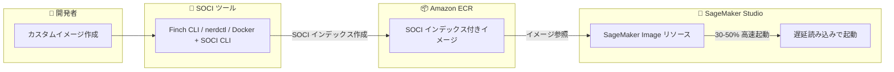

# Amazon SageMaker Studio - SOCI インデックスによるコンテナ起動時間の高速化

**リリース日**: 2025 年 12 月 19 日
**サービス**: Amazon SageMaker Studio
**機能**: SOCI (Seekable Open Container Initiative) インデックスサポート

## 概要

Amazon SageMaker Studio が SOCI (Seekable Open Container Initiative) インデックスをサポートし、カスタムイメージ使用時のコンテナ起動時間を 30〜50% 短縮できるようになりました。

Amazon SageMaker Studio は、エンドツーエンドの機械学習開発のための完全統合されたブラウザベースの環境です。TensorFlow、PyTorch、Scikit-learn などの一般的な ML フレームワーク用のビルド済みコンテナイメージを提供していますが、データサイエンティストが特定のユースケースに合わせて追加のライブラリや依存関係を含むカスタムコンテナイメージを使用する場合、イメージサイズの増大により起動に数分かかることがありました。

**アップデート前の課題**

- カスタムコンテナイメージの起動に数分かかることがあった
- ML ワークロードの複雑化に伴いイメージサイズが増大
- 反復的な ML 開発において、迅速な実験やプロトタイピングがボトルネックになっていた
- 完全なイメージダウンロードを待つ必要があった

**アップデート後の改善**

- コンテナ起動時間が 30〜50% 短縮
- 遅延読み込み (lazy loading) により、必要なコンポーネントのみを最初にダウンロード
- 数秒で作業を開始でき、残りのファイルはバックグラウンドで読み込み
- 迅速な実験とプロトタイピングが可能に

## アーキテクチャ図



SOCI インデックスにより、コンテナイメージ全体をダウンロードせずに必要な部分のみを取得して起動できます。

## サービスアップデートの詳細

### 主要機能

1. **遅延読み込み (Lazy Loading)**
   - コンテナイメージ全体をダウンロードせずに起動
   - アプリケーション起動に必要なコンポーネントのみを最初に取得
   - 追加ファイルはオンデマンドで読み込み

2. **SOCI インデックス作成ツールサポート**
   - Finch CLI
   - nerdctl
   - Docker with SOCI CLI

3. **Amazon ECR 統合**
   - SOCI インデックス付きイメージを ECR にプッシュ
   - SageMaker Image リソース作成時にイメージインデックス URI を参照

## 技術仕様

### SOCI インデックスの仕組み

| 項目 | 詳細 |
|------|------|
| 起動時間短縮 | 30〜50% |
| 対象 | カスタムコンテナイメージ |
| インデックス形式 | Seekable Open Container Initiative (SOCI) |
| 読み込み方式 | 遅延読み込み (Lazy Loading) |

### サポートされるツール

| ツール | 説明 |
|--------|------|
| Finch CLI | AWS が提供するコンテナ開発ツール |
| nerdctl | containerd 用の Docker 互換 CLI |
| Docker + SOCI CLI | Docker と SOCI CLI の組み合わせ |

## 設定方法

### 前提条件

1. Amazon SageMaker Studio へのアクセス権限
2. Amazon ECR リポジトリ
3. SOCI インデックス作成ツール (Finch CLI、nerdctl、または Docker + SOCI CLI)

### 手順

#### ステップ 1: SOCI インデックスの作成

```bash
# Finch CLI を使用した例
finch build -t my-custom-image:latest .
finch push --soci-index my-custom-image:latest <account-id>.dkr.ecr.<region>.amazonaws.com/my-repo:latest
```

Finch CLI を使用してカスタムイメージをビルドし、SOCI インデックス付きで ECR にプッシュします。

#### ステップ 2: Amazon ECR へのプッシュ

```bash
# ECR へのログイン
aws ecr get-login-password --region <region> | finch login --username AWS --password-stdin <account-id>.dkr.ecr.<region>.amazonaws.com

# SOCI インデックス付きイメージのプッシュ
finch push --soci-index <account-id>.dkr.ecr.<region>.amazonaws.com/my-repo:latest
```

SOCI インデックスが自動的に作成され、イメージと共に ECR にプッシュされます。

#### ステップ 3: SageMaker Image リソースの作成

SageMaker コンソールまたは API を使用して、SOCI インデックス付きイメージを参照する SageMaker Image リソースを作成します。イメージインデックス URI を指定することで、SOCI による高速起動が有効になります。

## メリット

### ビジネス面

- **開発効率の向上**: 起動待ち時間の短縮により、より多くの実験を実行可能
- **生産性の向上**: データサイエンティストが本来の作業に集中できる時間が増加
- **イテレーション速度の向上**: 迅速なプロトタイピングと実験が可能

### 技術面

- **起動時間 30〜50% 短縮**: 大規模なカスタムイメージでも数秒で作業開始
- **帯域幅の効率化**: 必要なコンポーネントのみをダウンロード
- **既存ワークフローとの互換性**: 標準的なコンテナツールで SOCI インデックスを作成可能

## デメリット・制約事項

### 制限事項

- SOCI インデックスの作成には追加のツールとステップが必要
- 初回アクセス時にオンデマンドでファイルを取得するため、特定のファイルへの初回アクセスに若干の遅延が発生する可能性
- すべてのコンテナイメージ形式がサポートされているわけではない

### 考慮すべき点

- SOCI インデックスの作成と管理のオーバーヘッド
- ECR へのイメージプッシュ時に SOCI インデックスも含める必要がある

## ユースケース

### ユースケース 1: 大規模 ML フレームワークを使用した開発

**シナリオ**: データサイエンティストが TensorFlow、PyTorch、および多数のカスタムライブラリを含む大規模なカスタムイメージを使用して開発を行う場合

**効果**: 従来数分かかっていた起動時間が数十秒に短縮され、1 日あたりの実験回数を大幅に増やすことが可能

### ユースケース 2: チーム間での標準化されたカスタムイメージの共有

**シナリオ**: 複数のデータサイエンティストが同じカスタムイメージを使用してプロジェクトに取り組む場合

**効果**: 各メンバーの環境セットアップ時間が短縮され、チーム全体の生産性が向上

### ユースケース 3: 反復的なモデル開発とハイパーパラメータチューニング

**シナリオ**: 頻繁にノートブックインスタンスを起動・停止しながらモデルの調整を行う場合

**効果**: 起動のたびに発生していた待ち時間が大幅に短縮され、より多くのイテレーションが可能

## 料金

SOCI インデックス機能自体に追加料金はありません。通常の Amazon SageMaker Studio および Amazon ECR の料金が適用されます。

## 利用可能リージョン

Amazon SageMaker Studio が利用可能なすべての AWS リージョンで利用できます。

## 関連サービス・機能

- **Amazon ECR**: SOCI インデックス付きコンテナイメージの保存
- **AWS Finch**: SOCI インデックス作成をサポートするコンテナ開発ツール
- **Amazon SageMaker**: 機械学習モデルの構築、トレーニング、デプロイのためのフルマネージドサービス

## 参考リンク

- [公式発表 (What's New)](https://aws.amazon.com/about-aws/whats-new/2025/12/amazon-sagemaker-nbi-soci/)
- [SOCI Snapshotter GitHub](https://github.com/awslabs/soci-snapshotter)
- [Bring your own SageMaker image ドキュメント](https://docs.aws.amazon.com/sagemaker-unified-studio/latest/userguide/byoi.html)

## まとめ

Amazon SageMaker Studio の SOCI インデックスサポートにより、カスタムコンテナイメージの起動時間が 30〜50% 短縮されます。大規模な ML ワークロードを扱うデータサイエンティストにとって、開発効率と生産性の大幅な向上が期待できます。カスタムイメージを使用している場合は、SOCI インデックスの導入を検討することをお勧めします。
