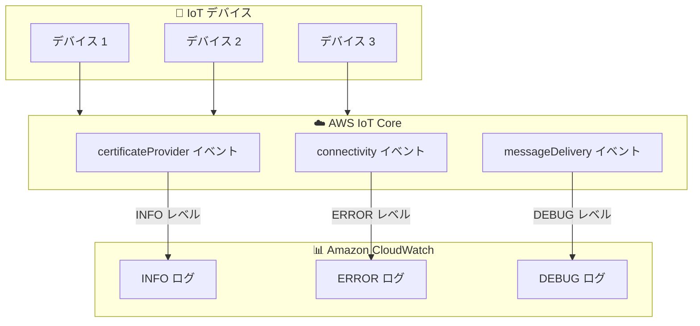

# AWS IoT Core - イベントベースロギングによるオブザーバビリティコスト最適化

**リリース日**: 2025 年 12 月 19 日
**サービス**: AWS IoT Core
**機能**: イベントベースロギング

## 概要

AWS IoT Core がイベントベースロギングをサポートし、Amazon CloudWatch のコスト削減とログ管理効率の向上を実現できるようになりました。この機能により、個々のイベントに対してカスタマイズ可能なログレベルと CloudWatch ロググループの宛先を設定できます。

IoT デバイスからの大量のイベントをすべて同じ詳細度でログに記録すると、CloudWatch のコストが増大し、重要なイベントの検索が困難になります。イベントベースロギングにより、イベントの種類ごとに適切なログレベルを設定し、運用上の重要度に基づいた効率的なログ管理が可能になります。

**アップデート前の課題**

- すべての IoT イベントを同じログレベルで記録する必要があった
- CloudWatch のログコストが高くなりがちだった
- 重要なイベントと重要でないイベントの区別が困難
- ログの検索と分析が非効率的だった

**アップデート後の改善**

- イベントタイプごとに異なるログレベルを設定可能
- CloudWatch コストの最適化が可能
- 重要なイベントに焦点を当てたログ管理
- ログの検索性と分析効率の向上

## アーキテクチャ図



イベントタイプごとに異なるログレベルを設定し、CloudWatch の異なるロググループに出力できます。

## サービスアップデートの詳細

### 主要機能

1. **イベントタイプ別ログレベル設定**
   - certificateProvider イベント: INFO レベル
   - connectivity イベント: ERROR レベル
   - messageDelivery イベント: 任意のレベル
   - 各イベントタイプに最適なログレベルを設定可能

2. **カスタム CloudWatch ロググループ宛先**
   - イベントタイプごとに異なるロググループを指定可能
   - ログの整理と検索が容易に

3. **コスト最適化**
   - 重要度の低いイベントのログ量を削減
   - 必要なイベントのみを詳細にログ記録

## 技術仕様

### サポートされるログレベル

| ログレベル | 説明 | 推奨用途 |
|-----------|------|----------|
| DEBUG | 最も詳細なログ | 開発・トラブルシューティング |
| INFO | 一般的な情報 | 通常運用時の監視 |
| WARN | 警告 | 潜在的な問題の検出 |
| ERROR | エラー | 重大な問題の検出 |
| DISABLED | ログ無効 | コスト削減が最優先の場合 |

### イベントタイプの例

| イベントタイプ | 説明 | 推奨ログレベル |
|---------------|------|---------------|
| certificateProvider | 証明書プロバイダーイベント | INFO |
| connectivity | 接続・切断イベント | ERROR |
| messageDelivery | メッセージ配信イベント | WARN |
| deviceShadow | デバイスシャドウ操作 | INFO |

## 設定方法

### 前提条件

1. AWS IoT Core へのアクセス権限
2. Amazon CloudWatch Logs へのアクセス権限
3. 適切な IAM ロールとポリシー

### 手順

#### ステップ 1: AWS CLI でイベントベースロギングを設定

```bash
aws iot set-v2-logging-options \
    --role-arn arn:aws:iam::<account-id>:role/IoTLoggingRole \
    --default-log-level ERROR
```

デフォルトのログレベルを ERROR に設定します。これにより、特に指定がないイベントは ERROR レベルでのみログ記録されます。

#### ステップ 2: イベントタイプ別のログレベル設定

```bash
aws iot set-v2-logging-level \
    --log-target targetType=EVENT_TYPE,targetName=certificateProvider \
    --log-level INFO
```

certificateProvider イベントを INFO レベルでログ記録するよう設定します。

#### ステップ 3: 設定の確認

```bash
aws iot list-v2-logging-levels
```

現在のログレベル設定を一覧表示して確認します。

## メリット

### ビジネス面

- **コスト削減**: 不要なログを削減し CloudWatch コストを最適化
- **運用効率向上**: 重要なイベントに集中した監視が可能
- **コンプライアンス対応**: 必要なイベントのみを適切に記録

### 技術面

- **柔軟なログ管理**: イベントタイプごとに最適なログレベルを設定
- **検索効率向上**: ログ量の削減により検索と分析が高速化
- **スケーラビリティ**: 大規模 IoT デプロイメントでも効率的なログ管理

## デメリット・制約事項

### 制限事項

- ログレベルの設定変更は即座に反映されるが、過去のログには影響しない
- 一部のイベントタイプはログレベル設定の対象外の場合がある

### 考慮すべき点

- ログレベルを低く設定しすぎると、トラブルシューティング時に必要な情報が不足する可能性
- 本番環境でのログレベル変更は慎重に行う必要がある

## ユースケース

### ユースケース 1: 大規模 IoT デプロイメントのコスト最適化

**シナリオ**: 数万台の IoT デバイスを運用しており、すべてのイベントをログ記録すると CloudWatch コストが高額になる

**実装例**:
```bash
# 接続イベントは ERROR のみ
aws iot set-v2-logging-level \
    --log-target targetType=EVENT_TYPE,targetName=connectivity \
    --log-level ERROR

# 証明書イベントは INFO
aws iot set-v2-logging-level \
    --log-target targetType=EVENT_TYPE,targetName=certificateProvider \
    --log-level INFO
```

**効果**: CloudWatch コストを大幅に削減しながら、重要なセキュリティイベントは詳細に記録

### ユースケース 2: セキュリティ監視の強化

**シナリオ**: セキュリティ関連のイベントは詳細にログ記録し、通常の運用イベントは最小限にしたい

**実装例**:
```bash
# 認証関連イベントは DEBUG レベルで詳細記録
aws iot set-v2-logging-level \
    --log-target targetType=EVENT_TYPE,targetName=certificateProvider \
    --log-level DEBUG
```

**効果**: セキュリティインシデントの調査に必要な詳細情報を確保

### ユースケース 3: 開発環境と本番環境の差別化

**シナリオ**: 開発環境では詳細なログが必要だが、本番環境ではコスト効率を重視したい

**効果**: 環境ごとに適切なログレベルを設定し、開発効率とコスト効率を両立

## 料金

イベントベースロギング機能自体に追加料金はありません。Amazon CloudWatch Logs の標準料金が適用されます。ログ量を削減することで、CloudWatch コストの最適化が可能です。

## 利用可能リージョン

AWS IoT Core がサポートされているすべての AWS リージョンで利用可能です。

## 関連サービス・機能

- **Amazon CloudWatch Logs**: IoT イベントログの保存と分析
- **AWS IoT Device Defender**: IoT デバイスのセキュリティ監視
- **AWS IoT Events**: IoT イベントの検出とアクション実行

## 参考リンク

- [公式発表 (What's New)](https://aws.amazon.com/about-aws/whats-new/2025/12/aws-iot-event-based-logging/)
- [AWS IoT ログ設定ドキュメント](https://docs.aws.amazon.com/iot/latest/developerguide/configure-logging.html)

## まとめ

AWS IoT Core のイベントベースロギングにより、IoT イベントの種類ごとに適切なログレベルを設定できるようになりました。大規模な IoT デプロイメントを運用している場合、この機能を活用することで CloudWatch コストを最適化しながら、重要なイベントの可視性を維持できます。
