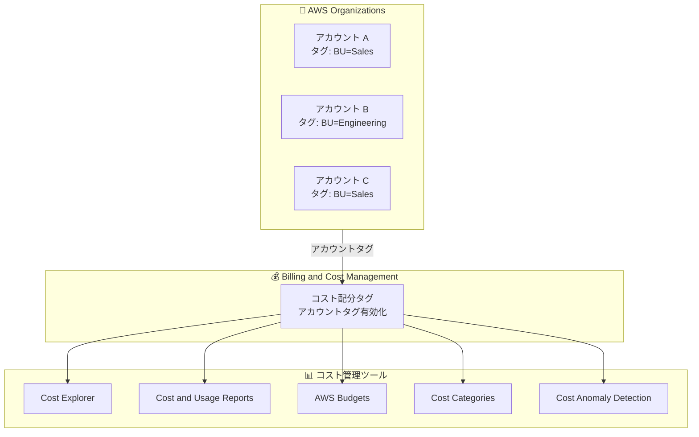

# AWS Cost Management - アカウントタグによるコスト配分サポート

**リリース日**: 2025 年 12 月 19 日
**サービス**: AWS Cost Management
**機能**: コスト配分タグのアカウントタグサポート

## 概要

AWS Cost Management 製品全体でアカウントタグのコスト配分タグサポートが発表されました。複数のメンバーアカウントを持つお客様は、AWS Organizations のアカウントタグをコスト管理ツールで直接利用できるようになります。

アカウントタグは AWS Organizations のアカウントレベルで適用され、タグ付けされたアカウント内のすべての従量課金使用量に自動的に適用されます。これにより、AWS Cost Explorer、Cost and Usage Reports、AWS Budgets、Cost Categories で個別のアカウントグループを手動で設定・維持する必要がなくなります。

**アップデート前の課題**

- アカウントごとのコスト分析には、アカウント ID のリストを手動で管理する必要があった
- 新しいアカウントが追加されるたびに、コスト管理ツールの設定を更新する必要があった
- 返金、クレジット、一部のサービス料金など、リソースレベルでタグ付けできない項目のコスト配分が困難だった
- 複数のコスト管理製品間で一貫したアカウントグループ化を維持するのが煩雑だった

**アップデート後の改善**

- AWS Organizations のアカウントタグをコスト管理ツールで直接利用可能
- アカウントの追加・削除時にタグを更新するだけで、すべてのコスト管理製品に自動反映
- タグ付け不可能なリソース (返金、クレジットなど) のコスト配分が可能に
- Cost Explorer、CUR、Budgets、Cost Categories で一貫したアカウントグループ化

## アーキテクチャ図



AWS Organizations のアカウントタグがコスト配分タグとして有効化され、すべてのコスト管理ツールで利用可能になります。

## サービスアップデートの詳細

### 主要機能

1. **Cost Explorer でのアカウントタグ分析**
   - アカウントタグでコストをフィルタリング・グループ化
   - 部門、プロジェクト、環境などの軸でコスト分析

2. **Cost and Usage Reports (CUR 2.0 および FOCUS) 対応**
   - アカウントタグがレポートに含まれる
   - 詳細なコスト分析とチャージバックに活用

3. **AWS Budgets との統合**
   - アカウント ID のリストを指定せずに、アカウントタグでグループ化した予算を設定
   - 新しいアカウントが追加されても自動的に予算に含まれる

4. **Cost Categories との統合**
   - アカウントタグを使用した複雑なコストカテゴリの構築
   - より柔軟なコスト配分ルールの定義

5. **Cost Anomaly Detection との統合**
   - アカウントタグでグループ化したアカウントに対する異常検出アラート

## 技術仕様

### サポートされるコスト管理製品

| 製品 | アカウントタグサポート |
|------|----------------------|
| AWS Cost Explorer | ✅ フィルタリング・グループ化 |
| Cost and Usage Reports (CUR 2.0) | ✅ レポートに含まれる |
| FOCUS | ✅ レポートに含まれる |
| AWS Budgets | ✅ 予算のスコープ設定 |
| Cost Categories | ✅ カテゴリルールの条件 |
| Cost Anomaly Detection | ✅ 監視対象のグループ化 |

### タグ付け不可能なリソースへの対応

| リソースタイプ | アカウントタグによる配分 |
|---------------|------------------------|
| 返金 (Refunds) | ✅ |
| クレジット (Credits) | ✅ |
| 一部のサービス料金 | ✅ |

## 設定方法

### 前提条件

1. AWS Organizations の管理アカウントへのアクセス
2. Billing and Cost Management コンソールへのアクセス
3. アカウントにタグを適用する権限

### 手順

#### ステップ 1: AWS Organizations でアカウントにタグを適用

```bash
aws organizations tag-resource \
    --resource-id <account-id> \
    --tags Key=BusinessUnit,Value=Sales
```

AWS Organizations コンソールまたは CLI を使用して、アカウントにタグを適用します。

#### ステップ 2: コスト配分タグページでアカウントタグを有効化

1. AWS Billing and Cost Management コンソールにアクセス
2. 「コスト配分タグ」ページに移動
3. アカウントタグを選択して有効化

#### ステップ 3: Cost Explorer でアカウントタグを使用

Cost Explorer でフィルターまたはグループ化の条件としてアカウントタグを選択し、コスト分析を実行します。

## メリット

### ビジネス面

- **運用効率の向上**: アカウントグループの手動管理が不要に
- **正確なコスト配分**: 部門やプロジェクトごとの正確なチャージバック
- **スケーラビリティ**: 組織の成長に合わせて自動的にスケール

### 技術面

- **一元管理**: AWS Organizations でタグを管理し、すべてのコスト管理ツールに反映
- **自動化**: 新しいアカウントの追加時に手動設定が不要
- **包括的なコスト配分**: タグ付け不可能なリソースも含めた完全なコスト配分

## デメリット・制約事項

### 制限事項

- GovCloud (US) リージョンでは利用不可
- 中国 (北京) および中国 (寧夏) リージョンでは利用不可
- アカウントタグの変更がコスト管理ツールに反映されるまでに最大 24 時間かかる場合がある

### 考慮すべき点

- 既存のコスト配分戦略との整合性を確認する必要がある
- アカウントタグの命名規則を組織全体で統一することが重要

## ユースケース

### ユースケース 1: 部門別コスト配分

**シナリオ**: 複数の部門がそれぞれ専用の AWS アカウントを持ち、部門ごとのコストを追跡したい

**実装例**:
```bash
# 営業部門のアカウントにタグを適用
aws organizations tag-resource \
    --resource-id 111111111111 \
    --tags Key=Department,Value=Sales

# エンジニアリング部門のアカウントにタグを適用
aws organizations tag-resource \
    --resource-id 222222222222 \
    --tags Key=Department,Value=Engineering
```

**効果**: Cost Explorer で Department タグでグループ化し、部門ごとのコストを即座に可視化

### ユースケース 2: 環境別予算管理

**シナリオ**: 開発、ステージング、本番環境のアカウントに対して、環境ごとの予算を設定したい

**実装例**:
```bash
# 本番環境アカウントにタグを適用
aws organizations tag-resource \
    --resource-id 333333333333 \
    --tags Key=Environment,Value=Production
```

**効果**: AWS Budgets で Environment=Production のアカウントに対する予算を設定し、新しい本番アカウントが追加されても自動的に予算に含まれる

### ユースケース 3: プロジェクト別コスト追跡

**シナリオ**: 複数のプロジェクトが進行中で、プロジェクトごとのコストを追跡し、異常を検出したい

**効果**: Cost Anomaly Detection でプロジェクトタグに基づいたモニターを設定し、プロジェクトごとのコスト異常を自動検出

## 料金

アカウントタグのコスト配分タグサポート機能自体に追加料金はありません。通常の AWS Cost Management 製品の料金が適用されます。

## 利用可能リージョン

GovCloud (US) リージョンおよび中国 (北京)、中国 (寧夏) リージョンを除くすべての AWS 商用リージョンで利用可能です。

## 関連サービス・機能

- **AWS Organizations**: アカウントタグの管理
- **AWS Cost Explorer**: コストの可視化と分析
- **AWS Budgets**: 予算の設定と監視
- **Cost and Usage Reports**: 詳細なコストレポート

## 参考リンク

- [公式発表 (What's New)](https://aws.amazon.com/about-aws/whats-new/2025/12/cost-allocation-tags/)
- [AWS コスト配分タグを使用したコストの整理と追跡](https://docs.aws.amazon.com/awsaccountbilling/latest/aboutv2/cost-alloc-tags.html)

## まとめ

AWS Cost Management のアカウントタグサポートにより、AWS Organizations のアカウントタグをコスト管理ツール全体で直接利用できるようになりました。複数のアカウントを持つ組織では、この機能を活用することで、コスト配分の自動化と運用効率の大幅な向上が期待できます。
