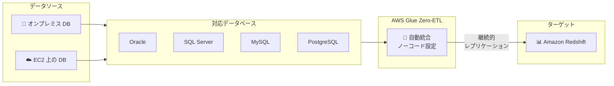

# AWS Glue Zero-ETL - セルフマネージドデータベースソースの東京リージョン対応

**リリース日**: 2025 年 12 月 19 日
**サービス**: AWS Glue
**機能**: Zero-ETL for self-managed database sources（7 リージョン追加）

## 概要

AWS Glue の Zero-ETL がセルフマネージドデータベースソースに対して 7 つの追加リージョンで利用可能になりました。東京リージョン (ap-northeast-1) を含むこの拡張により、オンプレミスまたは Amazon EC2 上の Oracle、SQL Server、MySQL、PostgreSQL データベースから Amazon Redshift へのデータレプリケーションが、設定の複雑さを排除したシンプルな体験で実現できます。

Zero-ETL は、従来のデータパイプライン構築に必要だった数週間のエンジニアリング作業を削減し、ノーコードインターフェースで継続的なデータレプリケーションを自動的に設定します。

**アップデート前の課題**

- オンプレミスや EC2 上のデータベースから Redshift へのデータパイプライン構築に数週間の開発が必要だった
- ETL ジョブの設計、構築、テストに専門知識が必要だった
- データレプリケーションの設定が複雑で運用負荷が高かった
- 東京リージョンではセルフマネージドデータベースソースの Zero-ETL が利用できなかった

**アップデート後の改善**

- ノーコードインターフェースでデータレプリケーションを設定可能
- 東京リージョンでセルフマネージドデータベースソースの Zero-ETL が利用可能に
- Oracle、SQL Server、MySQL、PostgreSQL からの継続的なレプリケーションを自動化
- 運用負荷とエンジニアリング工数を大幅に削減

## アーキテクチャ図



Zero-ETL により、セルフマネージドデータベースから Redshift への継続的なデータレプリケーションがノーコードで実現できます。

## サービスアップデートの詳細

### 主要機能

1. **ノーコードデータ統合**
   - シンプルなインターフェースでレプリケーションを設定
   - ETL コードの記述が不要
   - 設定の複雑さを排除

2. **継続的なデータレプリケーション**
   - ソースデータベースの変更を自動的に検出
   - リアルタイムに近いデータ同期
   - 増分レプリケーションによる効率的な転送

3. **複数データベースエンジンのサポート**
   - Oracle
   - SQL Server
   - MySQL
   - PostgreSQL

### 新たに利用可能になったリージョン

| リージョン | リージョンコード |
|-----------|-----------------|
| アジアパシフィック (香港) | ap-east-1 |
| アジアパシフィック (東京) | ap-northeast-1 |
| アジアパシフィック (シンガポール) | ap-southeast-1 |
| アジアパシフィック (シドニー) | ap-southeast-2 |
| ヨーロッパ (ロンドン) | eu-west-2 |
| 南米 (サンパウロ) | sa-east-1 |
| 米国東部 (バージニア北部) | us-east-1 |

## 技術仕様

### サポートされるソースデータベース

| データベース | バージョン | 接続方式 |
|-------------|-----------|---------|
| Oracle | 11g 以降 | JDBC |
| SQL Server | 2012 以降 | JDBC |
| MySQL | 5.7 以降 | JDBC |
| PostgreSQL | 10 以降 | JDBC |

### レプリケーション方式

- **初期ロード**: ソーステーブルの完全なスナップショットを転送
- **CDC (Change Data Capture)**: 変更データのみを継続的にレプリケート
- **増分更新**: 効率的なデータ転送で帯域幅を最適化

## 設定方法

### 前提条件

1. AWS アカウントと適切な IAM 権限
2. ソースデータベースへのネットワーク接続（VPN、Direct Connect、または EC2）
3. Amazon Redshift クラスターまたは Serverless ワークグループ
4. ソースデータベースの CDC 設定（データベースエンジンに応じて）

### 手順

#### ステップ 1: AWS Glue コンソールにアクセス

AWS マネジメントコンソールから AWS Glue を選択し、「Zero-ETL integrations」に移動します。

#### ステップ 2: 統合の作成

1. 「Create integration」を選択
2. ソースタイプとして「Self-managed database」を選択
3. データベースエンジン（Oracle、SQL Server、MySQL、PostgreSQL）を選択
4. 接続情報を入力

#### ステップ 3: ターゲットの設定

```json
{
  "target": {
    "type": "redshift",
    "cluster_identifier": "my-redshift-cluster",
    "database": "analytics_db",
    "schema": "public"
  }
}
```

Redshift クラスターまたは Serverless ワークグループをターゲットとして指定します。

#### ステップ 4: テーブルの選択とマッピング

1. レプリケートするテーブルを選択
2. 必要に応じてカラムマッピングを設定
3. 統合を開始

## メリット

### ビジネス面

- **開発時間の短縮**: 数週間のパイプライン開発が数分で完了
- **運用コストの削減**: ETL ジョブの管理・監視が不要
- **迅速なインサイト**: データの準リアルタイム分析が可能

### 技術面

- **ノーコード**: プログラミング不要でデータ統合を実現
- **自動スケーリング**: データ量に応じた自動的なリソース調整
- **信頼性**: AWS マネージドサービスによる高可用性

## デメリット・制約事項

### 制限事項

- 一部の複雑なデータ型は変換が必要な場合がある
- ソースデータベースで CDC の設定が必要
- ネットワーク帯域幅がレプリケーション速度に影響

### 考慮すべき点

- ソースデータベースへの追加負荷を考慮
- 初期ロード時のデータ量とネットワーク帯域幅
- Redshift のストレージコスト

## ユースケース

### ユースケース 1: オンプレミス Oracle から Redshift への移行

**シナリオ**: オンプレミスの Oracle データウェアハウスから Amazon Redshift への段階的な移行を実施したい。

**実装例**:
1. AWS Direct Connect または VPN でオンプレミスと AWS を接続
2. Zero-ETL 統合を作成し、Oracle テーブルを選択
3. 初期ロード後、継続的な CDC レプリケーションを開始
4. アプリケーションを段階的に Redshift に移行

**効果**: ダウンタイムなしでデータウェアハウスを移行し、移行期間中も両システムでデータの一貫性を維持。

### ユースケース 2: EC2 上の MySQL から分析基盤への統合

**シナリオ**: EC2 上で稼働する複数の MySQL データベースのデータを Redshift に統合して分析したい。

**実装例**:
1. 各 MySQL データベースに対して Zero-ETL 統合を作成
2. 必要なテーブルを選択してレプリケーション開始
3. Redshift で統合されたデータを分析

**効果**: 複数のデータソースを統合し、全社的なデータ分析基盤を構築。

### ユースケース 3: ハイブリッドクラウド環境でのリアルタイム分析

**シナリオ**: オンプレミスの基幹システム（SQL Server）のデータをリアルタイムに近い形で分析したい。

**実装例**:
1. SQL Server の CDC を有効化
2. Zero-ETL 統合を作成
3. Redshift で QuickSight ダッシュボードを構築

**効果**: 基幹システムのデータをほぼリアルタイムで可視化し、迅速な意思決定を支援。

## 料金

AWS Glue Zero-ETL の料金は、データ処理量とストレージに基づきます。詳細は [AWS Glue 料金ページ](https://aws.amazon.com/glue/pricing/) を参照してください。

## 利用可能リージョン

今回の拡張により、以下のリージョンで利用可能です。

- アジアパシフィック (香港)
- アジアパシフィック (東京) ← **新規追加**
- アジアパシフィック (シンガポール)
- アジアパシフィック (シドニー)
- ヨーロッパ (ロンドン)
- 南米 (サンパウロ)
- 米国東部 (バージニア北部)

## 関連サービス・機能

- **Amazon Redshift**: ターゲットデータウェアハウス
- **AWS Direct Connect**: オンプレミスとの専用接続
- **Amazon QuickSight**: データ可視化
- **AWS Glue Data Catalog**: メタデータ管理

## 参考リンク

- [公式発表 (What's New)](https://aws.amazon.com/about-aws/whats-new/2025/12/zero-etl-for-self-managed-databases-in-additional-regions/)
- [AWS Glue Zero-ETL ドキュメント](https://docs.aws.amazon.com/glue/latest/dg/zero-etl-using.html)
- [AWS Glue](https://aws.amazon.com/glue/)

## まとめ

AWS Glue Zero-ETL のセルフマネージドデータベースソース対応が東京リージョンを含む 7 リージョンに拡張されました。これにより、日本のお客様もオンプレミスや EC2 上のデータベースから Amazon Redshift へのデータレプリケーションを、ノーコードで簡単に設定できるようになりました。データパイプライン構築の工数を大幅に削減し、迅速なデータ分析基盤の構築を推奨します。
