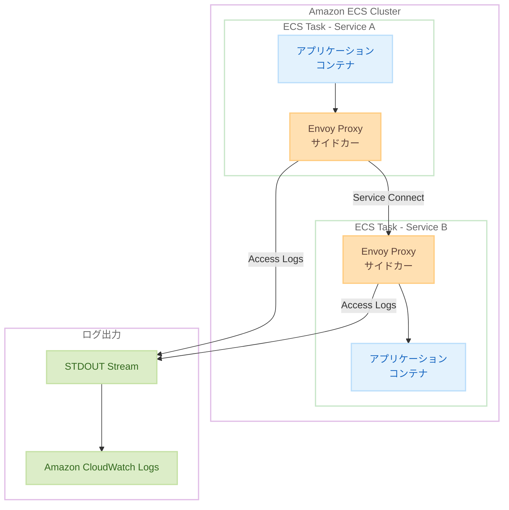

# Amazon ECS Service Connect - Envoy アクセスログのサポート

**リリース日**: 2025 年 12 月 22 日
**サービス**: Amazon Elastic Container Service (Amazon ECS)
**機能**: Service Connect Envoy アクセスログ

## 概要

Amazon ECS Service Connect で Envoy アクセスログがサポートされました。この新機能により、リクエストレベルのトラフィックパターンとサービス間の通信に関する詳細な可観測性が提供されます。エンドツーエンドのトレーシング、デバッグ、コンプライアンス監視のための詳細なリクエスト単位のテレメトリをキャプチャできます。

Amazon ECS Service Connect は、クラスター、VPC、AWS アカウントをまたいだセキュアで回復力のあるサービス間通信を簡単に構築できる機能です。AWS マネージドの Envoy プロキシをサイドカーとして自動的に注入し、トラフィックルーティング、ロードバランシング、サービス間接続を処理します。

**アップデート前の課題**

- Service Connect を使用したサービス間通信の詳細なトラフィック情報を取得するのが困難だった
- リクエストレベルでのトラブルシューティングに時間がかかっていた
- コンプライアンス要件を満たすための監査証跡の取得が複雑だった

**アップデート後の改善**

- リクエストレベルの詳細なトラフィックメタデータをキャプチャ可能に
- ネットワーク診断とトラブルシューティングの効率化
- コンプライアンス要件を満たす監査証跡の自動取得
- 既存の ECS ログパイプラインとシームレスに統合

## アーキテクチャ図



Envoy アクセスログは STDOUT に出力され、既存の ECS ログパイプラインを通じて CloudWatch Logs に送信されます。

## サービスアップデートの詳細

### 主要機能

1. **リクエストレベルのテレメトリ**
   - 各リクエストの詳細なメタデータをキャプチャ
   - レスポンスコード、レイテンシー、バイト数などの情報を記録
   - アップストリーム/ダウンストリームの接続情報を含む

2. **プライバシー保護**
   - クエリ文字列はデフォルトで編集（リダクト）される
   - 機密データの漏洩を防止

3. **既存ログパイプラインとの統合**
   - STDOUT ストリームに出力
   - 追加のインフラストラクチャ不要
   - アプリケーションログと同じパイプラインで処理

4. **複数プロトコルのサポート**
   - HTTP
   - HTTP2
   - gRPC
   - TCP

## 技術仕様

### サポートされるプロトコル

| プロトコル | サポート状況 |
|-----------|-------------|
| HTTP | ✅ サポート |
| HTTP2 | ✅ サポート |
| gRPC | ✅ サポート |
| TCP | ✅ サポート |

### アクセスログの出力形式

Envoy アクセスログは JSON 形式で出力され、以下の情報を含みます。

| フィールド | 説明 |
|-----------|------|
| `start_time` | リクエスト開始時刻 |
| `method` | HTTP メソッド |
| `path` | リクエストパス（クエリ文字列は編集済み） |
| `protocol` | プロトコルバージョン |
| `response_code` | HTTP レスポンスコード |
| `response_flags` | Envoy レスポンスフラグ |
| `bytes_received` | 受信バイト数 |
| `bytes_sent` | 送信バイト数 |
| `duration` | リクエスト処理時間 |
| `upstream_host` | アップストリームホスト |
| `downstream_remote_address` | ダウンストリームリモートアドレス |

### ServiceConnectConfiguration の設定例

```json
{
    "serviceConnectConfiguration": {
        "enabled": true,
        "namespace": "my-namespace",
        "services": [
            {
                "portName": "http",
                "discoveryName": "my-service",
                "clientAliases": [
                    {
                        "port": 80,
                        "dnsName": "my-service"
                    }
                ]
            }
        ],
        "logConfiguration": {
            "logDriver": "awslogs",
            "options": {
                "awslogs-group": "/ecs/service-connect",
                "awslogs-region": "ap-northeast-1",
                "awslogs-stream-prefix": "envoy"
            }
        }
    }
}
```

ServiceConnectConfiguration でアクセスログを有効化し、CloudWatch Logs への出力を設定します。

## 設定方法

### 前提条件

1. Amazon ECS クラスターと Service Connect が有効化されたサービス
2. CloudWatch Logs へのアクセス権限
3. タスク定義の更新権限

### 手順

#### ステップ 1: タスク定義の更新

```json
{
    "family": "my-service",
    "networkMode": "awsvpc",
    "containerDefinitions": [
        {
            "name": "app",
            "image": "my-app:latest",
            "portMappings": [
                {
                    "name": "http",
                    "containerPort": 8080,
                    "protocol": "tcp"
                }
            ],
            "logConfiguration": {
                "logDriver": "awslogs",
                "options": {
                    "awslogs-group": "/ecs/my-service",
                    "awslogs-region": "ap-northeast-1",
                    "awslogs-stream-prefix": "app"
                }
            }
        }
    ]
}
```

タスク定義でポートマッピングに名前を付け、ログ設定を行います。

#### ステップ 2: サービスの更新

```bash
aws ecs update-service \
    --cluster my-cluster \
    --service my-service \
    --service-connect-configuration '{
        "enabled": true,
        "namespace": "my-namespace",
        "services": [{
            "portName": "http",
            "discoveryName": "my-service"
        }],
        "logConfiguration": {
            "logDriver": "awslogs",
            "options": {
                "awslogs-group": "/ecs/service-connect",
                "awslogs-region": "ap-northeast-1",
                "awslogs-stream-prefix": "envoy"
            }
        }
    }'
```

サービスを更新して Service Connect とアクセスログを有効化します。

#### ステップ 3: ログの確認

```bash
# CloudWatch Logs でアクセスログを確認
aws logs filter-log-events \
    --log-group-name "/ecs/service-connect" \
    --filter-pattern "response_code"
```

CloudWatch Logs Insights でアクセスログをクエリして分析します。

## メリット

### ビジネス面

- **トラブルシューティング時間の短縮**: リクエストレベルの詳細情報により、問題の特定と解決が迅速に
- **コンプライアンス対応**: 監査証跡の自動取得により、コンプライアンス要件を満たしやすくなる
- **運用コストの削減**: 追加インフラ不要で、既存のログパイプラインを活用

### 技術面

- **詳細な可観測性**: サービス間通信のリクエストレベルの可視化
- **シームレスな統合**: 既存の ECS ログパイプラインとの統合
- **プライバシー保護**: クエリ文字列の自動編集によるデータ保護

## デメリット・制約事項

### 制限事項

- 現在は AWS GovCloud (US-West) および AWS GovCloud (US-East) リージョンでのみ利用可能
- アクセスログの有効化により、ログストレージコストが増加する可能性がある

### 考慮すべき点

- 高トラフィック環境では、ログボリュームが大きくなる可能性がある
- ログの保持期間とコストのバランスを考慮する必要がある

## ユースケース

### ユースケース 1: マイクロサービスのトラブルシューティング

**シナリオ**: サービス間通信でエラーが発生した際に、問題の原因を特定する

**実装例**:
```sql
-- CloudWatch Logs Insights クエリ
fields @timestamp, method, path, response_code, duration, upstream_host
| filter response_code >= 500
| sort @timestamp desc
| limit 100
```

**効果**: エラーが発生したリクエストを素早く特定し、原因を分析

### ユースケース 2: パフォーマンス分析

**シナリオ**: サービス間通信のレイテンシーを分析し、ボトルネックを特定する

**実装例**:
```sql
-- CloudWatch Logs Insights クエリ
fields @timestamp, path, duration, upstream_host
| stats avg(duration) as avg_latency, 
        max(duration) as max_latency,
        count(*) as request_count 
  by path
| sort avg_latency desc
```

**効果**: 高レイテンシーのエンドポイントを特定し、最適化の優先順位を決定

### ユースケース 3: コンプライアンス監査

**シナリオ**: 特定期間のサービス間通信の監査証跡を取得する

**実装例**:
```sql
-- CloudWatch Logs Insights クエリ
fields @timestamp, method, path, response_code, 
       downstream_remote_address, upstream_host
| filter @timestamp >= '2025-12-01' 
    and @timestamp <= '2025-12-31'
| sort @timestamp asc
```

**効果**: コンプライアンス要件を満たす監査証跡を自動的に取得

## 料金

アクセスログ機能自体に追加料金はかかりません。ただし、CloudWatch Logs へのログ取り込みと保存に対して標準の CloudWatch Logs 料金が適用されます。

## 利用可能リージョン

現在、以下のリージョンで利用可能です。

- AWS GovCloud (US-West)
- AWS GovCloud (US-East)

## 関連サービス・機能

- **Amazon CloudWatch Logs**: アクセスログの保存と分析
- **Amazon CloudWatch Logs Insights**: ログのクエリと可視化
- **AWS X-Ray**: 分散トレーシング
- **Amazon ECS Service Connect**: サービスメッシュ機能

## 参考リンク

- [公式発表 (What's New)](https://aws.amazon.com/about-aws/whats-new/2025/12/amazon-ecs-service-connect-observability-envoy-access-logs/)
- [Amazon ECS Developer Guide - Service Connect Envoy Access Logs](https://docs.aws.amazon.com/AmazonECS/latest/developerguide/service-connect-envoy-access-logs.html)
- [Amazon ECS Service Connect ドキュメント](https://docs.aws.amazon.com/AmazonECS/latest/developerguide/service-connect.html)

## まとめ

Amazon ECS Service Connect の Envoy アクセスログサポートにより、マイクロサービスアーキテクチャにおけるサービス間通信の可観測性が大幅に向上します。リクエストレベルの詳細なテレメトリにより、トラブルシューティング、パフォーマンス分析、コンプライアンス監査が効率化されます。既存の ECS ログパイプラインとシームレスに統合されるため、追加のインフラストラクチャなしで導入できます。
