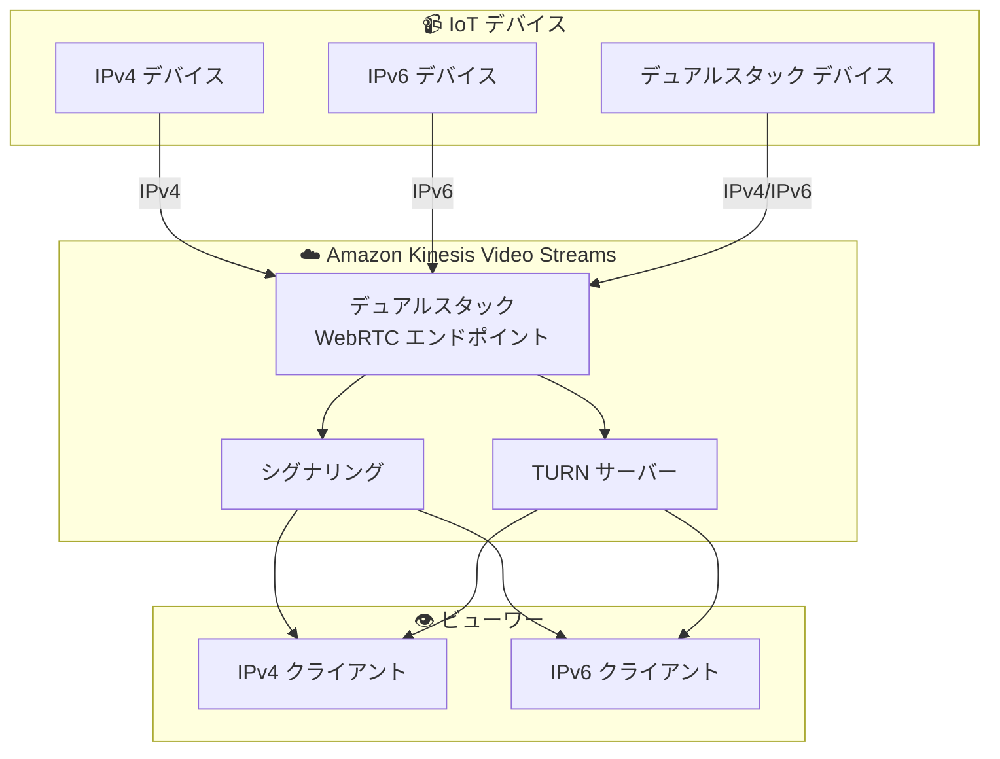

# Amazon Kinesis Video Streams - WebRTC の IPv6 サポート

**リリース日**: 2025 年 12 月 22 日
**サービス**: Amazon Kinesis Video Streams
**機能**: WebRTC の IPv6 (デュアルスタック) サポート

## 概要

Amazon Kinesis Video Streams (Amazon KVS) が WebRTC の Internet Protocol version 6 (IPv6) アドレッシングをサポートしました。このリリースでは、デュアルスタックエンドポイントのサポートが導入され、開発者は IPv4 と IPv6 の両方のアドレスを使用して数百万台のデバイスからビデオをストリーミングできるようになります。

デュアルスタックサポートにより、既存の IPv4 実装が引き続き確実に動作しながら、IPv6 接続のメリットを享受できます。また、アドレス変換機器を必要とせずに IPv6 アドレスへの移行が簡素化されます。

**アップデート前の課題**

- WebRTC 接続は IPv4 のみをサポート
- IPv6 のみのネットワーク環境では NAT64/DNS64 などのアドレス変換が必要
- IPv4 アドレスの枯渇に伴う将来的な課題
- 大規模 IoT デプロイメントでの IP アドレス管理の複雑さ

**アップデート後の改善**

- IPv4 と IPv6 の両方をサポートするデュアルスタックエンドポイント
- IPv6 のみのネットワーク環境でも直接接続可能
- アドレス変換機器が不要に
- 将来の IPv6 移行への準備が容易に

## アーキテクチャ図



デュアルスタックエンドポイントにより、IPv4 と IPv6 の両方のデバイスとクライアントが接続できます。

## サービスアップデートの詳細

### 主要機能

1. **デュアルスタックエンドポイント**
   - IPv4 と IPv6 の両方のアドレスをサポート
   - 既存の IPv4 実装との完全な互換性
   - 新しい IPv6 接続のサポート

2. **シームレスな移行**
   - 既存のアプリケーションコードの変更が最小限
   - アドレス変換機器が不要
   - 段階的な IPv6 移行が可能

3. **大規模デプロイメントのサポート**
   - 数百万台のデバイスからのビデオストリーミング
   - IPv6 の広大なアドレス空間を活用

## 技術仕様

### サポートされるプロトコル

| プロトコル | IPv4 | IPv6 |
|-----------|------|------|
| WebRTC シグナリング | ✅ | ✅ |
| TURN | ✅ | ✅ |
| STUN | ✅ | ✅ |

### エンドポイント設定

| 項目 | 詳細 |
|------|------|
| エンドポイントタイプ | デュアルスタック |
| IPv4 サポート | 継続 |
| IPv6 サポート | 新規追加 |

## 設定方法

### 前提条件

1. Amazon Kinesis Video Streams へのアクセス権限
2. WebRTC 対応のデバイスまたはアプリケーション
3. IPv6 対応のネットワーク環境 (IPv6 を使用する場合)

### 手順

#### ステップ 1: シグナリングチャネルの作成

```bash
aws kinesisvideo create-signaling-channel \
    --channel-name my-channel \
    --channel-type SINGLE_MASTER
```

WebRTC 接続用のシグナリングチャネルを作成します。

#### ステップ 2: デュアルスタックエンドポイントの取得

```bash
aws kinesisvideo get-signaling-channel-endpoint \
    --channel-arn arn:aws:kinesisvideo:<region>:<account-id>:channel/my-channel/1234567890 \
    --single-master-channel-endpoint-configuration Protocols=WSS,HTTPS,WEBRTC,Role=MASTER
```

シグナリングチャネルのエンドポイントを取得します。デュアルスタックエンドポイントが返されます。

#### ステップ 3: WebRTC 接続の確立

アプリケーションで取得したエンドポイントを使用して WebRTC 接続を確立します。IPv6 対応のネットワーク環境では、自動的に IPv6 が使用されます。

## メリット

### ビジネス面

- **将来への投資保護**: IPv6 移行への準備が整う
- **運用コスト削減**: NAT 機器やアドレス変換の必要性が減少
- **スケーラビリティ**: IPv6 の広大なアドレス空間を活用した大規模デプロイメント

### 技術面

- **シンプルなネットワーク構成**: アドレス変換が不要
- **エンドツーエンド接続**: NAT を介さない直接接続が可能
- **後方互換性**: 既存の IPv4 実装が引き続き動作

## デメリット・制約事項

### 制限事項

- Asia Pacific (Singapore) リージョンでは利用不可
- China (Beijing, operated by Sinnet) リージョンでは利用不可
- IPv6 を使用するにはネットワーク環境が IPv6 に対応している必要がある

### 考慮すべき点

- IPv6 のみの環境では、IPv4 フォールバックが利用できない
- 一部の古いデバイスやネットワーク機器は IPv6 をサポートしていない場合がある

## ユースケース

### ユースケース 1: 大規模 IoT ビデオ監視システム

**シナリオ**: 数万台の監視カメラを展開し、リアルタイムでビデオストリーミングを行う

**効果**: IPv6 の広大なアドレス空間を活用し、各デバイスに一意のグローバルアドレスを割り当て可能。NAT の複雑さを排除

### ユースケース 2: IPv6 のみのネットワーク環境

**シナリオ**: 新しいデータセンターやネットワークで IPv6 のみを使用している環境

**効果**: NAT64/DNS64 などのアドレス変換なしで、直接 Kinesis Video Streams に接続可能

### ユースケース 3: 段階的な IPv6 移行

**シナリオ**: 既存の IPv4 インフラを維持しながら、新しいデバイスは IPv6 で接続したい

**効果**: デュアルスタックサポートにより、IPv4 と IPv6 のデバイスが混在する環境でもシームレスに運用可能

## 料金

IPv6 サポート機能自体に追加料金はありません。通常の Amazon Kinesis Video Streams の料金が適用されます。

## 利用可能リージョン

Amazon KVS が提供されているすべての商用 AWS リージョンで利用可能です。ただし、以下のリージョンは除きます。

- Asia Pacific (Singapore)
- China (Beijing, operated by Sinnet)

## 関連サービス・機能

- **Amazon Kinesis Video Streams**: ビデオストリーミングとストレージ
- **AWS IoT Core**: IoT デバイスの接続と管理
- **Amazon CloudFront**: ビデオ配信の高速化

## 参考リンク

- [公式発表 (What's New)](https://aws.amazon.com/about-aws/whats-new/2025/12/amazon-kinesis-video-streams-webrtc-ipv6/)
- [Amazon KVS WebRTC IPv6 ドキュメント](https://docs.aws.amazon.com/kinesisvideostreams-webrtc-dg/latest/devguide/kvswebrtc-ipv6.html)
- [Amazon KVS リージョン別可用性](https://docs.aws.amazon.com/kinesisvideostreams-webrtc-dg/latest/devguide/availability.html)

## まとめ

Amazon Kinesis Video Streams の WebRTC IPv6 サポートにより、デュアルスタックエンドポイントを使用して IPv4 と IPv6 の両方のデバイスからビデオストリーミングが可能になりました。大規模な IoT ビデオ監視システムや IPv6 移行を計画している組織にとって、この機能は将来への投資保護とネットワーク構成の簡素化を提供します。
