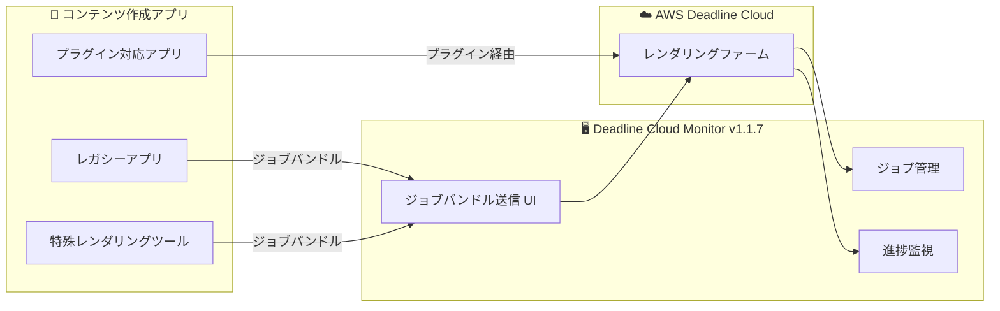

# AWS Deadline Cloud - Monitor からの直接ジョブ送信サポート

**リリース日**: 2025 年 12 月 22 日
**サービス**: AWS Deadline Cloud
**機能**: Deadline Cloud Monitor からの直接ジョブ送信

## 概要

AWS Deadline Cloud が Deadline Cloud Monitor デスクトップアプリケーションから直接レンダリングジョブを送信できるようになりました。この新機能により、Deadline Cloud プラグインや送信スクリプトが組み込まれていないアプリケーションからのレンダリング送信が容易になり、コンテンツ作成ツールとの互換性が拡大し、レンダリングワークフローが効率化されます。

**アップデート前の課題**

- ジョブバンドルの送信にはコマンドラインインターフェース (CLI) が必要だった
- Deadline Cloud プラグインがないアプリケーションからの送信が困難
- レガシーアプリケーションや特殊なレンダリングツールとの統合に手間がかかった
- ジョブの送信と管理が別々のインターフェースで行われていた

**アップデート後の改善**

- Deadline Cloud Monitor のデスクトップインターフェースから直接ジョブバンドルを送信可能
- CLI を使用せずにジョブの送信から完了まで一元管理
- レガシーアプリケーションや特殊なレンダリングツールとの統合が容易に
- カスタムワークフローのサポートが向上

## アーキテクチャ図



Deadline Cloud Monitor から直接ジョブバンドルを送信し、レンダリングの管理を一元化できます。

## サービスアップデートの詳細

### 主要機能

1. **デスクトップ UI からの直接ジョブ送信**
   - CLI を使用せずにジョブバンドルを送信
   - 直感的なグラフィカルインターフェース
   - ジョブパラメータの設定が容易

2. **一元化されたジョブ管理**
   - 送信から完了まで同じインターフェースで管理
   - ジョブの進捗状況をリアルタイムで監視
   - エラーの確認とトラブルシューティング

3. **幅広いアプリケーション互換性**
   - Deadline Cloud プラグインがないアプリケーションをサポート
   - レガシーアプリケーションとの統合
   - カスタムワークフローのサポート

## 技術仕様

### Deadline Cloud Monitor バージョン

| 項目 | 詳細 |
|------|------|
| 必要バージョン | 1.1.7 以降 |
| ダウンロード | AWS Console から取得可能 |
| 対応 OS | Windows, macOS, Linux |

### ジョブバンドル

| 項目 | 詳細 |
|------|------|
| 形式 | YAML/JSON ベースのジョブ定義 |
| 送信方法 | Monitor UI または CLI |
| カスタマイズ | パラメータ、環境変数、依存関係の設定 |

## 設定方法

### 前提条件

1. AWS Deadline Cloud へのアクセス権限
2. Deadline Cloud Monitor デスクトップアプリケーション (v1.1.7 以降)
3. 有効なジョブバンドル

### 手順

#### ステップ 1: Deadline Cloud Monitor のダウンロードとインストール

AWS Console の Deadline Cloud セクションから最新バージョン (v1.1.7) の Deadline Cloud Monitor をダウンロードしてインストールします。

#### ステップ 2: ジョブバンドルの準備

```yaml
# job_bundle.yaml の例
specificationVersion: jobtemplate-2023-09
name: MyRenderJob
parameterDefinitions:
  - name: Frames
    type: STRING
    default: "1-100"
steps:
  - name: Render
    script:
      actions:
        onRun:
          command: /usr/bin/render
          args:
            - "--frames"
            - "{{Param.Frames}}"
```

レンダリングジョブを定義するジョブバンドルを作成します。

#### ステップ 3: Monitor からジョブを送信

1. Deadline Cloud Monitor を起動
2. 「Submit Job」または「ジョブ送信」を選択
3. ジョブバンドルファイルを選択
4. 必要に応じてパラメータを調整
5. 送信を実行

## メリット

### ビジネス面

- **ワークフロー効率化**: CLI を使用せずにジョブを送信・管理
- **学習コストの削減**: グラフィカルインターフェースで直感的な操作
- **レガシー資産の活用**: 古いアプリケーションも Deadline Cloud で活用可能

### 技術面

- **統合の簡素化**: プラグインがないアプリケーションとの統合が容易
- **一元管理**: 送信から完了まで同じツールで管理
- **柔軟性**: カスタムワークフローのサポート

## デメリット・制約事項

### 制限事項

- Deadline Cloud Monitor v1.1.7 以降が必要
- ジョブバンドルの作成には一定の知識が必要

### 考慮すべき点

- 大量のジョブを自動送信する場合は CLI や API の方が適している場合がある
- 複雑なワークフローでは追加の設定が必要な場合がある

## ユースケース

### ユースケース 1: レガシーレンダリングアプリケーションの統合

**シナリオ**: Deadline Cloud プラグインがない古いレンダリングソフトウェアを使用しているスタジオが、クラウドレンダリングを活用したい

**効果**: ジョブバンドルを作成し、Monitor から直接送信することで、レガシーアプリケーションでもクラウドレンダリングを活用可能

### ユースケース 2: カスタムレンダリングパイプライン

**シナリオ**: 独自のレンダリングスクリプトやツールを使用しているプロダクションが、Deadline Cloud と統合したい

**効果**: カスタムジョブバンドルを作成し、Monitor から送信することで、既存のパイプラインを維持しながらクラウドレンダリングを活用

### ユースケース 3: 小規模チームでの簡易運用

**シナリオ**: CLI に慣れていないアーティストが、簡単にレンダリングジョブを送信したい

**効果**: グラフィカルインターフェースで直感的にジョブを送信・管理でき、技術的なハードルを下げる

## 料金

この機能自体に追加料金はありません。通常の AWS Deadline Cloud の料金が適用されます。

## 利用可能リージョン

AWS Deadline Cloud が提供されているすべての AWS リージョンで利用可能です。

## 関連サービス・機能

- **AWS Deadline Cloud**: クラウドベースのレンダリングファーム管理サービス
- **Amazon EC2 Spot Instances**: コスト効率の高いレンダリングリソース
- **Amazon S3**: レンダリング出力の保存

## 参考リンク

- [公式発表 (What's New)](https://aws.amazon.com/about-aws/whats-new/2025/12/aws-deadline-cloud-direct-job-submission-from/)
- [AWS Deadline Cloud ドキュメント](https://docs.aws.amazon.com/deadline-cloud/latest/userguide/submit-job-bundle-monitor.html)
- [Deadline Cloud Monitor ダウンロード](https://console.aws.amazon.com/deadlinecloud/home?useDefaultRegion=true#/downloads)

## まとめ

AWS Deadline Cloud Monitor からの直接ジョブ送信サポートにより、CLI を使用せずにレンダリングジョブを送信・管理できるようになりました。特に Deadline Cloud プラグインがないレガシーアプリケーションや特殊なレンダリングツールを使用している場合に、クラウドレンダリングの導入が容易になります。
