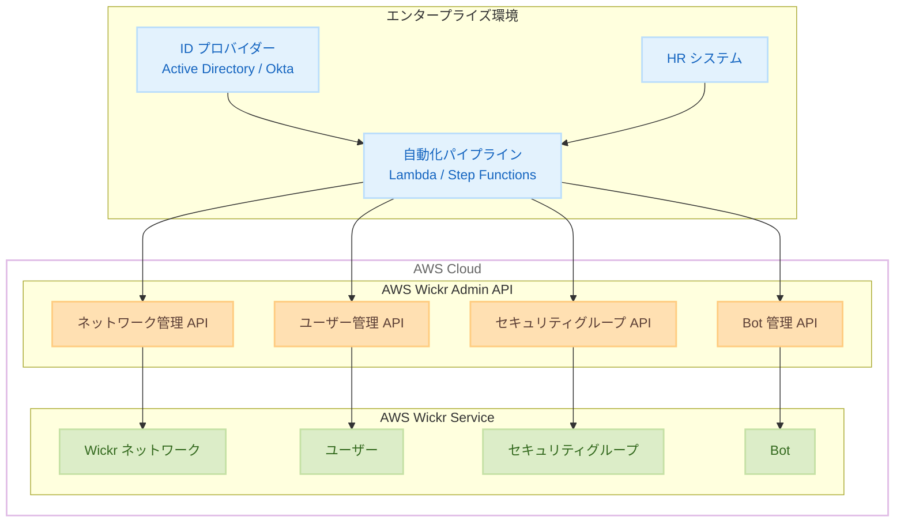

# AWS Wickr - Admin API の一般提供開始

**リリース日**: 2025 年 12 月 22 日
**サービス**: AWS Wickr
**機能**: Admin API (42 の新規 API メソッド)

## 概要

AWS Wickr で Admin API が一般提供開始されました。この API スイートにより、管理者はセキュアな通信ネットワークをプログラムで大規模に管理できるようになります。ユーザーライフサイクル管理、ネットワーク設定、セキュリティグループ管理などの重要な管理ワークフローを自動化できます。

AWS Wickr は、エンドツーエンド暗号化によりメッセージング、音声・ビデオ通話、ファイル共有、画面共有、位置情報共有を保護するセキュリティファーストのメッセージングおよびコラボレーションサービスです。今回の Admin API により、数千人規模のユーザーを持つ組織でも、ID 管理システムやポリシー管理フレームワーク、自動化パイプラインと直接連携してセキュアな通信インフラを管理できるようになりました。

**アップデート前の課題**

- Wickr ネットワークの管理は主にコンソールからの手動操作が必要だった
- 大規模な組織でのユーザー管理が煩雑で時間がかかっていた
- ID 管理システムとの自動連携が困難だった

**アップデート後の改善**

- 42 の新規 API メソッドによりプログラムでの管理が可能に
- ユーザーのオンボーディング・オフボーディングの自動化
- セキュリティグループの自動割り当てによるポリシー適用の効率化
- 既存の IT インフラとの統合が容易に

## アーキテクチャ図



Admin API を通じて、エンタープライズの ID 管理システムや自動化パイプラインから Wickr ネットワークを管理できます。

## サービスアップデートの詳細

### 主要機能

1. **ユーザーライフサイクル管理 API**
   - `BatchCreateUser`: 複数ユーザーの一括作成
   - `BatchDeleteUser`: 複数ユーザーの一括削除
   - `UpdateUser`: ユーザー情報の更新
   - `BatchToggleUserSuspendStatus`: ユーザーの一時停止/再開
   - `BatchReinviteUser`: 招待の再送信
   - `ListUsers`: ユーザー一覧の取得

2. **ネットワーク管理 API**
   - `CreateNetwork`: 新規ネットワークの作成
   - `DeleteNetwork`: ネットワークの削除
   - `UpdateNetwork`: ネットワーク設定の更新
   - `GetNetwork`: ネットワーク情報の取得
   - `ListNetworks`: ネットワーク一覧の取得
   - `UpdateNetworkSettings`: ネットワーク設定の更新

3. **セキュリティグループ管理 API**
   - `CreateSecurityGroup`: セキュリティグループの作成
   - `DeleteSecurityGroup`: セキュリティグループの削除
   - `UpdateSecurityGroup`: セキュリティグループの更新
   - `ListSecurityGroups`: セキュリティグループ一覧の取得
   - `ListSecurityGroupUsers`: グループ内ユーザーの取得

4. **Bot 管理 API**
   - `CreateBot`: Bot の作成
   - `DeleteBot`: Bot の削除
   - `UpdateBot`: Bot の更新
   - `ListBots`: Bot 一覧の取得

5. **データ保持管理 API**
   - `CreateDataRetentionBot`: データ保持 Bot の作成
   - `UpdateDataRetention`: データ保持設定の更新
   - `GetDataRetentionBot`: データ保持 Bot 情報の取得

## 技術仕様

### API 変更履歴

| 日付 | サービス | 変更内容 |
|------|----------|----------|
| 2025/12/19 | AWS Wickr Admin API | 42 new api methods - ユーザー管理、ネットワーク管理、セキュリティグループ管理、Bot 管理 API を追加 |

### 主要 API メソッド一覧

| カテゴリ | メソッド名 | 説明 |
|----------|-----------|------|
| ユーザー管理 | BatchCreateUser | 複数ユーザーの一括作成 |
| ユーザー管理 | BatchDeleteUser | 複数ユーザーの一括削除 |
| ユーザー管理 | UpdateUser | ユーザー情報の更新 |
| ユーザー管理 | GetUser | ユーザー情報の取得 |
| ユーザー管理 | ListUsers | ユーザー一覧の取得 |
| ネットワーク | CreateNetwork | ネットワークの作成 |
| ネットワーク | DeleteNetwork | ネットワークの削除 |
| ネットワーク | UpdateNetwork | ネットワークの更新 |
| セキュリティ | CreateSecurityGroup | セキュリティグループの作成 |
| セキュリティ | UpdateSecurityGroup | セキュリティグループの更新 |
| Bot | CreateBot | Bot の作成 |
| Bot | ListBots | Bot 一覧の取得 |

### ユーザー作成の例

```python
import boto3

client = boto3.client('wickr-admin')

# 複数ユーザーの一括作成
response = client.batch_create_user(
    networkId='network-12345',
    users=[
        {
            'firstName': 'Taro',
            'lastName': 'Yamada',
            'username': 'taro.yamada@example.com',
            'securityGroupIds': ['group-001'],
            'inviteCodeTtl': 604800  # 7日間
        },
        {
            'firstName': 'Hanako',
            'lastName': 'Suzuki',
            'username': 'hanako.suzuki@example.com',
            'securityGroupIds': ['group-002'],
            'inviteCodeTtl': 604800
        }
    ]
)

print(f"成功: {len(response['successful'])} 件")
print(f"失敗: {len(response['failed'])} 件")
```

BatchCreateUser API を使用して、複数のユーザーを一括で作成し、セキュリティグループに割り当てます。

## 設定方法

### 前提条件

1. AWS アカウントと AWS Wickr へのアクセス権限
2. Wickr ネットワークの管理者権限
3. 適切な IAM ポリシーの設定

### 手順

#### ステップ 1: IAM ポリシーの設定

```json
{
    "Version": "2012-10-17",
    "Statement": [
        {
            "Effect": "Allow",
            "Action": [
                "wickr:BatchCreateUser",
                "wickr:BatchDeleteUser",
                "wickr:UpdateUser",
                "wickr:ListUsers",
                "wickr:CreateSecurityGroup",
                "wickr:UpdateSecurityGroup",
                "wickr:ListSecurityGroups"
            ],
            "Resource": "arn:aws:wickr:*:*:network/*"
        }
    ]
}
```

Wickr Admin API を使用するために必要な IAM ポリシーを設定します。

#### ステップ 2: セキュリティグループの作成

```python
import boto3

client = boto3.client('wickr-admin')

# セキュリティグループの作成
response = client.create_security_group(
    networkId='network-12345',
    name='Engineering Team',
    securityGroupSettings={
        'globalFederation': True,
        'enableFileDownload': True,
        'filesEnabled': True,
        'locationEnabled': False,
        'passwordRequirements': {
            'minLength': 12,
            'uppercase': 1,
            'lowercase': 1,
            'numbers': 1,
            'symbols': 1
        }
    }
)

print(f"セキュリティグループ ID: {response['securityGroup']['id']}")
```

セキュリティグループを作成し、ポリシー設定を適用します。

#### ステップ 3: 自動化パイプラインとの統合

```python
import boto3
import json

def lambda_handler(event, context):
    """
    HR システムからのイベントを受けてユーザーを自動作成
    """
    client = boto3.client('wickr-admin')
    
    # イベントからユーザー情報を取得
    user_info = event['user']
    
    # 部門に基づいてセキュリティグループを決定
    security_group_mapping = {
        'Engineering': 'group-eng-001',
        'Sales': 'group-sales-001',
        'HR': 'group-hr-001'
    }
    
    group_id = security_group_mapping.get(
        user_info['department'], 
        'group-default'
    )
    
    # ユーザー作成
    response = client.batch_create_user(
        networkId='network-12345',
        users=[{
            'firstName': user_info['firstName'],
            'lastName': user_info['lastName'],
            'username': user_info['email'],
            'securityGroupIds': [group_id]
        }]
    )
    
    return {
        'statusCode': 200,
        'body': json.dumps(response)
    }
```

AWS Lambda を使用して、HR システムからのイベントに基づいてユーザーを自動作成します。

## メリット

### ビジネス面

- **運用効率の大幅向上**: 手動でのユーザー管理作業を自動化し、管理者の負担を軽減
- **オンボーディング時間の短縮**: 新入社員のアカウント作成を自動化し、即座にセキュアな通信環境を提供
- **コンプライアンス強化**: 一貫したセキュリティポリシーの自動適用により、コンプライアンス要件を満たしやすくなる

### 技術面

- **スケーラビリティ**: 数千人規模のユーザーを効率的に管理
- **統合性**: 既存の ID 管理システム (Active Directory, Okta など) との連携が容易
- **自動化**: CI/CD パイプラインや Infrastructure as Code との統合が可能

## デメリット・制約事項

### 制限事項

- API レート制限が適用される
- 一部の高度な設定はコンソールからのみ可能な場合がある
- ネットワーク作成には適切な権限が必要

### 考慮すべき点

- API キーの適切な管理とローテーションが必要
- 大量のユーザー操作時はバッチ処理の制限に注意
- エラーハンドリングの実装が重要

## ユースケース

### ユースケース 1: 従業員オンボーディングの自動化

**シナリオ**: 新入社員が HR システムに登録されると、自動的に Wickr アカウントが作成され、適切なセキュリティグループに割り当てられる

**実装例**:
```python
# EventBridge ルールで HR システムからのイベントをトリガー
# Lambda 関数でユーザー作成を自動化
def onboard_employee(employee_data):
    client = boto3.client('wickr-admin')
    
    # 役職に基づいてセキュリティグループを決定
    group_id = get_security_group_by_role(employee_data['role'])
    
    response = client.batch_create_user(
        networkId=NETWORK_ID,
        users=[{
            'firstName': employee_data['first_name'],
            'lastName': employee_data['last_name'],
            'username': employee_data['email'],
            'securityGroupIds': [group_id]
        }]
    )
    return response
```

**効果**: オンボーディング時間を数日から数分に短縮

### ユースケース 2: セキュリティポリシーの一括適用

**シナリオ**: 組織全体のセキュリティポリシーを更新し、すべてのセキュリティグループに一括適用

**実装例**:
```python
def update_all_security_groups(new_policy):
    client = boto3.client('wickr-admin')
    
    # すべてのセキュリティグループを取得
    groups = client.list_security_groups(networkId=NETWORK_ID)
    
    for group in groups['securityGroups']:
        client.update_security_group(
            networkId=NETWORK_ID,
            groupId=group['id'],
            securityGroupSettings=new_policy
        )
```

**効果**: ポリシー変更を即座に全ユーザーに適用

### ユースケース 3: 退職者のアカウント無効化

**シナリオ**: 従業員が退職した際に、自動的に Wickr アカウントを無効化

**実装例**:
```python
def offboard_employee(employee_email):
    client = boto3.client('wickr-admin')
    
    # ユーザーを検索
    users = client.list_users(
        networkId=NETWORK_ID,
        username=employee_email
    )
    
    if users['users']:
        user_id = users['users'][0]['userId']
        
        # アカウントを一時停止
        client.batch_toggle_user_suspend_status(
            networkId=NETWORK_ID,
            suspend=True,
            userIds=[user_id]
        )
```

**効果**: セキュリティリスクを最小化し、コンプライアンス要件を満たす

## 料金

AWS Wickr の標準料金が適用されます。Admin API の使用自体に追加料金はかかりません。

## 利用可能リージョン

AWS Wickr が利用可能なすべてのリージョンで利用可能です。AWS GovCloud (US-West) を含みます。

## 関連サービス・機能

- **AWS IAM**: API アクセスの認証・認可
- **AWS Lambda**: 自動化ワークフローの実行
- **Amazon EventBridge**: イベント駆動型の自動化
- **AWS CloudTrail**: API 呼び出しの監査ログ

## 参考リンク

- [公式発表 (What's New)](https://aws.amazon.com/about-aws/whats-new/2025/12/aws-wickr-admin-apis-generally-available/)
- [AWS Wickr API リファレンス](https://docs.aws.amazon.com/wickr/latest/APIReference/Welcome.html)
- [AWS Wickr 製品ページ](https://aws.amazon.com/wickr/)
- [AWS Wickr 管理者ガイド](https://docs.aws.amazon.com/wickr/latest/adminguide/what-is-wickr.html)

## まとめ

AWS Wickr Admin API の一般提供開始により、エンタープライズ規模でのセキュアな通信インフラの管理が大幅に効率化されます。42 の新規 API メソッドを活用することで、ユーザーライフサイクル管理、セキュリティポリシーの適用、既存 IT システムとの統合を自動化できます。特に大規模な組織において、運用効率の向上とセキュリティコンプライアンスの強化に貢献します。
