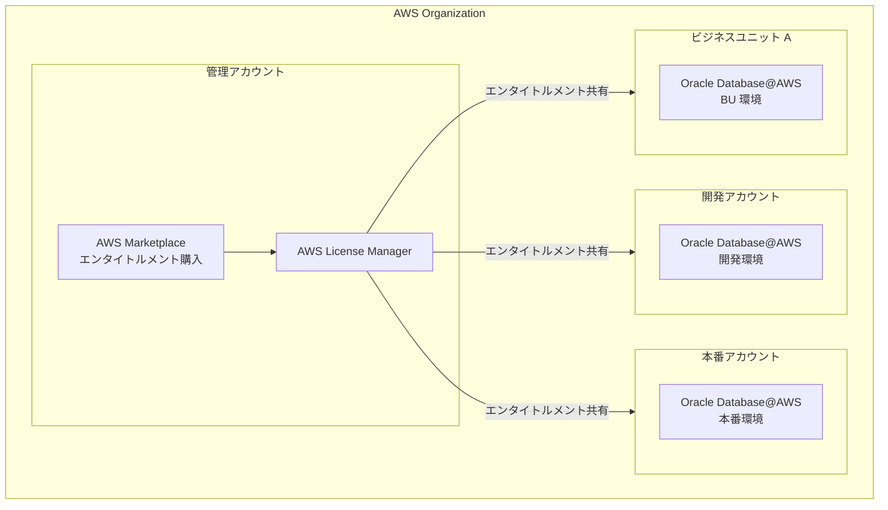

# Oracle Database@AWS - AWS Marketplace エンタイトルメントのアカウント間共有

**リリース日**: 2025 年 12 月 22 日
**サービス**: Oracle Database@AWS、AWS Marketplace
**機能**: Sharing of AWS Marketplace Entitlements Across Accounts

## 概要

Oracle Database@AWS が AWS Organization 内のアカウント間で AWS Marketplace エンタイトルメントを共有できるようになりました。この機能により、1 つの AWS アカウントで Oracle Database@AWS の AWS Marketplace オファーを受け入れ、そのエンタイトルメントを AWS Organization 内の他のアカウントと共有できます。

これにより、組織全体で単一の AWS Marketplace エンタイトルメントを使用して、複数の AWS アカウントから Oracle Database@AWS サービスを利用できるようになります。

**アップデート前の課題**

- 各 AWS アカウントで個別に Oracle Database@AWS の Marketplace オファーを購入する必要があった
- 開発環境と本番環境で別々のエンタイトルメントが必要だった
- 組織内の複数のビジネスユニットで統一した購入契約を管理することが困難だった

**アップデート後の改善**

- 単一のエンタイトルメントを AWS Organization 内の複数アカウントで共有可能
- 開発・本番環境を跨いだ統一的なライセンス管理が可能
- AWS License Manager を通じた一元的なエンタイトルメント管理

## アーキテクチャ図



AWS License Manager を通じて、管理アカウントで購入したエンタイトルメントを組織内の各アカウントに共有します。

## サービスアップデートの詳細

### 主要機能

1. **エンタイトルメント共有**
   - AWS Organization 内のアカウント間でエンタイトルメントを共有
   - 単一の購入契約で複数アカウントをカバー
   - AWS License Manager コンソールまたは API で管理

2. **AWS Marketplace Managed Entitlements 統合**
   - AWS Marketplace の Managed Entitlements 機能を活用
   - 組織全体のライセンス使用状況を一元管理
   - コンプライアンスとガバナンスの強化

3. **柔軟なアカウント構成対応**
   - 開発・ステージング・本番環境の分離に対応
   - ビジネスユニット別のアカウント構成に対応
   - マルチアカウント戦略との親和性

## 技術仕様

### エンタイトルメント共有の仕組み

| 項目 | 詳細 |
|------|------|
| 共有範囲 | AWS Organization 内のアカウント |
| 管理ツール | AWS License Manager |
| 共有方法 | コンソールまたは API |
| 有効化 | 共有先アカウントでの受け入れと有効化が必要 |

### 対応サービス

- OCI Exadata Database Service
- OCI Autonomous Database on Dedicated Infrastructure
- OCI Autonomous Recovery Service

## 設定方法

### 前提条件

1. AWS Organization が設定済みであること
2. Oracle Database@AWS の AWS Marketplace オファーを購入済みであること
3. AWS License Manager へのアクセス権限

### 手順

#### ステップ 1: エンタイトルメントの共有設定

AWS License Manager コンソールでエンタイトルメントを共有します。

1. AWS License Manager コンソールにサインイン
2. 「Granted licenses」または「Managed entitlements」に移動
3. Oracle Database@AWS のエンタイトルメントを選択
4. 「Share」を選択し、共有先アカウントを指定

#### ステップ 2: 共有先アカウントでの受け入れ

```bash
# AWS CLI でエンタイトルメントを受け入れ
aws license-manager accept-grant \
  --grant-arn "arn:aws:license-manager::123456789012:grant:g-xxxxx"
```

共有先アカウントで AWS License Manager からエンタイトルメントを受け入れます。

#### ステップ 3: Oracle Database@AWS の利用開始

エンタイトルメントを有効化後、共有先アカウントで Oracle Database@AWS サービスを利用できます。

## メリット

### ビジネス面

- **コスト最適化**: 単一のエンタイトルメントで組織全体をカバー
- **調達の簡素化**: 一元的な購入契約管理
- **ガバナンス強化**: 組織全体のライセンス使用状況を可視化

### 技術面

- **マルチアカウント対応**: AWS のベストプラクティスに沿ったアカウント構成をサポート
- **自動化対応**: API による自動化が可能
- **監査対応**: License Manager による使用状況の追跡

## デメリット・制約事項

### 制限事項

- AWS Organization 内のアカウントのみが対象
- 共有先アカウントでの受け入れ操作が必要
- Oracle Database@AWS が利用可能なリージョンに限定

### 考慮すべき点

- エンタイトルメントの使用量管理が必要
- 組織構造の変更時にエンタイトルメント共有の見直しが必要

## ユースケース

### ユースケース 1: 開発・本番環境の分離

**シナリオ**: 開発環境と本番環境を別々の AWS アカウントで運用している企業が、単一のエンタイトルメントで両環境をカバー。

**効果**: 調達プロセスの簡素化と、環境間での一貫したライセンス管理。

### ユースケース 2: マルチビジネスユニット

**シナリオ**: 複数のビジネスユニットがそれぞれ独自の AWS アカウントを持つ大企業で、組織全体で Oracle Database@AWS を利用。

**効果**: 各ビジネスユニットが独立して Oracle Database@AWS を利用しながら、ライセンスコストを組織全体で最適化。

### ユースケース 3: 段階的な移行

**シナリオ**: オンプレミスの Oracle データベースを段階的に Oracle Database@AWS に移行する際、複数のアカウントで移行を進める。

**効果**: 移行フェーズごとに異なるアカウントを使用しながら、単一のエンタイトルメントで移行プロジェクト全体をカバー。

## 料金

エンタイトルメント共有機能自体に追加料金はありません。Oracle Database@AWS の標準料金が適用されます。

## 利用可能リージョン

Oracle Database@AWS が提供されているすべての AWS リージョンで利用可能です。

- US East (N. Virginia)
- US West (Oregon)
- US East (Ohio)
- Europe (Frankfurt)
- Asia Pacific (Tokyo)

## 関連サービス・機能

- **AWS License Manager**: エンタイトルメントの共有と管理
- **AWS Marketplace Managed Entitlements**: 組織全体のエンタイトルメント管理
- **AWS Organizations**: マルチアカウント管理の基盤

## 参考リンク

- [公式発表 (What's New)](https://aws.amazon.com/about-aws/whats-new/2025/12/oracle-database-aws-marketplace-entitlements-across-accounts/)
- [ドキュメント - Entitlement Sharing](https://docs.aws.amazon.com/odb/latest/UserGuide/entitlement-sharing.html)
- [Oracle Database@AWS 製品ページ](https://aws.amazon.com/marketplace/featured-seller/oracle/)
- [AWS Marketplace Managed Entitlements](https://aws.amazon.com/marketplace/features/managed-entitlements/)
- [AWS License Manager](https://aws.amazon.com/license-manager/)

## まとめ

Oracle Database@AWS の AWS Marketplace エンタイトルメント共有機能により、マルチアカウント環境での Oracle データベース利用が大幅に簡素化されました。AWS Organization を活用している組織は、この機能を使用してライセンス管理の効率化とコスト最適化を実現できます。
