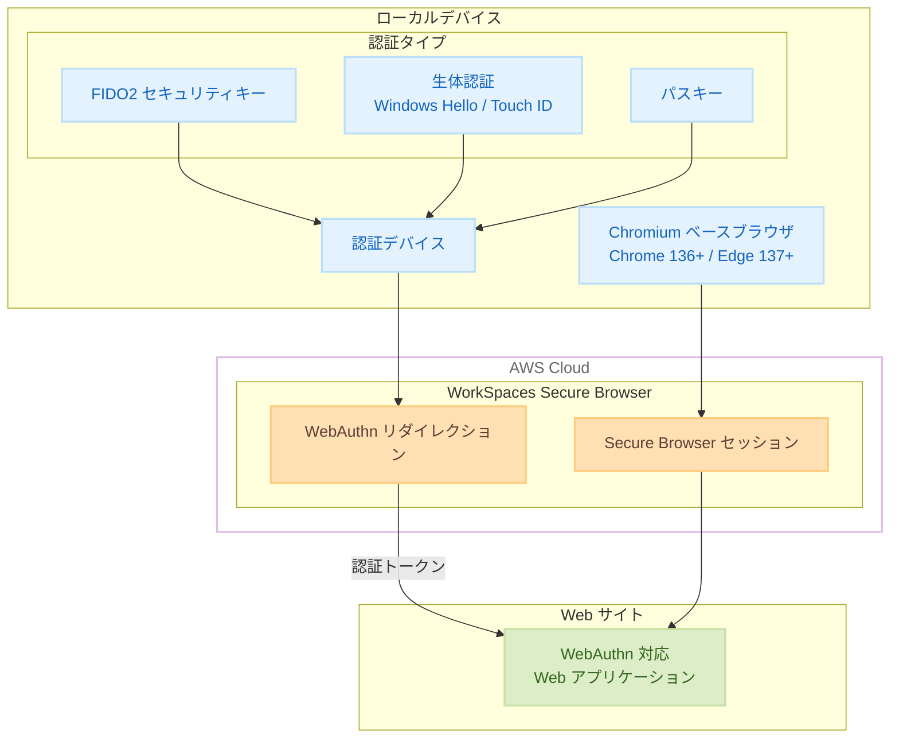

# Amazon WorkSpaces Secure Browser - WebAuthn リダイレクションのサポート

**リリース日**: 2025 年 12 月 23 日
**サービス**: Amazon WorkSpaces Secure Browser
**機能**: WebAuthn リダイレクション

## 概要

Amazon WorkSpaces Secure Browser で Web Authentication (WebAuthn) リダイレクションがサポートされました。この機能により、ユーザーは WorkSpaces Secure Browser セッション内で Web サイトにアクセスする際に、ローカルデバイスの FIDO2 セキュリティキー、生体認証、プラットフォーム認証を使用して認証できるようになります。

この機能は、Google Chrome 136 以降や Microsoft Edge 137 以降などの Chromium ベースのブラウザと互換性があります。Safari や Firefox などの非 Chromium ベースのブラウザではサポートされていません。

**アップデート前の課題**

- WorkSpaces Secure Browser セッション内でパスキーや FIDO2 セキュリティキーを使用した認証ができなかった
- リモートブラウジング環境でのセキュアな認証オプションが限られていた
- ローカルデバイスの生体認証機能を活用できなかった

**アップデート後の改善**

- FIDO2 セキュリティキー、パスキー、プラットフォーム認証 (Windows Hello, Touch ID) をサポート
- ローカルデバイスから Secure Browser セッション内の Web サイトへセキュアに認証トークンを転送
- リモートブラウジング環境のセキュリティメリットを維持しながらシームレスな認証を実現

## アーキテクチャ図



ローカルデバイスの認証情報が WebAuthn リダイレクションを通じて Secure Browser セッション内の Web サイトに安全に転送されます。

## サービスアップデートの詳細

### 主要機能

1. **FIDO2 セキュリティキーのサポート**
   - YubiKey などの物理セキュリティキーを使用した認証
   - USB、NFC、Bluetooth 接続のセキュリティキーに対応

2. **パスキーのサポート**
   - デバイスに保存されたパスキーを使用した認証
   - クロスデバイス認証にも対応

3. **プラットフォーム認証のサポート**
   - Windows Hello (顔認証、指紋認証、PIN)
   - Touch ID (macOS)
   - その他のプラットフォーム固有の認証機能

4. **セキュアなトークン転送**
   - WebAuthn トークンをローカルデバイスから Secure Browser セッションへ安全に転送
   - リモートブラウジング環境のセキュリティメリットを維持

## 技術仕様

### サポートされるブラウザ

| ブラウザ | 最小バージョン | サポート状況 |
|---------|---------------|-------------|
| Google Chrome | 136 以降 | ✅ サポート |
| Microsoft Edge | 137 以降 | ✅ サポート |
| Safari | - | ❌ 非サポート |
| Firefox | - | ❌ 非サポート |

### サポートされる認証方式

| 認証方式 | 説明 |
|---------|------|
| FIDO2 セキュリティキー | YubiKey などの物理キー |
| パスキー | デバイスに保存された認証情報 |
| Windows Hello | 顔認証、指紋認証、PIN |
| Touch ID | macOS の指紋認証 |

### 必要な設定

管理者側の設定:
1. Secure Browser ポータル設定で WebAuthn リダイレクションを有効化
2. ローカルブラウザで `WebAuthenticationRemoteDesktopAllowedOrigins` ポリシーを設定

### API 変更履歴

| 日付 | サービス | 変更内容 |
|------|----------|----------|
| 2025/12/19 | [Amazon WorkSpaces Web](https://awsapichanges.com/archive/changes/970b99-workspaces-web.html) | 4 updated api methods - ユーザー設定に WebAuthn サポートを追加 |

## 設定方法

### 前提条件

1. Amazon WorkSpaces Secure Browser ポータルの管理者権限
2. Chromium ベースのブラウザ (Chrome 136+ または Edge 137+)
3. FIDO2 セキュリティキーまたはプラットフォーム認証機能

### 手順

#### ステップ 1: ポータル設定で WebAuthn リダイレクションを有効化

1. Amazon WorkSpaces Secure Browser コンソールを開く
2. 対象のポータルを選択
3. 「ポータル設定」→「セキュリティ設定」を選択
4. 「WebAuthn リダイレクション」を有効化
5. 設定を保存

#### ステップ 2: ローカルブラウザのポリシー設定

**Chrome の場合:**

```json
{
    "WebAuthenticationRemoteDesktopAllowedOrigins": {
        "Value": [
            "https://*.workspaces-web.com"
        ]
    }
}
```

Chrome のポリシー設定で、WorkSpaces Secure Browser のオリジンを許可リストに追加します。

**Edge の場合:**

```json
{
    "WebAuthenticationRemoteDesktopAllowedOrigins": [
        "https://*.workspaces-web.com"
    ]
}
```

Edge のポリシー設定で同様に設定します。

#### ステップ 3: 動作確認

1. Chromium ベースのブラウザで WorkSpaces Secure Browser セッションを開始
2. WebAuthn 対応の Web サイトにアクセス
3. 認証プロンプトが表示されたら、ローカルデバイスの認証機能を使用
4. 認証が成功することを確認

## メリット

### ビジネス面

- **セキュリティの強化**: パスワードレス認証により、フィッシング攻撃のリスクを軽減
- **ユーザー体験の向上**: シームレスな認証により、生産性が向上
- **コンプライアンス対応**: 強力な認証要件を満たすことが容易に

### 技術面

- **ゼロトラストセキュリティ**: リモートブラウジング環境でも強力な認証を実現
- **既存インフラの活用**: 既存の FIDO2 セキュリティキーやパスキーをそのまま使用可能
- **追加コストなし**: 機能は追加料金なしで利用可能

## デメリット・制約事項

### 制限事項

- Chromium ベースのブラウザのみサポート (Safari、Firefox は非対応)
- ローカルブラウザのポリシー設定が必要
- 一部の古いセキュリティキーは互換性がない場合がある

### 考慮すべき点

- エンドユーザーのブラウザバージョンを確認する必要がある
- 組織全体でのポリシー展開が必要な場合がある

## ユースケース

### ユースケース 1: 金融機関のセキュアなリモートアクセス

**シナリオ**: 金融機関の従業員が、セキュアなブラウジング環境から社内システムにパスキーで認証

**実装例**:
1. WorkSpaces Secure Browser で WebAuthn リダイレクションを有効化
2. 従業員は YubiKey を使用して社内ポータルに認証
3. リモートブラウジング環境のセキュリティを維持しながら、強力な認証を実現

**効果**: フィッシング耐性のある認証により、セキュリティリスクを大幅に軽減

### ユースケース 2: 医療機関の HIPAA 準拠環境

**シナリオ**: 医療従事者が、患者データにアクセスする際に生体認証を使用

**実装例**:
1. Windows Hello または Touch ID を使用した認証を設定
2. WorkSpaces Secure Browser セッション内で電子カルテシステムにアクセス
3. 生体認証により、本人確認を強化

**効果**: HIPAA 準拠の強力な認証要件を満たしながら、ユーザー体験を向上

### ユースケース 3: リモートワーク環境でのセキュアな SaaS アクセス

**シナリオ**: リモートワーカーが、自宅から企業の SaaS アプリケーションにセキュアにアクセス

**実装例**:
1. 従業員に FIDO2 セキュリティキーを配布
2. WorkSpaces Secure Browser を通じて SaaS アプリケーションにアクセス
3. セキュリティキーで認証し、セキュアなセッションを確立

**効果**: リモート環境でも企業レベルのセキュリティを維持

## 料金

この機能は追加料金なしで利用可能です。Amazon WorkSpaces Secure Browser の標準料金のみが適用されます。

## 利用可能リージョン

以下のリージョンで利用可能です。

- US East (N. Virginia)
- US West (Oregon)
- Canada (Central)
- Europe (Frankfurt)
- Europe (London)
- Europe (Ireland)
- Asia Pacific (Tokyo) ✅
- Asia Pacific (Mumbai)
- Asia Pacific (Sydney)
- Asia Pacific (Singapore)

## 関連サービス・機能

- **Amazon WorkSpaces Secure Browser**: セキュアなリモートブラウジングサービス
- **AWS IAM Identity Center**: シングルサインオン (SSO) 機能
- **FIDO2/WebAuthn**: パスワードレス認証標準

## 参考リンク

- [公式発表 (What's New)](https://aws.amazon.com/about-aws/whats-new/2025/12/amazon-workspaces-secure-browser-webauthn-redirection-chromium-browsers/)
- [WebAuthn リダイレクション ドキュメント](https://docs.aws.amazon.com/workspaces-web/latest/adminguide/web-authentication.html)
- [Amazon WorkSpaces Secure Browser ドキュメント](https://docs.aws.amazon.com/workspaces-web/latest/adminguide/what-is-workspaces-web.html)

## まとめ

Amazon WorkSpaces Secure Browser の WebAuthn リダイレクションサポートにより、リモートブラウジング環境でも FIDO2 セキュリティキー、パスキー、生体認証を使用したセキュアな認証が可能になりました。フィッシング耐性のあるパスワードレス認証により、セキュリティを強化しながらユーザー体験を向上させることができます。東京リージョンでも利用可能で、追加料金なしで導入できます。
