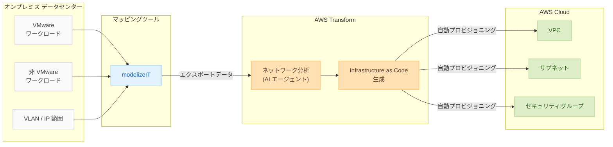

# AWS Transform - ハイブリッドデータセンター向けネットワーク変換

**リリース日**: 2025年12月23日
**サービス**: AWS Transform
**機能**: ハイブリッドデータセンターからの自動ネットワーク変換

## 概要

AWS Transform は、ハイブリッドデータセンターからの自動ネットワーク変換をサポートしました。この機能により、VMware と非 VMware ワークロードの両方を実行する環境での手動ネットワークマッピングが不要になります。サービスは、エクスポートされたすべてのソースネットワークの VLAN と IP 範囲を分析し、Virtual Private Cloud (VPC)、サブネット、セキュリティグループなどの AWS 構成要素にマッピングします。

AWS Transform for VMware は、エージェント型 AI を活用したサービスで、VMware ワークロードの検出、計画、移行を自動化し、インフラストラクチャの近代化を加速します。今回の機能拡張により、modelizeIT などのアプリケーションマッピングツールからエクスポートされたデータを分析し、Infrastructure as Code を自動生成して AWS ネットワークリソースをプロビジョニングできるようになりました。

**アップデート前の課題**

- ハイブリッドデータセンターのネットワーク構成を手動でマッピングする必要があった
- VMware と非 VMware 環境が混在する場合、ネットワーク変換が複雑だった
- VLAN から VPC/サブネットへの変換に時間と専門知識が必要だった

**アップデート後の改善**

- VLAN と IP 範囲の自動分析と AWS 構成要素へのマッピング
- Infrastructure as Code の自動生成
- AWS ネットワークリソースの自動プロビジョニング

## アーキテクチャ図



AWS Transform は、オンプレミスのネットワーク構成を分析し、AWS ネットワークリソースを自動的にプロビジョニングします。

## サービスアップデートの詳細

### 主要機能

1. **自動ネットワーク分析**
   - VLAN 構成の自動検出
   - IP 範囲の分析とマッピング
   - VMware/非 VMware 混在環境のサポート

2. **AWS 構成要素へのマッピング**
   - VLAN から VPC へのマッピング
   - IP 範囲からサブネットへの変換
   - セキュリティグループの自動生成

3. **Infrastructure as Code 生成**
   - AWS CloudFormation テンプレートの自動生成
   - 再現可能なインフラストラクチャ定義
   - バージョン管理可能な構成

4. **アプリケーションマッピングツール統合**
   - modelizeIT からのデータインポート
   - その他のマッピングツールとの連携
   - エクスポートデータの自動処理

## 技術仕様

### サポートされるソース環境

| 環境タイプ | サポート状況 |
|-----------|-------------|
| VMware vSphere | ✓ |
| 非 VMware 仮想化 | ✓ |
| 物理サーバー | ✓ (マッピングツール経由) |

### 生成される AWS リソース

| ソース | AWS リソース |
|--------|-------------|
| VLAN | VPC |
| IP サブネット | サブネット |
| ファイアウォールルール | セキュリティグループ |
| ルーティング | ルートテーブル |

## 設定方法

### 前提条件

1. AWS Transform へのアクセス権限
2. ソース環境のネットワーク情報
3. modelizeIT または互換性のあるマッピングツール

### 手順

#### ステップ 1: ソース環境のデータエクスポート

modelizeIT などのアプリケーションマッピングツールを使用して、ソース環境のネットワーク構成をエクスポートします。

```bash
# modelizeIT でのエクスポート例
modelizit export --format json --output network-config.json
```

エクスポートデータには VLAN、IP 範囲、ファイアウォールルールなどが含まれます。

#### ステップ 2: AWS Transform へのデータインポート

AWS Transform コンソールまたは CLI を使用して、エクスポートデータをインポートします。

```bash
aws transform import-network-config \
  --source-file network-config.json \
  --target-region us-east-1
```

#### ステップ 3: ネットワーク分析の実行

AWS Transform がネットワーク構成を分析し、AWS 構成要素へのマッピングを提案します。

```bash
aws transform analyze-network \
  --import-id import-xxxxx \
  --output-format cloudformation
```

#### ステップ 4: Infrastructure as Code の確認とデプロイ

生成された CloudFormation テンプレートを確認し、必要に応じて調整後、デプロイします。

```bash
aws cloudformation deploy \
  --template-file generated-network.yaml \
  --stack-name migrated-network \
  --capabilities CAPABILITY_IAM
```

## メリット

### ビジネス面

- **移行時間の短縮**: 手動ネットワークマッピングの排除により、移行プロジェクトを加速
- **コスト削減**: 専門家による手動作業の削減
- **リスク軽減**: 自動化による人的エラーの削減

### 技術面

- **一貫性**: Infrastructure as Code による再現可能な構成
- **ハイブリッド対応**: VMware/非 VMware 混在環境のサポート
- **AI 活用**: エージェント型 AI による高度な分析

## デメリット・制約事項

### 制限事項

- 一部の複雑なネットワーク構成は手動調整が必要な場合がある
- サポートされるマッピングツールに制限がある
- 特定のリージョンでのみ利用可能

### 考慮すべき点

- 生成された構成の検証とテストが必要
- セキュリティグループのルールは手動で確認・調整を推奨
- 本番環境へのデプロイ前にステージング環境でのテストを推奨

## ユースケース

### ユースケース 1: データセンター統合

**シナリオ**: 複数のデータセンターを AWS に統合し、ネットワーク構成を移行

**実装例**:
- 各データセンターの VLAN 構成をエクスポート
- AWS Transform で統合ネットワーク設計を生成
- VPC ピアリングや Transit Gateway を含む構成を自動生成

**効果**: 数週間かかるネットワーク設計を数日に短縮

### ユースケース 2: VMware から AWS への移行

**シナリオ**: VMware 環境を AWS に移行し、ネットワーク構成を維持

**実装例**:
- VMware NSX のネットワーク構成をエクスポート
- AWS Transform で VPC/サブネット構成を生成
- セキュリティグループでファイアウォールルールを再現

**効果**: ネットワーク構成の一貫性を維持しながら移行を加速

### ユースケース 3: ハイブリッドクラウド構築

**シナリオ**: オンプレミスと AWS のハイブリッド環境を構築

**実装例**:
- オンプレミスネットワークの IP 範囲を分析
- AWS 側のサブネット設計を自動生成
- Direct Connect/VPN 接続用の構成を含める

**効果**: IP アドレス競合を回避した最適なハイブリッド設計

## 料金

AWS Transform の料金は、分析対象のワークロード数とリソースに基づきます。詳細は AWS Transform 料金ページを参照してください。

## 利用可能リージョン

この機能は、AWS Transform ターゲットリージョンで利用可能です。詳細は [AWS Transform ドキュメント](https://docs.aws.amazon.com/transform/latest/userguide/transform-app-vmware-acct-connections.html#transform-app-vmware-target-acct) を参照してください。

## 関連サービス・機能

- **AWS Migration Hub**: 移行の追跡と管理
- **AWS Application Discovery Service**: アプリケーション検出
- **AWS CloudFormation**: Infrastructure as Code
- **Amazon VPC**: 仮想プライベートクラウド

## 参考リンク

- [公式発表 (What's New)](https://aws.amazon.com/about-aws/whats-new/2025/12/aws-transform-hybrid-network-migration/)
- [AWS Transform 製品ページ](https://aws.amazon.com/transform/vmware/)
- [ユーザーガイド](https://docs.aws.amazon.com/transform/latest/userguide/transform-app-vmware.html)
- [AWS Transform コンソール](https://console.aws.amazon.com/transform/home)

## まとめ

AWS Transform のハイブリッドデータセンター向けネットワーク変換機能により、VMware と非 VMware 環境が混在するデータセンターからの移行が大幅に簡素化されました。エージェント型 AI による自動分析と Infrastructure as Code 生成により、手動でのネットワークマッピング作業を排除し、移行プロジェクトを加速できます。データセンター統合や AWS への移行を計画している場合は、この機能を活用して移行時間とコストを削減することをお勧めします。
