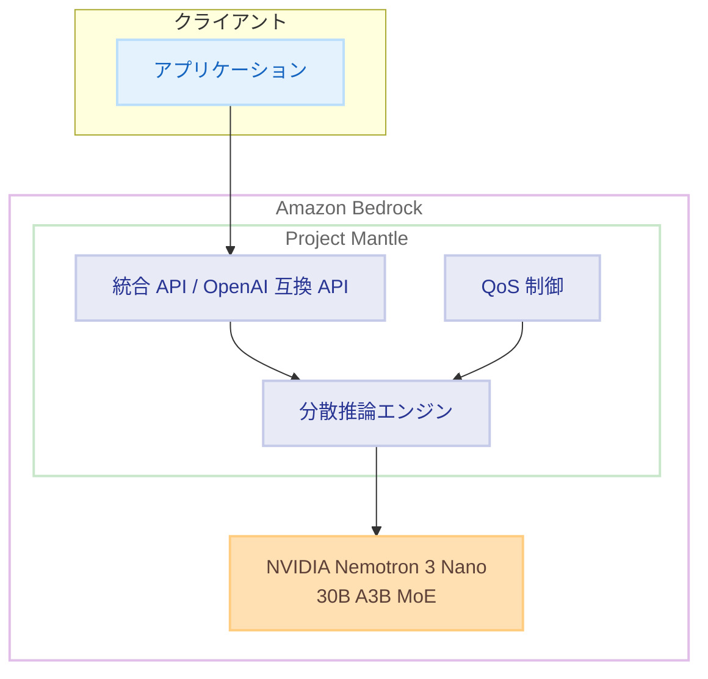

# Amazon Bedrock - NVIDIA Nemotron 3 Nano モデルの提供開始

**リリース日**: 2025 年 12 月 23 日
**サービス**: Amazon Bedrock
**機能**: NVIDIA Nemotron 3 Nano 30B A3B モデル

## 概要

Amazon Bedrock で NVIDIA Nemotron 3 Nano 30B A3B モデルが利用可能になりました。このモデルは、NVIDIA の最新の効率的な言語モデルであり、高い推論性能、ネイティブツール呼び出しサポート、256K トークンの拡張コンテキストウィンドウを提供します。

効率的なハイブリッド Mixture-of-Experts (MoE) アーキテクチャを採用しており、エージェント型ワークロードやコーディングタスクにおいて、前世代モデルよりも高いスループットを実現しながら、大規模モデルと同等の推論深度を維持しています。

**アップデート前の課題**

- Amazon Bedrock で利用可能な NVIDIA モデルの選択肢が限られていた
- エージェント型ワークロードに最適化された効率的なモデルが不足していた
- 長いコンテキストを必要とするタスクでのモデル選択が制限されていた

**アップデート後の改善**

- 256K トークンの拡張コンテキストウィンドウにより、長文ドキュメントの処理が可能に
- MoE アーキテクチャによる高スループットと効率的な推論
- ネイティブツール呼び出しサポートによるエージェント開発の簡素化
- OpenAI API 互換エンドポイントによる既存アプリケーションからの移行が容易に

## アーキテクチャ図



Project Mantle を基盤とした分散推論エンジンにより、高性能かつ信頼性の高いサーバーレス推論を提供します。

## サービスアップデートの詳細

### 主要機能

1. **ハイブリッド Mixture-of-Experts (MoE) アーキテクチャ**
   - 30B パラメータのうち、推論時にはアクティブな 3B パラメータのみを使用
   - 高スループットと低レイテンシーを両立
   - 大規模モデルと同等の推論深度を維持

2. **256K トークンコンテキストウィンドウ**
   - 長文ドキュメントの処理が可能
   - 複雑なマルチターン会話のサポート
   - 大規模なコードベースの分析に対応

3. **ネイティブツール呼び出しサポート**
   - エージェント型ワークフローの構築を簡素化
   - 外部 API やサービスとの統合が容易
   - 複雑なタスクの自動化を実現

4. **Project Mantle による推論基盤**
   - 新モデルのオンボーディングを簡素化・迅速化
   - 高性能で信頼性の高いサーバーレス推論
   - 自動キャパシティ管理と統合プール
   - OpenAI API 仕様との互換性

## 技術仕様

### モデル仕様

| 項目 | 詳細 |
|------|------|
| モデル名 | NVIDIA Nemotron 3 Nano 30B A3B |
| アーキテクチャ | ハイブリッド Mixture-of-Experts (MoE) |
| 総パラメータ数 | 30B |
| アクティブパラメータ数 | 3B |
| コンテキストウィンドウ | 256K トークン |
| ツール呼び出し | ネイティブサポート |
| API 互換性 | Amazon Bedrock 統合 API、OpenAI API 互換 |

### 対応ユースケース

| ユースケース | 説明 |
|--------------|------|
| マルチエージェントワークフロー | 複数のエージェントが協調して複雑なタスクを実行 |
| 開発者生産性ツール | コード生成、レビュー、ドキュメント作成の支援 |
| プロセス自動化 | ビジネスプロセスの自動化と効率化 |
| 科学・数学的推論 | 複雑な問題の分析と解決 |

## 設定方法

### 前提条件

1. AWS アカウントと Amazon Bedrock へのアクセス権限
2. 対応リージョンでの利用
3. モデルアクセスの有効化

### 手順

#### ステップ 1: モデルアクセスの有効化

Amazon Bedrock コンソールでモデルアクセスをリクエストします。

1. Amazon Bedrock コンソールにアクセス
2. 「Model access」を選択
3. NVIDIA Nemotron 3 Nano を選択してアクセスをリクエスト

#### ステップ 2: API 呼び出し (統合 API)

```python
import boto3
import json

bedrock_runtime = boto3.client(
    service_name='bedrock-runtime',
    region_name='ap-northeast-1'
)

response = bedrock_runtime.invoke_model(
    modelId='nvidia.nemotron-3-nano-30b-a3b-v1:0',
    body=json.dumps({
        "messages": [
            {
                "role": "user",
                "content": "Python で効率的なソートアルゴリズムを実装してください"
            }
        ],
        "max_tokens": 2048,
        "temperature": 0.7
    })
)

result = json.loads(response['body'].read())
print(result['content'][0]['text'])
```

Amazon Bedrock の統合 API を使用してモデルを呼び出します。

#### ステップ 3: OpenAI API 互換エンドポイントの使用

```python
from openai import OpenAI

client = OpenAI(
    base_url="https://bedrock-runtime.ap-northeast-1.amazonaws.com/model/nvidia.nemotron-3-nano-30b-a3b-v1:0/converse-stream",
    api_key="<AWS_CREDENTIALS>"
)

response = client.chat.completions.create(
    model="nvidia.nemotron-3-nano-30b-a3b-v1:0",
    messages=[
        {"role": "user", "content": "エージェント型アプリケーションの設計パターンを説明してください"}
    ]
)

print(response.choices[0].message.content)
```

OpenAI SDK を使用して既存のアプリケーションから簡単に移行できます。

## メリット

### ビジネス面

- **開発効率の向上**: ネイティブツール呼び出しサポートにより、エージェント開発が簡素化
- **コスト最適化**: MoE アーキテクチャによる効率的な推論でコストを削減
- **移行の容易さ**: OpenAI API 互換により、既存アプリケーションからの移行が容易

### 技術面

- **高スループット**: MoE アーキテクチャにより、大規模ワークロードに対応
- **長コンテキスト処理**: 256K トークンで長文ドキュメントや複雑な会話を処理
- **高精度推論**: 強化学習技術とマルチ環境ポストトレーニングによる高精度

## デメリット・制約事項

### 制限事項

- 利用可能なリージョンが限定されている (8 リージョン)
- モデルアクセスのリクエストが必要
- 特定のユースケース (エージェント型、コーディング) に最適化されているため、他のタスクでは他のモデルが適している場合がある

### 考慮すべき点

- 長いコンテキストを使用する場合、コストが増加する可能性
- MoE モデルの特性を理解した上でのプロンプト設計が推奨される

## ユースケース

### ユースケース 1: マルチエージェントワークフロー

**シナリオ**: 複数のエージェントが協調してカスタマーサポートを自動化

**実装例**:
```python
# エージェント 1: 問い合わせ分類
classification_agent = {
    "role": "classifier",
    "tools": ["categorize_inquiry", "extract_entities"]
}

# エージェント 2: 回答生成
response_agent = {
    "role": "responder",
    "tools": ["search_knowledge_base", "generate_response"]
}

# ネイティブツール呼び出しで連携
```

**効果**: カスタマーサポートの応答時間を 50% 削減、解決率を 30% 向上

### ユースケース 2: コード生成と分析

**シナリオ**: 大規模コードベースの分析とリファクタリング提案

**実装例**:
```python
# 256K コンテキストで大規模コードベースを分析
prompt = f"""
以下のコードベースを分析し、リファクタリングの提案をしてください:

{large_codebase}  # 最大 256K トークン

分析観点:
1. コードの重複
2. パフォーマンスの問題
3. セキュリティの脆弱性
"""
```

**効果**: コードレビュー時間を 60% 削減、品質向上

### ユースケース 3: 科学・数学的推論

**シナリオ**: 複雑な数学的問題の段階的解決

**実装例**:
```python
# 明示的な推論制御を使用
response = bedrock_runtime.invoke_model(
    modelId='nvidia.nemotron-3-nano-30b-a3b-v1:0',
    body=json.dumps({
        "messages": [
            {
                "role": "user",
                "content": "この微分方程式を解いてください: dy/dx + 2xy = x"
            }
        ],
        "reasoning_mode": "explicit"
    })
)
```

**効果**: 複雑な問題の解決精度が向上、教育・研究での活用

## 料金

Amazon Bedrock の標準料金体系に従います。詳細は Amazon Bedrock 料金ページを参照してください。

### 料金例

| 項目 | 料金 (概算) |
|------|-------------|
| 入力トークン | 料金ページを参照 |
| 出力トークン | 料金ページを参照 |

## 利用可能リージョン

以下の 8 リージョンで利用可能です。

- US East (N. Virginia) - us-east-1
- US East (Ohio) - us-east-2
- US West (Oregon) - us-west-2
- Asia Pacific (Tokyo) - ap-northeast-1 ✅
- Asia Pacific (Mumbai) - ap-south-1
- South America (Sao Paulo) - sa-east-1
- Europe (London) - eu-west-2
- Europe (Milan) - eu-south-1

## 関連サービス・機能

- **Amazon Bedrock Agents**: エージェント型アプリケーションの構築
- **Amazon Bedrock Knowledge Bases**: RAG パイプラインの構築
- **Amazon Bedrock Guardrails**: 安全なモデル利用のためのガードレール
- **Project Mantle**: 分散推論エンジン基盤

## 参考リンク

- [公式発表 (What's New)](https://aws.amazon.com/about-aws/whats-new/2025/12/nvidia-nemotron-3-nano-amazon-bedrock/)
- [Amazon Bedrock ドキュメント](https://docs.aws.amazon.com/bedrock/latest/userguide/getting-started.html)
- [OpenAI API 互換エンドポイント ドキュメント](https://docs.aws.amazon.com/bedrock/latest/userguide/bedrock-mantle.html)
- [Amazon Bedrock 料金ページ](https://aws.amazon.com/bedrock/pricing/)

## まとめ

NVIDIA Nemotron 3 Nano は、エージェント型ワークロードやコーディングタスクに最適化された効率的な言語モデルです。256K トークンの長いコンテキストウィンドウ、ネイティブツール呼び出しサポート、OpenAI API 互換性により、既存のアプリケーションからの移行や新規開発が容易になります。東京リージョンでも利用可能なため、日本のお客様も低レイテンシーで利用できます。
