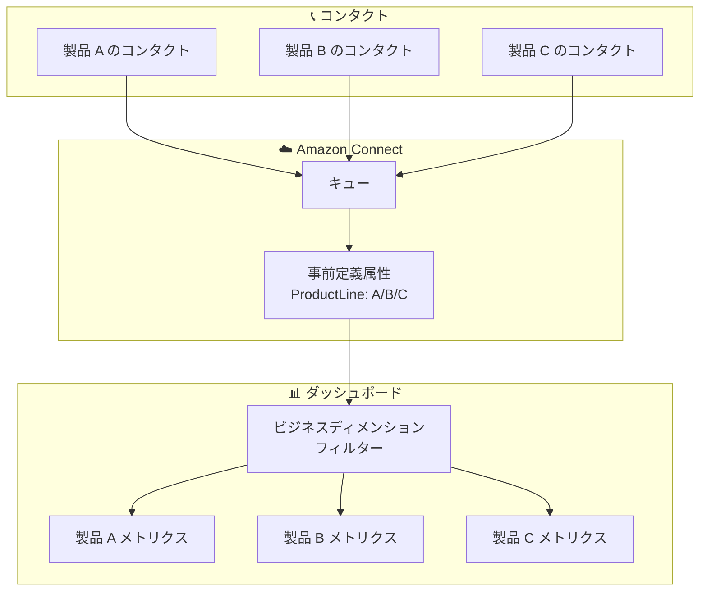

# Amazon Connect - ダッシュボードのカスタムビジネスディメンションによるメトリクスフィルタリング

**リリース日**: 2025 年 12 月 29 日
**サービス**: Amazon Connect
**機能**: ダッシュボードのカスタムビジネスディメンションフィルタリング

## 概要

Amazon Connect ダッシュボードが、ビジネス部門、製品ライン、顧客セグメントなどのカスタムビジネスディメンションに基づいてメトリクスをフィルタリングできるようになりました。事前定義された属性を使用してビジネスディメンションを作成し、独自のビジネスニーズに基づいてダッシュボードをカスタマイズできます。

例えば、キューが複数の製品ラインにまたがるコンタクトを処理している場合、製品ラインでメトリクスをフィルタリングして処理時間を比較し、エージェントがどの製品のトレーニングを必要としているかを判断できます。

**アップデート前の課題**

- ダッシュボードのメトリクスは標準的なディメンション (キュー、エージェントなど) でのみフィルタリング可能だった
- ビジネス固有の分析軸 (製品ライン、部門など) でのフィルタリングが困難
- カスタムレポートの作成に追加の作業が必要だった
- ビジネスコンテキストに基づいた洞察の取得が限定的だった

**アップデート後の改善**

- カスタムビジネスディメンションでメトリクスをフィルタリング可能
- 製品ライン、ビジネス部門、顧客セグメントなどの軸で分析
- ビジネスニーズに合わせたダッシュボードのカスタマイズ
- より深い洞察とデータドリブンな意思決定

## アーキテクチャ図

事前定義属性を使用してビジネスディメンションを設定し、ダッシュボードでフィルタリングできます。

## サービスアップデートの詳細

### 主要機能

1. **カスタムビジネスディメンションの作成**
   - 事前定義属性を使用してビジネスディメンションを定義
   - 製品ライン、部門、顧客セグメントなど任意の分類軸
   - 複数のディメンションを組み合わせた分析

2. **ダッシュボードフィルタリング**
   - ビジネスディメンションでメトリクスをフィルタリング
   - 比較分析による洞察の取得
   - リアルタイムでのフィルター適用

3. **ビジネスインサイトの強化**
   - 製品別、部門別のパフォーマンス比較
   - トレーニングニーズの特定
   - リソース配分の最適化

## 技術仕様

### サポートされるビジネスディメンション例

| ディメンション | 説明 | 使用例 |
|---------------|------|--------|
| 製品ライン | 製品やサービスの分類 | 製品別の処理時間比較 |
| ビジネス部門 | 組織の部門 | 部門別のコンタクト量分析 |
| 顧客セグメント | 顧客の分類 | VIP 顧客の対応品質監視 |
| 地域 | 地理的な分類 | 地域別のサービスレベル比較 |

### 利用可能なメトリクス

| メトリクス | 説明 |
|-----------|------|
| 処理時間 (Handle Time) | コンタクトの処理にかかった時間 |
| 待機時間 (Queue Time) | キューでの待機時間 |
| 放棄率 (Abandonment Rate) | 放棄されたコンタクトの割合 |
| サービスレベル | 目標時間内に応答したコンタクトの割合 |

## 設定方法

### 前提条件

1. Amazon Connect インスタンスへのアクセス権限
2. ダッシュボードの管理権限
3. コンタクト属性の設定権限

### 手順

#### ステップ 1: コンタクトフローで属性を設定

コンタクトフローで、コンタクトに事前定義属性を設定します。例えば、製品ラインを識別する属性を追加します。

#### ステップ 2: ビジネスディメンションの作成

Amazon Connect 管理コンソールで、事前定義属性を使用してビジネスディメンションを作成します。

#### ステップ 3: ダッシュボードでフィルターを適用

ダッシュボードで作成したビジネスディメンションを選択し、メトリクスをフィルタリングします。

## メリット

### ビジネス面

- **データドリブンな意思決定**: ビジネスコンテキストに基づいた分析
- **パフォーマンス最適化**: 製品別、部門別のパフォーマンス比較
- **トレーニング効率化**: エージェントのトレーニングニーズの特定

### 技術面

- **柔軟なフィルタリング**: 任意のビジネスディメンションで分析
- **リアルタイム分析**: ダッシュボードでのリアルタイムフィルタリング
- **既存機能との統合**: 既存のダッシュボード機能と seamless に統合

## デメリット・制約事項

### 制限事項

- ビジネスディメンションの設定にはコンタクトフローの変更が必要
- 過去のコンタクトには新しいディメンションが適用されない

### 考慮すべき点

- 属性の命名規則を組織全体で統一することが重要
- ディメンションの数が多すぎると分析が複雑になる可能性

## ユースケース

### ユースケース 1: 製品別パフォーマンス分析

**シナリオ**: 複数の製品を扱うコンタクトセンターで、製品ごとの処理時間を比較したい

**効果**: 製品ラインでフィルタリングし、どの製品のコンタクトに時間がかかっているかを特定。エージェントのトレーニングニーズを把握

### ユースケース 2: 顧客セグメント別サービスレベル監視

**シナリオ**: VIP 顧客と一般顧客で異なるサービスレベル目標を設定している

**効果**: 顧客セグメントでフィルタリングし、VIP 顧客へのサービスレベルが目標を達成しているか監視

### ユースケース 3: 部門別リソース配分最適化

**シナリオ**: 複数の部門がコンタクトセンターを共有しており、部門ごとのコンタクト量を把握したい

**効果**: 部門でフィルタリングし、コンタクト量の傾向を分析。リソース配分の最適化に活用

## 料金

この機能自体に追加料金はありません。通常の Amazon Connect の料金が適用されます。

## 利用可能リージョン

Amazon Connect が提供されているすべての AWS 商用リージョンおよび AWS GovCloud (US-West) で利用可能です。

## 関連サービス・機能

- **Amazon Connect Contact Lens**: AI を活用したコンタクト分析
- **Amazon Connect Wisdom**: エージェント向けナレッジ管理
- **Amazon QuickSight**: 高度なビジネスインテリジェンス分析

## 参考リンク

- [公式発表 (What's New)](https://aws.amazon.com/about-aws/whats-new/2025/12/amazon-connect-dashboards-filtering-metrics-custom-business-dimensions/)
- [Amazon Connect ダッシュボードドキュメント](https://docs.aws.amazon.com/connect/latest/adminguide/dashboards.html)
- [Amazon Connect 製品ページ](https://aws.amazon.com/connect/)

## まとめ

Amazon Connect ダッシュボードのカスタムビジネスディメンションフィルタリングにより、製品ライン、部門、顧客セグメントなどのビジネス固有の軸でメトリクスを分析できるようになりました。コンタクトセンターの運用をビジネスコンテキストに基づいて最適化したい組織にとって、この機能は価値ある洞察を提供します。
