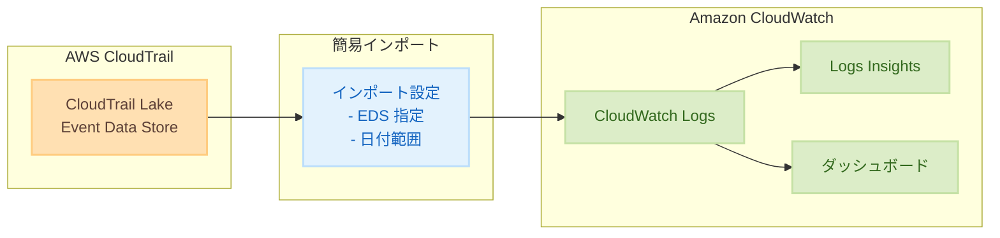

# Amazon CloudWatch - CloudTrail Lake データの簡易インポート機能

**リリース日**: 2025 年 12 月 30 日
**サービス**: Amazon CloudWatch
**機能**: CloudTrail Lake データの簡易インポート

## 概要

Amazon CloudWatch で CloudTrail Lake データの簡易インポート機能がリリースされました。この機能により、CloudTrail Lake に保存された履歴データを数ステップで CloudWatch にインポートし、運用、セキュリティ、コンプライアンスデータを一元的に統合できるようになります。

CloudWatch は、AWS 環境とサードパーティソースからの運用、セキュリティ、コンプライアンスデータを統合できるデータ管理・分析サービスです。今回のアップデートにより、CloudTrail Lake のイベントデータストア (EDS) と日付範囲を指定するだけで、履歴データを CloudWatch にインポートできるようになりました。

**アップデート前の課題**

- CloudTrail Lake と CloudWatch のデータが分散しており、統合的な分析が困難だった
- 履歴データの移行には複雑な ETL プロセスが必要だった
- セキュリティとコンプライアンスデータの一元管理ができなかった

**アップデート後の改善**

- 数ステップで CloudTrail Lake データを CloudWatch にインポート可能に
- 運用、セキュリティ、コンプライアンスデータを一箇所に統合
- AWS コンソール、CLI、SDK からインポートを実行可能

## アーキテクチャ図



CloudTrail Lake のイベントデータストアから CloudWatch Logs へ直接インポートし、Logs Insights やダッシュボードで分析できます。

## サービスアップデートの詳細

### 主要機能

1. **簡易インポートプロセス**
   - CloudTrail Lake のイベントデータストア (EDS) を指定
   - インポートする日付範囲を選択
   - 数ステップでインポートを開始

2. **複数のインターフェースサポート**
   - AWS マネジメントコンソール
   - AWS CLI
   - AWS SDK

3. **データ統合**
   - 運用データ、セキュリティデータ、コンプライアンスデータを一元化
   - CloudWatch の分析機能を活用した統合分析

## 技術仕様

### インポート設定パラメータ

| パラメータ | 説明 |
|-----------|------|
| Event Data Store | インポート元の CloudTrail Lake EDS |
| Start Date | インポート開始日 |
| End Date | インポート終了日 |
| Log Group | インポート先の CloudWatch Logs ロググループ |

### 料金体系

| 項目 | 料金 |
|------|------|
| 簡易インポート機能 | 無料 |
| CloudWatch Logs 取り込み | カスタムログ料金が適用 |
| CloudWatch Logs 保存 | 標準ストレージ料金が適用 |

## 設定方法

### 前提条件

1. CloudTrail Lake のイベントデータストアが作成済み
2. CloudWatch Logs へのアクセス権限
3. 適切な IAM ポリシーの設定

### 手順

#### ステップ 1: コンソールからのインポート

1. Amazon CloudWatch コンソールを開く
2. 「設定」→「テレメトリ設定」を選択
3. 「CloudTrail Lake からインポート」を選択
4. イベントデータストアと日付範囲を指定
5. インポートを開始

#### ステップ 2: AWS CLI でのインポート

```bash
# CloudTrail Lake データのインポートを開始
aws cloudwatch start-cloudtrail-lake-import \
    --event-data-store-arn "arn:aws:cloudtrail:ap-northeast-1:123456789012:eventdatastore/EXAMPLE-f852-4e8f-8bd1-bcf6cEXAMPLE" \
    --start-time "2025-01-01T00:00:00Z" \
    --end-time "2025-12-31T23:59:59Z" \
    --log-group-name "/aws/cloudtrail/imported"
```

AWS CLI を使用して CloudTrail Lake データのインポートを開始します。

#### ステップ 3: インポート状況の確認

```bash
# インポートジョブの状況を確認
aws cloudwatch describe-cloudtrail-lake-imports \
    --log-group-name "/aws/cloudtrail/imported"
```

インポートジョブの進行状況を確認します。

## メリット

### ビジネス面

- **運用効率の向上**: データの一元管理により、分析と監視が効率化
- **コンプライアンス対応の簡素化**: セキュリティとコンプライアンスデータを統合的に管理
- **コスト最適化**: 複雑な ETL プロセスが不要になり、運用コストを削減

### 技術面

- **シンプルな設定**: 数ステップでインポートを完了
- **柔軟な分析**: CloudWatch Logs Insights を使用した高度なクエリ
- **統合ダッシュボード**: 運用とセキュリティデータを統合したダッシュボードの作成

## デメリット・制約事項

### 制限事項

- インポート機能自体は無料だが、CloudWatch Logs の取り込みと保存に料金が発生
- 大量のデータをインポートする場合、時間がかかる可能性がある

### 考慮すべき点

- インポート前に CloudWatch Logs の料金を見積もることを推奨
- 日付範囲を適切に設定し、必要なデータのみをインポート

## ユースケース

### ユースケース 1: セキュリティ監査の統合

**シナリオ**: CloudTrail Lake の履歴データを CloudWatch にインポートし、セキュリティイベントを統合的に分析

**実装例**:
```sql
-- CloudWatch Logs Insights クエリ
fields @timestamp, eventName, userIdentity.arn, sourceIPAddress
| filter eventName like /Delete|Terminate|Remove/
| sort @timestamp desc
| limit 100
```

**効果**: セキュリティ関連のイベントを一元的に監視・分析

### ユースケース 2: コンプライアンスレポートの作成

**シナリオ**: 特定期間の API 呼び出し履歴をインポートし、コンプライアンスレポートを作成

**実装例**:
```sql
-- CloudWatch Logs Insights クエリ
fields @timestamp, eventName, userIdentity.arn, awsRegion
| stats count(*) as api_calls by eventName, userIdentity.arn
| sort api_calls desc
```

**効果**: コンプライアンス要件を満たすレポートを効率的に作成

### ユースケース 3: 運用データとの統合分析

**シナリオ**: CloudTrail イベントと CloudWatch メトリクスを組み合わせて、インシデントの根本原因を分析

**実装例**:
```sql
-- CloudWatch Logs Insights クエリ
fields @timestamp, eventName, errorCode, errorMessage
| filter errorCode != ""
| sort @timestamp desc
```

**効果**: 運用イベントとセキュリティイベントを統合的に分析し、問題の根本原因を特定

## 料金

簡易インポート機能自体は追加料金なしで利用可能です。ただし、CloudWatch Logs へのデータ取り込みと保存に対して、カスタムログ料金が適用されます。

### 料金例

| 項目 | 料金 (東京リージョン) |
|------|----------------------|
| ログ取り込み | $0.76/GB |
| ログ保存 | $0.033/GB/月 |

## 利用可能リージョン

CloudTrail Lake データの簡易インポートがサポートされているリージョンについては、[Amazon CloudWatch ドキュメント](https://docs.aws.amazon.com/AmazonCloudWatch/latest/monitoring/telemetry-config-cloudwatch.html)を参照してください。

## 関連サービス・機能

- **AWS CloudTrail Lake**: イベントデータの長期保存と分析
- **Amazon CloudWatch Logs Insights**: ログデータのクエリと分析
- **Amazon CloudWatch ダッシュボード**: メトリクスとログの可視化

## 参考リンク

- [公式発表 (What's New)](https://aws.amazon.com/about-aws/whats-new/2025/12/aws-simplified-import-cloudtrail-lake-data-amazon-cloudwatch/)
- [Amazon CloudWatch ドキュメント](https://docs.aws.amazon.com/AmazonCloudWatch/latest/monitoring/telemetry-config-cloudwatch.html)
- [AWS CloudTrail Lake ドキュメント](https://docs.aws.amazon.com/awscloudtrail/latest/userguide/cloudtrail-lake.html)

## まとめ

CloudTrail Lake データの簡易インポート機能により、履歴データを CloudWatch に統合し、運用、セキュリティ、コンプライアンスデータを一元的に管理・分析できるようになりました。複雑な ETL プロセスが不要になり、数ステップでインポートを完了できます。CloudWatch Logs Insights を活用した高度な分析により、セキュリティ監査やコンプライアンスレポートの作成が効率化されます。
