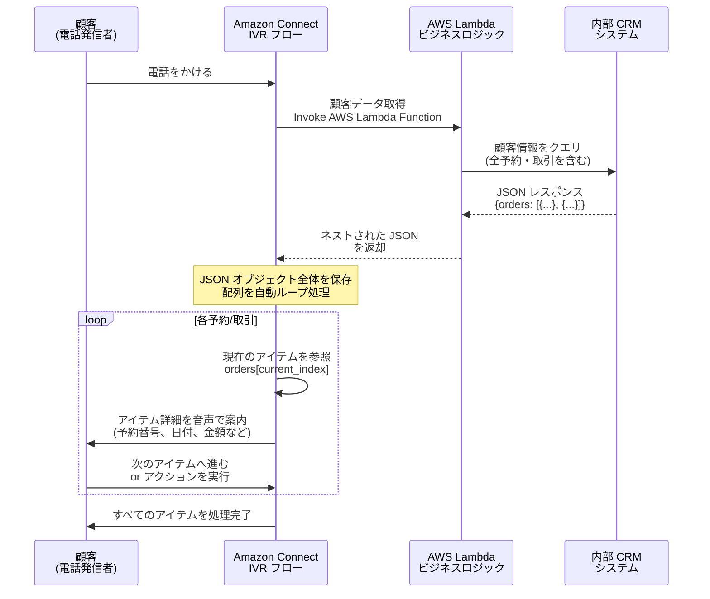

# Amazon Connect - ネストされた JSON オブジェクトとループ配列のサポート

**リリース日**: 2026年1月2日
**サービス**: Amazon Connect
**機能**: フローにおけるネストされた JSON オブジェクトとループ配列の保存・処理

## 概要

Amazon Connect は、フロー内で複雑なデータ構造を保存および操作できる新機能を発表しました。この機能により、内部ビジネスシステムから返される豊富な情報を使用して、動的な自動化エクスペリエンスを簡単に構築できるようになります。ネストされた JSON オブジェクトやリストを含む完全なデータレコードを保存し、その中の特定の要素を参照できるようになりました。

さらに、カスタマーサービスフロー内でアイテムのリストを自動的にループ処理し、各エントリを順番に処理しながらループ内の現在位置を追跡できます。これにより、アイテムレベルの詳細に簡単にアクセスし、関連情報をエンドカスタマーに提示できるようになりました。例えば、旅行代理店は顧客のすべての旅程を1回のリクエストで取得し、各予約を確認または更新するように発信者を案内できます。同様に、銀行は顧客をシステムから安全に取得したデータを使用して、最近の取引を1つずつ案内できます。

**アップデート前の課題**

- 複雑なデータ構造 (ネストされた JSON オブジェクトや配列) をフロー内で扱うことが困難だった
- ビジネスシステムから返されるリストデータを処理するために、複数回の API 呼び出しが必要だった
- 配列内のアイテムを順番に処理するための手動ループ処理が複雑でメンテナンスが困難だった
- リストデータを扱う場合、各アイテムに対して個別のフローブロックを作成する必要があり、フロー設計が複雑化していた

**アップデート後の改善**

- ネストされた JSON オブジェクトと配列を完全にフロー内で保存および参照できるようになった
- 配列内のアイテムを自動的にループ処理し、現在の位置を追跡できるようになった
- ビジネスシステムへの繰り返し呼び出しを減らし、フロー設計を簡素化できるようになった
- 顧客の複数の予約や取引など、複数のアイテムを含むデータを1回のリクエストで取得し、順番に処理できるようになった

## アーキテクチャ図



この図は、顧客が電話をかけた際に、Amazon Connect フローが AWS Lambda を呼び出してビジネスシステムから複数のアイテムを含む JSON データを取得し、配列をループ処理して各アイテムを順番に案内する流れを示しています。

## サービスアップデートの詳細

### 主要機能

1. **ネストされた JSON オブジェクトの保存と参照**
   - フロー内でネストされた JSON オブジェクト全体を保存
   - JSON パス表記を使用して、特定のネストされた要素にアクセス (例: `customer.orders[0].orderNumber`)
   - 複雑なデータ構造を1つの属性として扱い、フロー設計を簡素化

2. **配列の自動ループ処理**
   - リスト内のアイテムを順番に自動的にループ処理
   - 現在のループ位置 (インデックス) を自動追跡
   - ループ内で各アイテムの詳細にアクセスし、顧客に提示

3. **ビジネスシステムとの統合簡素化**
   - 1回の AWS Lambda 呼び出しで複数のデータレコードを取得
   - 繰り返しの API 呼び出しを削減し、レイテンシーとコストを削減
   - フローのメンテナンスを簡素化し、ビジネス要件の変化に柔軟に対応

## 技術仕様

### サポートされるデータ構造

| データ構造 | 説明 | 例 |
|-----------|------|-----|
| ネストされた JSON オブジェクト | 複数レベルのオブジェクト階層をサポート | `{"customer": {"name": "John", "address": {"city": "Tokyo"}}}` |
| 配列 (リスト) | 複数のアイテムを含む配列 | `{"orders": [{"id": 1}, {"id": 2}]}` |
| 混合構造 | オブジェクトと配列の組み合わせ | `{"customer": {"orders": [{"id": 1}]}}` |

### JSON パス参照

フロー内で JSON オブジェクトの特定の要素を参照するには、JSON パス表記を使用します。

```json
{
  "customer": {
    "name": "John Doe",
    "orders": [
      {
        "orderId": "12345",
        "date": "2026-01-01",
        "amount": 100.00
      },
      {
        "orderId": "67890",
        "date": "2026-01-05",
        "amount": 200.00
      }
    ]
  }
}
```

参照例:
- 顧客名: `$.customer.name` → "John Doe"
- 最初の注文 ID: `$.customer.orders[0].orderId` → "12345"
- 2番目の注文金額: `$.customer.orders[1].amount` → 200.00

### API 変更履歴

| 日付 | サービス | 変更内容 |
|------|----------|----------|
| 2025/12/30 | Amazon Connect Service | 1 updated method - グローバル連絡先の検索に ActiveRegions フィルターのサポートが追加され、ListSecurityProfileFlowModules および ListEntitySecurityProfiles にページネーションサポートが追加されました (この API 変更は、ネストされた JSON 機能とは直接関連しません) |

## 設定方法

### 前提条件

1. Amazon Connect インスタンスが既に作成されていること
2. AWS Lambda 関数がビジネスシステムと統合されていること
3. フローを編集する権限があること

### 手順

#### ステップ1: AWS Lambda 関数でネストされた JSON を返す

Lambda 関数を作成または更新し、ネストされた JSON オブジェクトを返すようにします。

```python
import json

def lambda_handler(event, context):
    # 内部ビジネスシステムから顧客データを取得
    customer_data = {
        "customer": {
            "name": "John Doe",
            "customerId": "C12345",
            "itineraries": [
                {
                    "bookingId": "B001",
                    "destination": "Paris",
                    "date": "2026-02-15",
                    "status": "Confirmed"
                },
                {
                    "bookingId": "B002",
                    "destination": "London",
                    "date": "2026-03-20",
                    "status": "Pending"
                }
            ]
        }
    }

    return customer_data
```

Lambda 関数がネストされた JSON オブジェクトを返すように設定します。

#### ステップ2: Amazon Connect フローで Lambda を呼び出し、JSON を保存

Amazon Connect フローエディタで「Invoke AWS Lambda function」ブロックを追加します。

1. フローエディタで「Invoke AWS Lambda function」ブロックを追加
2. Lambda 関数を選択
3. 「Function input parameters」で必要なパラメータ (例: 顧客電話番号) を設定
4. 「Success」パスで Lambda のレスポンス全体を属性に保存
   - 属性名: `customerData`
   - 値: `$.External.customer` (Lambda レスポンス全体)

#### ステップ3: 配列をループ処理

フローエディタで「Loop」ブロックを追加し、配列をループ処理します。

1. 「Loop」ブロックを追加
2. 「Loop through」で配列を指定: `$.Attributes.customerData.itineraries`
3. ループ内で「Play prompt」ブロックを使用し、現在のアイテムの詳細を案内
   - テキスト読み上げ: "Your booking ID is `$.Attributes.currentItem.bookingId` for `$.Attributes.currentItem.destination`"
4. ループ内で「Get customer input」ブロックを使用し、顧客のアクションを取得 (例: 次のアイテムへ進む、キャンセル、更新)

#### ステップ4: フローをテストして公開

1. フローエディタで「Test」をクリックし、フローをテストオンライン環境でテスト
2. 問題がなければ「Publish」をクリックしてフローを公開

## メリット

### ビジネス面

- **顧客体験の向上**: 複数の予約や取引を1回の電話で案内し、顧客の時間を節約
- **運用コストの削減**: ビジネスシステムへの API 呼び出し回数を削減し、コストを削減
- **柔軟性の向上**: ビジネス要件の変化に応じて、フロー設計を簡単に更新

### 技術面

- **フロー設計の簡素化**: 複雑なデータ構造を1つの属性として扱い、フローブロック数を削減
- **メンテナンスの容易性**: ループ処理が自動化されるため、手動でのインデックス管理が不要
- **パフォーマンスの向上**: 繰り返しの API 呼び出しを削減し、レイテンシーを改善

## デメリット・制約事項

### 制限事項

- JSON オブジェクトのサイズには制限があります (具体的な制限は Amazon Connect のドキュメントを参照)
- 非常に大きな配列 (数百アイテム以上) をループ処理する場合、顧客の待ち時間が長くなる可能性があります

### 考慮すべき点

- ネストされた JSON の構造が複雑すぎる場合、フロー内での参照が煩雑になる可能性があります
- Lambda 関数が返す JSON 構造は、フロー設計と整合性を保つ必要があります
- ループ処理中に顧客がハングアップした場合、適切なエラーハンドリングが必要です

## ユースケース

### ユースケース1: 旅行代理店の予約管理

**シナリオ**: 旅行代理店が顧客のすべての予約を1回の電話で確認し、変更またはキャンセルできるようにしたい。

**実装例**:
1. AWS Lambda 関数で顧客のすべての予約を取得し、ネストされた JSON として返す
2. Amazon Connect フローで JSON を保存し、配列をループ処理
3. 各予約の詳細 (予約番号、目的地、日付、ステータス) を音声で案内
4. 顧客が予約を変更またはキャンセルしたい場合、適切なフローに転送

**効果**: 顧客が複数の予約を1回の電話で確認でき、顧客満足度が向上します。また、エージェントへの転送を減らし、運用コストを削減できます。

### ユースケース2: 銀行の取引履歴案内

**シナリオ**: 銀行が顧客の最近の取引を電話で案内し、不正な取引があればすぐに報告できるようにしたい。

**実装例**:
1. AWS Lambda 関数で顧客の最近の取引 (過去30日間) を取得し、配列として返す
2. Amazon Connect フローで配列をループ処理し、各取引の詳細 (日付、金額、加盟店) を案内
3. 顧客が「不正な取引」と報告した場合、セキュリティチームに転送

**効果**: 顧客が最近の取引を迅速に確認でき、不正検出の精度が向上します。また、セルフサービスで取引を確認できるため、コールセンターの負荷が軽減されます。

### ユースケース3: E コマースの注文追跡

**シナリオ**: E コマース企業が顧客の複数の注文を電話で追跡し、配送状況を案内したい。

**実装例**:
1. AWS Lambda 関数で顧客の進行中の注文を取得し、配列として返す
2. Amazon Connect フローで配列をループ処理し、各注文の詳細 (注文番号、商品名、配送状況) を案内
3. 顧客が特定の注文について詳細を知りたい場合、追加情報を提供

**効果**: 顧客が自分のすべての注文を1回の電話で確認でき、カスタマーサポートへの問い合わせが減少します。

## 料金

この機能は、Amazon Connect が利用可能なすべての AWS リージョンで**追加料金なし**で利用できます。

- Amazon Connect の標準料金 (通話時間、フロー使用料) が適用されます
- AWS Lambda の呼び出しには、Lambda の標準料金が適用されます

詳細は [Amazon Connect 料金ページ](https://aws.amazon.com/connect/pricing/) を参照してください。

## 利用可能リージョン

この機能は、Amazon Connect が利用可能な[すべての AWS リージョン](https://aws.amazon.com/about-aws/global-infrastructure/regional-product-services/)で利用できます。

## 関連サービス・機能

- **AWS Lambda**: ビジネスシステムと統合し、ネストされた JSON データを取得
- **Amazon DynamoDB**: 顧客データや注文データを保存し、Lambda から取得
- **Amazon Connect Customer Profiles**: 顧客の統合プロファイルを管理し、複数のデータソースから情報を集約

## 参考リンク

- [公式発表 (What's New)](https://aws.amazon.com/about-aws/whats-new/2026/01/amazon-connect-nested-json-object-looping-arrays/)
- [Amazon Connect 管理者ガイド](https://docs.aws.amazon.com/connect/latest/adminguide/what-is-amazon-connect.html)
- [Amazon Connect 製品ページ](https://aws.amazon.com/connect/)
- [Amazon Connect 料金ページ](https://aws.amazon.com/connect/pricing/)

## まとめ

Amazon Connect のネストされた JSON オブジェクトとループ配列のサポートは、カスタマーサービスフローの設計を大幅に簡素化し、複雑なデータ構造を扱う際の柔軟性を向上させます。追加料金なしで利用可能なため、旅行代理店、銀行、E コマース企業など、複数のアイテムを含むデータを顧客に案内する必要があるすべての組織は、この機能を活用してカスタマーエクスペリエンスを向上させることを推奨します。
