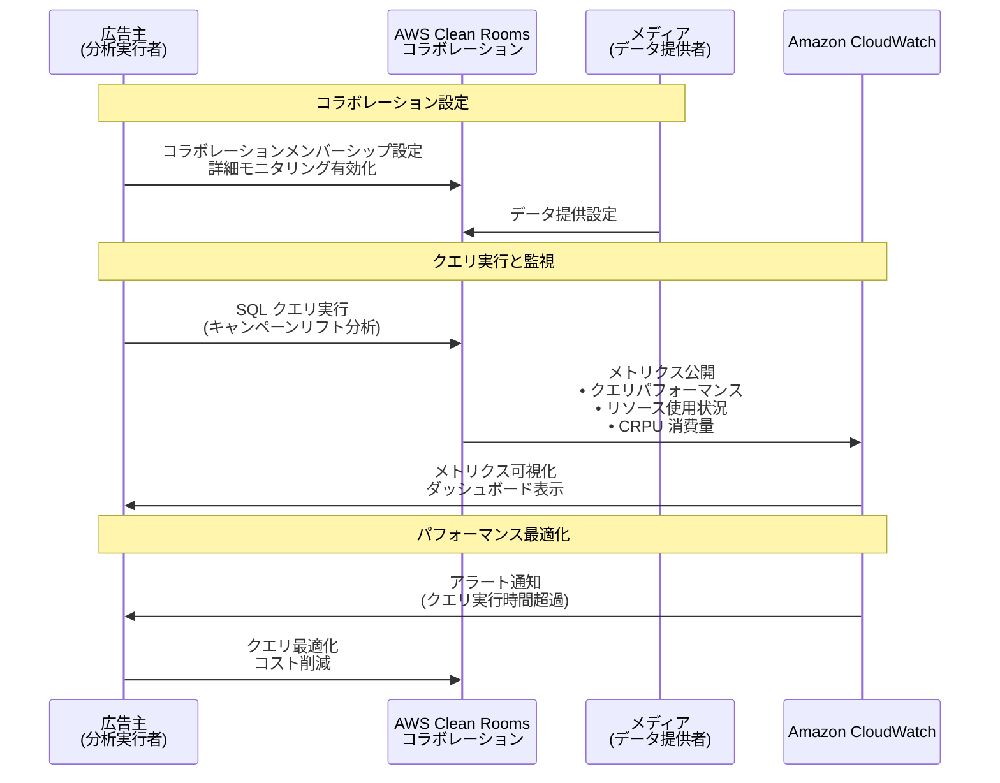

# AWS Clean Rooms - コラボレーションクエリの詳細モニタリング

**リリース日**: 2026年1月2日
**サービス**: AWS Clean Rooms
**機能**: コラボレーションクエリの詳細モニタリング (CloudWatch 統合)

## 概要

AWS Clean Rooms は、コラボレーション内の SQL クエリに対する詳細モニタリング機能を発表しました。この新機能により、クエリのパフォーマンスとリソース使用状況を含む詳細なメトリクスを CloudWatch に公開できるようになります。これにより、大規模なワークロードの可観測性が向上し、コラボレーションの運用監視が容易になります。

コラボレーション作成者は、コラボレーション全体で詳細モニタリングを有効にでき、分析実行者または設定された支払者は、コラボレーションメンバーシップの設定時に詳細モニタリングを有効にできます。例えば、広告主はキャンペーンのリフト分析クエリを CloudWatch で監視し、パフォーマンスの問題を特定してコストを最適化できます。

**アップデート前の課題**

- コラボレーションクエリのパフォーマンスやリソース使用状況を詳細に監視する手段が限られていた
- クエリの実行時間やリソース消費を定量的に把握し、最適化するための情報が不足していた
- 大規模なデータコラボレーションにおいて、コスト最適化のためのメトリクスが不足していた
- クエリの問題を早期に検出し、対応するためのリアルタイムな可観測性が不足していた

**アップデート後の改善**

- SQL クエリの詳細なメトリクスが CloudWatch に公開され、クエリパフォーマンスとリソース使用状況を可視化できるようになった
- コラボレーション作成者、分析実行者、支払者が柔軟に詳細モニタリングを有効化できるようになった
- CloudWatch のダッシュボードやアラート機能を活用して、クエリの問題を早期に検出し、対応できるようになった
- 大規模なワークロードの可観測性が向上し、コスト最適化とパフォーマンスチューニングが容易になった

## アーキテクチャ図



この図は、広告主がコラボレーションで SQL クエリを実行し、CloudWatch でメトリクスを監視してパフォーマンスを最適化する流れを示しています。

## サービスアップデートの詳細

### 主要機能

1. **詳細メトリクスの CloudWatch 公開**
   - SQL クエリのパフォーマンスメトリクスを CloudWatch に公開
   - クエリの実行時間、リソース使用状況、CRPU (Clean Rooms Processing Unit) 消費量などを追跡
   - リアルタイムでクエリのパフォーマンスを監視し、問題を早期に検出

2. **柔軟な有効化オプション**
   - **コラボレーション作成者**: コラボレーション全体で詳細モニタリングを有効化
   - **分析実行者または支払者**: コラボレーションメンバーシップ設定時に詳細モニタリングを有効化
   - 各参加者が自身の可観測性ニーズに応じて設定可能

3. **CloudWatch との統合**
   - CloudWatch ダッシュボードでカスタムビューを作成
   - CloudWatch アラームを設定し、クエリのパフォーマンス問題を自動検出
   - CloudWatch Logs Insights を使用して、クエリのトレンドを分析

## 技術仕様

### メトリクスの種類

| メトリクスカテゴリ | 詳細 |
|-------------------|------|
| クエリパフォーマンス | 実行時間 (AnalysisRuntime)、クエリ数 (AnalysesCount)、同時実行クエリ数 (ConcurrentQueries) |
| リソース使用状況 | CRPU 消費量 (CRPUConsumed)、同時 vCPU 数 (ConcurrentVCPUs)、メモリ使用率、ディスク使用率 |
| データ処理量 | 読み取りバイト数 (BytesRead)、書き込みバイト数 (BytesWritten)、読み取りレコード数 (RecordsRead)、書き込みレコード数 (RecordsWritten) |

### API 変更履歴

| 日付 | サービス | 変更内容 |
|------|----------|----------|
| 2026/01/02 | AWS Clean Rooms Service | 6 updated methods - 詳細メトリクスを CloudWatch に公開するための API メソッドが更新され、コラボレーションおよびメンバーシップ設定で詳細モニタリングを有効化するオプションが追加されました |

### メトリクスの公開先

詳細モニタリングメトリクスは、CloudWatch の `AWS/CleanRooms` ネームスペースに公開されます。

```json
{
  "Namespace": "AWS/CleanRooms",
  "MetricName": "AnalysisRuntime",
  "Dimensions": [
    {
      "Name": "CollaborationId",
      "Value": "collaboration-12345"
    },
    {
      "Name": "AnalysisStatus",
      "Value": "COMPLETED"
    }
  ]
}
```

## 設定方法

### 前提条件

1. AWS Clean Rooms のコラボレーションが既に作成されていること
2. コラボレーション作成者、分析実行者、または支払者のロールを持っていること
3. CloudWatch へのアクセス権限があること

### 手順

#### ステップ1: コラボレーション作成者として詳細モニタリングを有効化

コラボレーション作成時または既存のコラボレーションの設定で、詳細モニタリングを有効にします。

```bash
# AWS CLI を使用してコラボレーションの詳細モニタリングを有効化
aws cleanrooms update-collaboration \
  --collaboration-identifier collaboration-12345 \
  --query-log-status ENABLED
```

コラボレーション全体で詳細モニタリングを有効化します。

#### ステップ2: 分析実行者または支払者として詳細モニタリングを有効化

コラボレーションメンバーシップの設定時に、詳細モニタリングを有効にします。

```bash
# AWS CLI を使用してメンバーシップの詳細モニタリングを有効化
aws cleanrooms update-membership \
  --membership-identifier membership-67890 \
  --query-log-status ENABLED
```

メンバーシップレベルで詳細モニタリングを有効化します。

#### ステップ3: CloudWatch でメトリクスを確認

CloudWatch コンソールにアクセスし、`AWS/CleanRooms` ネームスペースでメトリクスを確認します。

1. [CloudWatch コンソール](https://console.aws.amazon.com/cloudwatch/) にアクセス
2. 左側のナビゲーションで「メトリクス」→「すべてのメトリクス」を選択
3. `AWS/CleanRooms` ネームスペースを検索
4. 表示したいメトリクス (AnalysisRuntime、CRPUConsumed など) を選択

## メリット

### ビジネス面

- **コスト最適化**: クエリのリソース消費を可視化し、非効率なクエリを特定してコストを削減
- **パフォーマンス改善**: クエリの実行時間を監視し、遅いクエリを最適化してビジネスの意思決定を迅速化
- **運用の透明性**: コラボレーション参加者がクエリのパフォーマンスを共有し、共同でワークロードを最適化

### 技術面

- **リアルタイム可観測性**: CloudWatch との統合により、クエリのパフォーマンス問題をリアルタイムで検出
- **カスタムアラート**: CloudWatch アラームを設定し、クエリの実行時間やコスト超過時に自動通知
- **既存ツールとの統合**: CloudWatch の既存のダッシュボードやログ分析ツールを活用し、追加の開発が不要

## デメリット・制約事項

### 制限事項

- データ提供者のみのメンバーは詳細モニタリングメトリクスにアクセスできない
- AWS Clean Rooms 自体はメトリクスの公開に料金を請求しないが、CloudWatch の標準料金 (メトリクスストレージ、ダッシュボード、アラーム) が適用される

### 考慮すべき点

- 詳細モニタリングを有効にすると、CloudWatch にメトリクスが蓄積されるため、CloudWatch の料金が増加する可能性がある
- 大量のクエリを実行する場合、メトリクスの数が増加するため、コスト管理が重要
- 詳細モニタリングは、パフォーマンス最適化の第一歩であり、実際のクエリ改善には SQL の最適化やデータ構造の見直しが必要

## ユースケース

### ユースケース1: 広告キャンペーンのリフト分析最適化

**シナリオ**: 広告主が複数のメディアとデータコラボレーションを行い、キャンペーンのリフト分析を実行している。クエリの実行時間が長く、コストが増加している。

**実装例**:
1. コラボレーションメンバーシップで詳細モニタリングを有効化
2. CloudWatch で `AnalysisRuntime` と `CRPUConsumed` メトリクスを確認
3. 実行時間が長いクエリを特定し、SQL を最適化
4. CloudWatch アラームを設定し、クエリ実行時間が閾値を超えた場合に通知

**効果**: クエリの実行時間を 50% 削減し、CRPU 消費量を 30% 削減することで、コストを大幅に削減できる。

### ユースケース2: 投資判断のためのデータコラボレーション

**シナリオ**: 金融機関が複数のデータプロバイダーと協力し、投資判断のためのデータ分析を行っている。クエリのパフォーマンスを継続的に監視し、SLA を満たしたい。

**実装例**:
1. コラボレーション作成者として詳細モニタリングを有効化
2. CloudWatch ダッシュボードで主要メトリクス (AnalysisRuntime、ConcurrentQueries、CRPUConsumed) を可視化
3. SLA に基づいて CloudWatch アラームを設定 (例: クエリ実行時間が 5 分を超えた場合に通知)
4. 定期的にメトリクスをレビューし、クエリのパフォーマンスを改善

**効果**: SLA 違反を早期に検出し、投資判断の遅延を防ぐことができる。

### ユースケース3: 研究開発のためのデータコラボレーション

**シナリオ**: 製薬会社が複数の研究機関とデータコラボレーションを行い、新薬の開発に必要なデータ分析を実行している。コスト管理と透明性が重要。

**実装例**:
1. 各研究機関が自身のメンバーシップで詳細モニタリングを有効化
2. CloudWatch で CRPU 消費量とクエリ数を追跡
3. 月次レポートを作成し、各機関のクエリコストを透明化
4. コスト超過のリスクがある場合、CloudWatch アラームで通知

**効果**: 各機関がコストを透明に管理し、予算内でデータコラボレーションを継続できる。

## 料金

AWS Clean Rooms は、詳細モニタリングメトリクスを CloudWatch に公開するための料金を請求しません。ただし、CloudWatch の標準料金が適用されます。

### CloudWatch 料金 (参考)

| 項目 | 料金 |
|------|------|
| カスタムメトリクス | 最初の 10,000 メトリクス: $0.30/メトリクス/月 |
| ダッシュボード | $3.00/ダッシュボード/月 |
| アラーム | 標準アラーム: $0.10/アラーム/月 |

詳細は [CloudWatch 料金ページ](https://aws.amazon.com/cloudwatch/pricing/) を参照してください。

## 利用可能リージョン

詳細モニタリング機能は、AWS Clean Rooms が利用可能なすべてのリージョンで提供されています。詳細は [AWS Regions テーブル](https://docs.aws.amazon.com/general/latest/gr/clean-rooms.html#clean-rooms_region) を参照してください。

## 関連サービス・機能

- **Amazon CloudWatch**: メトリクスの可視化、ダッシュボード作成、アラーム設定に使用
- **AWS Clean Rooms ML**: 機械学習モデルのトレーニングや推論におけるパフォーマンス監視にも応用可能
- **Amazon EventBridge**: クエリ完了イベントを他のサービスにルーティングし、自動化ワークフローを構築

## 参考リンク

- [公式発表 (What's New)](https://aws.amazon.com/about-aws/whats-new/2026/01/clean-rooms-detailed-monitoring-collaboration-queries/)
- [AWS Clean Rooms CloudWatch メトリクスドキュメント](https://docs.aws.amazon.com/clean-rooms/latest/userguide/cloudwatch-metrics.html)
- [AWS Clean Rooms 製品ページ](https://aws.amazon.com/clean-rooms/)
- [CloudWatch 料金ページ](https://aws.amazon.com/cloudwatch/pricing/)

## まとめ

AWS Clean Rooms の詳細モニタリング機能は、コラボレーションクエリのパフォーマンスとコストを可視化し、データドリブンな最適化を可能にします。CloudWatch との統合により、既存の監視インフラストラクチャを活用してリアルタイムな可観測性を実現できるため、データコラボレーションを行うすべての組織は、この機能を有効化してワークロードの最適化を開始することを推奨します。
