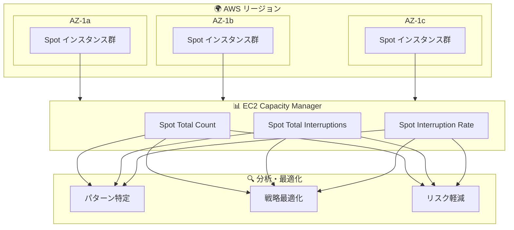

# Amazon EC2 Capacity Manager - Spot インスタンス中断メトリクスの追加

**リリース日**: 2026 年 1 月 5 日
**サービス**: Amazon EC2 Capacity Manager
**機能**: Spot インスタンス中断メトリクス

## 概要

Amazon EC2 Capacity Manager に新しい Spot インスタンス中断メトリクスが追加され、組織全体の Spot キャパシティをより深く理解できるようになりました。EC2 Capacity Manager は、オンデマンド、Spot、キャパシティ予約を含む EC2 キャパシティを単一の場所から監視、分析、管理するのに役立ちます。

この新機能により、実行中の Spot インスタンス数の追跡、中断回数の監視、リージョン、アベイラビリティゾーン、アカウント全体での中断率の計算が可能になります。これにより、Spot インスタンス戦略についてデータドリブンな意思決定ができるようになります。

**アップデート前の課題**

- Spot インスタンスの中断パターンを組織全体で把握することが困難だった
- リージョンやアベイラビリティゾーン間での中断率の比較が手動で行う必要があった
- Spot インスタンス戦略の最適化に必要なデータが分散していた
- 中断リスクの高いキャパシティプールの特定が困難だった

**アップデート後の改善**

- 3 つの新しいメトリクスで Spot キャパシティを包括的に監視
- リージョン、アベイラビリティゾーン、アカウント間での比較分析
- 中断パターンの特定と Spot 戦略の最適化
- データドリブンなインスタンスタイプの多様化とゾーン拡張の意思決定

## アーキテクチャ図



EC2 Capacity Manager で Spot インスタンスの中断メトリクスを監視し、戦略を最適化できます。

## サービスアップデートの詳細

### 主要機能

1. **Spot Total Count メトリクス**
   - 選択した期間中に実行された Spot インスタンスまたは vCPU の総数
   - リージョン、アベイラビリティゾーン、アカウント別に集計可能

2. **Spot Total Interruptions メトリクス**
   - 中断された Spot インスタンスの数を追跡
   - 中断パターンの特定に活用

3. **Spot Interruption Rate メトリクス**
   - 実行中のインスタンスのうち中断を経験した割合を計算
   - パーセンテージで表示

## 技術仕様

### 新しいメトリクス

| メトリクス | 説明 | 単位 |
|-----------|------|------|
| Spot Total Count | 期間中に実行された Spot インスタンス/vCPU の総数 | 個数 |
| Spot Total Interruptions | 中断された Spot インスタンスの数 | 個数 |
| Spot Interruption Rate | 中断を経験したインスタンスの割合 | パーセント |

### フィルタリングオプション

| フィルター | 説明 |
|-----------|------|
| リージョン | AWS リージョン別にフィルタリング |
| アベイラビリティゾーン | AZ 別にフィルタリング |
| アカウント | AWS アカウント別にフィルタリング |
| インスタンスタイプ | インスタンスタイプ別にフィルタリング |

## 設定方法

### 前提条件

1. AWS アカウントへのアクセス権限
2. EC2 Capacity Manager へのアクセス権限
3. Spot インスタンスの使用実績

### 手順

#### ステップ 1: EC2 Capacity Manager にアクセス

AWS コンソールから EC2 Capacity Manager にアクセスします。

```
https://console.aws.amazon.com/ec2/home#CapacityManagerHome
```

#### ステップ 2: Spot メトリクスの確認

Capacity Manager ダッシュボードで Spot インスタンスセクションを選択し、新しいメトリクスを確認します。

#### ステップ 3: フィルターの適用と分析

リージョン、アベイラビリティゾーン、アカウントでフィルタリングし、中断パターンを分析します。

## メリット

### ビジネス面

- **コスト最適化**: 中断率の低いキャパシティプールを特定し、コスト効率を向上
- **可用性向上**: 中断リスクを軽減する戦略の策定
- **データドリブンな意思決定**: 実際のデータに基づいた Spot 戦略の最適化

### 技術面

- **包括的な可視性**: 組織全体の Spot キャパシティを一元的に監視
- **パターン分析**: リージョン、AZ 間での中断パターンの特定
- **戦略最適化**: インスタンスタイプの多様化や AZ 拡張の判断材料

## デメリット・制約事項

### 制限事項

- 過去のデータは一定期間のみ保持される
- リアルタイムではなく、一定の遅延がある場合がある

### 考慮すべき点

- 中断率は時間帯や需要によって変動する
- 過去のパターンが将来を保証するものではない

## ユースケース

### ユースケース 1: Spot インスタンス戦略の最適化

**シナリオ**: 大規模なバッチ処理ワークロードで Spot インスタンスを使用しており、中断による影響を最小化したい

**実装例**:
1. EC2 Capacity Manager で中断率を確認
2. 中断率の低いアベイラビリティゾーンを特定
3. Spot Fleet の設定を更新して、低中断率の AZ を優先

**効果**: 中断による処理の再実行を削減し、全体的な処理時間とコストを最適化

### ユースケース 2: マルチリージョン展開の計画

**シナリオ**: 新しいリージョンへの Spot ワークロードの展開を検討している

**実装例**:
1. 候補リージョンの Spot 中断メトリクスを比較
2. 中断率の低いリージョンを選択
3. Spot placement score と組み合わせて最適なキャパシティプールを特定

**効果**: 新しいリージョンでの Spot ワークロードの安定性を確保

### ユースケース 3: インスタンスタイプの多様化

**シナリオ**: 特定のインスタンスタイプで中断が頻発している

**実装例**:
1. インスタンスタイプ別の中断率を分析
2. 中断率の低い代替インスタンスタイプを特定
3. Spot Fleet の設定でインスタンスタイプを多様化

**効果**: 単一インスタンスタイプへの依存を減らし、全体的な可用性を向上

## 料金

EC2 Capacity Manager の Spot 中断メトリクス機能は追加料金なしで利用できます。

## 利用可能リージョン

デフォルトで有効化されているすべての商用 AWS リージョンで利用可能です。

## 関連サービス・機能

- **Spot placement score**: 最適なキャパシティプールの特定
- **EC2 Fleet**: 複数のインスタンスタイプと購入オプションの組み合わせ
- **Spot Fleet**: Spot インスタンスのフリート管理
- **AWS Cost Explorer**: コスト分析と最適化

## 参考リンク

- [公式発表 (What's New)](https://aws.amazon.com/about-aws/whats-new/2026/01/ec2-capacity-manager-spot-interruption-metrics/)
- [Spot placement score ドキュメント](https://docs.aws.amazon.com/AWSEC2/latest/UserGuide/spot-placement-score.html)
- [EC2 Capacity Manager コンソール](https://console.aws.amazon.com/ec2/home#CapacityManagerHome)

## まとめ

EC2 Capacity Manager の Spot 中断メトリクスにより、組織全体の Spot インスタンスの中断パターンを包括的に把握できるようになりました。これらのメトリクスを活用して、インスタンスタイプの多様化、アベイラビリティゾーンの拡張、Spot placement score との組み合わせにより、Spot インスタンス戦略を最適化し、コスト効率と可用性のバランスを改善できます。
