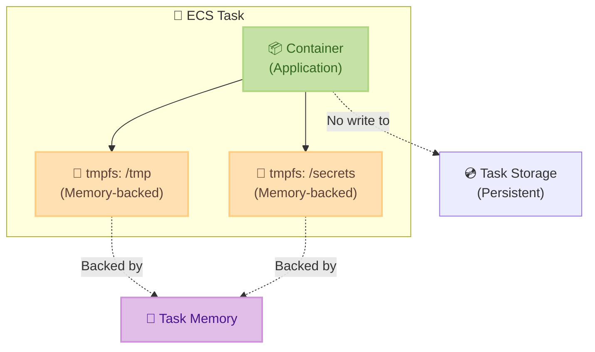

# Amazon ECS - tmpfs マウントのサポート拡大

**リリース日**: 2026年1月6日
**サービス**: Amazon Elastic Container Service (Amazon ECS)
**機能**: AWS Fargate および ECS Managed Instances における tmpfs マウントのサポート

## 概要

Amazon ECS が AWS Fargate および Amazon ECS Managed Instances で Linux タスクに対する tmpfs マウントのサポートを開始しました。これまで EC2 起動タイプでのみ利用可能だった tmpfs マウント機能が、Fargate と ECS Managed Instances にも拡張されました。tmpfs はメモリベースの一時ファイルシステムで、タスクストレージにデータを書き込むことなく、コンテナ化されたワークロードに高速なストレージを提供します。

この機能により、パフォーマンス重視のワークロードやセキュリティに配慮したデータ処理が容易になります。tmpfs に書き込まれたデータはタスクが停止すると自動的に消去されるため、機密情報の一時的な保存に適しています。また、`readonlyRootFilesystem` 設定を使用してコンテナのルートファイルシステムを読み取り専用に保ちながら、特定のメモリ内ディレクトリへの書き込みを許可することができます。

**アップデート前の課題**

- Fargate および ECS Managed Instances では tmpfs マウントが利用できず、一時データをタスクストレージに書き込む必要があった
- メモリベースの高速ストレージを必要とするワークロードは EC2 起動タイプに限定されていた
- セキュリティ重視のワークロードで、ルートファイルシステムを読み取り専用にしながら一時書き込みを許可する柔軟性が不足していた

**アップデート後の改善**

- Fargate および ECS Managed Instances でもメモリベースの tmpfs マウントが利用可能になった
- すべての起動タイプで一貫した tmpfs 機能を使用できるようになった
- キャッシュファイル、スクラッチファイル、一時的な認証情報などを高速かつセキュアに処理できるようになった

## アーキテクチャ図



tmpfs マウントはタスクメモリに直接バックアップされ、タスク停止後にデータが自動的に削除されるため、セキュリティとパフォーマンスの両立が可能です。

## サービスアップデートの詳細

### 主要機能

1. **メモリベースのファイルシステム**
   - tmpfs マウントはタスクメモリによってバックアップされる一時ファイルシステムを提供
   - 指定したパス (containerPath) でコンテナ内に公開される
   - タスク停止後、データは自動的に消去される

2. **パフォーマンス最適化**
   - スクラッチファイル、キャッシュ、一時的な作業セットへの高速アクセスを実現
   - ディスク I/O のオーバーヘッドを排除し、メモリ速度での読み書きが可能
   - パフォーマンス重視のワークロードに最適

3. **セキュリティ強化**
   - 短期間の秘密情報や認証情報を安全に保存
   - タスク終了後にデータが自動的に削除されるため、機密データの漏洩リスクを低減
   - `readonlyRootFilesystem` 設定との併用により、セキュアなコンテナ環境を構築可能

## 技術仕様

### 設定パラメータ

| 項目 | 説明 |
|------|------|
| containerPath | tmpfs ボリュームがマウントされる絶対ファイルパス（必須） |
| size | tmpfs ボリュームの最大サイズ (MiB 単位、必須) |
| mountOptions | tmpfs ボリュームマウントのオプションリスト（オプション） |

### マウントオプション

利用可能な mountOptions: `defaults`, `ro`, `rw`, `suid`, `nosuid`, `dev`, `nodev`, `exec`, `noexec`, `sync`, `async`, `dirsync`, `remount`, `mand`, `nomand`, `atime`, `noatime`, `diratime`, `nodiratime`, `bind`, `rbind`, `unbindable`, `runbindable`, `private`, `rprivate`, `shared`, `rshared`, `slave`, `rslave`, `relatime`, `norelatime`, `strictatime`, `nostrictatime`, `mode`, `uid`, `gid`, `nr_inodes`, `nr_blocks`, `mpol`

### タスク定義の設定例

```json
{
  "containerDefinitions": [
    {
      "name": "myapp",
      "image": "myapp:latest",
      "linuxParameters": {
        "tmpfs": [
          {
            "containerPath": "/tmp",
            "size": 1024,
            "mountOptions": ["rw", "noexec", "nosuid", "nodev"]
          },
          {
            "containerPath": "/cache",
            "size": 2048,
            "mountOptions": ["rw"]
          }
        ],
        "readonlyRootFilesystem": true
      }
    }
  ]
}
```

この設定により、ルートファイルシステムを読み取り専用に保ちながら、`/tmp` と `/cache` への書き込みが可能になります。

## 設定方法

### 前提条件

1. Amazon ECS タスク定義の作成または更新権限
2. AWS Fargate または Amazon ECS Managed Instances を使用するクラスター
3. Linux ベースのコンテナイメージ

### 手順

#### ステップ1: タスク定義の作成または更新

```bash
aws ecs register-task-definition \
  --family myapp-task \
  --container-definitions '[
    {
      "name": "myapp",
      "image": "myapp:latest",
      "memory": 2048,
      "linuxParameters": {
        "tmpfs": [
          {
            "containerPath": "/tmp",
            "size": 1024,
            "mountOptions": ["rw", "noexec"]
          }
        ]
      }
    }
  ]' \
  --requires-compatibilities FARGATE \
  --network-mode awsvpc \
  --cpu 1024 \
  --memory 2048
```

このコマンドは、tmpfs マウントを含む新しいタスク定義を登録します。`/tmp` ディレクトリに 1024 MiB のメモリベースファイルシステムがマウントされます。

#### ステップ2: タスクの起動

```bash
aws ecs run-task \
  --cluster my-cluster \
  --task-definition myapp-task \
  --launch-type FARGATE \
  --network-configuration "awsvpcConfiguration={subnets=[subnet-12345],securityGroups=[sg-12345]}"
```

登録したタスク定義を使用して、Fargate 上でタスクを起動します。

#### ステップ3: 動作確認

```bash
# コンテナ内で tmpfs マウントを確認
aws ecs execute-command \
  --cluster my-cluster \
  --task <task-id> \
  --container myapp \
  --interactive \
  --command "df -h /tmp"
```

ECS Exec を使用して、tmpfs マウントが正しく設定されていることを確認します。

## メリット

### ビジネス面

- **運用コストの削減**: 一時データをメモリに保存することで、ストレージコストを削減
- **セキュリティコンプライアンスの向上**: 機密データが永続化されないため、コンプライアンス要件を満たしやすい
- **開発の柔軟性向上**: EC2、Fargate、ECS Managed Instances 間で一貫した設定が可能になり、ワークロードの移行が容易

### 技術面

- **パフォーマンス向上**: メモリベースのストレージにより、ディスク I/O と比較して大幅な速度向上を実現
- **セキュリティ強化**: タスク終了時にデータが自動削除されるため、機密情報の漏洩リスクを低減
- **柔軟な設定**: `readonlyRootFilesystem` との併用により、セキュアかつ柔軟なファイルシステム構成が可能

## デメリット・制約事項

### 制限事項

- Linux タスクのみがサポート対象 (Windows コンテナは非対応)
- tmpfs のサイズはタスクメモリから割り当てられるため、タスクメモリの上限に影響する
- タスク停止後にデータは永続化されない

### 考慮すべき点

- tmpfs サイズを適切に設定しないと、アプリケーションで使用可能なメモリが不足する可能性がある
- 永続化が必要なデータには、EFS や EBS などの永続ストレージを使用する必要がある
- tmpfs の使用量が size を超えると、書き込みエラーが発生する

## ユースケース

### ユースケース1: 機密情報の一時保存

**シナリオ**: アプリケーションが短期間の認証トークンや API キーを一時的に保存する必要があるが、ディスクに永続化したくない場合。

**実装例**:
```json
{
  "linuxParameters": {
    "tmpfs": [
      {
        "containerPath": "/secrets",
        "size": 512,
        "mountOptions": ["rw", "noexec", "nosuid", "nodev", "mode=0700"]
      }
    ],
    "readonlyRootFilesystem": true
  }
}
```

**効果**: 機密情報がメモリのみに保存され、タスク終了後に自動的に削除されるため、セキュリティが大幅に向上します。

### ユースケース2: 高速キャッシュ処理

**シナリオ**: 画像処理や動画変換など、大量の一時ファイルを高速に読み書きする必要があるワークロード。

**実装例**:
```json
{
  "linuxParameters": {
    "tmpfs": [
      {
        "containerPath": "/cache",
        "size": 4096,
        "mountOptions": ["rw"]
      }
    ]
  }
}
```

**効果**: メモリベースのストレージにより、ディスク I/O のボトルネックを解消し、処理速度が大幅に向上します。

### ユースケース3: ビルドプロセスの最適化

**シナリオ**: CI/CD パイプラインで、ビルド成果物の一時的な保存場所として高速なストレージが必要な場合。

**実装例**:
```json
{
  "linuxParameters": {
    "tmpfs": [
      {
        "containerPath": "/build",
        "size": 2048,
        "mountOptions": ["rw", "noatime"]
      }
    ]
  }
}
```

**効果**: ビルド成果物の読み書きが高速化され、CI/CD パイプラインの実行時間を短縮できます。

## 料金

tmpfs マウント機能自体に追加料金はかかりません。ただし、tmpfs はタスクメモリから割り当てられるため、タスクに割り当てるメモリサイズを増やす必要がある場合があります。

### 料金例

| 使用量 | 月額料金（概算） |
|--------|------------------|
| Fargate タスク (1 vCPU, 2 GB メモリ, tmpfs 512 MB) | タスクメモリの料金に含まれる（追加料金なし） |
| ECS Managed Instances (EC2 インスタンスの料金のみ) | EC2 インスタンスの料金に含まれる（追加料金なし） |

詳細な料金については、[AWS Fargate 料金ページ](https://aws.amazon.com/fargate/pricing/) および [Amazon ECS 料金ページ](https://aws.amazon.com/ecs/pricing/) をご参照ください。

## 利用可能リージョン

Amazon ECS、AWS Fargate、および Amazon ECS Managed Instances がサポートされているすべての AWS リージョンで利用可能です。

## 関連サービス・機能

- **Amazon EFS**: 永続的なファイルストレージが必要な場合は、EFS ボリュームを使用
- **Amazon EBS**: EC2 起動タイプで永続的なブロックストレージが必要な場合に使用
- **AWS Secrets Manager**: 機密情報の安全な保存と管理を提供

## 参考リンク

- [公式発表 (What's New)](https://aws.amazon.com/about-aws/whats-new/2026/01/amazon-ecs-tmpfs-mounts-aws-fargate-managed-instances/)
- [Amazon ECS API Reference - Tmpfs](https://docs.aws.amazon.com/AmazonECS/latest/APIReference/API_Tmpfs.html)
- [Amazon ECS Developer Guide](https://docs.aws.amazon.com/AmazonECS/latest/developerguide/task_definitions.html)

## まとめ

Amazon ECS の tmpfs マウントが AWS Fargate および ECS Managed Instances に対応したことで、すべての起動タイプで一貫したメモリベースストレージ機能を利用できるようになりました。パフォーマンス重視のワークロードやセキュリティに配慮したデータ処理が容易になり、アプリケーションの柔軟性とセキュリティが向上します。既存のワークロードを見直し、tmpfs マウントの活用を検討することをお勧めします。
