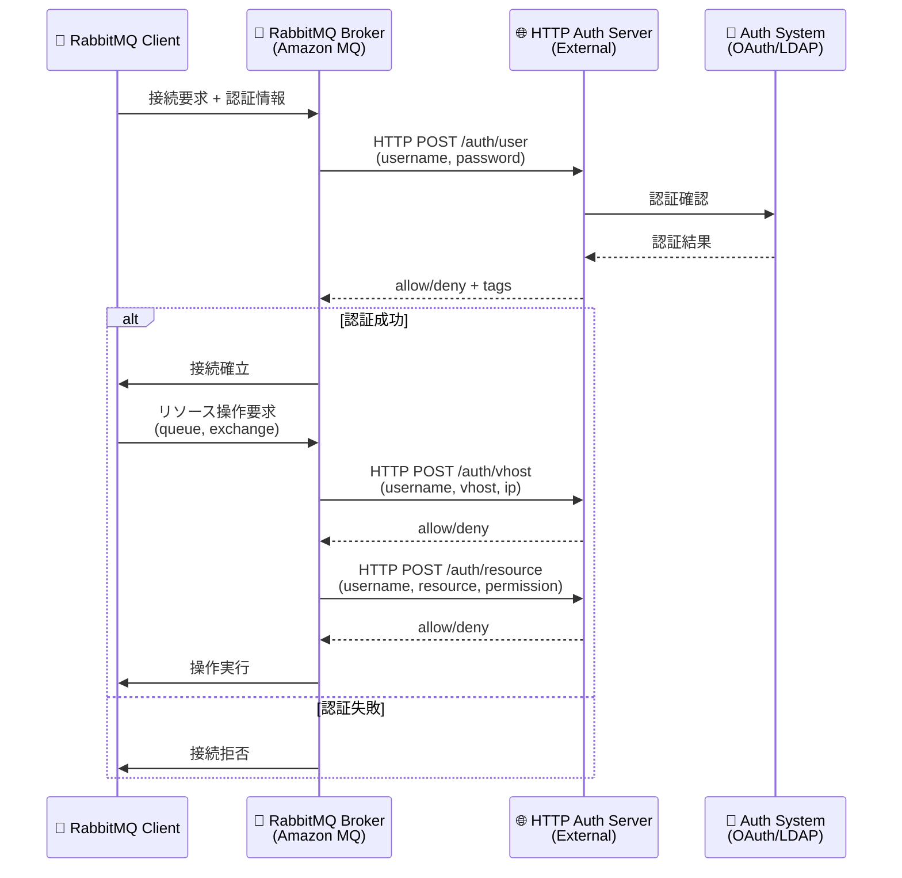

# Amazon MQ - RabbitMQ ブローカーの HTTP ベース認証サポート

**リリース日**: 2026年1月6日
**サービス**: Amazon MQ for RabbitMQ
**機能**: HTTP ベース認証・認可プラグイン

## 概要

Amazon MQ が RabbitMQ ブローカーに対する HTTP ベース認証・認可機能のサポートを開始しました。この機能により、RabbitMQ ブローカーは HTTP サーバーにリクエストを送信して認証 (ユーザーのログイン可否の判定) および認可 (ユーザーの権限判定) を実行できるようになります。このプラグインは、RabbitMQ 4.2 以上を実行している Amazon MQ ブローカーで、関連する設定ファイルを変更することで設定可能です。

この機能により、既存の外部認証システムとの統合が容易になり、中央集約型のユーザー管理とアクセス制御が実現します。OAuth 2.0、LDAP、カスタム認証システムなど、既存の HTTP ベース認証インフラストラクチャを活用できるため、セキュリティポリシーの一元管理が可能になります。

**アップデート前の課題**

- RabbitMQ のユーザー管理が個別のブローカーレベルで行われ、中央集約型の管理ができなかった
- 既存の外部認証システム (OAuth 2.0、LDAP など) との統合が限定的だった
- 組織全体のアクセス制御ポリシーを統一的に適用することが困難だった

**アップデート後の改善**

- HTTP サーバーを通じて外部認証システムと統合できるようになった
- 中央集約型のユーザー管理とアクセス制御が可能になった
- 既存の認証インフラストラクチャを再利用できるようになった

## アーキテクチャ図



HTTP 認証プラグインは、認証および認可の各段階で外部 HTTP サーバーと通信し、中央集約型のアクセス制御を実現します。

## サービスアップデートの詳細

### 主要機能

1. **HTTP ベース認証 (Authentication)**
   - ユーザーのログイン可否を HTTP サーバーに問い合わせて判定
   - ユーザー名、パスワード、IP アドレスを HTTP サーバーに送信
   - HTTP サーバーは `allow` または `deny` を返却

2. **HTTP ベース認可 (Authorization)**
   - ユーザーの権限 (パーミッション) を HTTP サーバーに問い合わせて判定
   - vhost アクセス、リソース (queue、exchange) 操作の権限を制御
   - HTTP サーバーは、ユーザーのロールやタグに基づいて権限を動的に決定

3. **外部認証システムとの統合**
   - OAuth 2.0、LDAP、Active Directory、カスタム認証システムとの統合が可能
   - 既存の認証インフラストラクチャを再利用できるため、導入コストを削減
   - 中央集約型のユーザー管理により、セキュリティポリシーの一元管理が実現

## 技術仕様

### サポート対象バージョン

| 項目 | 要件 |
|------|------|
| RabbitMQ バージョン | RabbitMQ 4.2 以上 |
| インスタンスタイプ | m7g インスタンスタイプ |
| 利用可能リージョン | Amazon MQ RabbitMQ 4 がサポートされているすべてのリージョン |

### HTTP 認証エンドポイント

HTTP 認証サーバーは、以下のエンドポイントを実装する必要があります:

| エンドポイント | 用途 | リクエストパラメータ |
|---------------|------|---------------------|
| `/auth/user` | ユーザー認証 | username, password, ip |
| `/auth/vhost` | vhost アクセス認可 | username, vhost, ip |
| `/auth/resource` | リソース操作認可 | username, vhost, resource, name, permission |
| `/auth/topic` | トピック認可 | username, vhost, resource, name, permission, routing_key |

### 設定ファイルの例 (rabbitmq.conf)

```conf
# HTTP 認証プラグインを有効化
auth_backends.1 = http

# HTTP 認証サーバーの設定
auth_http.http_method = post
auth_http.user_path = https://auth.example.com/auth/user
auth_http.vhost_path = https://auth.example.com/auth/vhost
auth_http.resource_path = https://auth.example.com/auth/resource
auth_http.topic_path = https://auth.example.com/auth/topic

# タイムアウト設定
auth_http.request_timeout = 5000

# TLS 設定 (オプション)
auth_http.ssl_options.verify = verify_peer
auth_http.ssl_options.cacertfile = /path/to/ca-cert.pem
```

この設定により、RabbitMQ ブローカーは外部 HTTP サーバーに認証・認可をデリゲートします。

## 設定方法

### 前提条件

1. RabbitMQ 4.2 以上をサポートする Amazon MQ ブローカー
2. m7g インスタンスタイプを使用
3. 外部 HTTP 認証サーバーが構築済みであること
4. Amazon MQ 設定ファイルの編集権限

### 手順

#### ステップ1: RabbitMQ 4.2 ブローカーの作成

```bash
aws mq create-broker \
  --broker-name my-rabbitmq-broker \
  --engine-type RABBITMQ \
  --engine-version 4.2 \
  --host-instance-type mq.m7g.large \
  --deployment-mode SINGLE_INSTANCE \
  --publicly-accessible \
  --users Username=admin,Password=MySecurePassword123
```

RabbitMQ 4.2 および m7g インスタンスタイプを使用して、新しいブローカーを作成します。

#### ステップ2: 設定ファイルの作成

```bash
aws mq create-configuration \
  --name my-http-auth-config \
  --engine-type RABBITMQ \
  --engine-version 4.2 \
  --configuration-data file://rabbitmq.conf
```

`rabbitmq.conf` ファイル:
```conf
auth_backends.1 = http
auth_http.http_method = post
auth_http.user_path = https://auth.example.com/auth/user
auth_http.vhost_path = https://auth.example.com/auth/vhost
auth_http.resource_path = https://auth.example.com/auth/resource
auth_http.request_timeout = 5000
```

HTTP 認証プラグインを有効化する設定ファイルを作成します。

#### ステップ3: ブローカーに設定を適用

```bash
aws mq update-broker \
  --broker-id <broker-id> \
  --configuration Id=<configuration-id>,Revision=<revision>
```

作成した設定ファイルをブローカーに適用します。ブローカーが再起動され、HTTP 認証プラグインが有効化されます。

#### ステップ4: 動作確認

```python
import pika

credentials = pika.PlainCredentials('testuser', 'testpassword')
parameters = pika.ConnectionParameters(
    host='b-xxxx-xxxx.mq.us-east-1.amazonaws.com',
    port=5671,
    credentials=credentials,
    ssl_options=pika.SSLOptions()
)

connection = pika.BlockingConnection(parameters)
channel = connection.channel()
print("Connection successful!")
```

RabbitMQ クライアントから接続し、HTTP 認証サーバーによる認証が正常に動作することを確認します。

## メリット

### ビジネス面

- **セキュリティポリシーの一元管理**: 中央集約型の認証システムにより、組織全体のセキュリティポリシーを統一的に適用
- **コンプライアンス対応の簡素化**: 既存の認証システムと統合することで、コンプライアンス要件を満たしやすい
- **運用コストの削減**: 個別のブローカーレベルでのユーザー管理が不要になり、運用負担を軽減

### 技術面

- **柔軟な認証・認可**: HTTP サーバーを通じて、任意の認証システム (OAuth 2.0、LDAP、カスタムシステム) と統合可能
- **動的なアクセス制御**: ユーザーのロールやコンテキストに基づいて、動的に権限を変更可能
- **既存インフラの再利用**: 既存の認証インフラストラクチャを再利用できるため、導入コストを削減

## デメリット・制約事項

### 制限事項

- RabbitMQ 4.2 以上および m7g インスタンスタイプが必要
- HTTP 認証サーバーの可用性が RabbitMQ ブローカーの可用性に影響する
- 認証・認可のたびに HTTP リクエストが発生するため、レイテンシが増加する可能性がある

### 考慮すべき点

- HTTP 認証サーバーの高可用性を確保する必要がある (複数 AZ へのデプロイなど)
- HTTP 認証サーバーのパフォーマンスが、RabbitMQ ブローカーのパフォーマンスに影響する
- タイムアウト設定 (`auth_http.request_timeout`) を適切に設定し、認証遅延を最小化する

## ユースケース

### ユースケース1: OAuth 2.0 認証との統合

**シナリオ**: 既存の OAuth 2.0 認証システムと RabbitMQ を統合し、中央集約型のアクセス制御を実現したい。

**実装例**:
```conf
auth_backends.1 = http
auth_http.user_path = https://oauth.example.com/rabbitmq/auth/user
auth_http.vhost_path = https://oauth.example.com/rabbitmq/auth/vhost
auth_http.resource_path = https://oauth.example.com/rabbitmq/auth/resource
```

HTTP 認証サーバーは、OAuth 2.0 トークンを検証し、ユーザーの権限を判定します。

**効果**: OAuth 2.0 による中央集約型の認証により、セキュリティポリシーの一元管理が実現します。

### ユースケース2: LDAP ディレクトリとの統合

**シナリオ**: 企業の LDAP ディレクトリと RabbitMQ を統合し、既存のユーザー管理システムを活用したい。

**実装例**:

HTTP 認証サーバーは、LDAP サーバーにクエリを送信し、ユーザーの認証情報とグループメンバーシップを確認します。

```python
# HTTP 認証サーバーの実装例 (Flask)
from flask import Flask, request, jsonify
import ldap

app = Flask(__name__)

@app.route('/auth/user', methods=['POST'])
def auth_user():
    username = request.form['username']
    password = request.form['password']

    # LDAP 認証
    try:
        conn = ldap.initialize('ldap://ldap.example.com')
        conn.simple_bind_s(f'uid={username},ou=users,dc=example,dc=com', password)
        return 'allow administrator'
    except ldap.INVALID_CREDENTIALS:
        return 'deny'
```

**効果**: 既存の LDAP ディレクトリを活用することで、ユーザー管理の重複を避け、運用コストを削減できます。

### ユースケース3: 動的な権限管理

**シナリオ**: ユーザーのコンテキスト (時間帯、IP アドレス、プロジェクト) に基づいて、動的に権限を変更したい。

**実装例**:

HTTP 認証サーバーは、ユーザーのコンテキストを考慮して、権限を動的に判定します。

```python
@app.route('/auth/resource', methods=['POST'])
def auth_resource():
    username = request.form['username']
    resource = request.form['resource']
    name = request.form['name']
    permission = request.form['permission']
    ip = request.form['ip']

    # 時間帯制限 (営業時間内のみアクセス許可)
    from datetime import datetime
    hour = datetime.now().hour
    if hour < 9 or hour > 18:
        return 'deny'

    # IP アドレス制限
    if not ip.startswith('10.0.'):
        return 'deny'

    return 'allow'
```

**効果**: コンテキストに基づく動的な権限管理により、セキュリティが強化されます。

## 料金

Amazon MQ for RabbitMQ の料金は、インスタンスタイプとデータ転送量に基づきます。HTTP 認証プラグイン自体に追加料金はかかりませんが、HTTP 認証サーバーの運用コストが発生します。

### 料金例

| 項目 | 月額料金（概算） |
|------|------------------|
| Amazon MQ ブローカー (mq.m7g.large, シングルインスタンス) | 約 $220/月 |
| HTTP 認証サーバー (EC2 t3.medium, 2 AZ) | 約 $60/月 |
| 合計 | 約 $280/月 |

詳細な料金については、[Amazon MQ 料金ページ](https://aws.amazon.com/amazon-mq/pricing/) をご参照ください。

## 利用可能リージョン

Amazon MQ RabbitMQ 4 インスタンスが利用可能なすべてのリージョンで利用可能です。詳細は [AWS リージョン表](https://aws.amazon.com/about-aws/global-infrastructure/regional-product-services/) をご参照ください。

## 関連サービス・機能

- **Amazon Cognito**: OAuth 2.0 認証プロバイダーとして利用可能
- **AWS Directory Service**: LDAP ディレクトリとの統合に利用可能
- **AWS Lambda**: HTTP 認証サーバーのサーバーレス実装に利用可能

## 参考リンク

- [公式発表 (What's New)](https://aws.amazon.com/about-aws/whats-new/2026/01/amazon-mq-http-based-rabbitmq-brokers/)
- [Amazon MQ Release Notes](https://docs.aws.amazon.com/amazon-mq/latest/developer-guide/amazon-mq-release-notes.html)
- [Amazon MQ Developer Guide - RabbitMQ](https://docs.aws.amazon.com/amazon-mq/latest/developer-guide/working-with-rabbitmq.html)
- [HTTP Authentication Tutorial](https://docs.aws.amazon.com/amazon-mq/latest/developer-guide/rabbitmq-http-tutorial.html)
- [RabbitMQ Plugins - HTTP Authentication](https://docs.aws.amazon.com/amazon-mq/latest/developer-guide/rabbitmq-basic-elements-plugins.html)

## まとめ

Amazon MQ が RabbitMQ ブローカーに対する HTTP ベース認証・認可機能をサポートしたことで、既存の外部認証システムとの統合が容易になり、中央集約型のユーザー管理とアクセス制御が実現しました。OAuth 2.0、LDAP、カスタム認証システムなど、既存の認証インフラストラクチャを活用できるため、セキュリティポリシーの一元管理が可能になります。RabbitMQ 4.2 および m7g インスタンスタイプを使用して、この新機能を活用することをお勧めします。
