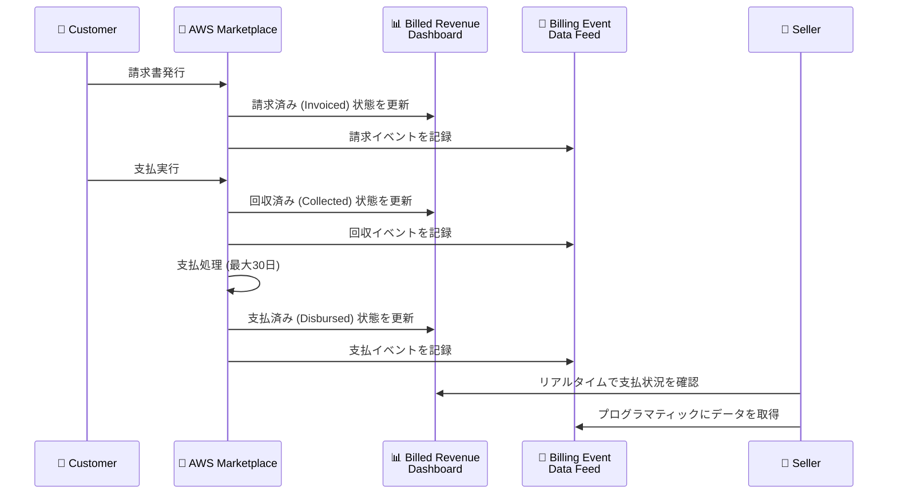

# AWS Marketplace - Seller Reporting に支払回収状況の可視化機能を追加

**リリース日**: 2026年1月6日
**サービス**: AWS Marketplace Seller Reporting
**機能**: 支払回収状況 (Collection Visibility) の可視化

## 概要

AWS Marketplace Seller Reporting に、支払回収状況を可視化する新機能が追加されました。この機能により、Billed Revenue Dashboard および Billing Event Data Feed に最新の支払回収ステータスが追加されます。販売者は、請求済み (invoiced)、回収済み (collected)、支払済み (disbursed) の金額を明確に区別できるようになり、請求書作成から支払いまでの可視性のギャップが解消されます。

この機能により、販売者は支払状況に基づいた適切なビジネス判断を行い、顧客への不要な支払確認フォローアップを削減できます。特に、月次支払を利用している販売者にとって大きなメリットがあります。これまでは支払回収状況を把握するまでに最大30日間待つ必要がありましたが、今後はリアルタイムで状況を確認できます。

**アップデート前の課題**

- 請求書作成から支払いまでの間、支払回収状況を把握できず、可視性のギャップが存在していた
- 月次支払を利用している販売者は、支払回収状況を把握するまでに最大30日間待つ必要があった
- 顧客への支払確認フォローアップが必要かどうかの判断が難しかった

**アップデート後の改善**

- 請求済み、回収済み、支払済みの金額をリアルタイムで区別できるようになった
- 支払予測の精度が向上し、回収問題を早期に検出できるようになった
- 不要な顧客フォローアップを削減し、販売者の運用効率が向上した

## サービスアップデートの詳細

### 主要機能

1. **リアルタイム支払回収状況の可視化**
   - Billed Revenue Dashboard に最新の支払回収ステータスを表示
   - 請求済み (invoiced)、回収済み (collected)、支払済み (disbursed) の金額を明確に区別
   - 請求書作成から支払いまでの可視性のギャップを解消

2. **Billing Event Data Feed への統合**
   - Billing Event Data Feed に支払回収状況のデータを追加
   - プログラマティックなアクセスにより、自動化されたレポーティングが可能
   - データ分析ツールとの統合が容易

3. **支払予測の精度向上**
   - リアルタイムの支払回収データにより、キャッシュフロー予測の精度が向上
   - 回収問題を早期に検出し、迅速な対応が可能
   - 月次支払利用者にとって、最大30日間の待機時間を解消

## アーキテクチャ図



支払回収状況が請求書作成から支払いまで、各段階でリアルタイムに可視化されます。

## 技術仕様

### 支払ステータスの種類

| ステータス | 説明 |
|-----------|------|
| Invoiced (請求済み) | 請求書が発行され、顧客に送付された状態 |
| Collected (回収済み) | AWS が顧客から支払を受領した状態 |
| Disbursed (支払済み) | 販売者の銀行口座に支払が完了した状態 |

### Billed Revenue Dashboard でのアクセス

AWS Marketplace Management Portal にログインし、以下の手順でアクセス:

1. [AWS Marketplace Management Portal](https://aws.amazon.com/marketplace/management/homepage/) にログイン
2. **Insights** → **Finance Operations** に移動
3. Billed Revenue Dashboard で支払回収状況を確認

### Billing Event Data Feed でのアクセス

プログラマティックにデータを取得する場合:

```bash
# AWS Data Exchange または S3 から Billing Event Data Feed を取得
aws s3 cp s3://your-billing-event-bucket/billing-events.csv ./
```

データフィード内の新しいフィールド:
- `collection_status`: 支払回収ステータス (invoiced, collected, disbursed)
- `collection_date`: 回収日時
- `disbursement_date`: 支払日時

## 設定方法

### 前提条件

1. AWS Marketplace の販売者アカウントを保有していること
2. AWS Marketplace Management Portal へのアクセス権限
3. Finance Operations へのアクセス権限

### 手順

#### ステップ1: AWS Marketplace Management Portal にアクセス

```
https://aws.amazon.com/marketplace/management/homepage/
```

AWS Marketplace Management Portal にログインします。

#### ステップ2: Finance Operations に移動

Management Portal のナビゲーションメニューから:
1. **Insights** をクリック
2. **Finance Operations** を選択

#### ステップ3: Billed Revenue Dashboard で支払回収状況を確認

Billed Revenue Dashboard に以下の情報が表示されます:
- **Invoiced Amount**: 請求済み金額
- **Collected Amount**: 回収済み金額
- **Disbursed Amount**: 支払済み金額
- **Uncollected Amount**: 未回収金額

各取引の詳細な支払回収ステータスを確認できます。

#### ステップ4: Billing Event Data Feed を設定 (オプション)

プログラマティックにデータを取得する場合:
1. Management Portal で **Data Feed Settings** に移動
2. Billing Event Data Feed を有効化
3. S3 バケットまたは AWS Data Exchange を設定
4. データフィードを定期的に取得

## メリット

### ビジネス面

- **キャッシュフロー管理の改善**: リアルタイムの支払回収データにより、正確なキャッシュフロー予測が可能
- **運用効率の向上**: 不要な顧客フォローアップを削減し、販売者の運用負担を軽減
- **ビジネス判断の迅速化**: 支払状況を即座に把握し、適切なビジネス判断を迅速に実行

### 技術面

- **可視性の向上**: 請求から支払いまでの全プロセスをリアルタイムで追跡
- **データ統合の容易化**: Billing Event Data Feed を通じて、既存のデータ分析ツールと統合可能
- **自動化の促進**: プログラマティックなアクセスにより、レポーティングの自動化が可能

## デメリット・制約事項

### 制限事項

- AWS Seller Reporting が利用可能なすべての AWS リージョンで提供
- 2026年1月6日以降の取引に対して、支払回収状況が記録される
- 過去の取引データについては、支払回収状況が遡及的に適用されない場合がある

### 考慮すべき点

- 支払回収ステータスは、顧客の支払タイミングに依存するため、リアルタイム性は顧客の支払行動に左右される
- 月次支払を利用している場合、支払済みステータスは月次スケジュールに従って更新される
- データフィードの取得には、適切な IAM 権限と S3 バケットの設定が必要

## ユースケース

### ユースケース1: キャッシュフロー予測の改善

**シナリオ**: SaaS 製品を提供する販売者が、月次のキャッシュフロー予測を改善したい。

**実装例**:
1. Billed Revenue Dashboard で請求済み金額と回収済み金額を確認
2. 回収率を算出し、過去のトレンドと比較
3. 未回収金額を特定し、フォローアップが必要な顧客を識別

**効果**: リアルタイムの支払回収データにより、キャッシュフロー予測の精度が向上し、財務計画が改善されます。

### ユースケース2: 回収問題の早期検出

**シナリオ**: 複数の顧客に対して製品を提供する販売者が、支払遅延を早期に検出したい。

**実装例**:
1. Billing Event Data Feed を定期的に取得
2. `collection_status` が `invoiced` のまま一定期間経過した取引を抽出
3. 自動アラートを設定し、未回収取引を通知

**効果**: 支払遅延を早期に検出し、顧客への迅速なフォローアップにより、回収率が向上します。

### ユースケース3: 顧客関係の改善

**シナリオ**: 顧客への不要な支払確認フォローアップを削減し、顧客関係を改善したい。

**実装例**:
1. Billed Revenue Dashboard で顧客ごとの支払回収ステータスを確認
2. 既に回収済みの取引については、フォローアップを実施しない
3. 未回収取引のみに焦点を当てたフォローアップを実施

**効果**: 不要なフォローアップを削減することで、顧客満足度が向上し、販売者の運用効率が改善されます。

## 料金

AWS Marketplace Seller Reporting の支払回収状況可視化機能は、追加料金なしで利用可能です。AWS Marketplace の販売者は、標準の Seller Reporting 機能の一部として、この機能を利用できます。

## 利用可能リージョン

AWS Seller Reporting が利用可能なすべての AWS リージョンで提供されます。2026年1月6日より、すべての AWS Marketplace 販売者が利用可能です。

## 関連サービス・機能

- **AWS Data Exchange**: Billing Event Data Feed を AWS Data Exchange 経由で取得可能
- **Amazon S3**: Billing Event Data Feed を S3 バケットに保存し、分析ツールと統合
- **Amazon QuickSight**: 支払回収データを可視化し、ダッシュボードを作成

## 参考リンク

- [公式発表 (What's New)](https://aws.amazon.com/about-aws/whats-new/2026/01/aws-marketplace-seller-reporting-collections/)
- [AWS Marketplace Management Portal](https://aws.amazon.com/marketplace/management/homepage/)
- [Finance Operations Dashboard](https://aws.amazon.com/marketplace/management/insights/finance)
- [Seller Reports ドキュメント](https://docs.aws.amazon.com/marketplace/latest/userguide/Reporting.html)
- [Collections and Disbursement Dashboard](https://docs.aws.amazon.com/marketplace/latest/userguide/collections-disbursement-dashboard.html)

## まとめ

AWS Marketplace Seller Reporting に支払回収状況の可視化機能が追加されたことで、販売者はリアルタイムで支払状況を把握し、適切なビジネス判断を行えるようになりました。特に月次支払を利用している販売者にとって、最大30日間の待機時間が解消され、キャッシュフロー管理が大幅に改善されます。AWS Marketplace で製品を販売している場合は、この新機能を活用して支払管理プロセスを最適化することをお勧めします。
