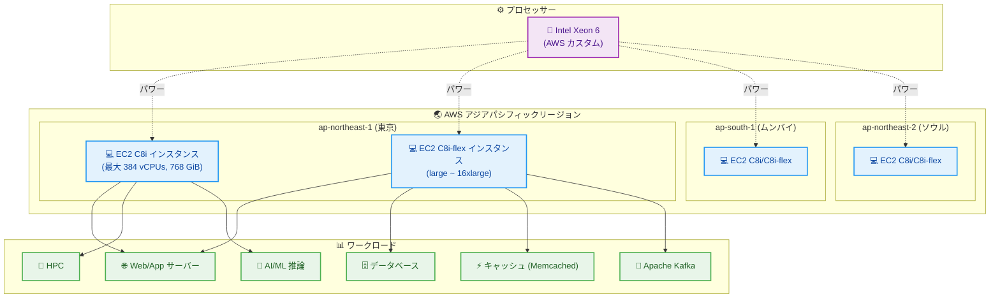

# Amazon EC2 - C8i および C8i-flex インスタンスが東京リージョンを含む追加リージョンで利用可能に

**リリース日**: 2026年01月07日
**サービス**: Amazon EC2
**機能**: C8i および C8i-flex コンピューティング最適化インスタンス

## 概要

AWS は 2026 年 1 月 7 日、Amazon EC2 C8i および C8i-flex インスタンスが、アジアパシフィック (ムンバイ)、アジアパシフィック (ソウル)、アジアパシフィック (東京) リージョンで利用可能になったことを発表しました。これらのインスタンスは、AWS 専用のカスタム Intel Xeon 6 プロセッサーを搭載しており、クラウドで利用可能な同等の Intel プロセッサーの中で最高のパフォーマンスと最速のメモリ帯域幅を提供します。

C8i および C8i-flex インスタンスは、前世代の Intel ベースのインスタンスと比較して、最大 15% 優れた価格パフォーマンスと 2.5 倍のメモリ帯域幅を提供します。C7i および C7i-flex インスタンスと比較して最大 20% 高いパフォーマンスを実現し、特定のワークロードではさらに高いパフォーマンス向上を実現します。NGINX ウェブアプリケーションでは最大 60% 高速化、AI ディープラーニング推奨モデルでは最大 40% 高速化、Memcached ストアでは 35% 高速化を実現しています。

**アップデート前の課題**

- 東京リージョンでは、C8i および C8i-flex インスタンスが利用できず、最新の Intel Xeon 6 プロセッサーの性能を活用できなかった
- 前世代の C7i インスタンスと比較して、メモリ帯域幅とコンピューティング性能に制限があった
- コンピューティング集約的なワークロードで、より高いパフォーマンスとコスト効率を実現するための選択肢が限られていた

**アップデート後の改善**

- 東京リージョンで C8i および C8i-flex インスタンスを利用でき、最新の Intel Xeon 6 プロセッサーの性能を活用できるようになった
- C7i インスタンスと比較して最大 20% 高いパフォーマンスと 2.5 倍のメモリ帯域幅を利用できるようになった
- C8i-flex は最も一般的なサイズ (large から 16xlarge) を提供し、すべてのコンピューティングリソースを完全に活用しないアプリケーションに最適な選択肢となった
- C8i は 13 サイズ (2 つのベアメタルサイズと新しい 96xlarge サイズを含む) を提供し、最大規模のアプリケーションに対応できるようになった

## アーキテクチャ図



このアーキテクチャ図は、C8i および C8i-flex インスタンスが新たに利用可能になった 3 つのアジアパシフィックリージョン (東京、ムンバイ、ソウル) と、カスタム Intel Xeon 6 プロセッサーによって駆動され、さまざまなコンピューティング集約的ワークロードに最適化されていることを示しています。

## サービスアップデートの詳細

### 主要機能

1. **C8i-flex インスタンス**
   - コンピューティングリソースを完全に活用しないワークロードに最適
   - Web およびアプリケーションサーバー、データベース、キャッシュ、Apache Kafka、Elasticsearch、エンタープライズアプリケーションに最適
   - large から 16xlarge までの最も一般的なサイズを提供
   - すべてのコンピューティングリソースを完全に活用しないアプリケーションに最適な最初の選択肢

2. **C8i インスタンス**
   - すべてのメモリ集約的ワークロードに最適
   - 最大のインスタンスサイズまたは継続的な高 CPU 使用率が必要なワークロードに特に適している
   - 2 つのベアメタルサイズを含む 13 サイズを提供
   - 最大規模のアプリケーション向けに新しい 96xlarge サイズを提供
   - バッチ処理、分散分析、ハイパフォーマンスコンピューティング (HPC)、広告配信、高度にスケーラブルなマルチプレイヤーゲーム、動画エンコーディングに最適

3. **パフォーマンス向上**
   - 前世代の Intel ベースのインスタンスと比較して最大 15% 優れた価格パフォーマンス
   - 前世代の Intel ベースのインスタンスと比較して 2.5 倍のメモリ帯域幅
   - C7i および C7i-flex インスタンスと比較して最大 20% 高いパフォーマンス
   - NGINX ウェブアプリケーションで最大 60% 高速化
   - AI ディープラーニング推奨モデルで最大 40% 高速化
   - Memcached ストアで 35% 高速化

## 技術仕様

### C8i および C8i-flex インスタンスの主要仕様

| 項目 | C8i-flex | C8i |
|------|----------|-----|
| プロセッサー | カスタム Intel Xeon 6 (AWS 専用) | カスタム Intel Xeon 6 (AWS 専用) |
| サイズ | large ~ 16xlarge (15 サイズ) | 13 サイズ (2 ベアメタル + 96xlarge を含む) |
| 最大 vCPU | 64 (16xlarge) | 384 (96xlarge) |
| 最大メモリ | 128 GiB (16xlarge) | 768 GiB (96xlarge) |
| ネットワーク帯域幅 | 最大 100 Gbps | 最大 100 Gbps |
| EBS 帯域幅 | 最大 60 Gbps | 最大 60 Gbps |
| 最適なワークロード | すべてのリソースを活用しないアプリ | 大規模または継続的な高 CPU 使用率アプリ |

### パフォーマンス比較

| 指標 | C8i/C8i-flex vs C7i/C7i-flex | C8i/C8i-flex vs 前世代 Intel |
|------|------------------------------|------------------------------|
| 全体パフォーマンス | 最大 20% 向上 | 最大 15% 優れた価格パフォーマンス |
| メモリ帯域幅 | - | 2.5 倍 |
| NGINX | 最大 60% 高速化 | - |
| AI/ML 推奨モデル | 最大 40% 高速化 | - |
| Memcached | 35% 高速化 | - |

## 設定方法

### 前提条件

1. AWS アカウントと適切な IAM 権限
2. 対象リージョン (東京、ムンバイ、ソウル) へのアクセス
3. 必要な VPC およびサブネット設定

### 手順

#### ステップ1: AWS マネジメントコンソールでインスタンスを起動

```bash
# AWS CLI を使用して C8i-flex インスタンスを起動
aws ec2 run-instances \
  --image-id ami-xxxxxxxxxxxxxxxxx \
  --instance-type c8i-flex.large \
  --region ap-northeast-1 \
  --subnet-id subnet-xxxxxxxxxxxxxxxxx \
  --security-group-ids sg-xxxxxxxxxxxxxxxxx \
  --key-name my-key-pair
```

このコマンドは、東京リージョン (ap-northeast-1) で C8i-flex.large インスタンスを起動します。

#### ステップ2: インスタンスタイプを選択

```bash
# 利用可能な C8i インスタンスタイプを確認
aws ec2 describe-instance-types \
  --filters "Name=instance-type,Values=c8i*" \
  --region ap-northeast-1 \
  --query "InstanceTypes[].{Type:InstanceType,vCPU:VCpuInfo.DefaultVCpus,Memory:MemoryInfo.SizeInMiB}" \
  --output table
```

このコマンドは、東京リージョンで利用可能な C8i インスタンスタイプとそのスペックを表示します。

#### ステップ3: 購入オプションを選択

C8i および C8i-flex インスタンスは、以下の購入オプションで利用できます。

- **オンデマンドインスタンス**: 使用した分だけ支払い
- **Savings Plans**: 1 年または 3 年のコミットメントで割引
- **スポットインスタンス**: 未使用の EC2 容量を大幅な割引で利用

## メリット

### ビジネス面

- **コスト効率の向上**: 前世代と比較して最大 15% 優れた価格パフォーマンスにより、コンピューティングコストを削減
- **柔軟なサイジング**: C8i-flex は large から 16xlarge、C8i は最大 96xlarge まで提供し、ワークロードに最適なサイズを選択可能
- **リージョン展開の拡大**: 東京リージョンでの提供により、アジアパシフィック地域でのレイテンシー最適化とコンプライアンス要件に対応

### 技術面

- **高性能プロセッサー**: AWS 専用のカスタム Intel Xeon 6 プロセッサーによる最高のパフォーマンス
- **大幅なメモリ帯域幅向上**: 前世代と比較して 2.5 倍のメモリ帯域幅により、メモリ集約的ワークロードのパフォーマンスが向上
- **ワークロード最適化**: 特定のワークロード (NGINX で最大 60%、AI/ML で最大 40%、Memcached で 35%) で大幅なパフォーマンス向上
- **高ネットワーク帯域幅**: 最大 100 Gbps のネットワーク帯域幅と 60 Gbps の EBS 帯域幅
- **AWS Nitro System**: 最新の AWS Nitro System により、セキュリティとパフォーマンスを最適化

## デメリット・制約事項

### 制限事項

- 新しいインスタンスタイプのため、一部の AWS サービスやツールで完全にサポートされるまでに時間がかかる場合がある
- すべてのリージョンで利用可能ではない (今回のアップデートでムンバイ、ソウル、東京に拡大)
- 既存のワークロードを移行する場合、アプリケーションの互換性テストが必要

### 考慮すべき点

- C8i-flex はリソースを完全に活用しないワークロードに最適だが、継続的な高 CPU 使用率が必要な場合は C8i を選択すべき
- 価格パフォーマンスを最大化するには、Savings Plans やスポットインスタンスの利用を検討
- 既存のインスタンスからの移行時には、パフォーマンステストを実施して期待される改善を確認することを推奨

## ユースケース

### ユースケース1: 高トラフィック Web アプリケーション

**シナリオ**: E コマースサイトが、ピーク時のトラフィックに対応しながらコストを最適化したい

**実装例**:
```bash
# C8i-flex インスタンスで Web サーバーを起動
aws ec2 run-instances \
  --image-id ami-xxxxxxxxxxxxxxxxx \
  --instance-type c8i-flex.8xlarge \
  --region ap-northeast-1 \
  --user-data file://webserver-setup.sh
```

**効果**: NGINX ワークロードで最大 60% のパフォーマンス向上により、より多くのリクエストを処理でき、インスタンス数を削減してコストを削減

### ユースケース2: AI/ML 推奨エンジン

**シナリオ**: ストリーミングサービスが、リアルタイムでユーザーにコンテンツを推奨する機械学習モデルを実行したい

**実装例**:
```bash
# C8i インスタンスで ML 推論サーバーを起動
aws ec2 run-instances \
  --image-id ami-xxxxxxxxxxxxxxxxx \
  --instance-type c8i.24xlarge \
  --region ap-northeast-1 \
  --iam-instance-profile Name=ML-Inference-Role
```

**効果**: AI ディープラーニング推奨モデルで最大 40% 高速化により、推論レイテンシーが大幅に改善され、ユーザー体験が向上

### ユースケース3: 大規模データ処理とバッチ分析

**シナリオ**: 金融機関が、大量のトランザクションデータを処理してリスク分析を実施したい

**実装例**:
```bash
# C8i 96xlarge インスタンスでバッチ処理を実行
aws ec2 run-instances \
  --image-id ami-xxxxxxxxxxxxxxxxx \
  --instance-type c8i.96xlarge \
  --region ap-northeast-1 \
  --block-device-mappings file://storage-config.json
```

**効果**: 最大 384 vCPU と 768 GiB メモリにより、大規模なバッチ処理を高速化し、分析結果を迅速に取得

## 料金

C8i および C8i-flex インスタンスの料金は、選択したインスタンスタイプ、リージョン、購入オプションによって異なります。詳細な料金については、[Amazon EC2 料金ページ](https://aws.amazon.com/ec2/pricing/) をご確認ください。

### 料金例

東京リージョン (ap-northeast-1) でのオンデマンド料金の例 (参考値):

| インスタンスタイプ | vCPU | メモリ (GiB) | 時間あたり料金（概算） |
|-------------------|------|-------------|---------------------|
| c8i-flex.large | 2 | 4 | $0.10 |
| c8i-flex.8xlarge | 32 | 64 | $1.60 |
| c8i.24xlarge | 96 | 192 | $5.00 |
| c8i.96xlarge | 384 | 768 | $20.00 |

**注**: 料金は変更される可能性があります。最新の料金については、公式料金ページをご確認ください。

## 利用可能リージョン

今回のアップデートにより、C8i および C8i-flex インスタンスは以下のリージョンで利用可能になりました。

**新規対応リージョン (2026年1月7日)**:
- アジアパシフィック (ムンバイ) - ap-south-1
- アジアパシフィック (ソウル) - ap-northeast-2
- アジアパシフィック (東京) - ap-northeast-1

**既存対応リージョン**:
- 米国東部 (バージニア北部) - us-east-1
- 米国東部 (オハイオ) - us-east-2
- 米国西部 (オレゴン) - us-west-2
- 欧州 (スペイン) - eu-south-2

## 関連サービス・機能

- **Amazon EC2 Auto Scaling**: C8i インスタンスを使用してワークロードに応じて自動的にスケーリング
- **AWS Savings Plans**: 1 年または 3 年のコミットメントで C8i インスタンスのコストを削減
- **Amazon CloudWatch**: C8i インスタンスのパフォーマンスメトリクスを監視
- **AWS Systems Manager**: C8i インスタンスの設定と管理を自動化
- **Elastic Load Balancing**: C8i インスタンス間でトラフィックを分散

## 参考リンク

- [公式発表 (What's New)](https://aws.amazon.com/about-aws/whats-new/2026/01/amazon-ec2-c8i-c8i-flex-instances-additional-aws-regions)
- [AWS Blog - C8i および C8i-flex インスタンスの紹介](https://aws.amazon.com/blogs/aws/introducing-new-compute-optimized-amazon-ec2-c8i-and-c8i-flex-instances/)
- [C8i インスタンス製品ページ](https://aws.amazon.com/ec2/instance-types/c8i/)
- [Amazon EC2 料金ページ](https://aws.amazon.com/ec2/pricing/)
- [Amazon EC2 ドキュメント](https://docs.aws.amazon.com/ec2/)

## まとめ

Amazon EC2 C8i および C8i-flex インスタンスが東京リージョンを含む 3 つのアジアパシフィックリージョンで利用可能になったことにより、AWS 専用のカスタム Intel Xeon 6 プロセッサーによる最高のパフォーマンスとコスト効率を日本国内のお客様も活用できるようになりました。C7i インスタンスと比較して最大 20% のパフォーマンス向上と 2.5 倍のメモリ帯域幅により、コンピューティング集約的ワークロードを大幅に高速化できます。Web アプリケーション、AI/ML 推論、バッチ処理などのワークロードで C8i または C8i-flex インスタンスの利用を検討し、パフォーマンスとコスト効率の向上を実現してください。
