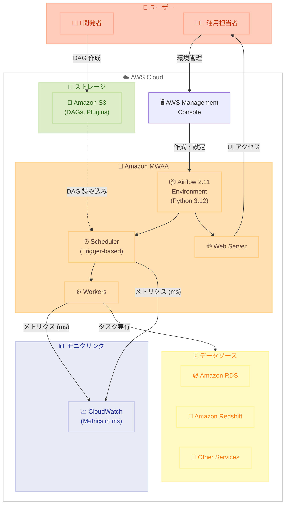

# Amazon MWAA - Apache Airflow 2.11 サポート

**リリース日**: 2026年1月7日
**サービス**: Amazon Managed Workflows for Apache Airflow (MWAA)
**機能**: Apache Airflow 2.11 サポート

## 概要

Amazon Managed Workflows for Apache Airflow (MWAA) で Apache Airflow バージョン 2.11 環境の作成がサポートされました。Apache Airflow 2.11 は、Apache Airflow 3 へのアップグレード準備を支援するいくつかの変更を導入しています。

Amazon MWAA は、クラウドでエンドツーエンドのデータパイプラインをセットアップおよび運用しやすくする、Apache Airflow のマネージド型オーケストレーションサービスです。Apache Airflow 2.11 は、デルタ間隔に対する新しいトリガーベースのスケジューリング、ミリ秒単位での一貫したメトリクスレポート、その他 Apache Airflow 3 への移行を容易にする変更など、いくつかの注目すべき機能強化を導入しています。

さらに、MWAA は Python 3.12 のサポートを提供し、ワークフローで活用できるようになりました。これにより、最新の Python 機能とパフォーマンス改善を利用できます。

**アップデート前の課題**

- Apache Airflow 2.10 以前のバージョンでは、Apache Airflow 3 への移行準備機能が不足していた
- メトリクスのレポート単位が統一されておらず、モニタリングが複雑だった
- Python 3.11 までのサポートで、最新の Python 機能を活用できなかった

**アップデート後の改善**

- Apache Airflow 3 への移行を容易にする機能強化が導入された
- トリガーベースのスケジューリングにより、デルタ間隔の処理が改善された
- メトリクスがミリ秒単位で一貫してレポートされるようになり、モニタリングが簡素化された
- Python 3.12 のサポートにより、最新の Python 機能とパフォーマンス改善を活用できる

## アーキテクチャ図



Amazon MWAA で Apache Airflow 2.11 環境を使用し、Python 3.12 のサポートとトリガーベースのスケジューリング、ミリ秒単位のメトリクスレポートが利用できる構成を示しています。

## サービスアップデートの詳細

### 主要機能

1. **Apache Airflow 2.11 サポート**
   - Amazon MWAA で Apache Airflow 2.11 環境の作成が可能
   - Apache Airflow 3 への移行を準備するための機能強化が含まれる
   - AWS マネジメントコンソール、AWS CLI、AWS SDK で簡単に作成可能

2. **トリガーベースのスケジューリング**
   - デルタ間隔に対する新しいトリガーベースのスケジューリング
   - より柔軟なワークフロースケジューリングが可能
   - 複雑なスケジューリング要件に対応

3. **一貫したメトリクスレポート**
   - メトリクスがミリ秒単位で一貫してレポートされる
   - モニタリングとトラブルシューティングが簡素化される
   - CloudWatch での分析が容易になる

4. **Python 3.12 サポート**
   - Apache Airflow 2.11 環境で Python 3.12 が利用可能
   - 最新の Python 機能とパフォーマンス改善を活用できる
   - ワークフローで新しい Python ライブラリを使用可能

5. **Apache Airflow 3 への移行準備**
   - Apache Airflow 3 への移行を容易にする変更が含まれる
   - 将来のアップグレードパスがスムーズになる
   - 段階的な移行戦略が可能

## 技術仕様

### サポートされる Apache Airflow バージョン

| バージョン | Python バージョン | OS | リリース日 |
|-----------|------------------|-----|-----------|
| 2.11.0 | 3.12 | Amazon Linux 2023 | 2026年1月7日 |
| 2.10.3 | 3.11 | Amazon Linux 2023 | 既存 |
| 2.9.2 | 3.11 | Amazon Linux 2023 | 既存 |

### Apache Airflow 2.11 の主要な変更点

| 機能 | 詳細 |
|------|------|
| トリガーベースのスケジューリング | デルタ間隔のスケジューリングが改善 |
| メトリクス単位 | すべてのメトリクスがミリ秒単位で統一 |
| Python サポート | Python 3.12 に対応 |
| Apache Airflow 3 準備 | 移行を容易にする変更が含まれる |

## 設定方法

### 前提条件

1. AWS アカウントと必要な IAM 権限
2. Amazon S3 バケット（バージョニング有効、パブリックアクセスブロック設定済み）
3. Amazon VPC ネットワーク（作成後は変更不可）

### 手順

#### ステップ1: AWS マネジメントコンソールで MWAA にアクセス

```bash
# AWS CLI で利用可能なリージョンを確認
aws mwaa list-environments --region ap-northeast-1
```

AWS マネジメントコンソールにサインインし、Amazon MWAA コンソールに移動します。

#### ステップ2: 新しい環境を作成

「Create environment」をクリックし、環境の詳細を指定します。

```yaml
# 環境設定例
Environment name: my-airflow-211-env
Apache Airflow version: 2.11.0
S3 Bucket: s3://my-mwaa-bucket
DAGs folder: dags/
```

#### ステップ3: Apache Airflow 2.11 を選択

「Apache Airflow version」ドロップダウンから「2.11」を選択します。これにより、Python 3.12 が自動的に使用されます。

#### ステップ4: ネットワークと詳細設定を構成

VPC、サブネット、セキュリティグループなどのネットワーク設定を構成します。

```bash
# AWS CLI での環境作成例
aws mwaa create-environment \
  --name my-airflow-211-env \
  --airflow-version 2.11.0 \
  --source-bucket-arn arn:aws:s3:::my-mwaa-bucket \
  --dag-s3-path dags/ \
  --execution-role-arn arn:aws:iam::123456789012:role/MWAAExecutionRole \
  --network-configuration "SubnetIds=subnet-xxxxx,subnet-yyyyy,SecurityGroupIds=sg-xxxxx" \
  --region ap-northeast-1
```

このコマンドは、Apache Airflow 2.11 環境を作成し、Python 3.12 を使用します。

#### ステップ5: 環境の作成を確認

環境の作成には約 20〜30 分かかります。作成が完了すると、環境のステータスが「Available」になります。

```bash
# 環境のステータスを確認
aws mwaa get-environment --name my-airflow-211-env --region ap-northeast-1
```

#### ステップ6: DAG を作成してアップロード

Python 3.12 の機能を活用した DAG を作成し、S3 バケットの DAG フォルダにアップロードします。

```python
# Python 3.12 の機能を使用した DAG 例
from airflow import DAG
from airflow.operators.python import PythonOperator
from datetime import datetime, timedelta

def my_task():
    # Python 3.12 の新機能を使用
    print("Running with Python 3.12!")

with DAG(
    'my_dag_211',
    default_args={
        'owner': 'airflow',
        'depends_on_past': False,
        'start_date': datetime(2026, 1, 7),
        'retries': 1,
        'retry_delay': timedelta(minutes=5),
    },
    description='A DAG using Airflow 2.11',
    schedule_interval=timedelta(days=1),
    catchup=False,
) as dag:

    task = PythonOperator(
        task_id='my_task',
        python_callable=my_task,
    )
```

## メリット

### ビジネス面

- **将来への準備**: Apache Airflow 3 への移行準備が整い、将来のアップグレードがスムーズになる
- **運用効率の向上**: 一貫したメトリクスレポートにより、モニタリングとトラブルシューティングが簡素化される
- **開発速度の向上**: Python 3.12 の最新機能により、開発生産性が向上する

### 技術面

- **最新の Python 機能**: Python 3.12 のサポートにより、最新のライブラリと機能を活用できる
- **パフォーマンス改善**: Python 3.12 のパフォーマンス改善により、ワークフローの実行速度が向上
- **柔軟なスケジューリング**: トリガーベースのスケジューリングにより、複雑なスケジューリング要件に対応できる
- **一貫したモニタリング**: ミリ秒単位での一貫したメトリクスレポートにより、分析が容易になる

## デメリット・制約事項

### 制限事項

- Amazon MWAA 環境の作成には約 20〜30 分かかる
- VPC ネットワーク設定は作成後に変更できない
- カスタムイメージはサポートされていない

### 考慮すべき点

- Apache Airflow 2.11 へのアップグレード前に、既存の DAG の互換性をテスト環境で確認することを推奨
- Python 3.12 への移行により、一部の古いライブラリに互換性の問題が発生する可能性がある
- Apache Airflow 3 へのアップグレードを計画している場合は、Airflow 2.11 のリリースノートを確認し、変更点を理解することが重要

## ユースケース

### ユースケース1: データパイプラインの最新化

**シナリオ**: 既存のデータパイプラインを Apache Airflow 2.11 にアップグレードし、Python 3.12 の機能を活用したい場合

**実装例**:
```python
# Python 3.12 の型ヒントを活用した DAG
from airflow import DAG
from airflow.operators.python import PythonOperator
from datetime import datetime
from typing import TypedDict

class DataConfig(TypedDict):
    source: str
    destination: str

def process_data(config: DataConfig) -> None:
    # データ処理ロジック
    print(f"Processing data from {config['source']} to {config['destination']}")

with DAG(
    'data_pipeline_211',
    start_date=datetime(2026, 1, 7),
    schedule_interval='@daily',
) as dag:

    task = PythonOperator(
        task_id='process_data',
        python_callable=process_data,
        op_kwargs={'config': {'source': 's3://source', 'destination': 's3://dest'}},
    )
```

**効果**: Python 3.12 の最新機能により、コードの可読性と保守性が向上し、開発生産性が向上する

### ユースケース2: Apache Airflow 3 への移行準備

**シナリオ**: 将来的に Apache Airflow 3 へのアップグレードを計画しており、Airflow 2.11 で移行準備を行いたい場合

**実装例**:
新しい MWAA 環境を Airflow 2.11 で作成し、変更点を確認しながら段階的に DAG を移行。

```bash
# 新しい環境を作成
aws mwaa create-environment \
  --name airflow-211-migration-test \
  --airflow-version 2.11.0 \
  --source-bucket-arn arn:aws:s3:::my-migration-bucket \
  --dag-s3-path dags/ \
  --execution-role-arn arn:aws:iam::123456789012:role/MWAAExecutionRole \
  --network-configuration "SubnetIds=subnet-xxxxx,subnet-yyyyy,SecurityGroupIds=sg-xxxxx" \
  --region ap-northeast-1
```

**効果**: Airflow 3 への移行がスムーズになり、ダウンタイムを最小限に抑えられる

### ユースケース3: トリガーベーススケジューリングの活用

**シナリオ**: デルタ間隔でのスケジューリングが必要な複雑なデータパイプラインを構築したい場合

**実装例**:
```python
from airflow import DAG
from airflow.operators.python import PythonOperator
from datetime import datetime, timedelta

# トリガーベースのスケジューリングを活用した DAG
with DAG(
    'trigger_based_pipeline',
    start_date=datetime(2026, 1, 7),
    schedule_interval=None,  # トリガーベース
    catchup=False,
) as dag:

    def check_and_trigger():
        # カスタムロジックでトリガー条件を判定
        pass

    trigger_task = PythonOperator(
        task_id='check_trigger',
        python_callable=check_and_trigger,
    )
```

**効果**: 複雑なスケジューリング要件に柔軟に対応でき、データパイプラインの効率が向上する

## 料金

Amazon MWAA の料金は、環境のサイズ（Small、Medium、Large）と実行時間に基づいて計算されます。Apache Airflow 2.11 の使用による追加料金はありません。

### 料金例（東京リージョン）

| 環境サイズ | 時間単位料金 | 月額料金（概算、730時間） |
|-----------|-------------|-------------------------|
| Small | 約 0.49 USD/時間 | 約 358 USD |
| Medium | 約 0.98 USD/時間 | 約 715 USD |
| Large | 約 1.96 USD/時間 | 約 1,431 USD |

詳細な料金については、[Amazon MWAA 料金ページ](https://aws.amazon.com/managed-workflows-for-apache-airflow/pricing/)を参照してください。

## 利用可能リージョン

Apache Airflow 2.11 は、Amazon MWAA が現在サポートされているすべてのリージョンで利用できます。利用可能なリージョンの最新情報については、[AWS リージョナルサービスページ](https://aws.amazon.com/about-aws/global-infrastructure/regional-product-services/)を参照してください。

## 関連サービス・機能

- **Amazon S3**: DAG、プラグイン、requirements ファイルの保存
- **Amazon CloudWatch**: メトリクスとログの監視
- **AWS IAM**: 実行ロールと権限の管理
- **Amazon VPC**: ネットワーク環境の構成

## 参考リンク

- [公式発表 (What's New)](https://aws.amazon.com/about-aws/whats-new/2026/01/apache-airflow-2-11-support-amazon-managed-workflows/)
- [Amazon MWAA ドキュメント](https://docs.aws.amazon.com/mwaa/latest/userguide/what-is-mwaa.html)
- [Apache Airflow 2.11 変更ログ](https://airflow.apache.org/docs/apache-airflow/2.11.0/release_notes.html#airflow-2-11-0-2025-05-20)
- [料金ページ](https://aws.amazon.com/managed-workflows-for-apache-airflow/pricing/)

## まとめ

Amazon MWAA での Apache Airflow 2.11 サポートにより、Python 3.12 の最新機能、トリガーベースのスケジューリング、一貫したメトリクスレポートが利用できるようになりました。Apache Airflow 3 への移行準備が整い、将来のアップグレードがスムーズになります。データパイプラインの最新化や複雑なスケジューリング要件に対応したい場合は、ぜひ Apache Airflow 2.11 環境を試してみることをお勧めします。
