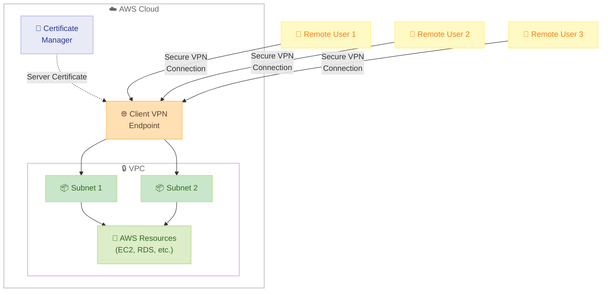

# AWS Client VPN - Quickstart セットアップによる簡略化されたオンボーディング

**リリース日**: 2026年1月7日
**サービス**: AWS Client VPN
**機能**: Quickstart セットアップ

## 概要

AWS は、AWS Client VPN の新しい Quickstart セットアップ方式を導入し、Client VPN エンドポイントの作成と設定プロセスを簡略化しました。この新しいセットアップにより、Client VPN エンドポイントの作成に必要な手順が削減され、わずか 3 つの主要な入力（IPv4 CIDR、サーバー証明書 ARN、サブネット選択）のみで設定が完了します。

AWS Client VPN は、リモートユーザーが AWS リソースやオンプレミスネットワークに安全に接続できるサービスです。開発チームが VPC リソースへのリモートアクセスを必要とする場合や、迅速なテストを実施する場合に、Quickstart セットアップにより簡素化されたプロセスでエンドポイントを作成できます。

Quickstart 方式は既存の Standard Setup オプションと並行して利用でき、デプロイメントのニーズに最適なアプローチを柔軟に選択できます。VPC を作成すると、Client VPN Quickstart ワークフローが自動的にフォローアップステップとして提案されます。エンドポイント作成が完了すると、クライアント設定ファイルをすぐにダウンロードして VPN クライアントで接続できます。後から、使用パターンの変化に応じて、Client VPN の標準コンソールまたは API を使用してエンドポイント設定を変更・拡張できます。

**アップデート前の課題**

- Client VPN エンドポイントの作成に多くの設定ステップが必要で、初期セットアップが複雑だった
- デフォルト設定を手動で構成する必要があり、時間がかかった
- 開発チームが迅速にテスト環境を構築する際に、設定の複雑さがボトルネックとなっていた

**アップデート後の改善**

- わずか 3 つの入力（IPv4 CIDR、サーバー証明書 ARN、サブネット選択）でエンドポイントを作成できるようになった
- AWS 推奨のデフォルト設定が自動的に適用され、設定時間が大幅に短縮された
- VPC 作成時に Quickstart ワークフローが自動提案され、シームレスなセットアップが可能になった
- エンドポイント作成後すぐにクライアント設定ファイルをダウンロードして接続できるようになった

## アーキテクチャ図



リモートユーザーが Client VPN エンドポイントを通じて VPC 内の AWS リソースに安全に接続する構成を示しています。Quickstart セットアップにより、この構成が 3 つの入力のみで実現できます。

## サービスアップデートの詳細

### 主要機能

1. **Quickstart セットアップ方式**
   - AWS 推奨のデフォルト設定を使用した簡略化されたセットアップフロー
   - 最小限の入力（IPv4 CIDR、サーバー証明書 ARN、サブネット選択）で完結
   - 複雑な設定オプションを排除し、初心者でも容易にセットアップ可能

2. **Standard Setup との併用**
   - 従来の Standard Setup オプションも引き続き利用可能
   - ユースケースに応じて最適なセットアップ方式を選択可能
   - 詳細なカスタマイズが必要な場合は Standard Setup を使用

3. **VPC 作成時の自動提案**
   - VPC を作成すると、Client VPN Quickstart ワークフローが自動的に提案される
   - シームレスなワークフローでネットワークセットアップが完了
   - VPC とのインテグレーションが強化された

4. **即座のクライアント設定ファイルダウンロード**
   - エンドポイント作成完了後、すぐにクライアント設定ファイルをダウンロード可能
   - エンドユーザーへの配布が迅速化
   - VPN クライアントでの接続がすぐに開始できる

5. **後からの設定変更・拡張**
   - 初期セットアップ後、使用パターンに応じて設定を変更可能
   - Client VPN 標準コンソールまたは API を使用してカスタマイズ
   - 柔軟な運用が可能

## 技術仕様

### 必要な入力項目

| 項目 | 詳細 |
|------|------|
| IPv4 CIDR | クライアント IP アドレス用の IP アドレス範囲 |
| サーバー証明書 ARN | AWS Certificate Manager で管理されるサーバー証明書の ARN |
| サブネット選択 | Client VPN エンドポイントを関連付けるサブネット |

### セットアップ方式の比較

| 項目 | Quickstart セットアップ | Standard セットアップ |
|------|------------------------|----------------------|
| 設定ステップ数 | 最小限（3 つの入力のみ） | 詳細設定が可能 |
| デフォルト設定 | AWS 推奨設定を自動適用 | 手動で構成 |
| 対象ユーザー | 初心者、迅速なセットアップが必要なユーザー | 詳細なカスタマイズが必要なユーザー |
| カスタマイズ | 作成後に変更可能 | 作成時に詳細設定 |

## 設定方法

### 前提条件

1. AWS アカウントと必要な権限
2. AWS Certificate Manager にサーバー証明書が登録されていること
3. VPC とサブネットが作成されていること

### 手順

#### ステップ1: AWS マネジメントコンソールで Client VPN にアクセス

AWS マネジメントコンソールにサインインし、VPC コンソールから Client VPN セクションに移動します。

#### ステップ2: Quickstart セットアップを選択

「Create Client VPN endpoint」をクリックし、Quickstart セットアップオプションを選択します。

#### ステップ3: 必要な情報を入力

以下の 3 つの情報を入力します。

```yaml
# 設定例
IPv4 CIDR: 10.0.0.0/22
Server Certificate ARN: arn:aws:acm:ap-northeast-1:123456789012:certificate/xxxxx
Subnet: subnet-xxxxx (ap-northeast-1a)
```

- **IPv4 CIDR**: クライアントに割り当てる IP アドレス範囲を指定
- **Server Certificate ARN**: ACM で管理されているサーバー証明書の ARN を指定
- **Subnet**: Client VPN エンドポイントを関連付けるサブネットを選択

#### ステップ4: エンドポイントを作成

「Create endpoint」をクリックすると、AWS が自動的にデフォルト設定を適用してエンドポイントを作成します。

#### ステップ5: クライアント設定ファイルをダウンロード

エンドポイント作成完了後、「Download client configuration」をクリックして設定ファイルをダウンロードします。

#### ステップ6: エンドユーザーに配布

ダウンロードした設定ファイル (.ovpn) をエンドユーザーに配布し、AWS VPN クライアントまたは互換性のある OpenVPN ベースのクライアントで接続します。

## メリット

### ビジネス面

- **セットアップ時間の大幅削減**: 複雑な設定ステップが削減され、迅速にリモートアクセス環境を構築できる
- **運用コストの削減**: 簡略化されたプロセスにより、管理者の作業負荷が軽減される
- **開発速度の向上**: 開発チームが迅速にテスト環境へアクセスでき、イテレーションサイクルが短縮される

### 技術面

- **AWS 推奨設定の自動適用**: ベストプラクティスに基づくデフォルト設定が自動的に適用される
- **柔軟な後からの変更**: 初期セットアップ後も、必要に応じて詳細設定を変更・拡張できる
- **既存ワークフローとの統合**: VPC 作成時に自動提案され、シームレスなワークフローを実現

## デメリット・制約事項

### 制限事項

- Quickstart セットアップでは、デフォルト設定が自動的に適用されるため、作成時に詳細なカスタマイズはできない
- 複雑な認証設定や高度なネットワーク構成が必要な場合は、Standard Setup を使用する必要がある

### 考慮すべき点

- 後からの設定変更は可能だが、初期デプロイメント時に詳細な要件がある場合は Standard Setup を選択することを推奨
- サーバー証明書は事前に AWS Certificate Manager で準備する必要がある

## ユースケース

### ユースケース1: 開発チームの迅速なテストアクセス

**シナリオ**: 開発チームが VPC 内の開発環境に迅速にリモートアクセスする必要がある場合

**実装例**:
```bash
# AWS CLI を使用した Quickstart セットアップの例
aws ec2 create-client-vpn-endpoint \
  --client-cidr-block 10.0.0.0/22 \
  --server-certificate-arn arn:aws:acm:ap-northeast-1:123456789012:certificate/xxxxx \
  --authentication-options Type=certificate-authentication,MutualAuthentication={ClientRootCertificateChainArn=arn:aws:acm:ap-northeast-1:123456789012:certificate/xxxxx}
```

**効果**: 開発チームは数分でリモートアクセス環境を構築でき、テストイテレーションサイクルが大幅に短縮される

### ユースケース2: 小規模組織のリモートワーク環境構築

**シナリオ**: 小規模組織が AWS リソースへのセキュアなリモートアクセスを迅速に構築したい場合

**実装例**:
AWS マネジメントコンソールで Quickstart セットアップを使用し、3 つの入力のみでエンドポイントを作成。設定ファイルをチームメンバーに配布。

**効果**: 専門的なネットワーク知識がなくても、セキュアなリモートアクセス環境を短時間で構築できる

### ユースケース3: 一時的なプロジェクトアクセス

**シナリオ**: 一時的なプロジェクトやコンサルタントに対して、期間限定で VPC リソースへのアクセスを提供する場合

**実装例**:
Quickstart セットアップで迅速にエンドポイントを作成し、プロジェクト終了後は簡単に削除。

**効果**: 短期間のアクセス要件に対して、迅速かつ柔軟に対応できる

## 料金

AWS Client VPN の料金は、Client VPN エンドポイントの時間単位の関連付け料金と、接続時間単位の料金で構成されます。Quickstart セットアップの使用による追加料金はありません。

### 料金例（東京リージョン）

| 項目 | 料金 |
|------|------|
| エンドポイント関連付け料金 | 約 0.15 USD/時間 |
| 接続時間料金 | 約 0.05 USD/時間/接続 |

詳細な料金については、[AWS Client VPN 料金ページ](https://aws.amazon.com/vpn/pricing/)を参照してください。

## 利用可能リージョン

この機能は、AWS Client VPN が一般提供されているすべての AWS リージョンで追加料金なしで利用できます。

## 関連サービス・機能

- **AWS Certificate Manager (ACM)**: サーバー証明書とクライアント証明書の管理
- **Amazon VPC**: Client VPN エンドポイントを関連付けるネットワーク環境
- **AWS Directory Service**: Active Directory 認証を使用する場合の認証バックエンド

## 参考リンク

- [公式発表 (What's New)](https://aws.amazon.com/about-aws/whats-new/2026/01/aws-client-vpn-onboarding-quickstart-setup/)
- [AWS Client VPN 製品ページ](https://aws.amazon.com/vpn/)
- [AWS Client VPN ドキュメント](https://docs.aws.amazon.com/vpn/latest/clientvpn-admin/what-is.html)
- [料金ページ](https://aws.amazon.com/vpn/pricing/)

## まとめ

AWS Client VPN の Quickstart セットアップは、リモートアクセス環境の構築を大幅に簡略化し、わずか 3 つの入力でエンドポイントを作成できるようになりました。開発チームや小規模組織が迅速にセキュアなリモートアクセスを構築したい場合に最適です。既存の Standard Setup と併用できるため、ユースケースに応じて柔軟に選択することをお勧めします。
