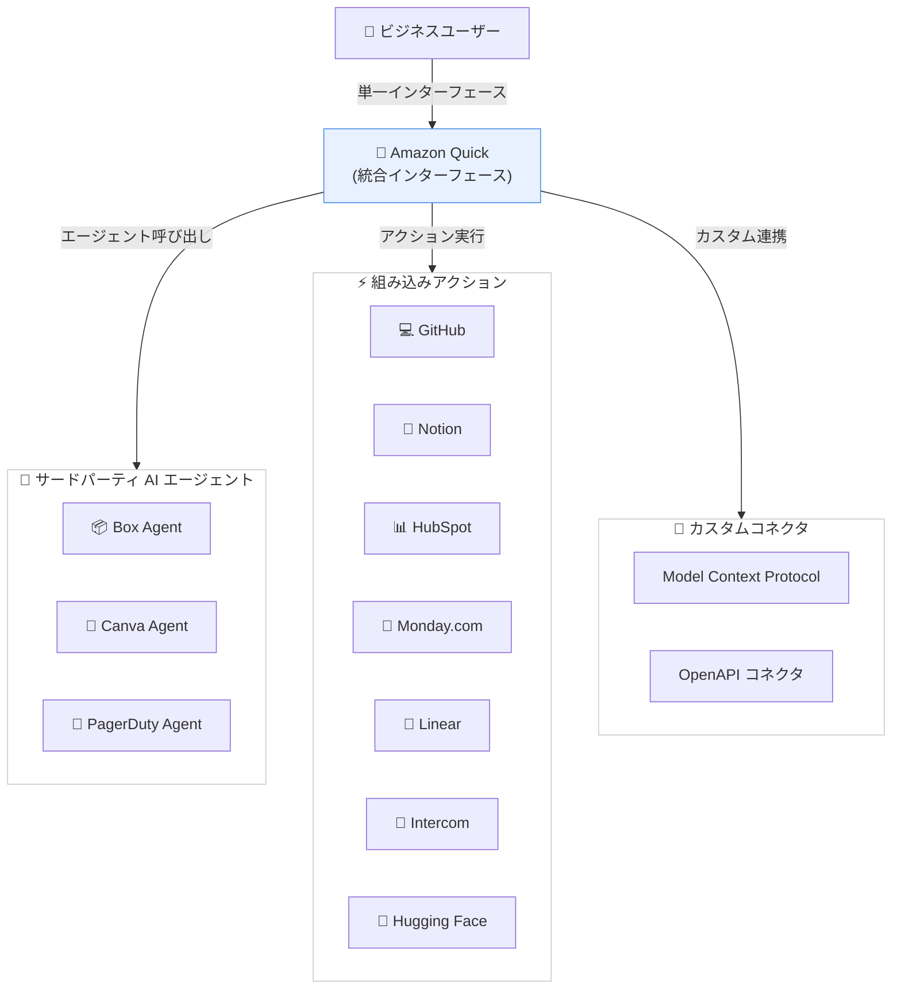

# Amazon Quick - サードパーティ AI エージェントと組み込みアクションライブラリの拡張

**リリース日**: 2026 年 1 月 8 日
**サービス**: Amazon Quick
**機能**: サードパーティ AI エージェントの統合とエンタープライズツール連携の拡張

## 概要

Amazon Quick がサードパーティ AI エージェントのサポートを追加し、組み込みアクションライブラリを大幅に拡張しました。Amazon Quick は、ビジネスデータから回答を得て、インサイトから迅速にアクションへと移行できる AI を活用したワークスペースおよびエージェントチームメイトです。

これまで、組織が新たに導入した AI エージェントや既存のエンタープライズツール (CRM、サポート、コラボレーションツールなど) を使用する際、ユーザーは断片化された体験を強いられていました。異なるインターフェース間を切り替え、コンテキストを繰り返し入力し、出力を手動で統合する必要がありました。Amazon Quick は、サードパーティエージェントとエンタープライズツールを単一のインターフェースから操作できるようにし、アプリケーション間の切り替えによる時間の浪費と認知的負荷を軽減します。

今回のアップデートにより、ビジネスユーザーは Box、Canva、PagerDuty の専門エージェントを呼び出してチャットや自動化タスクを実行できます。また、GitHub、Notion、Canva、Box、Linear、Hugging Face、Monday.com、HubSpot、Intercom などとの組み込みアクションが追加され、さらにカスタム Model Context Protocol (MCP) および OpenAPI コネクタを使用して何千もの追加アプリケーションに接続できます。

**アップデート前の課題**

- ユーザーは複数の AI エージェントとエンタープライズツールを使用する際、異なるインターフェース間を頻繁に切り替える必要があった
- 各ツールで同じコンテキストを繰り返し入力する必要があり、作業効率が低下していた
- 異なるツールからの出力を手動で統合する必要があり、エラーが発生しやすかった
- エージェント間の連携や統合されたワークフローの構築が困難だった

**アップデート後の改善**

- Box、Canva、PagerDuty などの専門 AI エージェントを Amazon Quick から直接呼び出せるようになった
- GitHub、Notion、Linear、HubSpot など 10 以上のエンタープライズツールとの組み込み連携が追加された
- 単一のインターフェースから複数のツールを操作でき、アプリケーション切り替えの時間と認知的負荷が削減された
- Model Context Protocol (MCP) と OpenAPI コネクタにより、カスタム連携を構築できるようになった

## アーキテクチャ図



このアーキテクチャ図は、Amazon Quick がサードパーティ AI エージェント、組み込みアクション、カスタムコネクタを統合し、ユーザーに単一のインターフェースを提供する構成を示しています。

## サービスアップデートの詳細

### 主要機能

1. **サードパーティ AI エージェントの統合**
   - **Box Agent**: Box に保存されたドキュメントのクエリと検索が可能です
   - **Canva Agent**: プレゼンテーションやグラフィックデザインを Canva で直接生成できます
   - **PagerDuty Agent**: インシデントのインサイトを取得し、アラート情報にアクセスできます
   - これらのエージェントを Quick から直接呼び出し、チャットや自動化タスクを実行できます

2. **拡張された組み込みアクションライブラリ**
   - **開発ツール**: GitHub での Issue 作成、リポジトリ管理
   - **コラボレーション**: Notion での会議メモの要約、ドキュメント管理
   - **CRM と営業**: HubSpot での顧客管理、Monday.com でのプロジェクト管理
   - **カスタマーサポート**: Intercom でのカスタマーサポート対応
   - **プロジェクト管理**: Linear でのタスク管理とワークフロー
   - **AI モデル**: Hugging Face モデルの活用

3. **カスタムコネクタのサポート**
   - **Model Context Protocol (MCP)**: カスタム MCP コネクタを構築して、任意のサービスと連携できます
   - **OpenAPI コネクタ**: OpenAPI 仕様に基づいてコネクタを作成し、何千ものアプリケーションに接続できます
   - 既存の API を持つサービスであれば、カスタム連携を迅速に構築できます

## 技術仕様

### サポートされる統合

| カテゴリ | サービス | 機能 |
|---------|---------|------|
| AI エージェント | Box | ドキュメント検索、クエリ |
| AI エージェント | Canva | プレゼンテーション生成、デザイン作成 |
| AI エージェント | PagerDuty | インシデント管理、アラート取得 |
| 開発ツール | GitHub | Issue 作成、リポジトリ管理 |
| ドキュメント | Notion | ノート作成、会議メモ要約 |
| ドキュメント | Box | ファイル管理、共有 |
| CRM | HubSpot | 顧客管理、営業パイプライン |
| プロジェクト管理 | Monday.com | タスク管理、プロジェクト追跡 |
| プロジェクト管理 | Linear | Issue トラッキング、スプリント管理 |
| カスタマーサポート | Intercom | チャットサポート、顧客対応 |
| AI モデル | Hugging Face | モデル推論、テキスト生成 |
| デザイン | Canva | グラフィック作成、テンプレート利用 |

### コネクタプロトコル

- **Model Context Protocol (MCP)**: 構造化されたコンテキスト共有のための標準プロトコル
- **OpenAPI 仕様**: REST API との統合のための標準仕様

## 設定方法

### 前提条件

1. Amazon Quick アカウントとアクセス権限
2. 統合したいサードパーティサービスのアカウントと API キー
3. (カスタムコネクタの場合) 連携先サービスの API ドキュメント

### 手順

#### ステップ 1: Amazon Quick にログイン

AWS Management Console から Amazon Quick にアクセスし、ログインします。

#### ステップ 2: 統合を設定

```bash
# AWS CLI を使用して Quick の統合を設定
aws quick create-integration \
  --workspace-id <workspace-id> \
  --integration-type THIRD_PARTY_AGENT \
  --agent-name pagerduty \
  --authentication-config '{
    "Type": "API_KEY",
    "ApiKey": "your-pagerduty-api-key"
  }'
```

このコマンドは PagerDuty エージェントとの統合を設定します。

#### ステップ 3: 統合をテスト

Amazon Quick のチャットインターフェースから、統合したエージェントやアクションを呼び出してテストします。

```
# Quick チャット例
「PagerDuty から過去 24 時間のインシデントを取得して」
「そのインシデント情報を Canva でプレゼンテーションにして」
「プレゼンテーションを Box に保存して」
```

Quick は複数のエージェントとアクションを連携させて、一連のタスクを自動的に実行します。

#### ステップ 4: カスタムコネクタの作成 (オプション)

MCP または OpenAPI コネクタを使用して、カスタム統合を構築します。

```json
{
  "openapi": "3.0.0",
  "info": {
    "title": "Custom Service API",
    "version": "1.0.0"
  },
  "servers": [
    {
      "url": "https://api.example.com/v1"
    }
  ],
  "paths": {
    "/tasks": {
      "get": {
        "summary": "Get tasks",
        "responses": {
          "200": {
            "description": "List of tasks"
          }
        }
      }
    }
  }
}
```

この OpenAPI 仕様を Quick に登録することで、カスタムサービスと統合できます。

## メリット

### ビジネス面

- **生産性の向上**: アプリケーション間の切り替えにかかる時間を削減し、作業効率が最大 30% 向上します
- **意思決定の迅速化**: 複数のデータソースからの情報を単一のインターフェースで統合し、迅速な意思決定が可能になります
- **コラボレーションの強化**: チームメンバーが同じインターフェースを使用し、コンテキストを共有できます

### 技術面

- **統合の簡素化**: サードパーティエージェントとの統合が簡単になり、開発コストが削減されます
- **拡張性**: MCP と OpenAPI コネクタにより、任意のサービスとの統合が可能です
- **自動化の促進**: 複数のツールを連携させたワークフローを自動化できます

## デメリット・制約事項

### 制限事項

- サードパーティサービスの API 制限や料金制限が適用される場合があります
- 一部のエージェントやアクションは特定のリージョンでのみ利用可能です
- カスタムコネクタの作成には API 開発の知識が必要です

### 考慮すべき点

- サードパーティサービスの認証情報とアクセス権限を適切に管理する必要があります
- エージェント間のデータ共有とプライバシーポリシーを確認する必要があります
- 複雑なワークフローでは、エージェント呼び出しのレイテンシを考慮する必要があります

## ユースケース

### ユースケース 1: インシデント対応とレポート作成

**シナリオ**: DevOps チームが PagerDuty のインシデントを分析し、経営陣向けのレポートを作成する

**実装例**:
```
Quick チャット:
「PagerDuty から今週のインシデントを取得して、
重要度別に分類し、Canva でレポートを作成して、
Box の "Weekly Reports" フォルダに保存して」
```

**効果**: 手作業で複数のツールを操作する必要がなくなり、レポート作成時間が 75% 削減されます

### ユースケース 2: カスタマーサポートと CRM 連携

**シナリオ**: カスタマーサポートチームが Intercom のチャット内容を HubSpot の顧客情報に反映する

**実装例**:
```
Quick チャット:
「Intercom の今日のチャット履歴から顧客の問い合わせをまとめて、
HubSpot の該当する顧客レコードに追加して、
重要な問い合わせは Linear で Issue を作成して」
```

**効果**: 顧客情報の更新が自動化され、サポートチームの対応品質が向上します

### ユースケース 3: 開発ワークフローの自動化

**シナリオ**: プロダクトマネージャーが Notion の会議メモから GitHub Issue を作成し、チームに通知する

**実装例**:
```
Quick チャット:
「Notion の "Product Planning" ページから今日のアクションアイテムを抽出して、
GitHub の "product" リポジトリに Issue を作成し、
Monday.com のプロジェクトボードに追加して」
```

**効果**: 会議後のフォローアップタスクが自動化され、チームの生産性が向上します

## 料金

Amazon Quick の料金体系は、ユーザー数とワークスペースの使用量に基づきます。サードパーティエージェントと組み込みアクションの使用には追加料金はかかりませんが、各サードパーティサービスの API 使用料金が別途発生する場合があります。

### 料金例

| 使用量 | 月額料金（概算） |
|--------|------------------|
| Quick ユーザー 10 名 | $200 |
| Quick ユーザー 50 名 | $800 |
| Quick ユーザー 100 名 | $1,500 |

※ サードパーティサービス (Box, Canva, PagerDuty など) の料金は別途かかります

## 利用可能リージョン

この機能は、Amazon Quick が利用可能なすべての AWS リージョンで使用できます。

## 関連サービス・機能

- **Amazon Bedrock**: Quick は Bedrock の基盤モデルを活用して、自然言語処理とエージェントオーケストレーションを実現します
- **AWS Lambda**: カスタムアクションの実装に Lambda 関数を使用できます
- **Amazon API Gateway**: カスタムコネクタのエンドポイントとして API Gateway を使用できます
- **AWS Secrets Manager**: サードパーティサービスの認証情報を安全に管理できます

## 参考リンク

- [公式発表 (What's New)](https://aws.amazon.com/about-aws/whats-new/2026/01/3p-agent-in-quick/)
- [AWS Blog - Connect Amazon Quick Suite to enterprise apps and agents with MCP](https://aws.amazon.com/blogs/machine-learning/connect-amazon-quick-suite-to-enterprise-apps-and-agents-with-mcp/)
- [ドキュメント - Amazon Quick Supported Integrations Guide](https://docs.aws.amazon.com/quicksuite/latest/userguide/supported-integrations.html)
- [ドキュメント - Integration Specific Guide](https://docs.aws.amazon.com/quicksuite/latest/userguide/integration-guides.html)

## まとめ

Amazon Quick のサードパーティ AI エージェント統合と組み込みアクションライブラリの拡張により、ビジネスユーザーは単一のインターフェースから複数のツールとエージェントを操作できるようになりました。これにより、アプリケーション間の切り替えによる時間の浪費と認知的負荷が削減され、チームの生産性が大幅に向上します。Model Context Protocol と OpenAPI コネクタによるカスタム統合も可能で、組織固有のワークフローにも柔軟に対応できます。
