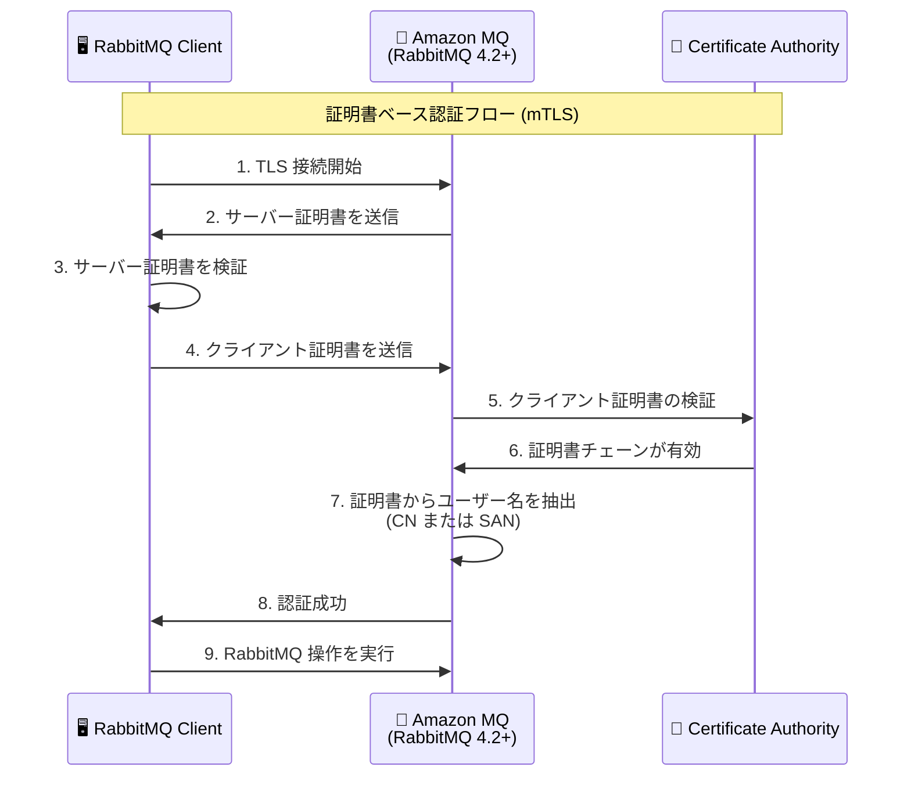

# Amazon MQ - RabbitMQ での証明書ベース認証と相互 TLS のサポート

**リリース日**: 2026 年 1 月 8 日
**サービス**: Amazon MQ
**機能**: RabbitMQ での X.509 クライアント証明書による認証 (mTLS)

## 概要

Amazon MQ が RabbitMQ ブローカーで X.509 クライアント証明書を使用した証明書ベース認証と相互 TLS (mTLS) をサポートするようになりました。この機能は RabbitMQ 4.2 以降を実行する Amazon MQ ブローカーで利用可能で、auth_mechanism_ssl プラグインを設定ファイルで有効化することで使用できます。

証明書ベース認証は、従来のユーザー名とパスワードによる認証に代わる、より強固なセキュリティメカニズムを提供します。クライアント証明書を使用することで、認証情報がネットワーク上を流れることがなくなり、セキュリティが大幅に向上します。この機能は、コンプライアンス要件が厳しい環境や、PKI (Public Key Infrastructure) ベースの認証を採用している組織にとって特に有用です。

**アップデート前の課題**

- RabbitMQ ブローカーへのアクセスにはユーザー名とパスワードによる認証のみが利用可能で、認証情報がネットワーク上を流れるリスクがあった
- PKI ベースの認証基盤を持つ組織では、既存の証明書管理インフラストラクチャを RabbitMQ 認証に活用できなかった
- コンプライアンス要件で証明書ベース認証が求められる環境では、Amazon MQ の採用が困難だった

**アップデート後の改善**

- X.509 クライアント証明書による強固な認証が可能になり、認証情報の漏洩リスクが軽減された
- 既存の PKI インフラストラクチャと統合でき、証明書のライフサイクル管理を一元化できるようになった
- コンプライアンス要件を満たす認証メカニズムが利用可能になり、規制の厳しい業界でも Amazon MQ を採用できるようになった

## アーキテクチャ図



この図は、クライアントが X.509 証明書を使用して Amazon MQ RabbitMQ ブローカーに接続する際の認証フローを示しています。相互 TLS では、クライアントとサーバーの両方が証明書を交換し検証します。

## サービスアップデートの詳細

### 主要機能

1. **X.509 クライアント証明書による認証**
   - クライアントは X.509 証明書を使用して RabbitMQ ブローカーに認証できます
   - 証明書は信頼された認証局 (CA) によって署名されている必要があり、Amazon MQ が証明書チェーンを検証します
   - ユーザー名とパスワードを送信する必要がなくなり、セキュリティが向上します

2. **auth_mechanism_ssl プラグインのサポート**
   - RabbitMQ 4.2 以降で利用可能な auth_mechanism_ssl プラグインを設定ファイルで有効化できます
   - プラグインの設定は Amazon MQ の設定ファイルを編集することで行います
   - 必要な設定値は AWS ドキュメントの configurable values ページを参照できます

3. **証明書からのユーザー名抽出**
   - 証明書の Common Name (CN) または Subject Alternative Name (SAN) からユーザー名を抽出します
   - `ssl_cert_login_from` で抽出元フィールドを指定できます (distinguished_name, common_name, subject_alternative_name など)
   - `ssl_cert_login_san_type` で SAN タイプを指定できます (dns, ip, email, uri, other_name)

## 技術仕様

### 対応バージョンとインスタンスタイプ

| 項目 | 詳細 |
|------|------|
| RabbitMQ バージョン | 4.2 以上 |
| インスタンスタイプ | M7g |
| プラグイン | auth_mechanism_ssl |
| 必要な認証局 | 信頼された CA による署名が必要 |

### 設定例

証明書ベース認証を有効にするための設定ファイルの例:

```erlang
%% SSL 証明書認証の設定
auth_mechanisms.1 = PLAIN
auth_mechanisms.2 = EXTERNAL

%% SSL オプション
ssl_options.verify = verify_peer
ssl_options.fail_if_no_peer_cert = true
ssl_options.depth = 3
aws.arns.ssl_options.cacertfile = arn:aws:acm:region:account-id:certificate/certificate-id

%% 証明書からのユーザー名抽出設定
ssl_cert_login_from = common_name
```

## 設定方法

### 前提条件

1. RabbitMQ 4.2 を実行する Amazon MQ ブローカー (M7g インスタンスタイプ)
2. 信頼された認証局 (CA) によって署名されたクライアント証明書
3. AWS Certificate Manager (ACM) に登録された CA 証明書
4. Amazon MQ の設定ファイルを編集する権限

### 手順

#### ステップ 1: RabbitMQ 4.2 ブローカーを作成

```bash
aws mq create-broker \
  --broker-name my-rabbitmq-broker \
  --engine-type RABBITMQ \
  --engine-version 4.2 \
  --host-instance-type mq.m7g.large \
  --deployment-mode SINGLE_INSTANCE \
  --authentication-strategy simple \
  --users Username=admin,Password=YourPassword
```

このコマンドは RabbitMQ 4.2 を実行する M7g インスタンスタイプのブローカーを作成します。

#### ステップ 2: 設定ファイルを編集

AWS Management Console、AWS CLI、または AWS SDK を使用して、ブローカーの設定ファイルに auth_mechanism_ssl プラグインの設定を追加します。

```bash
# 設定ファイルのテンプレートを取得
aws mq describe-configuration --configuration-id <configuration-id>

# 設定を更新
aws mq update-configuration \
  --configuration-id <configuration-id> \
  --data "$(cat updated-config.ldif | base64)"
```

設定ファイルには、SSL オプション、証明書検証設定、ユーザー名抽出ルールを含めます。

#### ステップ 3: クライアントから接続

クライアント証明書を使用して RabbitMQ ブローカーに接続します。

```python
import pika
import ssl

# SSL コンテキストの設定
context = ssl.create_default_context(
    cafile="/path/to/ca-cert.pem"
)
context.load_cert_chain(
    certfile="/path/to/client-cert.pem",
    keyfile="/path/to/client-key.pem"
)

# 接続パラメータ
credentials = pika.credentials.ExternalCredentials()
parameters = pika.ConnectionParameters(
    host='your-broker-endpoint.mq.amazonaws.com',
    port=5671,
    credentials=credentials,
    ssl_options=pika.SSLOptions(context)
)

# 接続
connection = pika.BlockingConnection(parameters)
channel = connection.channel()
```

このコードは、クライアント証明書を使用して mTLS 接続を確立します。

## メリット

### ビジネス面

- **コンプライアンス対応の向上**: PKI ベースの認証により、規制要件や業界標準に準拠しやすくなります
- **運用コストの削減**: 既存の PKI インフラストラクチャを活用でき、認証基盤の統合により管理コストを削減できます
- **セキュリティインシデントのリスク軽減**: 認証情報の漏洩リスクが低減され、セキュリティインシデントによる損失を防げます

### 技術面

- **強固な認証メカニズム**: X.509 証明書による認証は、パスワードベースの認証よりも強固です
- **認証情報の非送信**: クライアント証明書を使用するため、ネットワーク上で認証情報を送信する必要がありません
- **既存の PKI インフラとの統合**: 組織の既存の証明書管理システムと統合でき、証明書のライフサイクル管理を一元化できます

## デメリット・制約事項

### 制限事項

- RabbitMQ 4.2 以降および M7g インスタンスタイプでのみ利用可能
- クライアント証明書は信頼された CA によって署名されている必要がある
- 証明書の有効期限管理やローテーションプロセスを別途実装する必要がある

### 考慮すべき点

- 証明書の配布と管理のための PKI インフラストラクチャが必要
- クライアント側のアプリケーションで証明書ベース認証をサポートする必要がある
- 証明書の失効管理 (CRL または OCSP) を考慮する必要がある

## ユースケース

### ユースケース 1: 金融機関でのメッセージング

**シナリオ**: 金融機関が PCI DSS などのコンプライアンス要件を満たすため、強固な認証メカニズムが必要

**実装例**:
```erlang
%% 金融機関向け厳格な設定
auth_mechanisms.1 = EXTERNAL
ssl_options.verify = verify_peer
ssl_options.fail_if_no_peer_cert = true
ssl_options.depth = 3
ssl_cert_login_from = distinguished_name
```

**効果**: コンプライアンス要件を満たし、監査に対応できる強固な認証基盤を構築できます

### ユースケース 2: マイクロサービス間通信

**シナリオ**: Kubernetes クラスター内のマイクロサービスが RabbitMQ を使用してメッセージを交換する環境

**実装例**:
```yaml
# Kubernetes Secret として証明書を管理
apiVersion: v1
kind: Secret
metadata:
  name: rabbitmq-client-cert
type: kubernetes.io/tls
data:
  tls.crt: <base64-encoded-cert>
  tls.key: <base64-encoded-key>
  ca.crt: <base64-encoded-ca>
```

**効果**: サービスメッシュの mTLS と統合でき、エンドツーエンドの暗号化と認証を実現できます

### ユースケース 3: IoT デバイスからのメッセージング

**シナリオ**: IoT デバイスが個別の証明書を持ち、RabbitMQ にメッセージを送信する環境

**実装例**:
```python
# IoT デバイス側のコード
context = ssl.create_default_context(cafile="/etc/iot/ca-cert.pem")
context.load_cert_chain(
    certfile="/etc/iot/device-cert.pem",
    keyfile="/etc/iot/device-key.pem"
)
credentials = pika.credentials.ExternalCredentials()
connection = pika.BlockingConnection(
    pika.ConnectionParameters(
        host='broker.mq.amazonaws.com',
        port=5671,
        credentials=credentials,
        ssl_options=pika.SSLOptions(context)
    )
)
```

**効果**: デバイスごとに個別の証明書を発行でき、デバイスの識別と認証を確実に行えます

## 料金

この機能の利用に追加料金は発生しません。Amazon MQ の標準的なブローカー料金が適用されます。ただし、AWS Certificate Manager (ACM) でプライベート CA を使用する場合は、別途料金が発生します。

### 料金例

| リソース | 月額料金（概算） |
|--------|------------------|
| mq.m7g.large ブローカー (シングルインスタンス) | 約 $200 |
| AWS Certificate Manager プライベート CA | $400/月 (CA ごと) + $0.75/証明書 |

## 利用可能リージョン

この機能は、Amazon MQ RabbitMQ 4 インスタンスが利用可能なすべての AWS リージョンで使用できます。

## 関連サービス・機能

- **AWS Certificate Manager (ACM)**: CA 証明書の管理に使用します
- **AWS Private Certificate Authority**: プライベート CA を運用する場合に使用します
- **Amazon MQ OAuth 2.0 認証**: 別の認証オプションとして、外部 IdP と統合できます
- **Amazon MQ LDAP 認証**: LDAP ディレクトリサービスとの統合も可能です

## 参考リンク

- [公式発表 (What's New)](https://aws.amazon.com/about-aws/whats-new/2026/01/amazon-mq-certificate-based-authentication-mutual-tls-rabbitmq/)
- [ドキュメント - SSL certificate authentication](https://docs.aws.amazon.com/amazon-mq/latest/developer-guide/ssl-for-amq-for-rabbitmq.html)
- [ドキュメント - 設定可能な値](https://docs.aws.amazon.com/amazon-mq/latest/developer-guide/configurable-values.html)
- [ドキュメント - RabbitMQ の認証と認可](https://docs.aws.amazon.com/amazon-mq/latest/developer-guide/rabbitmq-authentication.html)
- [Amazon MQ リリースノート](https://docs.aws.amazon.com/amazon-mq/latest/developer-guide/amazon-mq-release-notes.html)

## まとめ

Amazon MQ の証明書ベース認証サポートにより、RabbitMQ ブローカーへのアクセスセキュリティが大幅に向上しました。既存の PKI インフラストラクチャと統合でき、コンプライアンス要件を満たす強固な認証メカニズムを実現できます。金融、ヘルスケア、IoT など、セキュリティ要件の高い業界での Amazon MQ 採用が加速することが期待されます。
