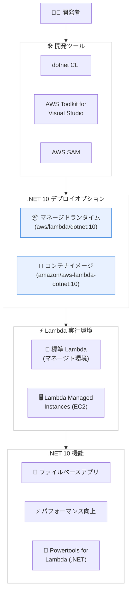

# AWS Lambda - .NET 10 サポートの追加

**リリース日**: 2026 年 1 月 8 日
**サービス**: AWS Lambda
**機能**: .NET 10 ランタイムのサポート

## 概要

AWS Lambda が .NET 10 を使用したサーバーレスアプリケーションの作成をサポートするようになりました。開発者は .NET 10 をマネージドランタイムとコンテナベースイメージの両方で使用でき、AWS が自動的にマネージドランタイムとベースイメージの更新を適用します。

.NET 10 は .NET の最新の長期サポート (LTS) リリースで、2028 年 11 月までセキュリティとバグ修正のサポートが予定されています。このリリースにより、Lambda 開発者はファイルベースアプリを含む最新の .NET 機能にアクセスできます。また、Lambda Managed Instances のサポートも含まれており、サーバーレスの運用のシンプルさを維持しながら、Amazon EC2 インスタンス上で Lambda 関数を実行でき、コスト効率と専用のコンピュートオプションを提供します。

Powertools for AWS Lambda (.NET) という、サーバーレスのベストプラクティスを実装し開発速度を向上させる開発者ツールキットも .NET 10 をサポートしています。Lambda コンソール、AWS CLI、AWS Serverless Application Model (AWS SAM)、AWS CDK、AWS CloudFormation など、すべての AWS デプロイツールを使用して .NET 10 で記述されたサーバーレスアプリケーションをデプロイおよび管理できます。

**アップデート前の課題**

- .NET 開発者は最新の .NET 10 の機能や改善を Lambda で利用できなかった
- ファイルベースアプリなどの新しい開発パラダイムがサポートされていなかった
- .NET 8 のサポート期限を考慮し、将来的な移行を計画する必要があった

**アップデート後の改善**

- .NET 10 の最新機能 (ファイルベースアプリなど) を Lambda で利用できるようになった
- 2028 年 11 月まで長期サポートが保証され、安定した開発環境を提供できるようになった
- Lambda Managed Instances により、EC2 インスタンス上で Lambda 関数を実行できる柔軟性が追加された
- AWS が自動的にランタイムとベースイメージを更新するため、メンテナンスの負担が軽減された

## アーキテクチャ図



この図は、.NET 10 を使用した Lambda 開発のワークフローと、マネージドランタイムとコンテナイメージの 2 つのデプロイオプション、そして標準 Lambda と Lambda Managed Instances の実行環境を示しています。

## サービスアップデートの詳細

### 主要機能

1. **マネージドランタイムとコンテナベースイメージのサポート**
   - .NET 10 をマネージドランタイム (`dotnet10`) として使用できます
   - コンテナベースイメージ (`amazon/aws-lambda-dotnet:10`) としても使用可能です
   - AWS が自動的にセキュリティパッチと更新を適用します

2. **ファイルベースアプリのサポート**
   - 単一の `.cs` ファイルに Lambda 関数を記述できます
   - `.csproj` ファイルや複雑なフォルダ構造が不要になります
   - 開発とデプロイがシンプルになり、小規模な関数に最適です

3. **Lambda Managed Instances のサポート**
   - Lambda 関数を Amazon EC2 インスタンス上で実行できます
   - サーバーレスの運用のシンプルさを維持しながら、コスト効率と専用コンピュートオプションを利用できます
   - 長時間実行される関数や、特定のインスタンスタイプが必要な関数に適しています

4. **Powertools for AWS Lambda (.NET) のサポート**
   - 構造化ログ、メトリクス、トレーシングなどのベストプラクティスを簡単に実装できます
   - 開発速度を向上させるツールキットが .NET 10 で利用可能です

## 技術仕様

### ランタイム情報

| 項目 | 詳細 |
|------|------|
| ランタイム識別子 | `dotnet10` |
| .NET バージョン | .NET 10 LTS |
| サポート期限 | 2028 年 11 月 |
| サポートする OS | Amazon Linux 2023 |
| コンテナベースイメージ | `amazon/aws-lambda-dotnet:10` |

### ファイルベースアプリの例

```csharp
// Function.cs - シンプルなファイルベース Lambda 関数
using Amazon.Lambda.Core;

[assembly: LambdaSerializer(typeof(Amazon.Lambda.Serialization.SystemTextJson.DefaultLambdaJsonSerializer))]

public class Function
{
    public string FunctionHandler(string input, ILambdaContext context)
    {
        context.Logger.LogInformation($"Input: {input}");
        return input.ToUpper();
    }
}
```

### API 変更履歴

現時点で .NET 10 に関連する AWS API の変更はありません。既存の Lambda API を使用して .NET 10 関数をデプロイできます。

## 設定方法

### 前提条件

1. .NET 10 SDK がインストールされていること
2. AWS CLI または AWS Toolkit for Visual Studio がインストールされていること
3. 適切な AWS 認証情報が設定されていること
4. Lambda 関数を作成する権限があること

### 手順

#### ステップ 1: .NET 10 SDK のインストール

```bash
# .NET 10 SDK をダウンロードしてインストール
# https://dotnet.microsoft.com/download/dotnet/10.0
```

.NET 10 SDK をシステムにインストールします。

#### ステップ 2: Lambda プロジェクトの作成

```bash
# Lambda テンプレートツールをインストール
dotnet new install Amazon.Lambda.Templates

# 新しい Lambda プロジェクトを作成
dotnet new lambda.EmptyFunction -n MyDotNet10Function -f net10.0

# プロジェクトディレクトリに移動
cd MyDotNet10Function/src/MyDotNet10Function
```

このコマンドは .NET 10 をターゲットとする Lambda プロジェクトを作成します。

#### ステップ 3: 関数コードの実装

```csharp
// Function.cs
using Amazon.Lambda.Core;

[assembly: LambdaSerializer(typeof(Amazon.Lambda.Serialization.SystemTextJson.DefaultLambdaJsonSerializer))]

namespace MyDotNet10Function;

public class Function
{
    public string FunctionHandler(string input, ILambdaContext context)
    {
        context.Logger.LogInformation($"Processing input: {input}");

        // .NET 10 の新機能を使用
        var result = $"Processed: {input.ToUpper()} at {DateTime.UtcNow:yyyy-MM-dd HH:mm:ss}";

        return result;
    }
}
```

Lambda 関数のロジックを実装します。

#### ステップ 4: デプロイ

```bash
# AWS SAM を使用してデプロイ
sam build
sam deploy --guided

# または dotnet CLI を使用
dotnet lambda deploy-function MyDotNet10Function \
  --function-runtime dotnet10 \
  --function-role arn:aws:iam::123456789012:role/lambda-execution-role \
  --region us-east-1
```

関数を AWS Lambda にデプロイします。初回は `--guided` オプションで対話的に設定を行います。

#### ステップ 5: 関数のテスト

```bash
# Lambda 関数を呼び出し
aws lambda invoke \
  --function-name MyDotNet10Function \
  --payload '{"input": "hello world"}' \
  --region us-east-1 \
  response.json

# レスポンスを確認
cat response.json
```

デプロイした関数をテストし、正しく動作することを確認します。

## メリット

### ビジネス面

- **長期サポート**: 2028 年 11 月まで LTS が保証され、長期的な計画を立てやすくなります
- **開発速度の向上**: ファイルベースアプリにより、小規模な関数を迅速に開発できます
- **コスト最適化**: Lambda Managed Instances により、長時間実行される関数のコストを最適化できます

### 技術面

- **最新機能へのアクセス**: .NET 10 の最新機能とパフォーマンス改善を利用できます
- **自動更新**: AWS がランタイムの更新を自動的に適用するため、セキュリティパッチの適用が容易です
- **柔軟な実行環境**: 標準 Lambda と Lambda Managed Instances を選択でき、ワークロードに最適な環境を選べます
- **開発ツールの統合**: Powertools for Lambda により、ベストプラクティスを簡単に実装できます

## デメリット・制約事項

### 制限事項

- .NET 8 以前のランタイムとは互換性がない場合があり、移行には注意が必要です
- ファイルベースアプリは単純な関数に適しており、複雑なアプリケーションには従来のプロジェクト構造が推奨されます
- Lambda Managed Instances は特定のユースケースに適しており、すべてのワークロードに適しているわけではありません

### 考慮すべき点

- .NET 8 から .NET 10 への移行では、破壊的変更がないか確認する必要があります
- コールドスタート時間は .NET のバージョンやデプロイパッケージのサイズに依存します
- コンテナイメージを使用する場合、イメージのサイズとビルド時間を考慮する必要があります

## ユースケース

### ユースケース 1: シンプルな API バックエンド

**シナリオ**: REST API のバックエンドとして、単純なデータ変換や検証を行う Lambda 関数を作成する

**実装例**:
```csharp
// Function.cs - ファイルベースアプリ
using Amazon.Lambda.Core;
using Amazon.Lambda.APIGatewayEvents;
using System.Text.Json;

[assembly: LambdaSerializer(typeof(Amazon.Lambda.Serialization.SystemTextJson.DefaultLambdaJsonSerializer))]

public class Function
{
    public APIGatewayProxyResponse FunctionHandler(APIGatewayProxyRequest request, ILambdaContext context)
    {
        var body = JsonSerializer.Deserialize<RequestBody>(request.Body);

        return new APIGatewayProxyResponse
        {
            StatusCode = 200,
            Body = JsonSerializer.Serialize(new { Message = $"Hello, {body.Name}!" }),
            Headers = new Dictionary<string, string> { { "Content-Type", "application/json" } }
        };
    }
}

public record RequestBody(string Name);
```

**効果**: ファイルベースアプリにより、小規模な API エンドポイントを迅速に実装できます

### ユースケース 2: バッチ処理

**シナリオ**: S3 にアップロードされたファイルを処理し、結果を DynamoDB に保存する

**実装例**:
```csharp
using Amazon.Lambda.Core;
using Amazon.Lambda.S3Events;
using Amazon.S3;
using Amazon.DynamoDBv2;
using AWS.Lambda.Powertools.Logging;

[assembly: LambdaSerializer(typeof(Amazon.Lambda.Serialization.SystemTextJson.DefaultLambdaJsonSerializer))]

namespace FileProcessor;

public class Function
{
    private readonly IAmazonS3 _s3Client = new AmazonS3Client();
    private readonly IAmazonDynamoDB _dynamoClient = new AmazonDynamoDBClient();

    [Logging(LogEvent = true)]
    public async Task FunctionHandler(S3Event s3Event, ILambdaContext context)
    {
        foreach (var record in s3Event.Records)
        {
            Logger.LogInformation($"Processing file: {record.S3.Object.Key}");

            // S3 からファイルを取得
            var response = await _s3Client.GetObjectAsync(
                record.S3.Bucket.Name,
                record.S3.Object.Key
            );

            // ファイルを処理して DynamoDB に保存
            // ... 処理ロジック
        }
    }
}
```

**効果**: Powertools for Lambda を使用して、構造化ログとトレーシングを簡単に実装できます

### ユースケース 3: Lambda Managed Instances での長時間実行

**シナリオ**: 大量のデータを処理する必要があり、標準 Lambda の 15 分制限では不足する場合

**実装例**:
```bash
# Lambda Managed Instances を使用してデプロイ
aws lambda create-function \
  --function-name long-running-processor \
  --runtime dotnet10 \
  --role arn:aws:iam::123456789012:role/lambda-role \
  --handler MyFunction::MyFunction.Function::FunctionHandler \
  --zip-file fileb://function.zip \
  --timeout 3600 \
  --memory-size 2048 \
  --environment Variables="{EXECUTION_MODE=MANAGED_INSTANCES}"
```

**効果**: Lambda Managed Instances により、標準 Lambda の時間制限を超える処理を実行できます

## 料金

AWS Lambda の料金は、リクエスト数とコンピュート時間 (GB-秒) に基づきます。.NET 10 ランタイムを使用しても追加料金は発生しません。

### 料金例

| 使用量 | 月額料金（概算） |
|--------|------------------|
| 100 万リクエスト、128MB メモリ、平均 200ms 実行 | $0.20 + $0.42 = $0.62 |
| 1,000 万リクエスト、512MB メモリ、平均 500ms 実行 | $2.00 + $41.67 = $43.67 |
| Lambda Managed Instances (m5.large、1 日 8 時間) | 約 $30 |

※ AWS Lambda の無料利用枠 (月間 100 万リクエストと 40 万 GB-秒) が適用されます

## 利用可能リージョン

.NET 10 ランタイムは、AWS GovCloud (US) リージョンと中国リージョンを含む、すべての AWS リージョンで利用可能です。

## 関連サービス・機能

- **AWS Serverless Application Model (AWS SAM)**: .NET 10 Lambda 関数のローカル開発とデプロイに使用できます
- **AWS CDK**: Infrastructure as Code で .NET 10 Lambda 関数をデプロイできます
- **AWS CloudFormation**: テンプレートを使用して .NET 10 Lambda 関数をプロビジョニングできます
- **Amazon CloudWatch**: Lambda 関数のログとメトリクスを監視できます
- **AWS X-Ray**: Lambda 関数のトレーシングとパフォーマンス分析に使用できます

## 参考リンク

- [公式発表 (What's New)](https://aws.amazon.com/about-aws/whats-new/2026/01/aws-lambda-dot-net-10/)
- [AWS Blog - .NET 10 runtime now available in AWS Lambda](https://aws.amazon.com/blogs/compute/net-10-runtime-now-available-in-aws-lambda/)
- [ドキュメント - Lambda Managed Instances](https://docs.aws.amazon.com/lambda/latest/dg/lambda-managed-instances.html)
- [ドキュメント - Powertools for AWS Lambda (.NET)](https://docs.aws.amazon.com/powertools/dotnet/)
- [AWS Lambda 製品ページ](https://aws.amazon.com/lambda/)

## まとめ

AWS Lambda の .NET 10 サポートにより、.NET 開発者は最新の機能とパフォーマンス改善を活用してサーバーレスアプリケーションを構築できるようになりました。2028 年 11 月まで長期サポートが保証され、ファイルベースアプリや Lambda Managed Instances などの新機能により、開発の柔軟性が向上しています。既存の .NET 8 関数を持つ組織は、.NET 10 への移行を計画し、最新の機能とセキュリティアップデートを活用することを推奨します。
