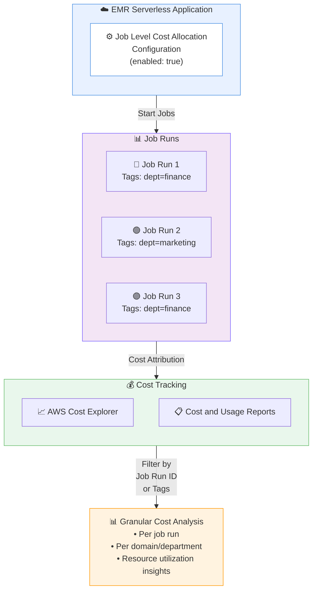

# Amazon EMR Serverless - ジョブ実行レベルのコスト配分

**リリース日**: 2026 年 01 月 09 日
**サービス**: Amazon EMR Serverless
**機能**: ジョブ実行レベルのコスト配分 (Job Run-Level Cost Allocation)

## 概要

Amazon EMR Serverless は、個別のジョブ実行レベルでの詳細なコスト配分をサポートする新機能を発表しました。この機能により、AWS Cost Explorer および Cost and Usage Reports で特定のジョブ実行 ID とジョブ実行に関連付けられたコスト配分タグでフィルタリングおよびコスト追跡ができるようになり、個別のジョブ実行の料金をより詳細に把握できます。

Amazon EMR Serverless は、クラスターやサーバーの設定、管理、スケーリングを行うことなく、オープンソースのビッグデータ分析フレームワークを簡単に実行できる Amazon EMR のデプロイオプションです。データエンジニアやデータサイエンティストが、インフラストラクチャの管理なしに、ミッションクリティカルな MongoDB ワークロードを運用する際に必要なスケーラビリティと耐久性を提供します。

この機能は、AWS GovCloud (US) および中国リージョンを含む、Amazon EMR Serverless が利用可能なすべての AWS リージョンで提供されています。

**アップデート前の課題**

以前は、Amazon EMR Serverless でコスト配分タグを設定できるのはアプリケーションレベルのみで、以下の制限がありました。

- コスト配分はアプリケーション全体に対してのみ可能で、個別のジョブ実行ごとのコスト追跡ができませんでした
- 1 つのアプリケーション内で複数のドメイン (例: 財務部門とマーケティング部門) のジョブを実行する場合、ドメインごとのコスト分析ができませんでした
- 個別のジョブ実行のコストベンチマークを実施することが困難で、コスト最適化の焦点を絞りにくい状況でした

**アップデート後の改善**

今回のアップデートにより、以下の機能が利用可能になりました。

- 各ジョブ実行にコスト配分タグを割り当てることで、個別のジョブ実行レベルでの詳細な請求属性が可能になりました
- 1 つのアプリケーション内でドメインごとにコストを追跡できるようになり、複数のドメインをサポートするアプリケーションで各ドメインのコストを個別に追跡できます
- 個別のジョブ実行のコストを評価するベンチマークが容易になり、コスト最適化の取り組みをより正確に集中できます
- リソース使用率と支出パターンに関するより深い洞察が得られ、異なるジョブやドメイン間での詳細な分析が可能になりました

## アーキテクチャ図



このアーキテクチャ図は、EMR Serverless アプリケーションでジョブレベルのコスト配分を有効にした後の、ジョブ実行からコスト追跡までのフローを示しています。各ジョブ実行に個別のタグを設定することで、AWS Cost Explorer や Cost and Usage Reports で詳細なコスト分析が可能になります。

## サービスアップデートの詳細

### 主要機能

1. **ジョブ実行レベルのコスト配分**
   - 各ジョブ実行に個別のコスト配分タグを割り当て可能
   - AWS Cost Explorer および Cost and Usage Reports で特定のジョブ実行 ID でフィルタリング可能
   - ジョブ実行に関連付けられたタグでコストを追跡可能

2. **ドメインごとのコスト追跡**
   - 1 つのアプリケーション内で複数のドメインのジョブをサポート
   - 例: 財務部門とマーケティング部門のジョブを同一アプリケーションで実行し、各ドメインのコストを個別に追跡
   - ドメイン固有のタグを使用してコストを分離

3. **詳細なコスト最適化**
   - 個別のジョブ実行のコストベンチマークを実施可能
   - リソース使用率と支出パターンの詳細な分析
   - コスト最適化の取り組みをより正確に焦点を絞ることが可能

## 技術仕様

### API 変更履歴

| 日付 | サービス | 変更内容 |
|------|----------|----------|
| 2026/01/06 | [EMR Serverless](https://awsapichanges.com/archive/changes/f6e323-emr-serverless.html) | 5 updated API methods - `CreateApplication`, `UpdateApplication`, `GetApplication`, `StartJobRun`, `GetJobRun` に `jobLevelCostAllocationConfiguration` パラメータが追加されました |

### 設定パラメータ

```json
{
  "jobLevelCostAllocationConfiguration": {
    "enabled": true
  }
}
```

### API メソッドの更新内容

以下の API メソッドが更新され、`jobLevelCostAllocationConfiguration` パラメータがサポートされました。

1. **CreateApplication**: 新規アプリケーション作成時にジョブレベルのコスト配分を設定
2. **UpdateApplication**: 既存アプリケーションのジョブレベルのコスト配分設定を更新
3. **GetApplication**: アプリケーションのジョブレベルのコスト配分設定を取得
4. **StartJobRun**: ジョブ実行開始時に個別のタグを設定可能
5. **GetJobRun**: ジョブ実行の詳細情報とタグを取得

## 設定方法

### 前提条件

1. Amazon EMR Serverless アプリケーションが作成済みであること
2. AWS CLI がインストールされ、適切な IAM 権限が設定されていること
3. アプリケーションが `CREATED` または `STOPPED` 状態であること (既存アプリケーションを更新する場合)

### 手順

#### ステップ 1: 新規アプリケーション作成時にジョブレベルのコスト配分を有効化

```bash
# ジョブレベルのコスト配分を有効化
aws emr-serverless create-application \
    --name "my-application" \
    --release-label "emr-7.12.0" \
    --type "SPARK" \
    --job-level-cost-allocation-configuration '{
        "enabled": true
    }'
```

このコマンドは、新しい EMR Serverless アプリケーションを作成し、ジョブレベルのコスト配分機能を有効化します。`enabled: true` を設定することで、このアプリケーションで実行されるすべてのジョブ実行に対して個別のコスト配分が可能になります。

#### ステップ 2: 既存アプリケーションのジョブレベルのコスト配分を有効化

```bash
# 既存アプリケーションでジョブレベルのコスト配分を有効化
aws emr-serverless update-application \
    --application-id <application-id> \
    --job-level-cost-allocation-configuration '{
        "enabled": true
    }'
```

このコマンドは、既存の EMR Serverless アプリケーションのジョブレベルのコスト配分設定を更新します。アプリケーション ID を指定し、`enabled: true` を設定することで機能を有効化できます。

#### ステップ 3: タグを付けてジョブを実行

```bash
# ジョブ実行時にタグを設定
aws emr-serverless start-job-run \
    --application-id <application-id> \
    --execution-role-arn <execution-role-arn> \
    --job-driver '{
        "sparkSubmit": {
            "entryPoint": "s3://bucket/path/to/script.py"
        }
    }' \
    --tags '{
        "department": "finance",
        "project": "quarterly-report",
        "cost-center": "finance-analytics"
    }'
```

このコマンドは、EMR Serverless でジョブを実行し、コスト追跡用のタグを設定します。タグを使用して、AWS Cost Explorer や Cost and Usage Reports でジョブ実行のコストをフィルタリングおよび追跡できます。

#### ステップ 4: AWS Cost Explorer でコストを確認

AWS Cost Explorer にアクセスし、以下の手順でジョブレベルのコストを確認します。

1. AWS Cost Explorer を開く
2. フィルターで「タグ」を選択
3. ジョブ実行時に設定したタグ (例: `department=finance`) でフィルタリング
4. 個別のジョブ実行 ID でさらに絞り込み、詳細なコスト分析を実施

## メリット

### ビジネス面

- **詳細なコスト可視化**: 個別のジョブ実行ごとにコストを追跡できるため、プロジェクトやドメインごとの正確な予算管理が可能になります
- **チャージバックの簡素化**: 複数の部門やプロジェクトが同一のアプリケーションを使用する場合、各部門に正確にコストを配分できます
- **コスト最適化の加速**: 個別のジョブ実行のコストを比較することで、非効率なジョブを特定し、最適化の優先順位を付けることができます

### 技術面

- **柔軟なコスト追跡**: ジョブ実行レベルでタグを設定できるため、プロジェクト、部門、環境などの任意のディメンションでコストを追跡可能
- **既存ワークフローとの統合**: AWS Cost Explorer および Cost and Usage Reports と統合されており、既存のコスト管理ツールチェーンにシームレスに組み込めます
- **詳細なベンチマーク**: 同じタイプのジョブ実行を比較し、パフォーマンスとコストのトレードオフを評価できます

## デメリット・制約事項

### 制限事項

- ジョブレベルのコスト配分を有効にしても、機能を有効化する前に完了したジョブ実行のコストは遡及的に配分されません
- ジョブレベルのコスト配分パラメータは、アプリケーションが `CREATED` または `STOPPED` 状態のときにのみ更新できます
- ジョブレベルのコスト配分を有効にすると、コストは個別のジョブ実行に配分されるため、アプリケーションレベルの集計コストを表示するには、すべてのジョブ実行に一貫したタグ (例: application-name または application-id) を適用し、Cost Explorer または Cost and Usage Reports でそれらのタグでフィルタリングする必要があります

### 考慮すべき点

- タグの命名規則を事前に定義し、組織全体で一貫性を保つことが重要です
- ジョブレベルのコスト配分を有効にする前に、既存のコスト追跡プロセスへの影響を評価してください
- Cost Explorer でのコスト表示には若干の遅延が発生する場合があります (通常 24 時間以内)

## ユースケース

### ユースケース 1: マルチテナント環境でのコストチャージバック

**シナリオ**: 大規模な組織で、財務部門、マーケティング部門、営業部門が同一の EMR Serverless アプリケーションを使用してデータ分析を実行しています。各部門に正確にコストを配分する必要があります。

**実装例**:

```bash
# 財務部門のジョブ実行
aws emr-serverless start-job-run \
    --application-id app-12345 \
    --execution-role-arn arn:aws:iam::123456789012:role/EMRServerlessRole \
    --job-driver '{
        "sparkSubmit": {
            "entryPoint": "s3://my-bucket/finance/quarterly-report.py"
        }
    }' \
    --tags '{
        "department": "finance",
        "cost-center": "FC-001"
    }'

# マーケティング部門のジョブ実行
aws emr-serverless start-job-run \
    --application-id app-12345 \
    --execution-role-arn arn:aws:iam::123456789012:role/EMRServerlessRole \
    --job-driver '{
        "sparkSubmit": {
            "entryPoint": "s3://my-bucket/marketing/campaign-analysis.py"
        }
    }' \
    --tags '{
        "department": "marketing",
        "cost-center": "MC-002"
    }'
```

**効果**: AWS Cost Explorer で `department` タグでフィルタリングすることで、各部門のコストを正確に追跡し、月末に各部門に適切にコストを配分できます。

### ユースケース 2: ジョブパフォーマンスのコストベンチマーク

**シナリオ**: データエンジニアリングチームが、同じデータ処理パイプラインの異なる実装 (Spark vs Hive、異なる最適化戦略) のコスト効率を比較したいと考えています。

**実装例**:

```bash
# 実装 A: Spark による処理
aws emr-serverless start-job-run \
    --application-id app-12345 \
    --execution-role-arn arn:aws:iam::123456789012:role/EMRServerlessRole \
    --job-driver '{
        "sparkSubmit": {
            "entryPoint": "s3://my-bucket/pipeline-spark.py"
        }
    }' \
    --tags '{
        "pipeline": "data-processing",
        "implementation": "spark",
        "version": "v1"
    }'

# 実装 B: 最適化された Spark
aws emr-serverless start-job-run \
    --application-id app-12345 \
    --execution-role-arn arn:aws:iam::123456789012:role/EMRServerlessRole \
    --job-driver '{
        "sparkSubmit": {
            "entryPoint": "s3://my-bucket/pipeline-spark-optimized.py"
        }
    }' \
    --tags '{
        "pipeline": "data-processing",
        "implementation": "spark-optimized",
        "version": "v2"
    }'
```

**効果**: 各ジョブ実行のコストを比較することで、どの実装が最もコスト効率が良いかを定量的に評価し、本番環境での採用を決定できます。

### ユースケース 3: プロジェクトごとのコスト追跡

**シナリオ**: データサイエンスチームが複数の機械学習プロジェクトを同時に進行しており、各プロジェクトの予算を個別に管理する必要があります。

**実装例**:

```bash
# プロジェクト A: 顧客離反予測
aws emr-serverless start-job-run \
    --application-id app-12345 \
    --execution-role-arn arn:aws:iam::123456789012:role/EMRServerlessRole \
    --job-driver '{
        "sparkSubmit": {
            "entryPoint": "s3://my-bucket/ml/churn-prediction.py"
        }
    }' \
    --tags '{
        "project": "churn-prediction",
        "team": "data-science",
        "budget-id": "PROJ-2026-001"
    }'

# プロジェクト B: レコメンデーションエンジン
aws emr-serverless start-job-run \
    --application-id app-12345 \
    --execution-role-arn arn:aws:iam::123456789012:role/EMRServerlessRole \
    --job-driver '{
        "sparkSubmit": {
            "entryPoint": "s3://my-bucket/ml/recommendation-engine.py"
        }
    }' \
    --tags '{
        "project": "recommendation-engine",
        "team": "data-science",
        "budget-id": "PROJ-2026-002"
    }'
```

**効果**: Cost and Usage Reports で `project` または `budget-id` タグでフィルタリングすることで、各プロジェクトの月次支出を追跡し、予算超過を早期に検出できます。

## 料金

ジョブレベルのコスト配分機能自体に追加料金はかかりません。Amazon EMR Serverless の既存の料金体系が適用されます。

Amazon EMR Serverless の料金は、ジョブの実行に使用される vCPU、メモリ、ストレージに基づいて計算されます。料金は、ジョブが実行されている時間に対してのみ発生します。

### 料金例

| 使用量 | 月額料金 (概算) |
|--------|------------------|
| 100 vCPU 時間、200 GB メモリ時間 | 約 $10-15 USD |
| 1,000 vCPU 時間、2,000 GB メモリ時間 | 約 $100-150 USD |

具体的な料金は、使用するリージョンやインスタンスタイプによって異なります。詳細は、[Amazon EMR 料金ページ](https://aws.amazon.com/emr/pricing/) をご確認ください。

## 利用可能リージョン

この機能は、AWS GovCloud (US) および中国リージョンを含む、Amazon EMR Serverless が利用可能なすべての AWS リージョンで提供されています。

利用可能なリージョンの最新リストは、[AWS リージョンテーブル](https://aws.amazon.com/about-aws/global-infrastructure/regional-product-services/) をご確認ください。

## 関連サービス・機能

- **AWS Cost Explorer**: ジョブレベルのコストを可視化し、トレンド分析やフィルタリングを実施するための主要ツール
- **AWS Cost and Usage Reports**: 詳細なコストデータをダウンロードし、カスタム分析やレポートを作成するためのサービス
- **AWS Billing and Cost Management**: 組織全体のコスト管理、予算設定、アラート機能を提供
- **Amazon EMR on EKS**: Kubernetes 上で EMR ワークロードを実行する別のデプロイオプション。同様のコスト配分機能が利用可能

## 参考リンク

- [公式発表 (What's New)](https://aws.amazon.com/about-aws/whats-new/2026/01/amazon-emr-serverless-adds-job-run-level/)
- [ドキュメント: Enabling Job Level Cost Allocation](https://docs.aws.amazon.com/emr/latest/EMR-Serverless-UserGuide/jobs-job-level-cost-allocation.html)
- [API リファレンス: JobLevelCostAllocationConfiguration](https://docs.aws.amazon.com/emr-serverless/latest/APIReference/API_JobLevelCostAllocationConfiguration.html)
- [Amazon EMR Serverless 製品ページ](https://aws.amazon.com/emr/serverless/)
- [Amazon EMR 料金ページ](https://aws.amazon.com/emr/pricing/)

## まとめ

Amazon EMR Serverless のジョブレベルのコスト配分機能により、個別のジョブ実行ごとに詳細なコスト追跡が可能になりました。この機能は、マルチテナント環境でのコストチャージバック、ジョブパフォーマンスのベンチマーク、プロジェクトごとの予算管理など、さまざまなユースケースで活用できます。既存の EMR Serverless ユーザーは、アプリケーション設定を更新するだけで、この機能を有効化し、より詳細なコスト最適化を実現できます。
