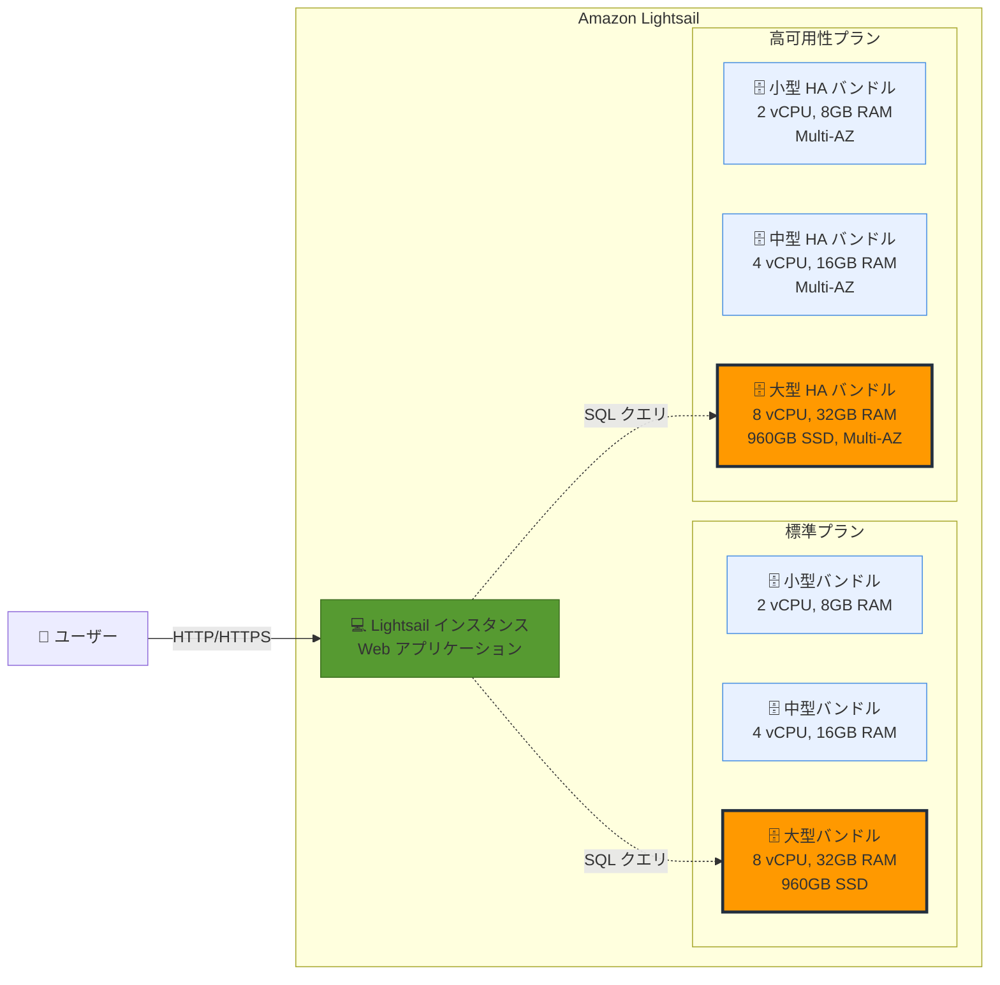

# Amazon Lightsail - より大きなマネージドデータベースバンドル

**リリース日**: 2026年1月9日
**サービス**: Amazon Lightsail
**機能**: より大きなマネージドデータベースバンドル

## 概要

Amazon Lightsail が、最大 8 vCPU、32GB メモリ、960GB SSD ストレージを持つ 2 つの大型データベースバンドルの提供を開始しました。これらの新しいバンドルは、標準プランと高可用性プランの両方で利用可能で、MySQL および PostgreSQL データベースを作成できます。

Amazon Lightsail は、事前設定された仮想プライベートサーバー、マネージドデータベース、その他のクラウドサービスを提供する、シンプルで使いやすいクラウドプラットフォームです。従来の Lightsail データベースバンドルは、小規模から中規模のアプリケーションには十分でしたが、データ集約型のワークロードやトラフィックが増加する本番環境には制約がありました。

今回のアップデートにより、より大規模なデータセットと多数の同時接続を処理する必要がある本番ワークロードにも対応できるようになります。E コマースプラットフォーム、コンテンツ管理システム、ビジネスインテリジェンスアプリケーション、SaaS 製品など、データ集約型のアプリケーションを Lightsail で実行できるようになりました。

**アップデート前の課題**

- Lightsail データベースの最大サイズでは、大規模なデータセットや高トラフィックのアプリケーションに対応できなかった
- データ集約型のワークロードを実行するには、より高価な RDS に移行する必要があった
- Lightsail のシンプルさを保ちながら、本番環境でスケールアップする選択肢が限られていた
- 成長するビジネスニーズに対応するため、他の AWS データベースサービスへの移行が必要になることがあった

**アップデート後の改善**

- 最大 8 vCPU、32GB メモリ、960GB SSD ストレージを持つ大型データベースバンドルが利用可能になった
- データ集約型のワークロードや本番環境でも、Lightsail のシンプルさと低価格を維持できるようになった
- E コマース、CMS、BI アプリケーション、SaaS 製品など、より大規模なアプリケーションに対応可能になった
- 成長するビジネスニーズに対応するため、Lightsail 内でスケールアップできる選択肢が増えた

## アーキテクチャ図



この図は、Lightsail の新しい大型データベースバンドルが標準プランと高可用性プランの両方で利用可能であることを示しています。アプリケーションは、ニーズに応じて適切なバンドルサイズを選択できます。

## サービスアップデートの詳細

### 主要機能

1. **大型データベースバンドルのスペック**
   - **vCPU**: 最大 8 vCPU (従来の最大から増強)
   - **メモリ**: 最大 32GB RAM (従来の最大から増強)
   - **ストレージ**: 最大 960GB SSD (従来の最大から増強)
   - **データベースエンジン**: MySQL (バージョン 5.7、8.0)、PostgreSQL (バージョン 11-16)

2. **標準プランと高可用性プラン**
   - **標準プラン**: 単一の Availability Zone にデータベースを配置
   - **高可用性プラン**: 異なる Availability Zone にプライマリとスタンバイデータベースを配置し、自動フェイルオーバーをサポート
   - 両方のプランで新しい大型バンドルが利用可能

3. **マネージド機能**
   - 自動バックアップとポイントインタイムリストア
   - 自動パッチ適用とメンテナンス
   - 自動スケーリング (スナップショットからより大きなバンドルに移行)
   - CloudWatch メトリクスによる監視

4. **データインポート制限**
   - バンドルサイズに応じたデータインポート制限
   - 大型バンドル (8 vCPU、32GB RAM): 最大 156GB のデータインポートが可能

## 技術仕様

### データベースバンドルサイズ一覧

| バンドル名 | vCPU | メモリ (GB) | ストレージ (GB) | データインポート制限 (GB) | 状態 |
|-----------|------|------------|--------------|---------------------|------|
| Micro | 1 | 1 | 40 | 10 | 既存 |
| Small | 1 | 2 | 80 | 20 | 既存 |
| Medium | 2 | 4 | 120 | 85 | 既存 |
| Large | 2 | 8 | 240 | 156 | 既存 |
| Xlarge | 4 | 16 | 480 | 156 | 既存 |
| 2Xlarge | 8 | 32 | 960 | 156 | **新規** |

※ 高可用性プランでは、すべてのバンドルサイズで Multi-AZ 構成が利用可能

### サポートされるデータベースエンジン

| データベースエンジン | サポートバージョン | 特徴 |
|-------------------|-----------------|------|
| MySQL | 5.7、8.0 | 広く使用されているオープンソース RDBMS |
| PostgreSQL | 11、12、13、14、15、16 | 高度な機能を持つオープンソース RDBMS |

### API 変更履歴

今回のアップデートでは、Lightsail の API 自体に変更はありません。既存の `CreateRelationalDatabase` API を使用して、新しい大型バンドルを指定できます。

## 設定方法

### 前提条件

1. AWS アカウントがあり、Lightsail を利用できる
2. データベースを配置するリージョンを決定している
3. MySQL または PostgreSQL のいずれかのデータベースエンジンを選択している

### 手順

#### ステップ1: Lightsail コンソールでデータベースを作成

```bash
# AWS CLI を使用してデータベースを作成 (2Xlarge バンドル)
aws lightsail create-relational-database \
  --relational-database-name my-large-database \
  --relational-database-blueprint-id postgres_16 \
  --relational-database-bundle-id 2xlarge_ha_2_0 \
  --master-database-name mydb \
  --master-username dbadmin \
  --master-user-password 'YourSecurePassword123!' \
  --availability-zone us-east-1a
```

このコマンドは、PostgreSQL 16 を使用した 2Xlarge 高可用性データベースを作成します。`2xlarge_ha_2_0` は高可用性プランの 2Xlarge バンドルを示します。

#### ステップ2: データベース接続情報を取得

```bash
# データベースの詳細情報を取得
aws lightsail get-relational-database \
  --relational-database-name my-large-database
```

このコマンドは、データベースのエンドポイント、ポート、ステータスなどの詳細情報を返します。

#### ステップ3: アプリケーションからデータベースに接続

```python
# Python (psycopg2) を使用した接続例
import psycopg2

connection = psycopg2.connect(
    host="database-endpoint.lightsail.aws.region.amazonaws.com",
    database="mydb",
    user="dbadmin",
    password="YourSecurePassword123!",
    port=5432
)

cursor = connection.cursor()
cursor.execute("SELECT version();")
print(cursor.fetchone())
```

このコードは、PostgreSQL データベースに接続し、バージョン情報を取得します。

## メリット

### ビジネス面

- **コスト効率**: RDS よりも低価格で、大規模なデータベースワークロードを実行可能
- **シンプルさの維持**: Lightsail のシンプルな UI と予測可能な料金体系を維持しながら、スケールアップ可能
- **ビジネス成長への対応**: アプリケーションの成長に合わせて、Lightsail 内でデータベースをスケールアップできる

### 技術面

- **高性能**: 8 vCPU、32GB RAM により、データ集約型のワークロードや多数の同時接続を処理可能
- **大容量ストレージ**: 960GB SSD ストレージにより、大規模なデータセットを保存可能
- **高可用性**: 高可用性プランでは、Multi-AZ 構成により自動フェイルオーバーをサポート
- **マネージド運用**: 自動バックアップ、パッチ適用、監視により、運用負荷を削減

## デメリット・制約事項

### 制限事項

- データインポート制限は最大 156GB (他の AWS データベースサービスと比較して制限がある)
- Lightsail データベースは Lightsail VPC 内に配置され、他の AWS VPC との直接接続には VPC ピアリングが必要
- データベースのスケールアップには、スナップショットからの再作成が必要 (ダウンタイムが発生)

### 考慮すべき点

- 大型バンドルは従来のバンドルよりも料金が高くなるため、コスト見積もりが必要
- 非常に大規模なデータセット (数 TB 以上) や高度な機能が必要な場合は、RDS への移行を検討する必要がある
- 高可用性プランは標準プランの約 2 倍の料金がかかるため、可用性要件を慎重に評価する必要がある

## ユースケース

### ユースケース1: E コマースプラットフォームのデータベース

**シナリオ**: 成長する E コマースプラットフォームで、商品カタログ、注文履歴、顧客情報を管理する大規模なデータベースが必要。

**実装例**:
```bash
# 高可用性プランで 2Xlarge MySQL データベースを作成
aws lightsail create-relational-database \
  --relational-database-name ecommerce-db \
  --relational-database-blueprint-id mysql_8_0 \
  --relational-database-bundle-id 2xlarge_ha_2_0 \
  --master-database-name ecommerce \
  --master-username admin \
  --master-user-password 'SecurePass456!'
```

**効果**: 大量の商品データと注文トランザクションを処理でき、高可用性プランにより、データベース障害時にも自動的にフェイルオーバーして可用性を維持できます。

### ユースケース2: SaaS アプリケーションのマルチテナントデータベース

**シナリオ**: SaaS アプリケーションで、複数の顧客のデータを管理する単一の大規模データベースが必要。

**実装例**:
```sql
-- PostgreSQL でマルチテナント構成を実装
CREATE SCHEMA tenant_001;
CREATE SCHEMA tenant_002;
CREATE SCHEMA tenant_003;

-- 各テナントのテーブルをスキーマに作成
CREATE TABLE tenant_001.users (
    id SERIAL PRIMARY KEY,
    username VARCHAR(100),
    email VARCHAR(255)
);
```

**効果**: 大型バンドルにより、多数のテナントのデータを単一のデータベースで管理でき、スキーマ分離によりデータのセキュリティと整合性を維持できます。

### ユースケース3: コンテンツ管理システム (CMS) の本番環境

**シナリオ**: WordPress や Drupal などの CMS を使用した大規模なメディアサイトで、記事、画像メタデータ、ユーザーコメントを管理するデータベースが必要。

**実装例**:
```bash
# 標準プランで 2Xlarge MySQL データベースを作成 (コスト最適化)
aws lightsail create-relational-database \
  --relational-database-name cms-db \
  --relational-database-blueprint-id mysql_8_0 \
  --relational-database-bundle-id 2xlarge_2_0 \
  --master-database-name wordpress \
  --master-username wpuser \
  --master-user-password 'WPSecure789!'

# スナップショットを定期的に作成してバックアップ
aws lightsail create-relational-database-snapshot \
  --relational-database-name cms-db \
  --relational-database-snapshot-name cms-db-snapshot-$(date +%Y%m%d)
```

**効果**: 大規模なコンテンツライブラリと多数の同時アクセスを処理でき、定期的なスナップショットにより、データの安全性を確保できます。

## 料金

Amazon Lightsail データベースは、シンプルで予測可能な料金体系を提供します。

### 料金体系

| バンドル名 | vCPU | メモリ (GB) | ストレージ (GB) | 標準プラン (月額) | 高可用性プラン (月額) |
|-----------|------|------------|--------------|----------------|-------------------|
| Micro | 1 | 1 | 40 | $15 | $30 |
| Small | 1 | 2 | 80 | $30 | $60 |
| Medium | 2 | 4 | 120 | $60 | $120 |
| Large | 2 | 8 | 240 | $115 | $230 |
| Xlarge | 4 | 16 | 480 | $230 | $460 |
| **2Xlarge (新規)** | **8** | **32** | **960** | **$460** | **$920** |

※ 上記は米国東部 (バージニア北部) リージョンの料金例です。実際の料金はリージョンにより異なります。

### 料金例

| 使用シナリオ | 月額料金 (概算) |
|------------|------------------|
| E コマースサイト (2Xlarge、高可用性) | $920 |
| SaaS アプリケーション (2Xlarge、標準) | $460 |
| CMS + バックアップストレージ (2Xlarge、標準 + 100GB スナップショット) | $460 + $10 = $470 |

※ 最初の 3 ヶ月間は無料トライアルが利用可能 (一部のリージョンおよびバンドルに制限あり)。

## 利用可能リージョン

Amazon Lightsail が利用可能なすべての AWS リージョンで、新しい大型データベースバンドルを利用できます。詳細は [Amazon Lightsail リージョンと Availability Zone](https://docs.aws.amazon.com/lightsail/latest/userguide/understanding-regions-and-availability-zones-in-amazon-lightsail.html) を参照してください。

## 関連サービス・機能

- **Amazon RDS**: より高度な機能やスケーラビリティが必要な場合は、RDS への移行を検討
- **Amazon Lightsail インスタンス**: データベースと連携する Web アプリケーションやアプリケーションサーバーを実行
- **Amazon Lightsail ロードバランサー**: 複数のインスタンスにトラフィックを分散し、高可用性を実現
- **Amazon Lightsail スナップショット**: データベースのバックアップと復元を簡単に実行

## 参考リンク

- [公式発表 (What's New)](https://aws.amazon.com/about-aws/whats-new/2026/01/larger-managed-database-bundles-lightsail/)
- [Amazon Lightsail 製品ページ](https://aws.amazon.com/lightsail/)
- [Amazon Lightsail 料金ページ](https://aws.amazon.com/lightsail/pricing/)
- [Lightsail データベースの作成と管理 (ドキュメント)](https://docs.aws.amazon.com/lightsail/latest/userguide/amazon-lightsail-databases.html)
- [データベース FAQ (ドキュメント)](https://docs.aws.amazon.com/lightsail/latest/userguide/amazon-lightsail-faq-databases.html)
- [高可用性データベース (ドキュメント)](https://docs.aws.amazon.com/lightsail/latest/userguide/amazon-lightsail-high-availability-databases.html)

## まとめ

Amazon Lightsail の新しい大型データベースバンドル (最大 8 vCPU、32GB メモリ、960GB SSD) により、データ集約型のワークロードや本番環境でも Lightsail のシンプルさと低価格を活用できるようになりました。E コマース、CMS、BI アプリケーション、SaaS 製品など、より大規模なアプリケーションに対応可能になり、成長するビジネスニーズに合わせて Lightsail 内でスケールアップできる選択肢が増えました。既存の Lightsail ユーザーは、スナップショットから新しい大型バンドルにアップグレードすることで、アプリケーションのパフォーマンスと容量を向上させることができます。
