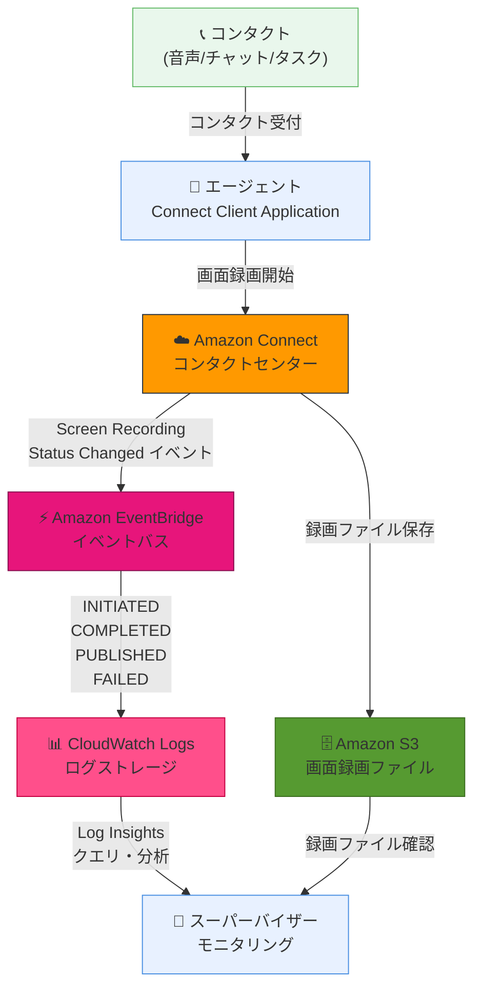

# Amazon Connect - エージェント画面録画ステータストラッキング

**リリース日**: 2026年1月12日
**サービス**: Amazon Connect
**機能**: エージェント画面録画ステータストラッキング

## 概要

Amazon Connect が、Amazon EventBridge を使用して CloudWatch でエージェント画面録画のステータスをほぼリアルタイムで表示できるようになりました。この機能により、スーパーバイザーは通話の音声やチャットトランスクリプトを確認するだけでなく、コンタクト処理中のエージェントの操作を視覚的に確認することで、より効果的なコーチングを提供できます。

従来の画面録画機能では、録画が正常に完了したかどうか、失敗した場合の原因など、録画プロセスのステータスをリアルタイムで把握することが困難でした。今回のアップデートにより、各エージェント画面録画の成功・失敗、失敗コード、クライアントバージョン、エージェントのウェブブラウザバージョン、OS 情報、録画開始・終了時刻などの詳細情報を CloudWatch から確認できるようになります。

この機能は、コールセンター運営の品質管理とトラブルシューティングを大幅に改善します。Amazon Connect が利用可能なすべての AWS リージョンで利用できます。

**アップデート前の課題**

- 画面録画の成功・失敗をリアルタイムで把握することができなかった
- 録画失敗時の原因特定が困難で、問題解決に時間がかかった
- エージェントのクライアント環境 (バージョン、ブラウザ、OS) を一元的に確認する手段がなかった
- 画面録画の運用状況を監視・分析するための統合されたログがなかった

**アップデート後の改善**

- EventBridge イベントを通じて画面録画のステータスをほぼリアルタイムで追跡できるようになった
- CloudWatch Logs に統合されたログから、録画の成功率や失敗原因を分析できるようになった
- エージェントのクライアント環境情報 (バージョン、ブラウザ、OS) を一元的に確認できるようになった
- CloudWatch Log Insights を使用して、録画ステータスの傾向分析や問題の早期発見が可能になった

## アーキテクチャ図



この図は、エージェントがコンタクトを処理する際に、画面録画のステータスが EventBridge を通じて CloudWatch Logs に記録される流れを示しています。スーパーバイザーは CloudWatch Log Insights を使用してリアルタイムで録画ステータスを監視できます。

## サービスアップデートの詳細

### 主要機能

1. **EventBridge イベント統合**
   - Amazon EventBridge の「Screen Recording Status Changed」イベントタイプをサブスクライブすることで、画面録画ステータスを追跡
   - EventBridge のデフォルトイベントバスにイベントが送信される
   - CloudWatch Logs をターゲットとして設定することで、ログの一元管理が可能

2. **4つのイベントステータス**
   - **INITIATED**: エージェントがコンタクトを受け入れた時に発行
   - **COMPLETED**: エージェントデスクトップで画面録画が終了した時に発行
   - **PUBLISHED**: 画面録画が Amazon S3 バケットに正常にアップロードされた時に発行
   - **FAILED**: 画面録画が失敗した時に発行 (失敗コードと説明を含む)

3. **詳細なメタデータ取得**
   - 各イベントには以下の情報が含まれる
     - 録画の成功・失敗ステータス
     - 失敗コードと説明
     - インストールされたクライアントのバージョン
     - エージェントのウェブブラウザバージョン
     - エージェントのオペレーティングシステム
     - 画面録画の開始時刻と終了時刻

4. **CloudWatch Log Insights によるクエリ**
   - 録画の成功率を計算
   - 各録画ステータスのカウント
   - 最も多い失敗コードを持つ失敗コンタクトの特定
   - 最も失敗が多いエージェントの特定

## 技術仕様

### イベント詳細

| 項目 | 詳細 |
|------|------|
| イベントソース | `aws.connect` |
| イベントタイプ | `Screen Recording Status Changed` |
| ターゲットサービス | Amazon CloudWatch Logs、Lambda、SNS など |
| イベント発行頻度 | ほぼリアルタイム |

### 画面録画の技術仕様

| 項目 | 詳細 |
|------|------|
| ファイル形式 | MP4 |
| コーデック | OpenH264 |
| フレームレート | 5 fps |
| 平均ファイルサイズ | 1.5MB/分 |
| 推奨帯域幅 | 500kbps/同時コンタクト |
| 最大画面数 | 3 画面/モニター |
| 対応コンタクトタイプ | 音声、チャット、タスク |

### API 変更履歴

今回のアップデートでは、API の変更はありません。既存の Amazon Connect API と EventBridge API を使用します。

## 設定方法

### 前提条件

1. Amazon Connect インスタンスで画面録画機能が有効化されている
2. エージェントが Amazon Connect Client Application バージョン 2.0.0 以降を使用している
3. Amazon S3 バケットが設定され、画面録画ファイルの保存先として指定されている
4. IAM ロールに EventBridge と CloudWatch Logs へのアクセス権限がある

### 手順

#### ステップ1: EventBridge ルールの作成

```bash
# AWS CLI を使用して EventBridge ルールを作成
aws events put-rule \
  --name connect-screen-recording-status \
  --event-pattern '{
    "source": ["aws.connect"],
    "detail-type": ["Screen Recording Status Changed"]
  }'
```

このコマンドは、Amazon Connect の画面録画ステータス変更イベントを捕捉する EventBridge ルールを作成します。

#### ステップ2: CloudWatch Logs をターゲットとして設定

```bash
# CloudWatch Logs ロググループを作成
aws logs create-log-group \
  --log-group-name /aws/events/connect-screen-recording

# EventBridge ルールのターゲットとして CloudWatch Logs を追加
aws events put-targets \
  --rule connect-screen-recording-status \
  --targets "Id"="1","Arn"="arn:aws:logs:REGION:ACCOUNT_ID:log-group:/aws/events/connect-screen-recording"
```

これらのコマンドは、CloudWatch Logs にロググループを作成し、EventBridge ルールからイベントを送信するように設定します。

#### ステップ3: CloudWatch Log Insights でクエリを実行

AWS マネジメントコンソールの CloudWatch Log Insights で以下のようなクエリを実行できます。

```sql
# 録画の成功率を計算
fields @timestamp, detail.status
| stats count() as total,
        sum(detail.status = 'PUBLISHED') as published
        by bin(5m)
| fields published / total * 100 as success_rate
```

このクエリは、5分間隔で画面録画の成功率を計算します。

## メリット

### ビジネス面

- **品質管理の向上**: 画面録画の成功・失敗をリアルタイムで監視することで、コンタクトセンターの品質管理を強化
- **問題の早期発見**: 録画失敗率が上昇した場合に迅速に対応でき、顧客体験への影響を最小化
- **コンプライアンス強化**: 録画が正常に完了していることを証跡として確認でき、コンプライアンス要件への対応が容易

### 技術面

- **統合ログ管理**: CloudWatch Logs に画面録画ステータスを集約することで、他の運用ログと統合分析が可能
- **自動化の促進**: EventBridge イベントをトリガーとして、Lambda 関数などを使用した自動化ワークフローを構築可能
- **トラブルシューティングの効率化**: 失敗コードとクライアント環境情報により、問題の根本原因を迅速に特定
- **傾向分析**: Log Insights を使用して、録画成功率の時系列変化やエージェント別の統計を分析可能

## デメリット・制約事項

### 制限事項

- 画面録画機能自体は Amazon Connect Client Application バージョン 2.0.0 以降が必要
- 画面録画は最大 3 画面/モニターまで対応
- 画面録画は CPU 負荷が高いため、エージェントのマシンスペックに配慮が必要

### 考慮すべき点

- EventBridge と CloudWatch Logs の利用に対して追加料金が発生する (イベント数とログ保存量に応じて)
- 大量のエージェントがいる場合、イベント数が増加するため、コスト見積もりが必要
- PII (個人識別情報) が画面に表示される場合、適切なマスキングやアクセス制御が必要

## ユースケース

### ユースケース1: 録画失敗率のリアルタイム監視

**シナリオ**: コンタクトセンター運営チームが、画面録画の失敗率を監視し、問題が発生した場合にアラートを受け取りたい。

**実装例**:
```sql
# CloudWatch Log Insights クエリ
fields @timestamp, detail.status, detail.failureCode
| filter detail.status = 'FAILED'
| stats count() as failure_count by detail.failureCode
| sort failure_count desc
```

さらに、CloudWatch アラームを設定して、失敗率が 5% を超えた場合に SNS 通知を送信します。

**効果**: 画面録画の問題を早期に発見し、エージェントのクライアント環境やネットワークの問題に迅速に対応できます。

### ユースケース2: エージェント別のクライアント環境監査

**シナリオ**: IT 部門が、エージェントが使用している Amazon Connect Client Application のバージョンを監査し、古いバージョンを使用しているエージェントを特定したい。

**実装例**:
```sql
# CloudWatch Log Insights クエリ
fields detail.agentARN, detail.clientVersion, detail.browserVersion, detail.operatingSystem
| stats latest(detail.clientVersion) as latest_client_version by detail.agentARN
| filter latest_client_version < "2.5.0"
```

**効果**: 古いクライアントバージョンを使用しているエージェントを特定し、アップデートを促すことで、セキュリティと機能の最新性を維持できます。

### ユースケース3: コンプライアンスレポートの自動生成

**シナリオ**: コンプライアンスチームが、月次で画面録画の成功率と失敗原因をレポートする必要がある。

**実装例**:
```python
# Lambda 関数で CloudWatch Logs Insights API を呼び出し
import boto3
from datetime import datetime, timedelta

logs_client = boto3.client('logs')

query = """
fields @timestamp, detail.status
| stats count() as total,
        sum(detail.status = 'PUBLISHED') as published,
        sum(detail.status = 'FAILED') as failed
"""

response = logs_client.start_query(
    logGroupName='/aws/events/connect-screen-recording',
    startTime=int((datetime.now() - timedelta(days=30)).timestamp()),
    endTime=int(datetime.now().timestamp()),
    queryString=query
)
```

**効果**: 自動化されたレポート生成により、コンプライアンスチームの作業負荷を削減し、定期的な監査要件に対応できます。

## 料金

この機能自体に追加料金はかかりませんが、以下のサービスの利用に対して料金が発生します。

### 料金体系

- **Amazon EventBridge**: カスタムイベントバスへの配信は無料 (デフォルトバス使用時)、ターゲットへの配信は $1.00/100万イベント
- **Amazon CloudWatch Logs**: ログの取り込み料金 $0.50/GB、ログの保存料金 $0.03/GB/月
- **Amazon S3**: 画面録画ファイルの保存料金 (Standard ストレージクラスで $0.023/GB/月)

### 料金例

| 使用量 | 月額料金 (概算) |
|--------|------------------|
| エージェント 100 人、1 日平均 50 コンタクト/人、月 22 営業日 (合計 110,000 イベント、録画ファイル 165GB) | EventBridge: $0.11、CloudWatch Logs: $87.45、S3: $3.80、合計: $91.36 |
| エージェント 500 人、1 日平均 50 コンタクト/人、月 22 営業日 (合計 550,000 イベント、録画ファイル 825GB) | EventBridge: $0.55、CloudWatch Logs: $437.25、S3: $18.98、合計: $456.78 |

※ 上記は東京リージョンの料金例です。実際の料金は使用状況により異なります。

## 利用可能リージョン

Amazon Connect が利用可能なすべての AWS リージョンで利用できます。詳細は [AWS リージョナルサービス一覧](https://docs.aws.amazon.com/general/latest/gr/connect_region.html) を参照してください。

## 関連サービス・機能

- **Amazon Connect Contact Lens**: リアルタイム分析とコンタクト後分析により、顧客とエージェントの会話を分析
- **Amazon EventBridge**: イベント駆動型のアプリケーション統合を実現し、画面録画ステータス以外の Connect イベントも処理可能
- **Amazon CloudWatch Logs**: 統合ログ管理により、画面録画ステータスだけでなく、他の運用ログも一元管理
- **AWS Lambda**: EventBridge イベントをトリガーとして、自動化ワークフローを構築可能

## 参考リンク

- [公式発表 (What's New)](https://aws.amazon.com/about-aws/whats-new/2026/01/amazon-connect-agent-screen-recording-status-tracking)
- [EventBridge イベントによるステータストラッキング (ドキュメント)](https://docs.aws.amazon.com/connect/latest/adminguide/track-screen-recording-status.html)
- [画面録画のセットアップとレビュー (ドキュメント)](https://docs.aws.amazon.com/connect/latest/adminguide/agent-screen-recording.html)
- [画面録画 FAQ (ドキュメント)](https://docs.aws.amazon.com/connect/latest/adminguide/faq-screenrecording.html)
- [Amazon Connect 料金ページ](https://aws.amazon.com/connect/pricing/)

## まとめ

Amazon Connect のエージェント画面録画ステータストラッキング機能により、コンタクトセンターの運営チームは画面録画の成功・失敗をリアルタイムで監視し、問題を早期に発見できるようになりました。EventBridge と CloudWatch Logs の統合により、ログの一元管理と傾向分析が可能になり、コンプライアンス要件への対応も容易になります。画面録画機能を既に使用している場合は、EventBridge イベントをサブスクライブして、運用監視を強化することをお勧めします。
