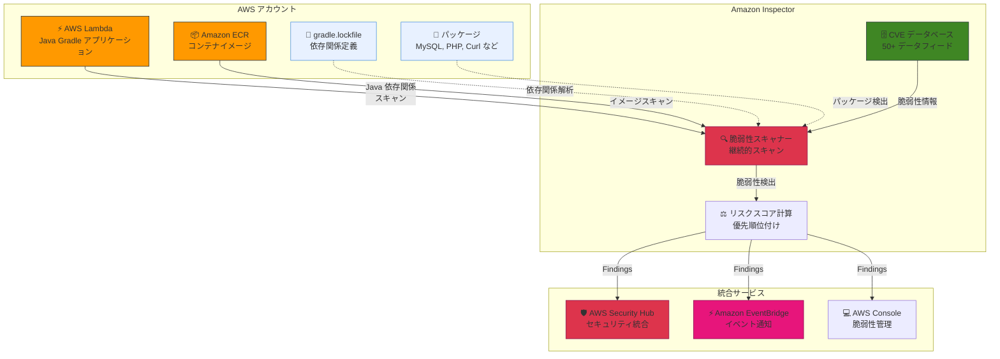

# Amazon Inspector - Java Gradle サポートとエコシステム拡張

**リリース日**: 2026年1月12日
**サービス**: Amazon Inspector
**機能**: Java Gradle サポートおよびエコシステムカバレッジ拡張

## 概要

Amazon Inspector の Lambda 関数と Elastic Container Registry (ECR) イメージのスキャン機能が、Java Gradle のインベントリおよび脆弱性スキャンに対応しました。また、MySQL、MariaDB、PHP、Jenkins-core、7zip (Windows)、Elasticsearch、Curl/LibCurl のカバレッジも追加され、より広範なアプリケーションと環境における脆弱性と設定ミスを検出できるようになりました。

Amazon Inspector は、AWS ワークロードをソフトウェアの脆弱性と意図しないネットワーク露出について継続的にスキャンする自動脆弱性管理サービスです。組織がセキュリティ態勢を改善し、コンプライアンス要件を満たすことを支援します。

今回のアップデートにより、Java Gradle で構築されたアプリケーションの依存関係を gradle.lockfile の内容に基づいてスキャンし、包括的な脆弱性評価を提供できるようになります。また、パッケージマネージャー外でインストールされたパッケージの脆弱性をより正確に検出できるようになり、セキュリティカバレッジが大幅に向上します。

**アップデート前の課題**

- Java Gradle プロジェクトの依存関係を Amazon Inspector で自動的にスキャンできなかった
- MySQL、MariaDB、PHP、Jenkins-core、7zip、Elasticsearch、Curl/LibCurl などのパッケージの脆弱性が検出されなかった
- パッケージマネージャー外でインストールされたパッケージの脆弱性検出が不十分だった
- Lambda 関数や ECR イメージで使用される一般的なツールやライブラリの脆弱性を見逃すリスクがあった

**アップデート後の改善**

- Java Gradle プロジェクトの依存関係を gradle.lockfile から自動的に検出し、脆弱性スキャンが可能になった
- MySQL、MariaDB、PHP、Jenkins-core、7zip、Elasticsearch、Curl/LibCurl の脆弱性を検出できるようになった
- パッケージマネージャー外でインストールされたパッケージも含めた包括的な脆弱性評価が可能になった
- Lambda 関数や ECR イメージのセキュリティカバレッジが大幅に向上した

## アーキテクチャ図



この図は、Amazon Inspector が Lambda 関数と ECR イメージをスキャンし、Java Gradle の依存関係や各種パッケージの脆弱性を検出する流れを示しています。検出された脆弱性は Security Hub や EventBridge に統合されます。

## サービスアップデートの詳細

### 主要機能

1. **Java Gradle サポート**
   - gradle.lockfile の内容に基づいて Java 依存関係をスキャン
   - Maven と並んで主要な Java ビルドツールの Gradle に対応
   - Lambda 関数と ECR イメージの両方でサポート
   - 依存関係の脆弱性を自動的に検出し、CVE 情報を提供

2. **エコシステムカバレッジの拡張**
   - **MySQL**: MySQL データベースクライアント/サーバーの脆弱性検出
   - **MariaDB**: MariaDB データベースクライアント/サーバーの脆弱性検出
   - **PHP**: PHP ランタイムとエクステンションの脆弱性検出
   - **Jenkins-core**: Jenkins コアコンポーネントの脆弱性検出
   - **7zip (Windows)**: Windows 環境での 7zip アーカイブツールの脆弱性検出
   - **Elasticsearch**: Elasticsearch クライアント/サーバーの脆弱性検出
   - **Curl/LibCurl**: HTTP クライアントライブラリの脆弱性検出

3. **パッケージマネージャー外のパッケージ検出**
   - システムパッケージマネージャーを経由せずにインストールされたパッケージも検出
   - バイナリやソースからビルドされたパッケージの脆弱性も特定
   - より正確で包括的なセキュリティカバレッジを実現

4. **継続的な自動スキャン**
   - Lambda 関数のデプロイ時、更新時、新しい CVE 公開時に自動スキャン
   - ECR イメージのプッシュ時および継続的なスキャン
   - スキャン結果はほぼリアルタイムで提供

## 技術仕様

### サポートされる言語とパッケージマネージャー

| 言語/ツール | パッケージマネージャー/形式 | サポート内容 |
|------------|------------------------|------------|
| Java | Maven (pom.xml) | 既存サポート |
| Java | **Gradle (gradle.lockfile)** | **新規追加** |
| Python | pip (requirements.txt) | 既存サポート |
| JavaScript/Node.js | npm, yarn | 既存サポート |
| Go | go.mod | 既存サポート |
| Ruby | bundler | 既存サポート |
| C# | NuGet | 既存サポート |
| Rust | Cargo | 既存サポート |

### 新規追加されたパッケージカバレッジ

| パッケージ | 対象環境 | 検出内容 |
|-----------|---------|---------|
| **MySQL** | Linux, Windows | クライアント/サーバーの脆弱性 |
| **MariaDB** | Linux, Windows | クライアント/サーバーの脆弱性 |
| **PHP** | Linux, Windows | ランタイムとエクステンションの脆弱性 |
| **Jenkins-core** | Linux, Windows | Jenkins コアの脆弱性 |
| **7zip** | Windows のみ | アーカイブツールの脆弱性 |
| **Elasticsearch** | Linux, Windows | クライアント/サーバーの脆弱性 |
| **Curl/LibCurl** | Linux, Windows | HTTP クライアントライブラリの脆弱性 |

### API 変更履歴

今回のアップデートでは、Inspector の API 自体に変更はありません。既存の Inspector API を使用して、新しく追加されたパッケージタイプの脆弱性情報を取得できます。

## 設定方法

### 前提条件

1. Amazon Inspector がアカウントで有効化されている
2. Lambda 関数スキャンまたは ECR スキャンが有効化されている
3. IAM ロールに Inspector へのアクセス権限がある

### 手順

#### ステップ1: Amazon Inspector の有効化

```bash
# AWS CLI を使用して Amazon Inspector を有効化
aws inspector2 enable \
  --resource-types LAMBDA ECR
```

このコマンドは、Lambda 関数と ECR リポジトリの Inspector スキャンを有効化します。既に有効化されている場合はスキップできます。

#### ステップ2: Java Gradle プロジェクトのデプロイ

Java Gradle プロジェクトを Lambda にデプロイする際、gradle.lockfile を含めることで、Inspector が依存関係を自動的にスキャンします。

```bash
# Gradle プロジェクトのビルド
./gradlew build

# Lambda 関数のデプロイ (gradle.lockfile を含む)
aws lambda update-function-code \
  --function-name my-gradle-function \
  --zip-file fileb://build/distributions/my-gradle-function.zip
```

gradle.lockfile がパッケージに含まれていることを確認してください。Inspector は自動的にこのファイルを検出し、依存関係をスキャンします。

#### ステップ3: スキャン結果の確認

```bash
# Inspector の Findings を確認
aws inspector2 list-findings \
  --filter-criteria '{"resourceType":[{"comparison":"EQUALS","value":"AWS_LAMBDA_FUNCTION"}]}'
```

このコマンドは、Lambda 関数に関連するすべての脆弱性 Findings を一覧表示します。新しく追加された Gradle 依存関係や MySQL、PHP などのパッケージの脆弱性も含まれます。

## メリット

### ビジネス面

- **リスクの可視化**: Java Gradle プロジェクトや一般的なツール (MySQL、PHP など) の脆弱性を自動的に検出し、リスクを可視化
- **コンプライアンス対応**: 包括的な脆弱性管理により、セキュリティコンプライアンス要件への対応が容易
- **セキュリティ態勢の向上**: より広範なパッケージとツールをカバーすることで、全体的なセキュリティ態勢を向上

### 技術面

- **Gradle プロジェクトの自動スキャン**: gradle.lockfile を使用することで、Gradle プロジェクトの依存関係を自動的にスキャン
- **包括的なカバレッジ**: パッケージマネージャー外でインストールされたパッケージも検出し、セキュリティの盲点を削減
- **統合された脆弱性管理**: Security Hub や EventBridge との統合により、既存のセキュリティワークフローに組み込みが容易
- **優先順位付け**: Inspector リスクスコアにより、CVE 情報とネットワークアクセスに基づいて脆弱性の優先順位を自動的に決定

## デメリット・制約事項

### 制限事項

- Java Gradle サポートは gradle.lockfile の存在が必要 (lockfile が生成されていないプロジェクトはスキャンされない)
- Inspector のスキャンは Lambda 関数と ECR イメージに限定 (EC2 インスタンス上の Gradle プロジェクトは別のスキャン方法でカバー)
- 検出される脆弱性は公開された CVE データベースに基づくため、ゼロデイ脆弱性は検出されない

### 考慮すべき点

- gradle.lockfile を生成するには、Gradle プロジェクトで依存関係ロックを有効化する必要がある (`gradle dependencies --write-locks`)
- スキャン結果に多数の Findings が表示される場合があるため、リスクスコアに基づいて優先順位付けが重要
- Inspector の料金は Lambda 関数と ECR イメージのスキャン数に応じて課金される

## ユースケース

### ユースケース1: Java Gradle マイクロサービスの脆弱性管理

**シナリオ**: Java Gradle で構築されたマイクロサービスを Lambda にデプロイし、依存関係の脆弱性を継続的に監視したい。

**実装例**:
```bash
# Gradle プロジェクトで依存関係ロックを生成
./gradlew dependencies --write-locks

# Lambda にデプロイ (gradle.lockfile を含む)
./gradlew build
aws lambda update-function-code \
  --function-name my-microservice \
  --zip-file fileb://build/distributions/my-microservice.zip

# Inspector が自動的にスキャンを開始
# Security Hub で脆弱性を確認
aws securityhub get-findings \
  --filters '{"ProductName":[{"Value":"Inspector","Comparison":"EQUALS"}]}'
```

**効果**: Gradle プロジェクトの依存関係の脆弱性を自動的に検出し、開発チームは新しい CVE が公開された際にも迅速に対応できます。

### ユースケース2: コンテナイメージの包括的なセキュリティスキャン

**シナリオ**: ECR にプッシュされたコンテナイメージに MySQL クライアントや Curl が含まれており、これらのパッケージの脆弱性も検出したい。

**実装例**:
```dockerfile
# Dockerfile
FROM amazoncorretto:17
RUN yum install -y mysql curl
COPY build/libs/myapp.jar /app/myapp.jar
CMD ["java", "-jar", "/app/myapp.jar"]
```

```bash
# コンテナイメージのビルドとプッシュ
docker build -t myapp:latest .
docker tag myapp:latest 123456789012.dkr.ecr.us-east-1.amazonaws.com/myapp:latest
docker push 123456789012.dkr.ecr.us-east-1.amazonaws.com/myapp:latest

# Inspector が自動的にイメージをスキャン
# MySQL と Curl の脆弱性も検出される
```

**効果**: Java アプリケーションだけでなく、イメージに含まれる MySQL クライアントや Curl の脆弱性も自動的に検出され、包括的なセキュリティカバレッジを実現できます。

### ユースケース3: CI/CD パイプラインでの脆弱性チェック

**シナリオ**: CI/CD パイプラインで Lambda 関数をデプロイする際、Inspector のスキャン結果に基づいて Critical な脆弱性がある場合はデプロイをブロックしたい。

**実装例**:
```yaml
# GitHub Actions ワークフロー
name: Deploy Lambda Function
on:
  push:
    branches: [main]

jobs:
  deploy:
    runs-on: ubuntu-latest
    steps:
      - name: Checkout code
        uses: actions/checkout@v3

      - name: Build and deploy
        run: |
          ./gradlew build
          aws lambda update-function-code \
            --function-name my-function \
            --zip-file fileb://build/distributions/my-function.zip

      - name: Wait for Inspector scan
        run: sleep 300

      - name: Check for critical vulnerabilities
        run: |
          CRITICAL_COUNT=$(aws inspector2 list-findings \
            --filter-criteria '{"severity":[{"comparison":"EQUALS","value":"CRITICAL"}]}' \
            --query 'length(findings)' --output text)
          if [ "$CRITICAL_COUNT" -gt 0 ]; then
            echo "Critical vulnerabilities found: $CRITICAL_COUNT"
            exit 1
          fi
```

**効果**: CI/CD パイプラインに脆弱性チェックを統合することで、Critical な脆弱性を持つコードが本番環境にデプロイされるのを防ぎます。

## 料金

Amazon Inspector の料金は、スキャンするリソースの数と種類に基づいて課金されます。

### 料金体系

- **Lambda 関数スキャン (標準スキャン)**: $0.30/関数/月 (最初の 3,000 関数)、$0.15/関数/月 (3,000 関数超)
- **Lambda コードスキャン**: $0.50/関数/月 (コードの脆弱性スキャン、オプション)
- **ECR イメージスキャン**: $0.09/イメージ/月 (最初のスキャン)、再スキャンは無料

### 料金例

| 使用量 | 月額料金 (概算) |
|--------|------------------|
| Lambda 関数 100 個 (標準スキャンのみ) | $30.00 |
| Lambda 関数 100 個 (標準スキャン + コードスキャン) | $80.00 |
| ECR イメージ 50 個 (継続的スキャン) | $4.50 |
| Lambda 関数 5,000 個 (標準スキャンのみ) | $1,200.00 |

※ 上記は東京リージョンの料金例です。実際の料金は使用状況により異なります。

## 利用可能リージョン

Amazon Inspector が利用可能なすべての AWS リージョンで、今回のアップデートを即座に利用できます。詳細は [AWS リージョナルサービス一覧](https://aws.amazon.com/about-aws/global-infrastructure/regional-product-services/) を参照してください。

## 関連サービス・機能

- **AWS Security Hub**: Inspector の Findings を統合し、一元的なセキュリティ管理を実現
- **Amazon EventBridge**: Inspector の Findings をトリガーとして、自動化ワークフローを構築
- **AWS Lambda**: Inspector によりスキャンされるサーバーレス関数の実行環境
- **Amazon ECR**: Inspector によりスキャンされるコンテナイメージのレジストリ
- **AWS Systems Manager**: EC2 インスタンスのパッチ管理と Inspector の統合

## 参考リンク

- [公式発表 (What's New)](https://aws.amazon.com/about-aws/whats-new/2026/01/amazon-inspector-java-gradle-ecosystem/)
- [Amazon Inspector 製品ページ](https://aws.amazon.com/inspector/)
- [サポートされる OS とプログラミング言語 (ドキュメント)](https://docs.aws.amazon.com/inspector/latest/user/supported.html)
- [ECR コンテナイメージスキャン (ドキュメント)](https://docs.aws.amazon.com/inspector/latest/user/scanning-ecr.html)
- [Lambda の脆弱性スキャン (ドキュメント)](https://docs.aws.amazon.com/lambda/latest/dg/governance-code-scanning.html)

## まとめ

Amazon Inspector の Java Gradle サポートとエコシステムカバレッジの拡張により、より広範なアプリケーションとパッケージの脆弱性を自動的に検出できるようになりました。Java Gradle プロジェクトを使用している開発チームは、gradle.lockfile を含めることで、依存関係の脆弱性を継続的に監視できます。また、MySQL、PHP、Curl などの一般的なツールやライブラリの脆弱性も検出されるため、Lambda 関数や ECR イメージのセキュリティカバレッジが大幅に向上します。Inspector を有効化し、CI/CD パイプラインに統合することで、セキュアな開発ライフサイクルを実現できます。
