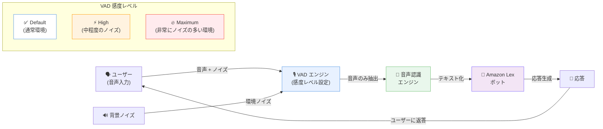

# Amazon Lex - 音声アクティビティ検出感度の設定機能

**リリース日**: 2026年01月12日
**サービス**: Amazon Lex
**機能**: 音声アクティビティ検出 (VAD) の感度レベル設定

## 概要

Amazon Lex が、各ボットロケールに対して音声アクティビティ検出 (Voice Activity Detection: VAD) の感度レベルを設定できる機能を追加しました。この機能により、Default、High、Maximum の 3 つの感度レベルから選択し、異なるノイズ環境に応じた最適な音声認識を実現できます。

Amazon Lex は、開発者が会話型ボットを構築するためのサービスです。VAD 技術は、音声と背景ノイズを区別することで音声認識の精度を最適化します。今回のアップデートにより、オフィス、小売店、製造現場、建設現場、屋外など、さまざまなノイズ環境に対応した柔軟な音声認識設定が可能になりました。

**アップデート前の課題**

- VAD の感度レベルが固定されており、環境に応じた調整ができなかった
- ノイズの多い環境では音声認識の精度が低下し、ユーザー体験が悪化していた
- 製造現場や建設現場などの非常にノイズの多い環境でのボット利用が困難だった
- 環境ごとに最適化された音声認識設定を適用できなかった

**アップデート後の改善**

- Default、High、Maximum の 3 つの VAD 感度レベルから環境に応じて選択可能
- Amazon Connect の Conversational AI デザイナーでボットロケールを作成または更新する際に VAD 感度を設定できる
- ノイズの多い環境でも高精度な音声認識を実現
- 各ボットロケールごとに異なる感度レベルを設定可能

## アーキテクチャ図



VAD エンジンが設定された感度レベルに基づいて音声と背景ノイズを区別し、音声のみを音声認識エンジンに渡します。感度レベルが高いほど、ノイズの多い環境でも音声を正確に検出できます。

## サービスアップデートの詳細

### 主要機能

1. **3 つの VAD 感度レベル**
   - **Default**: 通常のバックグラウンドノイズレベルを持つ環境に適している
   - **High**: オフィスや小売店など、一貫した中程度のノイズレベルを持つ環境向け
   - **Maximum**: 製造現場、建設現場、屋外など、非常にノイズの多い環境に最高の耐性を提供

2. **ボットロケールごとの設定**
   - 各ボットロケール (言語設定) に対して個別に VAD 感度を設定可能
   - 異なる地域や用途に応じて最適な感度レベルを適用できる
   - 1 つのボットで複数の感度設定を使い分けることが可能

3. **Amazon Connect との統合**
   - Amazon Connect の Conversational AI デザイナーで VAD 感度を設定
   - ボットロケールを作成または更新する際に感度レベルを選択
   - Amazon Connect のコンタクトセンターソリューションとシームレスに連携

## 技術仕様

### VAD 感度レベルの詳細

| 感度レベル | 対象環境 | 使用例 |
|-----------|---------|-------|
| Default | 通常のバックグラウンドノイズレベル | 静かなオフィス、自宅、コールセンター |
| High | 一貫した中程度のノイズレベル | 繁忙なオフィス、小売店、カフェ、公共施設 |
| Maximum | 非常にノイズの多い環境 | 製造現場、建設現場、屋外、空港、駅 |

### 設定方法

VAD 感度は以下の方法で設定できます:
- Amazon Connect の Conversational AI デザイナー (コンソール)
- AWS CLI (`CreateBotLocale`、`UpdateBotLocale` API)
- AWS SDK (`speechDetectionSensitivity` パラメータ)

## 設定方法

### 前提条件

1. Amazon Lex ボットが作成されている
2. Amazon Connect が Lex と統合されている (Conversational AI デザイナーを使用する場合)
3. 必要な IAM 権限が付与されている

### 手順

#### ステップ1: Amazon Connect Conversational AI デザイナーにアクセス

Amazon Connect コンソールから Conversational AI デザイナーを開きます。

#### ステップ2: ボットロケールを選択または作成

VAD 感度を設定したいボットとロケール (言語) を選択するか、新しいボットロケールを作成します。

#### ステップ3: VAD 感度レベルを設定

Speech detection sensitivity セクションで、Default、High、または Maximum のいずれかの感度レベルを選択します。

#### ステップ4: 設定を保存

設定を保存し、ボットロケールを更新します。

#### AWS CLI を使用した設定例

```bash
aws lexv2-models update-bot-locale \
  --bot-id <bot-id> \
  --bot-version DRAFT \
  --locale-id en_US \
  --speech-detection-sensitivity HighNoiseTolerance
```

このコマンドは、指定したボットロケールの VAD 感度を High (HighNoiseTolerance) に設定します。

## メリット

### ビジネス面

- **顧客満足度の向上**: ノイズの多い環境でも正確な音声認識により、ユーザー体験が向上
- **適用範囲の拡大**: 製造現場や建設現場など、これまで困難だった環境でもボットを利用可能
- **オペレーション効率の改善**: 環境に最適化された音声認識により、再入力や誤認識の削減

### 技術面

- **柔軟な設定**: 各ボットロケールごとに最適な感度レベルを適用可能
- **簡単な設定**: コンソールまたは API を通じて簡単に VAD 感度を設定
- **Amazon Connect との統合**: Conversational AI デザイナーでシームレスに設定可能

## デメリット・制約事項

### 制限事項

- 感度レベルを高くすると、音声と誤認識する可能性のあるノイズも検出される場合がある
- 過度に高い感度レベルは、環境によっては逆効果になる可能性がある
- 既存のボットロケールを更新する必要がある (自動的には適用されない)

### 考慮すべき点

- 環境に応じて最適な感度レベルをテストして決定する必要がある
- Default から始めて、必要に応じて High または Maximum に調整することを推奨
- 感度レベルの変更後、実際の環境でテストしてパフォーマンスを監視することが重要

## ユースケース

### ユースケース1: 製造現場での作業指示ボット

**シナリオ**: 製造現場の作業員が、機械の稼働音が常に聞こえる環境で音声ボットを使用して作業指示を受け取る。

**実装例**:
1. Amazon Lex で作業指示ボットを作成
2. ボットロケールの VAD 感度を Maximum に設定
3. 作業員がヘッドセットを使用してボットと対話
4. ボットが製造現場のノイズをフィルタリングし、作業員の音声を正確に認識

**効果**: 製造現場のノイズの多い環境でも、作業員がスムーズにボットと対話でき、作業効率が向上する。

### ユースケース2: 小売店での顧客サポートボット

**シナリオ**: 小売店のカスタマーサービスキオスクで、顧客が製品情報や店舗案内を音声で問い合わせる。

**実装例**:
1. Amazon Lex で顧客サポートボットを作成
2. ボットロケールの VAD 感度を High に設定
3. キオスクに設置されたマイクで顧客の音声を取得
4. ボットが店内の BGM や他の顧客の会話をフィルタリングし、顧客の問い合わせを正確に認識

**効果**: 繁忙な小売店内でも、顧客がストレスなく音声でサポートを受けられ、顧客満足度が向上する。

### ユースケース3: コールセンターでのセルフサービスボット

**シナリオ**: コールセンターのセルフサービスシステムで、顧客が電話を通じてアカウント情報の確認や予約変更を行う。

**実装例**:
1. Amazon Lex でセルフサービスボットを作成
2. ボットロケールの VAD 感度を Default に設定
3. 顧客が電話から音声で問い合わせ
4. ボットが通常の通話品質で顧客の音声を認識し、適切な応答を提供

**効果**: 静かな環境での通話に最適化され、顧客がスムーズにセルフサービスを利用でき、コールセンターのオペレーターの負荷が軽減される。

## 料金

VAD 感度設定機能は、Amazon Lex の標準料金に含まれており、追加料金は発生しません。通常の Amazon Lex の料金体系が適用されます。

### 料金例

Amazon Lex の料金は、音声またはテキストのリクエスト数に基づいて計算されます。詳細は [Amazon Lex 料金ページ](https://aws.amazon.com/lex/pricing/) を参照してください。

## 利用可能リージョン

この機能は、Amazon Connect と Lex が稼働しているすべての AWS 商用リージョンで利用可能です。詳細なリージョンリストは [AWS リージョンとサービス](https://aws.amazon.com/about-aws/global-infrastructure/regional-product-services/) を参照してください。

## 関連サービス・機能

- **Amazon Connect**: Amazon Lex と統合してコンタクトセンターソリューションを提供するサービス
- **Amazon Transcribe**: 音声をテキストに変換するサービス。Lex と連携して音声認識を強化
- **AWS Lambda**: Lex ボットのバックエンド処理を実装するためのサーバーレスコンピューティングサービス

## 参考リンク

- [公式発表 (What's New)](https://aws.amazon.com/about-aws/whats-new/2026/01/amazon-lex-configurable-voice-activity-detection-sensitivity/)
- [ドキュメント - VAD 感度の設定](https://docs.aws.amazon.com/lexv2/latest/dg/customizing-speech-vad-sensitivity.html)
- [Amazon Connect セルフサービス](https://aws.amazon.com/connect/self-service/)
- [Amazon Lex 料金ページ](https://aws.amazon.com/lex/pricing/)

## まとめ

Amazon Lex の音声アクティビティ検出感度設定機能は、さまざまなノイズ環境に対応した柔軟な音声認識を実現する重要なアップデートです。製造現場、小売店、コールセンターなど、異なる環境で最適な音声認識を提供することで、ユーザー体験を向上させ、ボットの適用範囲を拡大できます。Amazon Lex を使用してコンタクトセンターやセルフサービスボットを構築している組織は、この機能を活用して環境に応じた最適な音声認識設定を適用することを推奨します。
