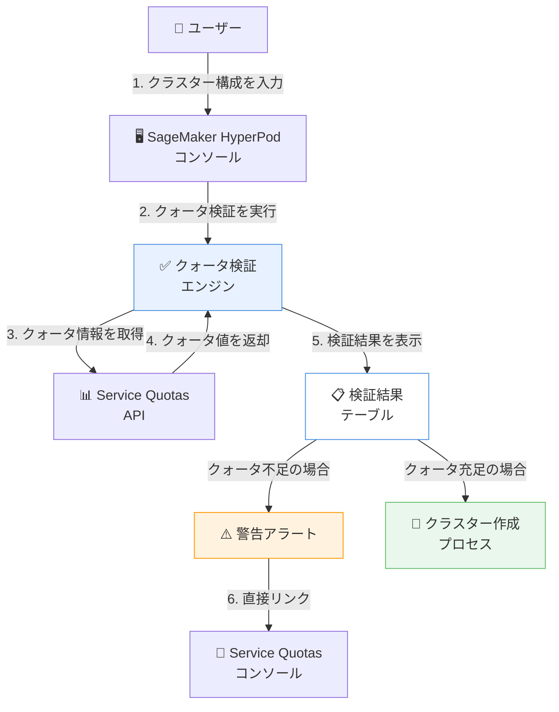

# Amazon SageMaker HyperPod - サービスクォータ検証機能

**リリース日**: 2026年01月12日
**サービス**: Amazon SageMaker HyperPod
**機能**: クラスター作成前のサービスクォータ自動検証

## 概要

Amazon SageMaker HyperPod コンソールが、クラスター作成を開始する前に AWS アカウントのサービスクォータを検証する機能を追加しました。この機能により、プロビジョニングを開始する前に十分なクォータが利用可能であることを確認できます。SageMaker HyperPod は、大規模言語モデル (LLM)、拡散モデル、基盤モデル (FM) などの最先端モデルを開発するための AI/ML ワークロード実行用に、耐障害性のあるクラスターをプロビジョニングするためのサービスです。

大規模な AI/ML クラスターを作成する際には、インスタンス、ストレージ、ネットワークリソースに対する十分なクォータがアカウントにあることを確認する必要があります。新しいクォータ検証機能により、クラスター作成の失敗を事前に防ぎ、時間の無駄を削減できます。

**アップデート前の課題**

- クォータの検証には複数の AWS サービスにわたる手動チェックが必要だった
- クォータ上限の増加リクエストを忘れた場合、クラスター作成の試行が失敗していた
- 失敗後に問題を特定し、クォータ増加をリクエストして再試行する必要があり、時間が無駄になっていた
- インスタンスタイプの制限、EBS ボリュームサイズ、VPC 関連のクォータを個別に確認する必要があった

**アップデート後の改善**

- SageMaker HyperPod コンソールがアカウントレベルのクォータをクラスター構成に対して自動的にチェックする
- 予想される使用率、適用されたクォータ値、各クォータのコンプライアンスステータスを示す明確な表が表示される
- クォータを超過する可能性がある場合、Service Quotas コンソールへの直接リンク付きで警告アラートを受け取る
- クラスター作成前にクォータの問題を解決できるため、失敗したプロビジョニング試行を回避できる

## アーキテクチャ図

クォータ検証エンジンが Service Quotas API を呼び出してアカウントのクォータ情報を取得し、クラスター構成と照合して検証結果を表示します。クォータ不足が検出された場合は、警告アラートと共に Service Quotas コンソールへの直接リンクが提供されます。

## サービスアップデートの詳細

### 主要機能

1. **自動クォータ検証**
   - クラスター作成を開始する前にアカウントレベルのクォータを自動的にチェック
   - インスタンスタイプの制限、EBS ボリュームサイズ、VPC 関連のクォータを検証
   - 新しいリソースを作成する際のクォータ要件を評価

2. **検証結果の可視化**
   - 予想される使用率、適用されたクォータ値、各クォータのコンプライアンスステータスを示す明確な表を表示
   - どのクォータが不足しているか、どのクォータが十分かを一目で確認可能
   - クラスター構成に必要なすべてのクォータを包括的に表示

3. **警告アラートと直接リンク**
   - クォータを超過する可能性がある場合、警告アラートを表示
   - Service Quotas コンソールへの直接リンクを提供し、増加リクエストを簡単に実行可能
   - クォータ増加が必要な項目を明確に識別

## 技術仕様

### 検証対象のクォータ

| クォータタイプ | 詳細 |
|--------------|------|
| インスタンスタイプの制限 | 選択したインスタンスタイプの利用可能数を検証 |
| EBS ボリュームサイズ | クラスターに必要な EBS ストレージ容量を検証 |
| VPC 関連のクォータ | VPC リソース (ENI、セキュリティグループなど) の制限を検証 |
| 新規リソース作成時のクォータ | 新しいリソースを作成する際に必要なクォータを検証 |

### 対応リージョン

Amazon SageMaker HyperPod がサポートされているすべての AWS リージョンで利用可能。

## 設定方法

### 前提条件

1. AWS アカウントに SageMaker HyperPod へのアクセス権限がある
2. クラスターを作成する AWS リージョンで SageMaker HyperPod が利用可能である
3. 必要な IAM 権限が付与されている

### 手順

#### ステップ1: SageMaker HyperPod コンソールにアクセス

AWS Management Console から Amazon SageMaker HyperPod コンソールを開きます。

#### ステップ2: クラスター構成を入力

新しいクラスターを作成する際に、インスタンスタイプ、ノード数、ストレージ構成などのクラスター設定を入力します。

#### ステップ3: クォータ検証結果を確認

コンソールが自動的にクォータ検証を実行し、検証結果の表を表示します。各クォータの使用状況とコンプライアンスステータスを確認します。

#### ステップ4: 必要に応じてクォータ増加をリクエスト

クォータ不足が検出された場合、警告アラート内の直接リンクから Service Quotas コンソールにアクセスし、必要なクォータの増加をリクエストします。

#### ステップ5: クラスター作成を続行

すべてのクォータが十分である場合、クラスター作成プロセスを続行します。

## メリット

### ビジネス面

- **時間の節約**: クラスター作成の失敗を事前に防ぎ、再試行にかかる時間を削減
- **計画の改善**: クォータ要件を事前に把握することで、プロジェクトの計画とリソース管理が向上
- **生産性の向上**: クォータの問題を早期に解決できるため、AI/ML プロジェクトの開始を迅速化

### 技術面

- **包括的な検証**: インスタンス、ストレージ、ネットワークリソースのクォータを一度に検証
- **事前の問題発見**: プロビジョニングを開始する前にクォータの問題を特定
- **簡単なクォータ管理**: Service Quotas コンソールへの直接リンクにより、クォータ増加のリクエストが容易

## デメリット・制約事項

### 制限事項

- この機能はコンソールからのクラスター作成時のみ利用可能 (API/CLI では手動確認が必要)
- クォータ検証は作成時のスナップショットであり、リアルタイムでの変動は反映されない
- 一部のリージョンやアカウントタイプでは利用できない場合がある

### 考慮すべき点

- クォータ増加のリクエストには AWS のレビューと承認が必要で、即座には反映されない
- 複数のチームが同じアカウントを使用している場合、他のチームによるリソース使用がクォータに影響する可能性がある
- クォータ検証はガイダンスを提供するが、クラスター作成の成功を保証するものではない

## ユースケース

### ユースケース1: 大規模 LLM トレーニングクラスターの事前検証

**シナリオ**: データサイエンスチームが数百台の GPU インスタンスを使用した大規模 LLM トレーニングクラスターを作成する際に、必要なクォータを事前に確認したい。

**実装例**:
1. SageMaker HyperPod コンソールでクラスター構成を入力
2. クォータ検証機能が自動的に実行され、GPU インスタンスの制限を確認
3. 不足しているクォータがあれば、事前に増加リクエストを送信
4. すべてのクォータが確保された後、クラスター作成を開始

**効果**: クラスター作成の失敗を回避し、プロジェクトのスケジュール遅延を防ぐ。

### ユースケース2: マルチチーム環境でのリソース計画

**シナリオ**: 複数のデータサイエンスチームが同じ AWS アカウントを使用している環境で、各チームのクラスター作成計画を調整する必要がある。

**実装例**:
1. 各チームがクラスター構成を入力し、クォータ検証を実行
2. 現在のクォータ使用状況と利用可能な容量を確認
3. 必要に応じてクォータ増加をリクエストし、チーム間でリソース配分を調整
4. クォータが確保されたチームから順次クラスター作成を開始

**効果**: リソースの競合を回避し、各チームの AI/ML プロジェクトをスムーズに進行させる。

### ユースケース3: 新規リージョンでのクラスター作成

**シナリオ**: 新しい AWS リージョンで初めて SageMaker HyperPod クラスターを作成する際に、そのリージョンでのクォータ制限を確認したい。

**実装例**:
1. 新規リージョンで SageMaker HyperPod コンソールにアクセス
2. 希望するクラスター構成を入力し、クォータ検証を実行
3. デフォルトのクォータでは不十分な場合、必要な増加をリクエスト
4. クォータ増加が承認された後、クラスター作成を開始

**効果**: 新規リージョンでのスムーズなクラスター展開を実現し、試行錯誤の時間を削減する。

## 料金

この機能は SageMaker HyperPod コンソールに組み込まれており、追加料金は発生しません。通常の SageMaker HyperPod の料金体系が適用されます。

### 料金例

SageMaker HyperPod の料金は使用するインスタンスタイプとストレージに基づいて計算されます。詳細は [Amazon SageMaker 料金ページ](https://aws.amazon.com/sagemaker/pricing/) を参照してください。

## 利用可能リージョン

Amazon SageMaker HyperPod がサポートされているすべての AWS リージョンで利用可能です。詳細なリージョンリストは [AWS リージョンとサービス](https://aws.amazon.com/about-aws/global-infrastructure/regional-product-services/) を参照してください。

## 関連サービス・機能

- **AWS Service Quotas**: クォータの表示、管理、増加リクエストを行うサービス
- **Amazon SageMaker HyperPod タスクガバナンス**: クラスター内のリソース配分を細かく制御する機能
- **Amazon EC2 インスタンス**: SageMaker HyperPod クラスターの基盤となるコンピューティングリソース

## 参考リンク

- [公式発表 (What's New)](https://aws.amazon.com/about-aws/whats-new/2026/01/amazon-sagemaker-hyperpod-validates-service-quotas/)
- [AWS Blog - HyperPod タスクガバナンスによるクラスター利用率の最大化](https://aws.amazon.com/blogs/machine-learning/maximize-hyperpod-cluster-utilization-with-hyperpod-task-governance-fine-grained-quota-allocation/)
- [ドキュメント - SageMaker HyperPod 前提条件](https://docs.aws.amazon.com/sagemaker/latest/dg/sagemaker-hyperpod-prerequisites.html#sagemaker-hyperpod-prerequisites-quotas)
- [Amazon SageMaker 料金ページ](https://aws.amazon.com/sagemaker/pricing/)

## まとめ

Amazon SageMaker HyperPod のサービスクォータ検証機能は、大規模 AI/ML クラスター作成の成功率を高め、時間の無駄を削減する重要なアップデートです。クラスター作成を開始する前にクォータの問題を特定し解決できるため、データサイエンスチームは AI/ML プロジェクトをよりスムーズに進めることができます。SageMaker HyperPod を使用して大規模モデルのトレーニングを行う組織は、この機能を活用してリソース計画と管理を改善することを推奨します。
