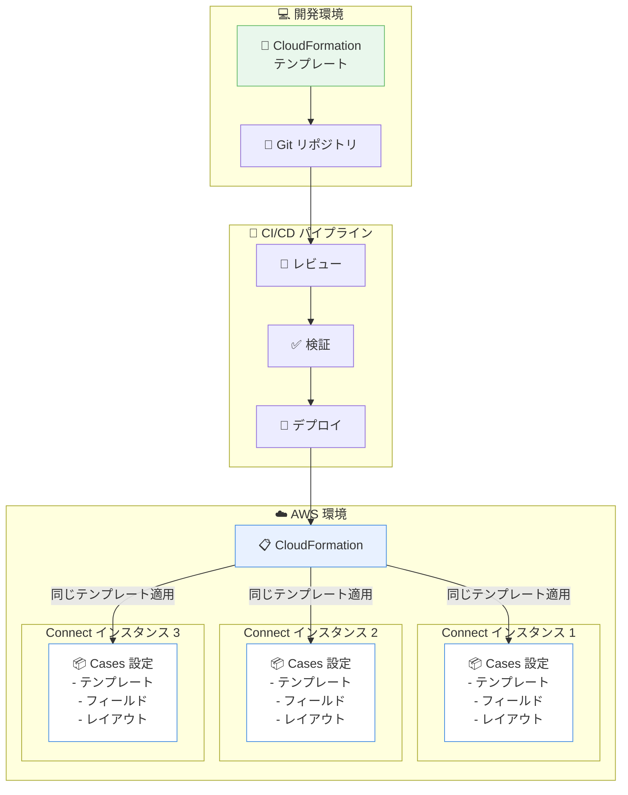

# Amazon Connect Cases - AWS CloudFormation サポート

**リリース日**: 2026年01月13日
**サービス**: Amazon Connect Cases
**機能**: AWS CloudFormation サポート

## 概要

Amazon Connect Cases が AWS CloudFormation をサポートし、ケースリソースを Infrastructure as Code (IaC) として管理できるようになりました。この機能により、管理者は CloudFormation テンプレートを作成して、Cases の設定 (テンプレート、フィールド、レイアウトなど) を複数の Amazon Connect インスタンス間でプログラマティックにデプロイおよび更新できます。

Amazon Connect Cases は、複数のやり取りや複数のオーナーを必要とする顧客の問題を管理するための機能です。今回の CloudFormation サポートにより、手動セットアップ時間を削減し、設定エラーを最小限に抑えることができます。これにより、大規模な環境での Cases の展開が容易になり、一貫性のある設定を複数のインスタンス間で維持できます。

この機能は、Amazon Connect Cases が利用可能なすべてのリージョンで提供されており、米国東部 (バージニア北部)、米国西部 (オレゴン)、カナダ (中部)、欧州 (フランクフルト)、欧州 (ロンドン)、アジアパシフィック (ソウル)、アジアパシフィック (シンガポール)、アジアパシフィック (シドニー)、アジアパシフィック (東京)、アフリカ (ケープタウン) で利用可能です。

**アップデート前の課題**

- Cases の設定 (テンプレート、フィールド、レイアウト) を手動で作成・管理する必要があり、時間がかかっていた
- 複数の Amazon Connect インスタンス間で一貫した Cases 設定を維持することが困難だった
- 手動設定による設定エラーのリスクがあり、トラブルシューティングに時間を要していた
- 環境間 (開発、ステージング、本番) での設定の同期が手作業で煩雑だった

**アップデート後の改善**

- CloudFormation テンプレートを使用して、Cases の設定をコードとして管理できるようになった
- 複数の Amazon Connect インスタンス間で、同じ CloudFormation テンプレートを再利用して一貫性を確保できる
- Infrastructure as Code により、バージョン管理、レビュー、ロールバックが容易になった
- 自動化により、手動設定エラーのリスクが大幅に減少した

## アーキテクチャ図



CloudFormation により、Cases の設定をコードとして管理し、複数の Amazon Connect インスタンス間で一貫性のある設定を自動的にデプロイできます。

## サービスアップデートの詳細

### 主要機能

1. **CloudFormation リソースタイプのサポート**
   - Cases テンプレート (AWS::Cases::Template)
   - Cases フィールド (AWS::Cases::Field)
   - Cases レイアウト (AWS::Cases::Layout)
   - Cases ドメイン設定

2. **Infrastructure as Code の実現**
   - Cases の設定を YAML または JSON 形式の CloudFormation テンプレートとして定義
   - バージョン管理システム (Git など) でテンプレートを管理
   - コードレビュープロセスを通じた設定変更の品質向上

3. **自動化されたデプロイメント**
   - CloudFormation スタックを使用して、Cases の設定を自動的にデプロイ
   - CI/CD パイプラインとの統合により、継続的なデプロイメントを実現
   - 複数のリージョンやアカウントへの一括デプロイが可能

4. **設定の再利用性と一貫性**
   - 同じ CloudFormation テンプレートを複数の Amazon Connect インスタンスで再利用
   - 環境間 (開発、ステージング、本番) での設定の一貫性を保証
   - パラメータ化により、環境固有の設定を柔軟に変更可能

## 技術仕様

### サポートされる CloudFormation リソースタイプ

| リソースタイプ | 説明 |
|----------------|------|
| AWS::Cases::Domain | Cases ドメインの設定 |
| AWS::Cases::Template | ケーステンプレートの定義 |
| AWS::Cases::Field | カスタムフィールドの定義 |
| AWS::Cases::Layout | ケースレイアウトの設定 |

### CloudFormation テンプレート例

```yaml
Resources:
  CasesDomain:
    Type: AWS::Cases::Domain
    Properties:
      Name: MyContactCenterDomain

  CustomField:
    Type: AWS::Cases::Field
    Properties:
      DomainId: !Ref CasesDomain
      Name: CustomerPriority
      Type: SingleSelect
      Options:
        - High
        - Medium
        - Low

  CaseTemplate:
    Type: AWS::Cases::Template
    Properties:
      DomainId: !Ref CasesDomain
      Name: StandardCaseTemplate
      Description: Standard case template for customer issues
      RequiredFields:
        - FieldId: !Ref CustomField
      Status: Active
```

### API変更履歴

CloudFormation サポートに伴う API 変更は確認されませんでした。既存の Cases API を CloudFormation が内部的に呼び出します。

## 設定方法

### 前提条件

1. Amazon Connect インスタンスが作成されていること
2. Amazon Connect Cases が有効化されていること
3. CloudFormation を使用するための適切な IAM 権限を持っていること
4. AWS CLI または AWS マネジメントコンソールへのアクセス権限

### 手順

#### ステップ1: CloudFormation テンプレートの作成

Cases の設定を定義する CloudFormation テンプレートを作成します。

```yaml
# cases-config.yaml
AWSTemplateFormatVersion: '2010-09-09'
Description: Amazon Connect Cases Configuration

Parameters:
  ConnectInstanceArn:
    Type: String
    Description: ARN of the Amazon Connect instance

Resources:
  CasesDomain:
    Type: AWS::Cases::Domain
    Properties:
      Name: !Sub '${AWS::StackName}-domain'

  PriorityField:
    Type: AWS::Cases::Field
    Properties:
      DomainId: !Ref CasesDomain
      Name: Priority
      Type: SingleSelect
      Options:
        - Critical
        - High
        - Medium
        - Low

  CategoryField:
    Type: AWS::Cases::Field
    Properties:
      DomainId: !Ref CasesDomain
      Name: Category
      Type: SingleSelect
      Options:
        - Technical Support
        - Billing
        - Account Management
        - General Inquiry

  SupportCaseTemplate:
    Type: AWS::Cases::Template
    Properties:
      DomainId: !Ref CasesDomain
      Name: SupportCaseTemplate
      Description: Template for customer support cases
      RequiredFields:
        - FieldId: !Ref PriorityField
        - FieldId: !Ref CategoryField
      Status: Active

  CaseLayout:
    Type: AWS::Cases::Layout
    Properties:
      DomainId: !Ref CasesDomain
      Name: StandardLayout
      Content:
        Basic:
          MoreInfo:
            Sections:
              - FieldGroup:
                  Fields:
                    - Id: !Ref PriorityField
                    - Id: !Ref CategoryField

Outputs:
  DomainId:
    Description: Cases Domain ID
    Value: !Ref CasesDomain
    Export:
      Name: !Sub '${AWS::StackName}-DomainId'

  TemplateId:
    Description: Case Template ID
    Value: !Ref SupportCaseTemplate
    Export:
      Name: !Sub '${AWS::StackName}-TemplateId'
```

#### ステップ2: CloudFormation スタックのデプロイ

AWS CLI を使用して、CloudFormation スタックをデプロイします。

```bash
# CloudFormation スタックを作成
aws cloudformation create-stack \
  --stack-name amazon-connect-cases-config \
  --template-body file://cases-config.yaml \
  --parameters ParameterKey=ConnectInstanceArn,ParameterValue=arn:aws:connect:us-east-1:123456789012:instance/12345678-1234-1234-1234-123456789012 \
  --capabilities CAPABILITY_IAM
```

このコマンドは、Cases の設定を含む CloudFormation スタックを作成します。

#### ステップ3: スタックの作成状態を確認

```bash
# スタックの状態を確認
aws cloudformation describe-stacks \
  --stack-name amazon-connect-cases-config \
  --query 'Stacks[0].StackStatus'
```

スタックが `CREATE_COMPLETE` 状態になれば、Cases の設定が正常にデプロイされています。

#### ステップ4: デプロイされたリソースの確認

```bash
# スタックのリソースを確認
aws cloudformation describe-stack-resources \
  --stack-name amazon-connect-cases-config
```

Cases のドメイン、フィールド、テンプレート、レイアウトが正常に作成されたことを確認します。

#### ステップ5: 設定の更新

設定を変更する場合は、テンプレートを更新してスタックを更新します。

```bash
# スタックを更新
aws cloudformation update-stack \
  --stack-name amazon-connect-cases-config \
  --template-body file://cases-config-updated.yaml \
  --parameters ParameterKey=ConnectInstanceArn,ParameterValue=arn:aws:connect:us-east-1:123456789012:instance/12345678-1234-1234-1234-123456789012 \
  --capabilities CAPABILITY_IAM
```

## メリット

### ビジネス面

- **デプロイ時間の短縮**: 手動設定と比較して、CloudFormation による自動デプロイにより、Cases の設定時間が大幅に短縮されます
- **運用コストの削減**: 自動化により、手動作業に伴う人的コストが削減され、設定エラーによるトラブルシューティング時間も減少します
- **スケーラビリティの向上**: 複数の Amazon Connect インスタンスへの Cases 設定の展開が容易になり、ビジネスの拡大に対応できます

### 技術面

- **Infrastructure as Code の実現**: Cases の設定をコードとして管理でき、バージョン管理、レビュー、ロールバックが可能になります
- **一貫性の確保**: 複数のインスタンス間で同じテンプレートを使用することで、設定の一貫性が保証されます
- **CI/CD 統合**: CloudFormation テンプレートを CI/CD パイプラインに統合することで、継続的なデプロイメントを実現できます
- **設定エラーの削減**: 自動化により、手動設定に伴う入力ミスや設定漏れのリスクが最小限に抑えられます

## デメリット・制約事項

### 制限事項

- CloudFormation を使用するには、CloudFormation と Cases の両方に対する適切な IAM 権限が必要です
- 既存の手動で作成した Cases 設定を CloudFormation で管理する場合、インポート操作が必要になる場合があります

### 考慮すべき点

- CloudFormation テンプレートの作成と管理には、CloudFormation の知識が必要です
- スタックの削除時には、Cases の設定も削除されるため、注意が必要です (削除保護機能の使用を推奨)
- 大規模な設定変更の場合、CloudFormation スタックの更新に時間がかかる場合があります

## ユースケース

### ユースケース1: マルチリージョン展開での一貫した設定

**シナリオ**: グローバル企業が、複数のリージョンに Amazon Connect インスタンスを展開し、各リージョンで同じ Cases 設定を使用したい。

**実装例**:
```bash
# 米国東部にデプロイ
aws cloudformation create-stack \
  --stack-name cases-config-us-east-1 \
  --template-body file://cases-config.yaml \
  --region us-east-1

# 欧州にデプロイ
aws cloudformation create-stack \
  --stack-name cases-config-eu-west-1 \
  --template-body file://cases-config.yaml \
  --region eu-west-1

# アジアパシフィックにデプロイ
aws cloudformation create-stack \
  --stack-name cases-config-ap-northeast-1 \
  --template-body file://cases-config.yaml \
  --region ap-northeast-1
```

**効果**: 複数のリージョン間で一貫した Cases 設定を維持でき、グローバルなカスタマーサポート体制を構築できます。

### ユースケース2: 環境間での設定の同期

**シナリオ**: 開発、ステージング、本番環境で同じ Cases 設定を使用し、環境間での一貫性を保ちたい。

**実装例**:
```yaml
# パラメータ化されたテンプレート
Parameters:
  Environment:
    Type: String
    AllowedValues:
      - dev
      - staging
      - prod
    Default: dev

Resources:
  CasesDomain:
    Type: AWS::Cases::Domain
    Properties:
      Name: !Sub 'cases-domain-${Environment}'
  # その他のリソース...
```

```bash
# 開発環境にデプロイ
aws cloudformation create-stack \
  --stack-name cases-config-dev \
  --template-body file://cases-config.yaml \
  --parameters ParameterKey=Environment,ParameterValue=dev

# 本番環境にデプロイ
aws cloudformation create-stack \
  --stack-name cases-config-prod \
  --template-body file://cases-config.yaml \
  --parameters ParameterKey=Environment,ParameterValue=prod
```

**効果**: 開発環境でテストした設定を、本番環境に確実に反映でき、環境間の設定差異によるトラブルを防止できます。

### ユースケース3: CI/CD パイプラインでの自動デプロイ

**シナリオ**: Git リポジトリでの変更をトリガーに、Cases の設定を自動的にデプロイしたい。

**実装例**:
```yaml
# .github/workflows/deploy-cases.yml
name: Deploy Cases Configuration

on:
  push:
    branches:
      - main
    paths:
      - 'cloudformation/cases-config.yaml'

jobs:
  deploy:
    runs-on: ubuntu-latest
    steps:
      - name: Checkout code
        uses: actions/checkout@v2

      - name: Configure AWS credentials
        uses: aws-actions/configure-aws-credentials@v1
        with:
          aws-access-key-id: ${{ secrets.AWS_ACCESS_KEY_ID }}
          aws-secret-access-key: ${{ secrets.AWS_SECRET_ACCESS_KEY }}
          aws-region: us-east-1

      - name: Deploy CloudFormation stack
        run: |
          aws cloudformation deploy \
            --stack-name amazon-connect-cases-config \
            --template-file cloudformation/cases-config.yaml \
            --capabilities CAPABILITY_IAM
```

**効果**: テンプレートへの変更が自動的にデプロイされ、手動作業を削減し、デプロイの一貫性を確保できます。

## 料金

CloudFormation 自体の使用に追加料金は発生しません。Amazon Connect Cases の料金は、通常通り、アクティブなケース数と API コール数に基づきます。

### Amazon Connect Cases 料金

Amazon Connect Cases の詳細な料金については、[Amazon Connect 料金ページ](https://aws.amazon.com/connect/pricing/)を参照してください。

## 利用可能リージョン

Amazon Connect Cases と CloudFormation サポートは、以下のリージョンで利用可能です。

- 米国東部 (バージニア北部) - us-east-1
- 米国西部 (オレゴン) - us-west-2
- カナダ (中部) - ca-central-1
- 欧州 (フランクフルト) - eu-central-1
- 欧州 (ロンドン) - eu-west-2
- アジアパシフィック (ソウル) - ap-northeast-2
- アジアパシフィック (シンガポール) - ap-southeast-1
- アジアパシフィック (シドニー) - ap-southeast-2
- アジアパシフィック (東京) - ap-northeast-1
- アフリカ (ケープタウン) - af-south-1

## 関連サービス・機能

- **Amazon Connect**: コンタクトセンターサービス。Cases と統合してカスタマーサポートを提供
- **AWS CloudFormation**: Infrastructure as Code サービス。AWS リソースをテンプレートとして管理
- **Amazon Connect Tasks**: Cases と連携して、タスク管理機能を提供
- **AWS CDK**: CloudFormation テンプレートをプログラマティックに生成するためのフレームワーク

## 参考リンク

- [公式発表 (What's New)](https://aws.amazon.com/about-aws/whats-new/2026/01/amazon-connect-cases-aws-cloudformation/)
- [Amazon Connect Cases ウェブページ](https://aws.amazon.com/connect/cases/)
- [Amazon Connect Cases CloudFormation ドキュメント](https://docs.aws.amazon.com/AWSCloudFormation/latest/TemplateReference/AWS_Cases.html)
- [Amazon Connect 管理者ガイド - Cases](https://docs.aws.amazon.com/connect/latest/adminguide/cases.html)

## まとめ

Amazon Connect Cases の AWS CloudFormation サポートにより、Cases の設定を Infrastructure as Code として管理できるようになりました。これにより、複数の Amazon Connect インスタンス間で一貫した設定を維持し、自動化されたデプロイメントを実現できます。特に、マルチリージョン展開や CI/CD パイプラインとの統合を検討している組織にとって、運用効率の向上と設定エラーの削減に大きく貢献します。CloudFormation テンプレートを使用することで、Cases の設定をバージョン管理し、環境間での一貫性を保つことができます。
