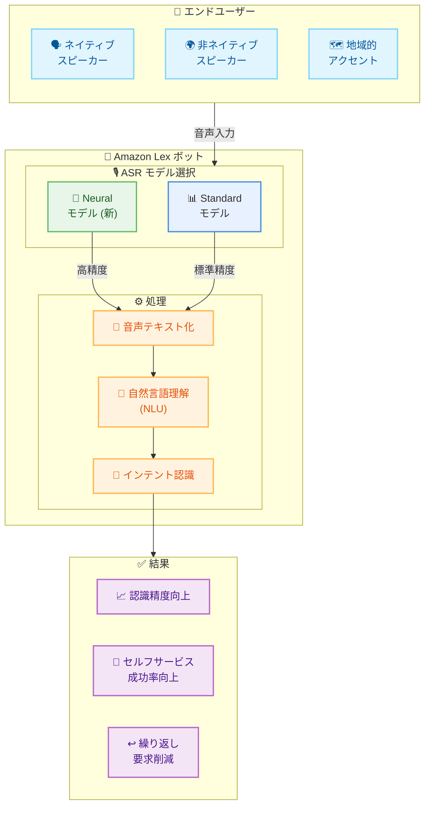

# Amazon Lex が英語向け改善された音声認識モデルをリリース

## 概要

2026 年 1 月 13 日、Amazon Lex は**英語向けニューラル自動音声認識 (ASR) モデル**をリリースしました。この新しいモデルは、音声ボットの認識精度を向上させ、複数の英語ロケールのデータで訓練されています。非ネイティブスピーカーや地域的なアクセントを含む、多様な話し方での会話音声パターンの認識に優れています。

## アーキテクチャ図

## 主な特徴

### ニューラル ASR モデルの改善点

新しいニューラルモデルは、以下の点で従来の標準モデルを上回ります。

#### 1. 多様な話し方への対応

- **非ネイティブスピーカー**: 第二言語としての英語話者の認識精度向上
- **地域的アクセント**: 様々な英語圏のアクセントに対応
- **会話音声パターン**: 自然な会話のリズムやパターンを理解

#### 2. ユーザーエクスペリエンスの向上

- **繰り返し削減**: エンドカスタマーが自分の発言を繰り返す必要が減少
- **セルフサービス成功率**: 音声によるセルフサービスの成功率が向上
- **顧客満足度**: より正確な認識により、顧客満足度が向上

#### 3. トレーニングデータの拡張

- **複数の英語ロケール**: 様々な英語圏のデータで訓練
- **多様な話し方**: 幅広い話し方のバリエーションを学習

## ユースケース

### 1. コンタクトセンターの IVR システム

**課題:**
- 様々なアクセントを持つ顧客からの問い合わせ
- 音声認識の誤りによる顧客のフラストレーション
- オペレーターへのエスカレーション増加

**ニューラル ASR の効果:**
- アクセントに関係なく高精度な認識
- セルフサービスでの解決率向上
- オペレーターの負荷軽減

### 2. グローバルカスタマーサポート

**課題:**
- 多国籍な顧客ベース
- 英語が第二言語のユーザーへの対応
- 地域による音声認識の品質差

**ニューラル ASR の効果:**
- 非ネイティブスピーカーの認識精度向上
- 地域間での一貫した品質
- グローバルなサービス展開の促進

### 3. 音声アシスタントアプリケーション

**課題:**
- 自然な会話パターンの認識
- 背景ノイズへの対応
- ユーザーの多様な話し方

**ニューラル ASR の効果:**
- 会話音声パターンの正確な理解
- ノイズ環境下での認識精度向上
- ユーザーエクスペリエンスの改善

## 音声認識モデルの比較

### Standard モデル

**特徴:**
- 一般的なユースケースに対応
- 制御された音声環境に適している
- クリアな音声入力に最適

**適用シナリオ:**
- 静かな環境での使用
- 標準的なアクセントの話者
- 明瞭な発音

### Neural モデル (新)

**特徴:**
- 高度な認識精度
- 自然な会話パターンの理解
- アクセントとノイズへの耐性

**適用シナリオ:**
- 騒がしい環境
- 多様なアクセント
- 自然な会話パターン
- 非ネイティブスピーカー

## 設定方法

### Amazon Lex コンソールでの設定

1. **Amazon Lex V2 コンソール**にアクセス
2. 設定したい**ボット**を選択
3. ボットの**ロケール設定**に移動
4. **Speech recognition settings** セクションで **"Neural"** を選択
5. ボットを**リビルド**して変更を適用

### 設定のベストプラクティス

#### モデル選択の基準

**Neural モデルを推奨するケース:**
- 多様なアクセントを持つユーザーベース
- 非ネイティブスピーカーが多い
- 自然な会話パターンが重要
- 騒がしい環境での使用
- 高い認識精度が必要

**Standard モデルで十分なケース:**
- 制御された音声環境
- 標準的なアクセントの話者
- クリアな音声入力
- シンプルなコマンドベースの対話

## Amazon Connect との統合

Amazon Lex と Amazon Connect を組み合わせることで、シームレスなカスタマーセルフサービス体験を提供できます。

### 統合のメリット

1. **コンタクトセンターの効率化**
   - セルフサービスでの解決率向上
   - オペレーターの負荷軽減
   - 待ち時間の短縮

2. **顧客満足度の向上**
   - 正確な音声認識
   - スムーズな対話体験
   - 24/7 の自動対応

3. **コスト削減**
   - オペレーター対応の削減
   - インフラストラクチャの最適化
   - スケーラブルな運用

## 利用可能なリージョン

この機能は、**Amazon Connect と Amazon Lex が動作するすべての AWS 商用リージョン**で利用可能です。

東京リージョン (ap-northeast-1) を含む、以下のリージョンで利用できます。

- US East (N. Virginia)
- US East (Ohio)
- US West (Oregon)
- Europe (Ireland)
- Europe (Frankfurt)
- Europe (London)
- Asia Pacific (Sydney)
- Asia Pacific (Tokyo)
- その他の商用リージョン

## その他の考慮事項

### 音声テキスト化信頼度スコア

Amazon Lex V2 は、音声テキスト化の曖昧さがある場合、複数のテキスト化候補と信頼度スコアを提供します。

**活用方法:**
- 正しいテキスト化の判定
- スロット値の比較
- キーワードに基づくインテントの切り替え

**利用可能な言語:**
- English (GB)
- English (US)

**要件:**
- 8 kHz オーディオ入力

### パフォーマンスとコスト

- Neural モデルは Standard モデルと同じ料金体系
- 追加コストなしで高精度な認識を実現
- Amazon Lex の標準料金が適用

## 参考リンク

- [What's New 発表](https://aws.amazon.com/about-aws/whats-new/2026/01/amazon-lex-improved-speech-recognition-models-english/)
- [Amazon Lex ドキュメント: 音声認識モデルの設定](https://docs.aws.amazon.com/lexv2/latest/dg/customizing-speech-model-preferences.html)
- [Amazon Connect セルフサービス](https://aws.amazon.com/connect/self-service/)
- [音声テキスト化信頼度スコアの使用](https://docs.aws.amazon.com/lexv2/latest/dg/using-transcript-confidence-scores.html)

---

**発表日**: 2026 年 1 月 13 日  
**ソース**: [AWS What's New](https://aws.amazon.com/new/)
