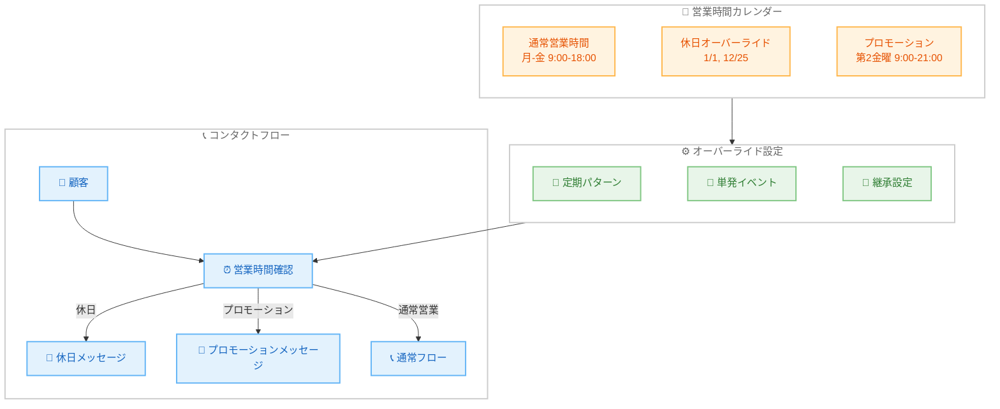

# Amazon Connect - 営業時間の定期オーバーライド機能

**リリース日**: 2026年01月14日
**サービス**: Amazon Connect
**機能**: 営業時間の定期オーバーライド (Recurring Hours of Operation Overrides)

## 概要

Amazon Connect は、コンタクトセンターの営業時間を、休日、メンテナンスウィンドウ、プロモーション期間などの定期的なイベント向けに管理しやすくする新機能を導入しました。ビジュアルカレンダーにより、日、月、年単位で一目で営業時間を把握できます。毎週、毎月、または隔週金曜日など、自動的に有効になる定期オーバーライドを設定し、手動で設定を再訪問することなく、顧客にパーソナライズされた体験を提供できます。

たとえば、毎年 1 月 1 日に自動的に顧客を「新年おめでとうございます!」とグリーティングし、エージェントが利用可能かどうかを確認する前に特別な休日メッセージにルーティングし、1 月 2 日にはコンタクトセンターが自動的に通常運用に戻ります。この機能により、営業時間管理の自動化が進み、運用効率が大幅に向上します。

**アップデート前の課題**

- 休日やプロモーション期間ごとに、手動で営業時間の設定を変更する必要があった
- 毎年繰り返される休日 (正月、クリスマスなど) でも、毎回手動で設定が必要だった
- 営業時間の変更履歴を一目で確認する方法がなく、過去や未来の設定を把握しにくかった
- 複数のイベントが重なる場合、管理が複雑で、設定ミスのリスクがあった

**アップデート後の改善**

- 週次、月次、年次など、定期的に自動適用されるオーバーライドを設定可能
- ビジュアルカレンダーにより、日、月、年単位で営業時間の変更を一目で確認
- 別の営業時間設定にリンクして、オーバーライドを継承可能
- Public API と AWS CloudFormation をサポートし、Infrastructure as Code (IaC) で管理可能

## アーキテクチャ図



この図は、定期オーバーライドとカレンダーベースの営業時間管理により、顧客が適切なメッセージやフローにルーティングされる仕組みを示しています。

## サービスアップデートの詳細

### 主要機能

1. **定期オーバーライドパターン**
   - 週次 (WEEKLY): 毎週特定の曜日に自動適用
   - 月次 (MONTHLY): 毎月特定の日に自動適用
   - 年次 (YEARLY): 毎年特定の月日に自動適用
   - 柔軟な繰り返し設定: 「毎月第 2 金曜日」「隔週月曜日」など、複雑なパターンも設定可能

2. **ビジュアルカレンダービュー**
   - 日、月、年単位での営業時間の可視化
   - 過去、現在、未来の営業時間変更を一目で確認
   - オーバーライドの重複や競合を視覚的に識別

3. **営業時間の継承**
   - 別の営業時間設定にリンクして、オーバーライドを継承
   - 複数のコンタクトセンターやキューで、同じ休日設定を共有
   - 親の営業時間が更新されると、子の営業時間も自動的に更新

4. **オーバーライドタイプ**
   - **STANDARD**: 特定の営業時間を設定
   - **OPEN**: 24 時間オープン
   - **CLOSED**: 完全クローズ

5. **API と CloudFormation サポート**
   - Public API を使用して、プログラムから営業時間とオーバーライドを管理
   - AWS CloudFormation テンプレートで、Infrastructure as Code (IaC) を実現
   - 複数の Connect インスタンスに、一貫した設定を展開

## 技術仕様

### オーバーライド設定パラメータ

| パラメータ | 説明 |
|-----------|------|
| **Name** | オーバーライドの名称 (例: "New Year Holiday") |
| **Description** | オーバーライドの説明 |
| **Config** | 営業時間の設定 (開始時刻、終了時刻、曜日) |
| **EffectiveFrom** | オーバーライドの有効開始日 (ISO 8601 形式) |
| **EffectiveTill** | オーバーライドの有効終了日 (ISO 8601 形式) |
| **RecurrenceConfig** | 定期パターンの設定 |
| **OverrideType** | STANDARD, OPEN, CLOSED のいずれか |

### 定期パターン設定

| フィールド | 説明 |
|-----------|------|
| **Frequency** | WEEKLY, MONTHLY, YEARLY |
| **Interval** | 繰り返しの間隔 (例: 2 = 隔週) |
| **ByMonth** | 特定の月 (1-12 の配列) |
| **ByMonthDay** | 特定の日 (1-31 の配列) |
| **ByWeekdayOccurrence** | 特定の週の曜日 (例: 第 2 金曜日) |

### API 変更履歴

| 日付 | サービス | 変更内容 |
|------|----------|----------|
| 2026/01/14 | [Amazon Connect Service](https://awsapichanges.com/archive/changes/10cfc3-connect.html) | 3 new 9 updated api methods - `CreateHoursOfOperationOverride`, `DescribeHoursOfOperationOverride`, `UpdateHoursOfOperationOverride` などの新規 API、および `RecurrenceConfig`, `OverrideType` パラメータを追加 |

### 新規 API メソッド

1. **CreateHoursOfOperationOverride**: 営業時間のオーバーライドを作成
2. **DescribeHoursOfOperationOverride**: オーバーライドの詳細を取得
3. **ListChildHoursOfOperations**: 子の営業時間設定を一覧表示
4. **AssociateHoursOfOperations**: 営業時間設定を関連付け
5. **DisassociateHoursOfOperations**: 営業時間設定の関連付けを解除

### オーバーライド設定例 (JSON)

```json
{
  "InstanceId": "aaaaaaaa-bbbb-cccc-dddd-111111111111",
  "HoursOfOperationId": "12345678-1234-1234-1234-123456789012",
  "Name": "New Year Holiday",
  "Description": "Closed for New Year's Day",
  "Config": [],
  "EffectiveFrom": "2026-01-01T00:00:00Z",
  "EffectiveTill": "2026-01-01T23:59:59Z",
  "RecurrenceConfig": {
    "RecurrencePattern": {
      "Frequency": "YEARLY",
      "Interval": 1,
      "ByMonth": [1],
      "ByMonthDay": [1]
    }
  },
  "OverrideType": "CLOSED"
}
```

## 設定方法

### 前提条件

1. Amazon Connect インスタンスが作成されている
2. 営業時間 (Hours of Operation) が設定されている
3. AWS Management Console へのアクセス権限、または AWS CLI/SDK の設定

### 手順

#### ステップ1: Amazon Connect コンソールにアクセス

```bash
# AWS Management Console にログイン
# Amazon Connect サービスを開く
# 対象の Connect インスタンスを選択
```

Amazon Connect コンソールから、営業時間の管理画面にアクセスします。

#### ステップ2: 営業時間のオーバーライドを作成

1. ナビゲーションメニューから「Routing」→「Hours of operation」を選択
2. オーバーライドを追加したい営業時間を選択
3. 「Overrides」タブを開く
4. 「Add override」をクリック
5. 以下の情報を入力:
   - **Name**: オーバーライドの名称 (例: "New Year Holiday")
   - **Description**: 説明 (オプション)
   - **Effective dates**: 有効期間
   - **Recurrence**: 定期パターン (週次、月次、年次)
   - **Override type**: STANDARD, OPEN, CLOSED のいずれか
   - **Hours**: STANDARD の場合、営業時間を設定
6. 「Save」をクリック

#### ステップ3: カレンダーで確認

```bash
# カレンダービューを開いて、オーバーライドが正しく設定されているか確認
# 日、月、年のビューを切り替えて、定期パターンを視覚的に確認
```

カレンダービューで、オーバーライドが意図した日付に適用されているかを確認します。

#### ステップ4: API を使用した設定 (オプション)

```bash
# AWS CLI を使用してオーバーライドを作成
aws connect create-hours-of-operation-override \
  --instance-id aaaaaaaa-bbbb-cccc-dddd-111111111111 \
  --hours-of-operation-id 12345678-1234-1234-1234-123456789012 \
  --name "New Year Holiday" \
  --description "Closed for New Year's Day" \
  --config '[]' \
  --effective-from "2026-01-01T00:00:00Z" \
  --effective-till "2026-01-01T23:59:59Z" \
  --recurrence-config '{"RecurrencePattern":{"Frequency":"YEARLY","Interval":1,"ByMonth":[1],"ByMonthDay":[1]}}' \
  --override-type CLOSED
```

このコマンドは、毎年 1 月 1 日に自動的に適用される「終日クローズ」のオーバーライドを作成します。

## メリット

### ビジネス面

- **顧客体験の向上**: 休日やプロモーション期間に、適切なメッセージとサービスを提供
- **運用効率の向上**: 手動での営業時間変更が不要になり、管理者の作業負荷を削減
- **設定ミスの防止**: 自動化により、営業時間の変更忘れや設定ミスを防止
- **柔軟なマーケティング**: プロモーション期間に、自動的に特別なメッセージやサービスを提供

### 技術面

- **自動化**: 定期オーバーライドにより、手動介入なしで営業時間を自動更新
- **可視化**: ビジュアルカレンダーにより、営業時間の変更を直感的に把握
- **Infrastructure as Code**: API と CloudFormation サポートにより、設定の自動化とバージョン管理が可能
- **継承機能**: 複数のキューやコンタクトセンターで、同じ休日設定を共有し、一元管理

## デメリット・制約事項

### 制限事項

- オーバーライドの数には上限がある可能性がある (詳細は AWS ドキュメントを参照)
- 定期パターンの複雑さには制限がある (例: 「第 2 と第 4 金曜日」は設定可能だが、「毎月最終営業日」などは直接設定できない場合がある)
- タイムゾーンは営業時間設定に依存し、オーバーライドごとに異なるタイムゾーンは設定できない

### 考慮すべき点

- 複数のオーバーライドが重複する場合、優先順位のルールを理解する必要がある
- 定期オーバーライドの変更は、過去のオーバーライドには影響しないため、履歴管理に注意が必要
- コンタクトフローで営業時間を参照している場合、オーバーライドが正しく反映されるか、事前にテストすることを推奨

## ユースケース

### ユースケース1: 年次休日の自動設定

**シナリオ**: 毎年、正月、クリスマスなど、特定の休日にコンタクトセンターを閉鎖し、顧客に休日メッセージを表示したい。

**実装例**:
```json
{
  "Name": "New Year Holiday",
  "RecurrenceConfig": {
    "RecurrencePattern": {
      "Frequency": "YEARLY",
      "Interval": 1,
      "ByMonth": [1],
      "ByMonthDay": [1]
    }
  },
  "OverrideType": "CLOSED"
}
```

**効果**: 毎年 1 月 1 日に自動的にコンタクトセンターがクローズされ、「新年おめでとうございます。営業再開は 1 月 2 日です」などのメッセージを顧客に表示できます。管理者は、毎年手動で設定を変更する必要がありません。

### ユースケース2: プロモーション期間の延長営業

**シナリオ**: 毎月第 2 金曜日は特別プロモーションデーとして、営業時間を延長し、特別なプロモーションメッセージを顧客に表示したい。

**実装例**:
```json
{
  "Name": "Second Friday Promotion",
  "Config": [
    {
      "Day": "FRIDAY",
      "StartTime": {"Hours": 9, "Minutes": 0},
      "EndTime": {"Hours": 21, "Minutes": 0}
    }
  ],
  "RecurrenceConfig": {
    "RecurrencePattern": {
      "Frequency": "MONTHLY",
      "Interval": 1,
      "ByWeekdayOccurrence": [2]
    }
  },
  "OverrideType": "STANDARD"
}
```

**効果**: 毎月第 2 金曜日に、営業時間が自動的に 9:00-21:00 に延長され、コンタクトフローで「本日は特別プロモーションデーです!」などのメッセージを表示できます。プロモーション終了後は、自動的に通常営業時間に戻ります。

### ユースケース3: メンテナンスウィンドウの設定

**シナリオ**: 毎週日曜日の深夜 1:00-3:00 にシステムメンテナンスを実施し、この時間帯はコンタクトセンターをクローズしたい。

**実装例**:
```json
{
  "Name": "Weekly Maintenance Window",
  "Config": [],
  "RecurrenceConfig": {
    "RecurrencePattern": {
      "Frequency": "WEEKLY",
      "Interval": 1
    }
  },
  "OverrideType": "CLOSED",
  "EffectiveFrom": "2026-01-01T01:00:00Z",
  "EffectiveTill": "2026-01-01T03:00:00Z"
}
```

**効果**: 毎週日曜日の深夜 1:00-3:00 に自動的にコンタクトセンターがクローズされ、「現在、システムメンテナンス中です。3:00 以降に再度お試しください」などのメッセージを表示できます。

## 料金

営業時間の定期オーバーライド機能自体に追加料金はかかりません。Amazon Connect の標準的な料金体系が適用されます。

- **使用料金**: 通話時間、チャットメッセージ、ビデオ通話などの使用量に基づいて課金
- **電話番号**: 電話番号の取得と維持に対して課金
- **追加機能**: Amazon Connect Wisdom、Customer Profiles などの追加機能を使用した場合、別途料金が発生

### 料金例

| 使用量 | 月額料金 (概算、東京リージョン) |
|--------|------------------|
| 1,000 分の通話時間 | 約 $12 |
| 10,000 分の通話時間 | 約 $120 |

*料金は変更される可能性があります。最新の料金については、[Amazon Connect 料金ページ](https://aws.amazon.com/connect/pricing/)を参照してください。*

## 利用可能リージョン

この機能は、Amazon Connect が利用可能なすべての AWS リージョンで提供されています。

主要リージョン:
- 米国東部 (バージニア北部)
- 米国西部 (オレゴン)
- カナダ (中部)
- 欧州 (アイルランド、フランクフルト、ロンドン)
- アジアパシフィック (東京、シンガポール、シドニー、ソウル)
- アフリカ (ケープタウン)

詳細なリージョン一覧については、[Amazon Connect リージョン](https://docs.aws.amazon.com/connect/latest/adminguide/regions.html#amazonconnect_region)を参照してください。

## 関連サービス・機能

- **Amazon Connect コンタクトフロー**: 営業時間に基づいて、コンタクトフローを分岐し、適切なメッセージやエージェントにルーティング
- **AWS CloudFormation**: Infrastructure as Code (IaC) で、営業時間とオーバーライドを管理
- **Amazon CloudWatch**: 営業時間の変更履歴を CloudWatch Logs で記録
- **AWS Lambda**: Lambda 関数を使用して、動的に営業時間を変更したり、複雑なビジネスロジックを実装

## 参考リンク

- [公式発表 (What's New)](https://aws.amazon.com/about-aws/whats-new/2026/01/amazon-connect-recurring-hour-operation-overrides/)
- [ドキュメント: Amazon Connect Administrator Guide - Hours of Operation](https://docs.aws.amazon.com/connect/latest/adminguide/set-hours-operation.html)
- [Amazon Connect ウェブサイト](https://aws.amazon.com/connect/)
- [料金ページ](https://aws.amazon.com/connect/pricing/)

## まとめ

Amazon Connect の営業時間の定期オーバーライド機能は、コンタクトセンター運用の自動化と効率化を大幅に向上させる重要なアップデートです。休日、プロモーション期間、メンテナンスウィンドウなど、定期的なイベントを自動的に管理し、手動での設定変更を不要にします。ビジュアルカレンダーと API サポートにより、営業時間の可視化と自動化が容易になり、設定ミスのリスクが削減されます。すべての Connect ユーザーに、この機能の導入を強くお勧めします。
