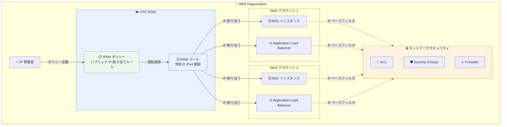

# Amazon VPC IPAM - RDS と Application Load Balancer のポリシーサポート

**リリース日**: 2026年01月14日
**サービス**: Amazon VPC IP Address Manager (IPAM)
**機能**: RDS インスタンスと Application Load Balancer のポリシーサポート

## 概要

Amazon VPC IP Address Manager (IPAM) が、Amazon Relational Database Service (RDS) インスタンスと Application Load Balancer (ALB) に対するポリシーサポートを開始しました。この機能により、IP 管理者は RDS インスタンスと ALB のパブリック IP アドレス割り当て戦略を一元的に設定し、強制できるようになります。

これまで IPAM ポリシーは、NAT Gateway (リージョン可用性モード使用時) と Elastic IP アドレスに対してのみ適用可能でしたが、今回のアップデートにより RDS インスタンスと ALB にも対象が拡大されました。IP 管理者は、組織全体のネットワークセキュリティポリシーを一元的に管理し、アプリケーションチームによる設定の上書きを防ぐことができます。

この機能は、AWS の全商用リージョンおよび AWS GovCloud (US) リージョンで利用可能で、IPAM の Free Tier と Advanced Tier の両方でサポートされます。Advanced Tier を使用すると、複数の AWS アカウントおよびリージョンにまたがってポリシーを設定できます。

**アップデート前の課題**

- IP 管理者は、データベース管理者やアプリケーション開発者に対して、RDS インスタンスと ALB の IP 割り当て要件を教育し、ベストプラクティスへの準拠を依頼する必要があった
- アプリケーションチームが独自に IP アドレスを設定できるため、組織のセキュリティポリシーに準拠しない設定が行われるリスクがあった
- RDS インスタンスと ALB のパブリック IPv4 アドレスが特定の IPAM プールから割り当てられることを保証できなかった
- ネットワークおよびセキュリティ構成 (ACL、ルートテーブル、セキュリティグループ、ファイアウォール) で IP ベースのフィルタリングを適用する際に、確実性が不足していた

**アップデート後の改善**

- IP 管理者が RDS インスタンスと ALB に対して、パブリック IP 割り当てルールを一元的に定義できるようになった
- 一元設定された IP 割り当てポリシーは、個別のアプリケーションチームによって上書きできないため、常にコンプライアンスが確保される
- RDS インスタンスと ALB のパブリック IPv4 アドレス割り当てが、常に特定の IPAM プールから行われることを保証できる
- ネットワークおよびセキュリティ構成で、RDS と ALB トラフィックに対する IP ベースのフィルタリングを確実に適用できる

## アーキテクチャ図



IPAM ポリシーにより、IP 管理者は組織全体の RDS インスタンスと ALB に対して、一元的に IP 割り当て戦略を定義・強制できます。割り当てられた IP アドレスは、ネットワークセキュリティ構成で確実にフィルタリングされます。

## サービスアップデートの詳細

### 主要機能

1. **RDS インスタンスへのポリシー適用**
   - RDS インスタンスのパブリック IP アドレス割り当てを、IPAM ポリシーで制御可能
   - データベース管理者による手動設定を不要にし、組織のセキュリティポリシーを自動適用
   - RDS インスタンスが常に特定の IPAM プールから IP アドレスを取得することを保証

2. **Application Load Balancer へのポリシー適用**
   - ALB のパブリック IP アドレス割り当てを、IPAM ポリシーで制御可能
   - アプリケーション開発者による個別設定を制限し、一貫したセキュリティポリシーを適用
   - ALB が常に特定の IPAM プールから IP アドレスを取得することを保証

3. **クロスアカウント・クロスリージョンポリシー (Advanced Tier)**
   - Advanced Tier を使用すると、複数の AWS アカウントおよびリージョンにまたがってポリシーを設定可能
   - 組織全体で統一された IP 管理戦略を実現
   - 大規模な AWS 環境における IP アドレス管理を簡素化

## 技術仕様

### サポート対象リソースタイプ

IPAM ポリシーは以下のリソースタイプに対して適用可能です。

| リソースタイプ | 説明 |
|----------------|------|
| RDS インスタンス | Amazon Relational Database Service のデータベースインスタンス |
| Application Load Balancer | レイヤー 7 ロードバランサー |
| NAT Gateway (リージョン可用性モード) | リージョン可用性モードで使用される NAT Gateway |
| Elastic IP アドレス | 静的パブリック IPv4 アドレス |

### IPAM Tier の比較

| 機能 | Free Tier | Advanced Tier |
|------|-----------|---------------|
| RDS/ALB ポリシーサポート | ✓ | ✓ |
| 単一アカウント内のポリシー | ✓ | ✓ |
| クロスアカウントポリシー | ✗ | ✓ |
| クロスリージョンポリシー | ✗ | ✓ |

### API変更履歴

API 変更は確認されませんでした。既存の IPAM API を使用して、RDS と ALB に対するポリシーを設定できます。

## 設定方法

### 前提条件

1. VPC IPAM が有効化されていること
2. IPAM プールが作成されていること (パブリック IPv4 アドレス範囲を含む)
3. 適切な IAM 権限 (IPAM ポリシーの作成・管理権限) を持っていること

### 手順

#### ステップ1: IPAM ポリシーの作成

AWS マネジメントコンソールまたは AWS CLI を使用して、IPAM ポリシーを作成します。

```bash
# IPAM ポリシーを作成 (RDS インスタンス用)
aws ec2 create-ipam-policy \
  --ipam-id ipam-xxxxxxxxxxxxxxxxx \
  --resource-type rds \
  --allocation-rule IpamPoolId=ipam-pool-xxxxxxxxxxxxxxxxx
```

このコマンドは、RDS インスタンスに対して特定の IPAM プールから IP アドレスを割り当てるポリシーを作成します。

#### ステップ2: Application Load Balancer 用のポリシー作成

```bash
# IPAM ポリシーを作成 (ALB 用)
aws ec2 create-ipam-policy \
  --ipam-id ipam-xxxxxxxxxxxxxxxxx \
  --resource-type alb \
  --allocation-rule IpamPoolId=ipam-pool-xxxxxxxxxxxxxxxxx
```

このコマンドは、ALB に対して特定の IPAM プールから IP アドレスを割り当てるポリシーを作成します。

#### ステップ3: ポリシーの確認

```bash
# IPAM ポリシーの一覧を確認
aws ec2 describe-ipam-policies \
  --ipam-id ipam-xxxxxxxxxxxxxxxxx
```

設定したポリシーが正しく適用されているか確認します。

## メリット

### ビジネス面

- **コンプライアンスの自動化**: IP 割り当てポリシーが自動的に適用されるため、手動によるコンプライアンス確認作業が不要になり、運用コストを削減できます
- **セキュリティリスクの低減**: アプリケーションチームによる誤った IP 設定を防止し、組織全体のセキュリティポスチャーを向上させます
- **運用効率の向上**: IP 管理者がデータベース管理者やアプリケーション開発者に対して、個別に教育やレビューを行う必要がなくなり、運用負荷が軽減されます

### 技術面

- **一元的な IP 管理**: 組織全体の IP アドレス割り当て戦略を、単一のインターフェースから管理できます
- **確実なポリシー適用**: 一元設定されたポリシーは、個別のアプリケーションチームによって上書きできないため、常に組織のセキュリティポリシーが適用されます
- **ネットワークセキュリティの強化**: RDS と ALB のトラフィックに対して、IP ベースのフィルタリングを確実に適用でき、ACL、ルートテーブル、セキュリティグループ、ファイアウォールの設定が簡素化されます

## デメリット・制約事項

### 制限事項

- ポリシーは公式ドキュメントで確認された限り、パブリック IPv4 アドレスの割り当てにのみ適用されます (プライベート IP アドレスには適用されない可能性があります)
- IPAM ポリシーを使用するには、事前に IPAM プールを作成し、適切な IPv4 アドレス範囲を設定する必要があります

### 考慮すべき点

- Advanced Tier を使用してクロスアカウント・クロスリージョンポリシーを設定する場合、追加の料金が発生します
- 既存の RDS インスタンスや ALB に対してポリシーを適用する場合、IP アドレスの再割り当てが必要になる可能性があります

## ユースケース

### ユースケース1: 金融機関におけるコンプライアンス要件への対応

**シナリオ**: 金融機関では、RDS データベースと ALB に割り当てられるパブリック IP アドレスが、特定の IP 範囲からのみ割り当てられることをコンプライアンス要件として求められています。

**実装例**:
```bash
# コンプライアンス用 IPAM プールの作成
aws ec2 create-ipam-pool \
  --ipam-scope-id ipam-scope-xxxxxxxxxxxxxxxxx \
  --address-family ipv4 \
  --provisioned-cidrs Cidr=198.51.100.0/24

# RDS と ALB に対するポリシーの設定
aws ec2 create-ipam-policy \
  --ipam-id ipam-xxxxxxxxxxxxxxxxx \
  --resource-type rds \
  --allocation-rule IpamPoolId=ipam-pool-xxxxxxxxxxxxxxxxx

aws ec2 create-ipam-policy \
  --ipam-id ipam-xxxxxxxxxxxxxxxxx \
  --resource-type alb \
  --allocation-rule IpamPoolId=ipam-pool-xxxxxxxxxxxxxxxxx
```

**効果**: 開発チームが RDS インスタンスや ALB を作成する際に、自動的にコンプライアンス要件を満たす IP アドレスが割り当てられ、監査対応が簡素化されます。

### ユースケース2: マルチアカウント環境における一元的な IP 管理

**シナリオ**: 複数の AWS アカウントを使用している企業で、各アカウントの RDS と ALB に対して統一された IP 割り当て戦略を適用したい。

**実装例**:
```bash
# Advanced Tier を使用したクロスアカウントポリシーの設定
aws ec2 create-ipam-policy \
  --ipam-id ipam-xxxxxxxxxxxxxxxxx \
  --resource-type rds \
  --allocation-rule IpamPoolId=ipam-pool-xxxxxxxxxxxxxxxxx \
  --scope organization
```

**効果**: 組織全体で統一された IP 管理戦略が適用され、アカウント間での IP アドレス管理の一貫性が保たれます。

### ユースケース3: ファイアウォールルールの簡素化

**シナリオ**: 企業のファイアウォールで、RDS と ALB からのトラフィックに対して IP ベースのフィルタリングを適用したい。

**実装例**:
```bash
# 特定の IP 範囲を持つ IPAM プールを作成
aws ec2 create-ipam-pool \
  --ipam-scope-id ipam-scope-xxxxxxxxxxxxxxxxx \
  --address-family ipv4 \
  --provisioned-cidrs Cidr=203.0.113.0/24

# ファイアウォールルールの設定例 (疑似コード)
# allow traffic from 203.0.113.0/24 to internal resources
```

**効果**: RDS と ALB が常に 203.0.113.0/24 の範囲から IP アドレスを取得するため、ファイアウォールルールをシンプルに保つことができ、セキュリティ管理が容易になります。

## 料金

IPAM ポリシー機能自体に追加料金は発生しません。VPC IPAM の既存の料金体系に従います。

### IPAM 料金

| Tier | 月額料金 | 説明 |
|------|----------|------|
| Free Tier | 無料 | 単一アカウント内での使用 |
| Advanced Tier | アクティブな IPAM あたり月額 $100 | クロスアカウント・クロスリージョン機能を含む |

詳細な料金情報については、[Amazon VPC 料金ページ](https://aws.amazon.com/vpc/pricing/)の IPAM タブを参照してください。

## 利用可能リージョン

この機能は、以下のリージョンで利用可能です。

- すべての AWS 商用リージョン
- AWS GovCloud (US-East) リージョン
- AWS GovCloud (US-West) リージョン

## 関連サービス・機能

- **Amazon VPC**: IPAM は VPC 内の IP アドレス管理を一元化します
- **AWS Organizations**: Advanced Tier を使用すると、組織全体で IPAM ポリシーを適用できます
- **Amazon RDS**: IPAM ポリシーにより、RDS インスタンスの IP アドレス割り当てを制御できます
- **Elastic Load Balancing**: IPAM ポリシーにより、ALB の IP アドレス割り当てを制御できます

## 参考リンク

- [公式発表 (What's New)](https://aws.amazon.com/about-aws/whats-new/2026/01/amazon-vpc-ipam-policies-rds-alb/)
- [IPAM ポリシードキュメント](https://docs.aws.amazon.com/vpc/latest/ipam/define-public-ipv4-allocation-strategy-with-ipam-policies.html)
- [IPAM ドキュメント](https://docs.aws.amazon.com/vpc/latest/ipam/what-it-is-ipam.html)
- [Amazon VPC 料金ページ](https://aws.amazon.com/vpc/pricing/)

## まとめ

Amazon VPC IPAM の RDS と ALB へのポリシーサポートにより、組織は IP アドレス割り当て戦略を一元的に管理し、コンプライアンスを自動的に確保できるようになりました。この機能は、特に大規模な AWS 環境や厳格なセキュリティ要件を持つ組織にとって、運用効率の向上とセキュリティリスクの低減に大きく貢献します。Advanced Tier を使用することで、複数のアカウントやリージョンにまたがる統一された IP 管理戦略を実現できます。
