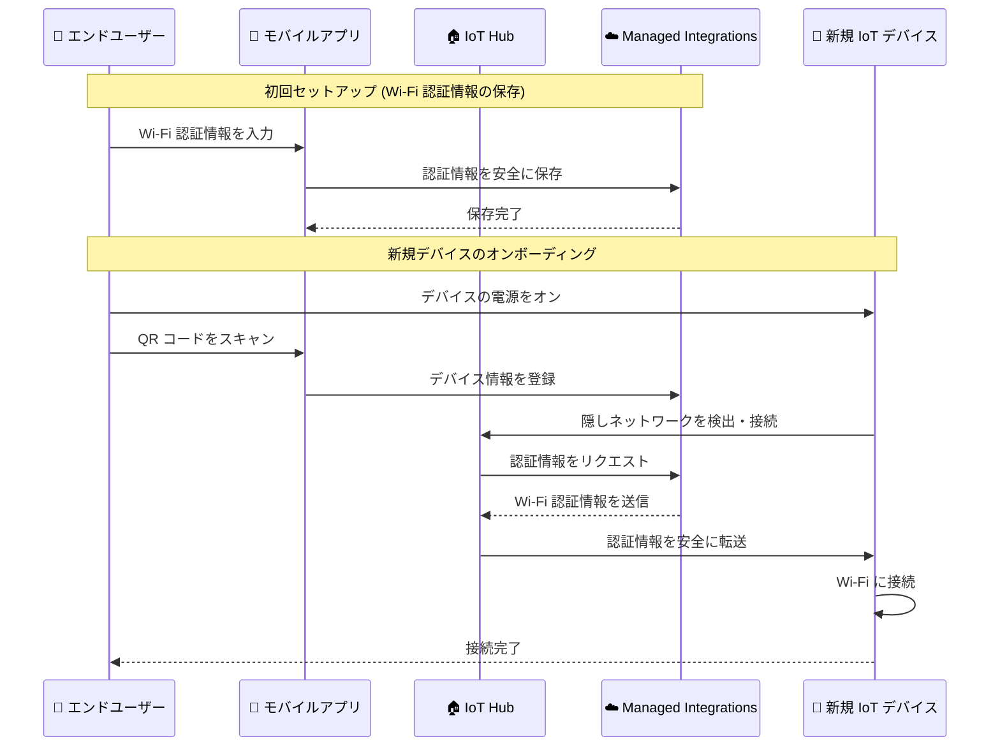

# AWS IoT Device Management - Wi-Fi Simple Setup (WSS)

**リリース日**: 2026年1月14日
**サービス**: AWS IoT Device Management
**機能**: Wi-Fi Simple Setup for Managed Integrations

## 概要

AWS IoT Device Management が、マネージドインテグレーション機能向けに Wi-Fi Simple Setup (WSS) を導入しました。WSS により、開発者は IoT ソリューションにおける Wi-Fi プロビジョニングを簡素化できます。エンドユーザーは QR コードをスキャンするだけで、Wi-Fi 対応デバイスを接続できるようになり、デバイスのセットアップ時間が短縮され、手動設定と比較してテクニカルサポートの必要性が最小限に抑えられます。

WSS 機能は、AWS IoT Device Management のマネージドインテグレーション機能を通じて動作します。マネージドインテグレーションにより、開発者は異なるベンダーや接続プロトコル間でデバイスを制御および管理でき、WSS はデバイスオンボーディングプロセスを効率化します。この機能は、カナダ (中部) およびヨーロッパ (アイルランド) リージョンで利用可能です。

**アップデート前の課題**

- エンドユーザーは各 IoT デバイスに対して手動で Wi-Fi 認証情報を入力する必要があった
- デバイスのセットアップに時間がかかり、技術的なサポートが頻繁に必要だった
- 複数のデバイスを展開する際、各デバイスに対して繰り返し同じ設定作業を行う必要があった
- セキュアな Wi-Fi 認証情報の共有が複雑で、ユーザーエクスペリエンスが低下していた

**アップデート後の改善**

- QR コードをスキャンするだけで、デバイスが自動的に Wi-Fi に接続できるようになった
- ほぼゼロタッチのオンボーディング体験を実現し、ユーザーの操作を最小限に抑えた
- Wi-Fi 認証情報をマネージドインテグレーションに一度保存すれば、新しいデバイスのセットアップが自動化される
- セキュアなローカル認証情報交換により、セキュリティと利便性の両立を実現した

## アーキテクチャ図



このシーケンス図は、Wi-Fi Simple Setup のオンボーディングフローを示しています。ユーザーは一度 Wi-Fi 認証情報を保存すれば、以降の新規デバイスは QR コードスキャンだけで自動的に Wi-Fi に接続されます。

## サービスアップデートの詳細

### 主要機能

1. **QR コードベースのオンボーディング**
   - エンドユーザーはモバイルアプリで IoT デバイスの QR コードをスキャン
   - デバイス情報がマネージドインテグレーションに自動登録される
   - 手動での設定入力が不要になり、ユーザーエクスペリエンスが向上

2. **自動 Wi-Fi 認証情報プロビジョニング**
   - Wi-Fi 認証情報をマネージドインテグレーションに一度保存
   - 新規デバイスは IoT Hub がブロードキャストする隠しネットワークを検出
   - セキュアに保存された認証情報が自動的にデバイスに送信される

3. **セキュアなローカル認証情報交換**
   - TLS 1.2/1.3 を使用した暗号化通信
   - 認証情報の転送は IoT Hub とデバイス間のローカルネットワーク上で実行
   - 時間制限付きのアクティベーションウィンドウにより、セキュリティを強化

## 技術仕様

### 対応プロトコルとセキュリティ

| 項目 | 詳細 |
|------|------|
| 暗号化プロトコル | TLS 1.2/1.3 |
| 認証方法 | QR コードベースの認証 |
| ネットワーク方式 | 隠しネットワークブロードキャスト |
| アクティベーション期間 | 設定可能な時間制限付きウィンドウ |
| 対応地域 | カナダ (中部)、ヨーロッパ (アイルランド) |

### オンボーディングフロー

WSS は、マネージドインテグレーションが提供する 4 つのデバイスオンボーディングフローの 1 つです。

| フロー | 説明 |
|--------|------|
| Simple Setup (SS) | QR コードスキャンによる基本的なデバイス登録 |
| Zero-touch Setup (ZTS) | デバイスを事前にアカウントに関連付け、自動登録 |
| User Guided Setup (UGS) | ユーザーインタラクションが必要なセットアップ |
| **Wi-Fi Simple Setup (WSS)** | Wi-Fi 認証情報の自動プロビジョニング |

## 設定方法

### 前提条件

1. AWS IoT Device Management のマネージドインテグレーション機能が有効になっている
2. カナダ (中部) またはヨーロッパ (アイルランド) リージョンでの利用
3. Hub SDK を統合したモバイルアプリケーション
4. Wi-Fi 対応の IoT デバイス

### 手順

#### ステップ1: マネージドインテグレーションのセットアップ

AWS IoT コンソールからマネージドインテグレーション機能を有効化し、IoT Hub を設定します。

#### ステップ2: モバイルアプリに Hub SDK を統合

```bash
# Hub SDK をアプリケーションに統合
# SDK は QR コードスキャン機能と WSS フローをサポート
```

モバイルアプリケーションに AWS IoT Hub SDK を統合し、QR コードスキャン機能を実装します。

#### ステップ3: Wi-Fi 認証情報の保存

エンドユーザーがモバイルアプリから Wi-Fi 認証情報を入力し、マネージドインテグレーションに安全に保存します。この操作は一度だけ実行します。

#### ステップ4: デバイスのオンボーディング

1. 新しい IoT デバイスの電源をオン
2. モバイルアプリでデバイスの QR コードをスキャン
3. デバイスが自動的に隠しネットワークに接続し、Wi-Fi 認証情報を受信
4. デバイスが自動的に Wi-Fi ネットワークに接続完了

## メリット

### ビジネス面

- **ユーザーエクスペリエンスの向上**: QR コードスキャンだけで完了する簡単なセットアップにより、顧客満足度が向上
- **サポートコストの削減**: 手動設定に関する問い合わせが減少し、テクニカルサポートの負担が軽減
- **迅速なデバイス展開**: 大量のデバイスを短時間でオンボーディングできるため、ビジネスの拡張性が向上

### 技術面

- **セキュアな認証情報管理**: TLS 暗号化とマネージドインテグレーションによる安全な認証情報保存
- **ほぼゼロタッチのオンボーディング**: ユーザーの操作を最小限に抑えた自動化されたセットアップ
- **マルチベンダー対応**: マネージドインテグレーションにより、異なるベンダーのデバイスやプロトコルに対応

## デメリット・制約事項

### 制限事項

- 現在はカナダ (中部) およびヨーロッパ (アイルランド) リージョンのみで利用可能
- Wi-Fi 対応デバイスのみが対象 (Ethernet 専用デバイスには非対応)
- マネージドインテグレーション機能の有効化が必須

### 考慮すべき点

- IoT Hub が隠しネットワークをブロードキャストするため、ネットワーク環境の設計を考慮する必要がある
- QR コードの生成と管理が必要 (デバイス製造時またはパッケージングプロセスに組み込む)
- モバイルアプリに Hub SDK を統合するための開発作業が必要

## ユースケース

### ユースケース1: スマートホームデバイスの大量展開

**シナリオ**: スマートホーム機器メーカーが、エンドユーザー向けにスマート照明やセンサーを大量に展開する場合。

**実装例**:
1. 製品パッケージに QR コードを印刷
2. ユーザーはメーカーのモバイルアプリをダウンロードし、Wi-Fi 認証情報を一度入力
3. 各デバイスのパッケージに印刷された QR コードをスキャン
4. デバイスが自動的に Wi-Fi に接続され、利用可能になる

**効果**: ユーザーは複雑な設定手順を踏まずに、数秒で複数のデバイスをセットアップできる。サポート問い合わせが大幅に減少。

### ユースケース2: 工場内の IoT センサー展開

**シナリオ**: 製造業の工場で、温度・湿度センサーを大量に配置し、リアルタイムモニタリングを実現する場合。

**実装例**:
1. 工場の管理者がモバイルアプリから Wi-Fi 認証情報を設定
2. 設置担当者が各センサーの QR コードをスキャン
3. センサーが自動的に工場の Wi-Fi ネットワークに接続
4. マネージドインテグレーションを通じてデータ収集が開始

**効果**: 数百台のセンサーを短時間で展開でき、手動設定による人的エラーを排除。

### ユースケース3: 小売店舗の在庫管理 IoT デバイス

**シナリオ**: 小売チェーンが複数店舗に在庫管理用の IoT デバイスを展開する場合。

**実装例**:
1. 本部で各店舗の Wi-Fi 認証情報をマネージドインテグレーションに登録
2. 店舗スタッフが配送されたデバイスの QR コードをスキャン
3. デバイスが店舗の Wi-Fi に自動接続し、在庫データをクラウドに送信開始

**効果**: IT 担当者が現地に赴く必要がなくなり、店舗スタッフだけで迅速なデバイス展開が可能。

## 料金

Wi-Fi Simple Setup (WSS) は、AWS IoT Device Management のマネージドインテグレーション機能の一部として提供されます。料金は、マネージドインテグレーション機能の利用料金に含まれます。

詳細な料金については、AWS IoT Device Management の料金ページをご確認ください。

## 利用可能リージョン

Wi-Fi Simple Setup は、以下のリージョンで利用可能です。

- カナダ (中部)
- ヨーロッパ (アイルランド)

今後、追加のリージョンでのサポートが予定されています。

## 関連サービス・機能

- **AWS IoT Device Management**: IoT デバイスのライフサイクル全体を管理するサービス
- **AWS IoT Core**: IoT デバイスとクラウドアプリケーション間の安全な通信を提供
- **AWS IoT Hub SDK**: マネージドインテグレーション機能を活用するための開発キット

## 参考リンク

- [公式発表 (What's New)](https://aws.amazon.com/about-aws/whats-new/2026/01/aws-iot-device-management-wifi-simple-setup/)
- [Managed Integrations ドキュメント](https://docs.aws.amazon.com/iot-mi/latest/devguide/what-is-managedintegrations.html)
- [Wi-Fi Simple Setup ドキュメント](https://docs.aws.amazon.com/iot-mi/latest/devguide/managedintegrations-sdk-v2-cookbook-wss.html)
- [AWS IoT Console](https://console.aws.amazon.com/iot/home)

## まとめ

AWS IoT Device Management の Wi-Fi Simple Setup (WSS) は、IoT デバイスのオンボーディングプロセスを劇的に簡素化します。QR コードスキャンによるほぼゼロタッチのセットアップにより、ユーザーエクスペリエンスが向上し、サポートコストが削減されます。スマートホーム、工場、小売店舗など、大量の IoT デバイスを展開する場合に特に有効です。カナダ (中部) またはヨーロッパ (アイルランド) リージョンで IoT ソリューションを展開している場合は、この機能の導入を検討することをお勧めします。
