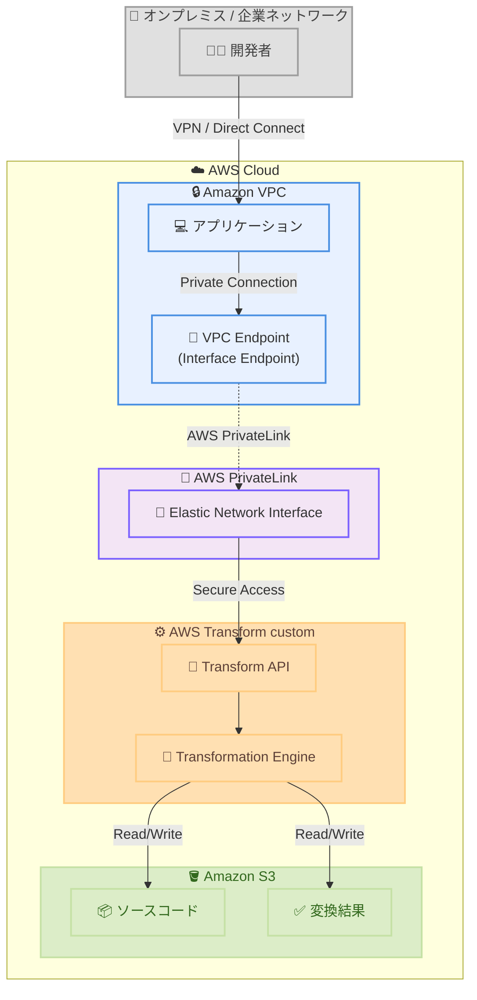

# AWS Transform custom - AWS PrivateLink サポートとリージョン拡大

**リリース日**: 2026年1月14日
**サービス**: AWS Transform custom
**機能**: AWS PrivateLink Support and Europe (Frankfurt) Region Expansion

## 概要

AWS Transform custom が AWS PrivateLink をサポートし、ヨーロッパ (フランクフルト) リージョンでも利用可能になりました。AWS Transform custom は、言語バージョンアップグレード、API マイグレーション、フレームワーク更新などの反復的な変換タスクを自動化することで、組織の技術的負債を削減するサービスです。エージェント AI を活用し、大規模なコードベース全体で一貫性のある反復可能なコード変換を実行できます。

AWS PrivateLink サポートにより、お客様は Amazon VPC から AWS Transform custom にアクセスする際、トラフィックをパブリックインターネット経由でルーティングすることなく、プライベート接続を利用できるようになりました。これにより、セキュリティとコンプライアンス要件を満たすことが容易になります。

**アップデート前の課題**

- AWS Transform custom へのアクセスはパブリックインターネット経由のみで、プライベートネットワークからの直接アクセスができなかった
- 厳格なセキュリティおよびコンプライアンス要件を持つ組織では、パブリックインターネット経由のトラフィックが制限事項となっていた
- 米国東部 (バージニア北部) リージョンのみでの提供のため、ヨーロッパのお客様にとってレイテンシーが課題となっていた

**アップデート後の改善**

- AWS PrivateLink を使用して、VPC から AWS Transform custom にプライベートに接続できるようになった
- トラフィックが AWS ネットワーク内に留まるため、セキュリティとコンプライアンス要件を満たしやすくなった
- ヨーロッパ (フランクフルト) リージョンでの利用により、ヨーロッパのお客様のレイテンシーが改善された

## アーキテクチャ図



このアーキテクチャ図は、AWS PrivateLink を使用して VPC から AWS Transform custom にプライベートに接続する構成を示しています。トラフィックは AWS ネットワーク内に留まり、パブリックインターネットを経由しません。

## サービスアップデートの詳細

### 主要機能

1. **AWS PrivateLink サポート**
   - VPC エンドポイント (インターフェースエンドポイント) を作成し、AWS Transform custom にプライベートに接続
   - トラフィックが AWS ネットワーク内に留まり、パブリックインターネットを経由しない
   - セキュリティグループとネットワーク ACL を使用したアクセス制御が可能

2. **ヨーロッパ (フランクフルト) リージョンでの提供開始**
   - 米国東部 (バージニア北部) リージョンに加えて、ヨーロッパ (フランクフルト) リージョンでも利用可能
   - ヨーロッパのお客様にとって、レイテンシーが改善され、データレジデンシー要件を満たしやすくなった

3. **継続的学習による変換品質の向上**
   - すべての変換実行から自動的にフィードバックをキャプチャし、変換品質を継続的に改善
   - 自然言語、ドキュメント、コードサンプルを使用してカスタム変換定義を作成可能
   - Java、Python、Node.js バージョンアップグレードなどの一般的なシナリオ向けに AWS 管理の変換を利用可能

## 技術仕様

### 対応リージョンと AWS PrivateLink

| 項目 | 詳細 |
|------|------|
| 対応リージョン | 米国東部 (バージニア北部)、ヨーロッパ (フランクフルト) |
| AWS PrivateLink サポート | 両リージョンで利用可能 |
| VPC エンドポイントタイプ | インターフェースエンドポイント (Interface Endpoint) |
| 接続方式 | Elastic Network Interface (ENI) 経由 |

### 対応する変換パターン

AWS Transform custom は、以下のような多様な変換パターンに対応しています。

| 変換パターン | 説明 |
|--------------|------|
| 言語バージョンアップグレード | Java、Python、Node.js などの言語バージョンを最新にアップグレード |
| API マイグレーション | 古い API から新しい API への移行 |
| フレームワークアップグレード | フレームワークのバージョンアップグレード |
| コードリファクタリング | コードパターンの現代化 |
| 組織固有の変換 | 組織のコーディング規約に合わせたカスタム変換 |

## 設定方法

### 前提条件

1. AWS アカウントと適切な IAM 権限
2. Amazon VPC の作成と設定
3. Amazon S3 への AWS PrivateLink 統合の有効化
4. AWS サービス (VPC、PrivateLink、Transform) の基本的な理解

### 手順

#### ステップ1: VPC エンドポイントの作成 (AWS コンソールを使用)

1. Amazon VPC コンソールを開く
2. ナビゲーションペインで「エンドポイント」を選択
3. 「エンドポイントの作成」を選択
4. サービスカテゴリで「AWS サービス」を選択
5. サービス名で `com.amazonaws.[region].transform` を検索して選択
6. VPC とサブネットを選択
7. セキュリティグループを設定
8. 「エンドポイントの作成」を選択

#### ステップ2: VPC エンドポイントの作成 (AWS CLI を使用)

```bash
aws ec2 create-vpc-endpoint \
  --vpc-id vpc-xxxxxxxxx \
  --vpc-endpoint-type Interface \
  --service-name com.amazonaws.us-east-1.transform \
  --subnet-ids subnet-xxxxxxxxx \
  --security-group-ids sg-xxxxxxxxx
```

VPC エンドポイントを作成し、AWS Transform custom へのプライベート接続を確立します。

#### ステップ3: VPC エンドポイントポリシーの作成 (オプション)

```json
{
  "Statement": [
    {
      "Effect": "Allow",
      "Principal": "*",
      "Action": [
        "transform:CreateTransformation",
        "transform:ExecuteTransformation",
        "transform:GetTransformation"
      ],
      "Resource": "*"
    }
  ]
}
```

VPC エンドポイントポリシーを作成し、AWS Transform custom へのアクセスを制御します。

#### ステップ4: オンプレミスからの接続 (オプション)

オンプレミスのコンピューターから VPN 接続と Route 53 インバウンドエンドポイントを使用して、AWS Transform custom エンドポイントに接続することも可能です。

## メリット

### ビジネス面

- **コンプライアンス要件の遵守**: トラフィックがパブリックインターネットを経由しないため、厳格なセキュリティ要件を満たしやすい
- **データレジデンシー対応**: ヨーロッパ (フランクフルト) リージョンでの提供により、EU のデータレジデンシー要件に対応可能
- **技術的負債の削減**: コード変換を自動化することで、手動作業にかかる時間とコストを削減

### 技術面

- **セキュアな接続**: AWS PrivateLink により、VPC から AWS Transform custom へのプライベート接続を確立
- **ネットワーク分離**: トラフィックが AWS ネットワーク内に留まり、パブリックインターネットへの露出を回避
- **アクセス制御**: セキュリティグループとネットワーク ACL を使用したきめ細かなアクセス制御が可能
- **低レイテンシー**: ヨーロッパリージョンでの提供により、ヨーロッパのお客様のレイテンシーが改善

## デメリット・制約事項

### 制限事項

- 現在は米国東部 (バージニア北部) とヨーロッパ (フランクフルト) の 2 リージョンのみで利用可能
- VPC エンドポイントの作成と管理には追加の設定作業が必要
- AWS PrivateLink を使用する場合、VPC エンドポイントの料金が発生

### 考慮すべき点

- Amazon S3 への AWS PrivateLink 統合を事前に有効化する必要がある
- VPC エンドポイントポリシーを適切に設定し、最小権限の原則に従う
- オンプレミスから接続する場合、VPN または AWS Direct Connect の設定が必要

## ユースケース

### ユースケース1: 金融機関のレガシーコードモダナイゼーション

**シナリオ**: 金融機関が厳格なセキュリティ要件のもと、レガシー Java アプリケーションを最新バージョンにアップグレードする場合。

**実装例**:
1. VPC 内に AWS Transform custom への VPC エンドポイントを作成
2. セキュリティグループで特定の開発者グループのみがアクセスできるように制限
3. レガシーコードを S3 バケットにアップロードし、Transform custom で Java 11 から Java 21 へのアップグレードを実行
4. 変換結果を検証し、継続的に変換品質を改善

**効果**: トラフィックがパブリックインターネットを経由せず、金融機関のセキュリティ要件を満たしながら、大規模なコードベースのモダナイゼーションを実現。

### ユースケース2: 欧州企業の GDPR 準拠コード変換

**シナリオ**: GDPR 要件を満たす必要がある欧州企業が、データレジデンシーを考慮しながらコード変換を実行する場合。

**実装例**:
1. ヨーロッパ (フランクフルト) リージョンで VPC エンドポイントを作成
2. EU 内のデータセンターから VPN 経由で VPC に接続
3. AWS Transform custom を使用して、Python 3.8 から Python 3.12 へのアップグレードを実行
4. すべてのデータが EU リージョン内に留まることを確認

**効果**: データレジデンシー要件を満たしながら、低レイテンシーでコード変換を実行できる。

### ユースケース3: エンタープライズ開発チームの大規模リファクタリング

**シナリオ**: エンタープライズ開発チームが、組織固有のコーディング規約に合わせて大規模なコードベースをリファクタリングする場合。

**実装例**:
1. 自然言語とコードサンプルを使用してカスタム変換定義を作成
2. パイロットプロジェクトで変換品質を検証し、フィードバックを提供
3. VPC エンドポイント経由で AWS Transform custom にアクセスし、大規模な変換を実行
4. 継続的学習により、変換品質が自動的に向上

**効果**: 一貫性のある反復可能な変換を実行し、手動リファクタリングにかかる時間を大幅に削減。

## 料金

AWS Transform custom の料金は、変換の実行時間とリソース使用量に基づいて課金されます。AWS PrivateLink を使用する場合、VPC エンドポイントの料金が追加で発生します。

### VPC エンドポイント料金

| 項目 | 料金 (概算) |
|------|-------------|
| VPC エンドポイント (時間あたり) | $0.01 USD/時間 |
| データ処理 (GB あたり) | $0.01 USD/GB |

詳細な料金については、AWS Transform custom および AWS PrivateLink の料金ページをご確認ください。

## 利用可能リージョン

AWS Transform custom は、以下のリージョンで利用可能です。

- 米国東部 (バージニア北部)
- ヨーロッパ (フランクフルト)

AWS PrivateLink サポートは、両リージョンで利用可能です。

## 関連サービス・機能

- **AWS PrivateLink**: VPC から AWS サービスへのプライベート接続を提供
- **Amazon VPC**: 仮想ネットワーク環境を提供
- **Amazon S3**: 変換前のソースコードと変換後のコードを保存
- **AWS Direct Connect**: オンプレミスから AWS への専用ネットワーク接続を提供

## 参考リンク

- [公式発表 (What's New)](https://aws.amazon.com/about-aws/whats-new/2026/01/aws-transform-custom-privatelink-europe-frankfurt-region/)
- [AWS Transform custom ドキュメント](https://docs.aws.amazon.com/transform/latest/userguide/custom.html)
- [AWS PrivateLink ドキュメント](https://docs.aws.amazon.com/transform/latest/userguide/vpc-interface-endpoints-transform-custom.html)
- [AWS Transform custom 製品ページ](https://aws.amazon.com/transform/custom/)

## まとめ

AWS Transform custom の AWS PrivateLink サポートとヨーロッパ (フランクフルト) リージョンでの提供開始により、セキュリティとコンプライアンス要件を満たしながら、大規模なコード変換を実行できるようになりました。金融機関や GDPR 準拠が必要な欧州企業など、厳格なセキュリティ要件を持つ組織にとって、この機能は特に有用です。VPC エンドポイントを作成し、AWS PrivateLink を活用することで、トラフィックをパブリックインターネットに露出させることなく、安全にコードモダナイゼーションを進めることができます。
