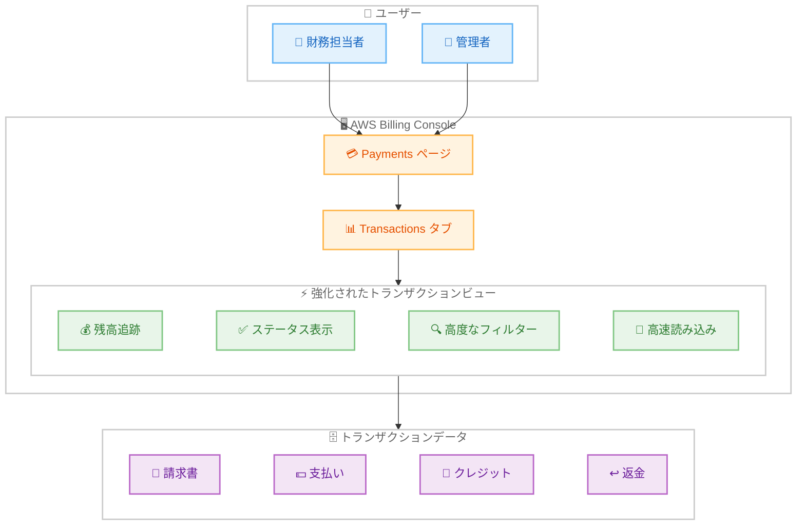

# AWS Billing Console - 強化されたトランザクションビュー

**リリース日**: 2026年01月14日
**サービス**: AWS Billing and Cost Management
**機能**: 強化されたトランザクションビュー (Enhanced Transactions View)

## 概要

AWS は、AWS Billing and Cost Management コンソールの Payments ページにある Transactions ビューに、大幅な改善を発表しました。この強化により、パフォーマンスの高速化、支払い照合の簡素化、データ精度の向上が実現され、顧客はすべての財務トランザクションを管理するための統合インターフェースを利用できるようになりました。この機能は、可視性を向上させ、支払い追跡に費やす時間を削減します。

強化されたビューは、ページの読み込み時間がミリ秒単位となり、以前は数分かかっていた処理が大幅に高速化されました。数万件のトランザクションを持つ顧客でも、タイムアウトすることなく、完全なトランザクション履歴にアクセスできるようになりました。包括的な残高追跡、明確なトランザクションステータスインジケータ、高度なフィルタリングオプションなどの新機能が導入されています。

**アップデート前の課題**

- トランザクション履歴の読み込みに数分かかり、数万件のトランザクションがある場合はタイムアウトが発生していた
- 請求書のステータス、支払残高、利用可能な資金の可視性が不十分だった
- トランザクションのフィルタリングや検索が限定的で、特定のトランザクションを見つけるのが困難だった
- Billing Transfer を使用している組織では、複数のアカウント間のトランザクションを追跡するのが複雑だった

**アップデート後の改善**

- ページの読み込み時間がミリ秒単位に短縮され、数万件のトランザクションでもタイムアウトなしでアクセス可能
- 請求書のステータス、支払残高 (+/-)、利用可能な資金を明確に表示
- 高度なフィルタリングオプションにより、特定のトランザクションを素早く検索可能
- Billing Transfer 使用組織向けに「Usage Consolidation Account」列を追加し、複数アカウント間のトランザクション追跡を容易化

## アーキテクチャ図



この図は、強化されたトランザクションビューが、高速なパフォーマンス、明確なステータス表示、高度なフィルタリングにより、財務担当者や管理者がトランザクションデータを効率的に管理できる仕組みを示しています。

## サービスアップデートの詳細

### 主要機能

1. **大幅なパフォーマンス向上**
   - ページの読み込み時間が数分からミリ秒単位に短縮
   - 数万件のトランザクションでも、タイムアウトなしで完全な履歴にアクセス可能
   - レスポンシブで直感的なユーザーインターフェース

2. **包括的な残高追跡**
   - 請求書のステータスを一目で確認
   - 支払残高 (+) と利用可能な資金 (-) を明確に表示
   - 未払い金額、クレジット、前払い残高を統合的に管理

3. **高度なフィルタリングオプション**
   - 日付範囲、トランザクションタイプ、ステータスでフィルタリング
   - 特定の請求書番号やトランザクション ID を検索
   - カスタムビューを保存して、頻繁に使用するフィルターを再利用

4. **Billing Transfer 対応**
   - 「Usage Consolidation Account」列を追加
   - 複数の AWS Organizations 間のトランザクションを容易に追跡
   - 組織間の請求とコストの集約を簡素化

5. **シングルビューでの完全な可視性**
   - すべてのトランザクションを単一のビューで表示
   - パフォーマンスへの影響なしで、数千件のレコードを閲覧
   - エクスポート機能により、外部ツールでの分析も可能

## 技術仕様

### 新しいトランザクションビューの機能

| 機能 | 説明 |
|------|------|
| **読み込み時間** | ミリ秒単位 (以前は数分) |
| **トランザクション容量** | 数万件のトランザクションを同時表示可能 |
| **残高インジケータ** | +/- 記号で支払残高と利用可能資金を明確に表示 |
| **フィルタリング** | 日付、タイプ、ステータス、アカウントで高度なフィルタリング |
| **Billing Transfer 列** | Usage Consolidation Account 列で複数組織を管理 |

### トランザクションステータスの種類

| ステータス | 説明 |
|-----------|------|
| **Pending** | 処理中のトランザクション |
| **Completed** | 完了したトランザクション |
| **Failed** | 失敗したトランザクション |
| **Refunded** | 返金されたトランザクション |

### フィルタリングオプション

```javascript
// フィルタリング例 (概念的な表現)
{
  "dateRange": {
    "from": "2025-01-01",
    "to": "2026-01-15"
  },
  "transactionType": ["Invoice", "Payment", "Credit", "Refund"],
  "status": ["Completed", "Pending"],
  "usageConsolidationAccount": "123456789012"
}
```

## 設定方法

### 前提条件

1. AWS アカウントが有効である
2. AWS Billing and Cost Management コンソールへのアクセス権限
3. (オプション) Billing Transfer を使用している場合、複数の AWS Organizations への アクセス権限

### 手順

#### ステップ1: AWS Billing Console にアクセス

```bash
# AWS Management Console にログイン
# 「Billing and Cost Management」サービスを開く
# または、直接 URL にアクセス: https://console.aws.amazon.com/billing/
```

AWS Management Console から、Billing and Cost Management サービスにアクセスします。

#### ステップ2: Transactions ビューを開く

1. 左側のナビゲーションメニューから「Payments」を選択
2. 「Transactions」タブをクリック
3. 強化されたトランザクションビューが自動的に読み込まれます (2026年1月12日以降、すべての顧客に自動適用)

#### ステップ3: フィルターを使用してトランザクションを検索

1. ページ上部のフィルターバーを使用
2. 日付範囲を指定: 「From」と「To」フィールドに日付を入力
3. トランザクションタイプを選択: Invoice, Payment, Credit, Refund など
4. ステータスを選択: Completed, Pending, Failed など
5. (Billing Transfer 使用時) Usage Consolidation Account でフィルタリング
6. 「Apply」をクリックしてフィルターを適用

#### ステップ4: トランザクション詳細を確認

```bash
# 特定のトランザクションをクリックして詳細を表示
# - トランザクション ID
# - 金額
# - 日付
# - ステータス
# - 関連する請求書番号
# - Usage Consolidation Account (Billing Transfer 使用時)
```

トランザクションをクリックすると、詳細情報が表示されます。

#### ステップ5: データをエクスポート (オプション)

```bash
# 「Export」ボタンをクリック
# CSV または JSON 形式でエクスポート
# 外部ツール (Excel, Google Sheets など) で分析
```

トランザクションデータをエクスポートして、外部ツールでさらに詳細な分析を行うことができます。

## メリット

### ビジネス面

- **財務透明性の向上**: すべてのトランザクションを単一のビューで確認し、支払いと請求の状況を一目で把握
- **時間の節約**: 読み込み時間の大幅な短縮により、財務担当者の生産性が向上
- **支払い照合の簡素化**: 明確なステータスインジケータと残高追跡により、支払い照合が容易
- **コンプライアンスと監査**: 完全なトランザクション履歴により、監査とコンプライアンス要件を満たす

### 技術面

- **高速なパフォーマンス**: ミリ秒単位の読み込み時間により、ユーザー体験が大幅に向上
- **スケーラビリティ**: 数万件のトランザクションでも、パフォーマンス低下なしで処理
- **高度なフィルタリング**: 複雑な検索条件で、必要なトランザクションを素早く特定
- **Billing Transfer 統合**: 複数の AWS Organizations を使用している組織でも、簡単にトランザクションを追跡

## デメリット・制約事項

### 制限事項

- 過去のトランザクションデータは、AWS のデータ保持ポリシーに従って保存される (通常、数年間)
- エクスポートできるトランザクション数には上限がある可能性がある
- リアルタイムではなく、トランザクションの反映に若干の遅延がある場合がある

### 考慮すべき点

- 新しいビューは自動的に適用されるため、ユーザーは新しいインターフェースに慣れる必要がある
- カスタムフィルターは現在のセッションのみ保存され、別のセッションでは再設定が必要な場合がある
- 複雑なフィルター条件では、結果の取得に時間がかかる場合がある

## ユースケース

### ユースケース1: 月次支払い照合

**シナリオ**: 財務担当者が、毎月の AWS 請求書と実際の支払いを照合し、未払い金額を確認する必要がある。

**実装例**:
1. Transactions ビューを開く
2. 日付範囲を「先月」に設定
3. トランザクションタイプを「Invoice」と「Payment」に設定
4. ステータスを「Completed」と「Pending」に設定
5. 残高インジケータ (+/-) を確認して、未払い金額を特定
6. データをエクスポートして、財務システムに統合

**効果**: 数秒で先月のすべてのトランザクションを確認し、未払い金額を特定できます。以前は数分かかっていた作業が、大幅に効率化されます。

### ユースケース2: Billing Transfer を使用した複数組織の管理

**シナリオ**: 複数の AWS Organizations を管理しており、各組織のトランザクションを個別に追跡する必要がある。

**実装例**:
1. Transactions ビューを開く
2. 「Usage Consolidation Account」列を確認
3. 特定の組織のアカウント ID でフィルタリング
4. その組織の請求書、支払い、クレジットを確認
5. 各組織のトランザクションをエクスポートして、個別にレポート作成

**効果**: 複数の AWS Organizations を一元的に管理し、各組織のトランザクションを容易に追跡できます。Billing Transfer の使用により、組織間の請求とコストの集約が簡素化されます。

### ユースケース3: 未払い請求書の特定と支払い

**シナリオ**: 未払いの請求書を特定し、すぐに支払いを行いたい。

**実装例**:
1. Transactions ビューを開く
2. ステータスを「Pending」に設定
3. トランザクションタイプを「Invoice」に設定
4. +/- インジケータで、支払残高 (+) を確認
5. 未払い請求書をクリックして詳細を表示
6. 「Pay now」ボタンをクリックして支払いを実行

**効果**: 未払い請求書を素早く特定し、すぐに支払いを実行できます。残高インジケータにより、支払残高が一目で確認でき、延滞を防止できます。

## 料金

強化されたトランザクションビュー機能自体に追加料金はかかりません。すべての AWS 顧客が無料で利用できます。

AWS Billing and Cost Management コンソールの使用には、料金は発生しません。AWS サービスの使用に対してのみ、標準の料金が適用されます。

## 利用可能リージョン

この機能は、2026年1月12日にすべての AWS 顧客に自動的に提供され、すべての AWS 商用リージョンで利用可能です。

- 米国東部 (バージニア北部、オハイオ)
- 米国西部 (オレゴン、北カリフォルニア)
- 欧州 (アイルランド、フランクフルト、ロンドン)
- アジアパシフィック (東京、シンガポール、シドニー、ソウル)
- その他すべての AWS 商用リージョン

## 関連サービス・機能

- **AWS Cost Explorer**: コスト分析と最適化のための詳細なビジュアライゼーション
- **AWS Budgets**: 予算の設定とアラートの受信
- **AWS Cost and Usage Reports**: 詳細なコストと使用状況データの取得
- **AWS Billing Transfer**: 複数の AWS Organizations 間で請求とコストを集約
- **AWS Cost Anomaly Detection**: 異常なコスト増加を自動的に検出

## 参考リンク

- [公式発表 (What's New)](https://aws.amazon.com/about-aws/whats-new/2026/01/enhanced-transactions-view-aws-billing-console/)
- [ドキュメント: View remaining invoices, unapplied funds, and payment history](https://docs.aws.amazon.com/awsaccountbilling/latest/aboutv2/view-payment-info.html)
- [ドキュメント: AWS Billing Console User Guide](https://docs.aws.amazon.com/awsaccountbilling/latest/aboutv2/billing-what-is.html)
- [AWS Blog: New AWS Billing Transfer for centrally managing AWS billing and costs across multiple organizations](https://aws.amazon.com/blogs/aws/new-aws-billing-transfer-for-centrally-managing-aws-billing-and-costs-across-multiple-organizations/)
- [AWS Billing and Cost Management](https://aws.amazon.com/aws-cost-management/aws-billing/)

## まとめ

AWS Billing Console の強化されたトランザクションビューは、パフォーマンスの大幅な向上、包括的な残高追跡、高度なフィルタリングオプションにより、財務管理を革新する重要なアップデートです。読み込み時間がミリ秒単位に短縮され、数万件のトランザクションでもタイムアウトなしでアクセスできるようになりました。Billing Transfer を使用している組織では、複数の AWS Organizations 間のトランザクションを容易に追跡できます。この機能は、すべての AWS 顧客に自動的に提供され、追加料金なしで利用できます。財務担当者と管理者は、この強化されたビューを活用して、支払い照合を簡素化し、業務効率を大幅に向上させることができます。
