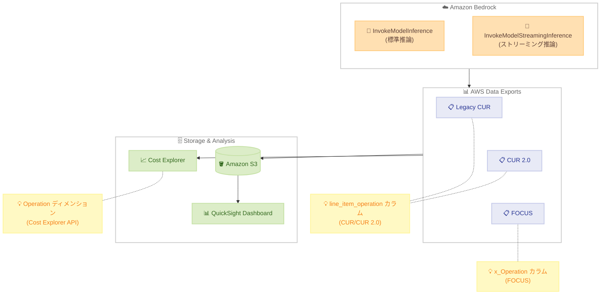

# AWS Data Exports - Amazon Bedrock 使用量の詳細可視化

**リリース日**: 2026 年 01 月 15 日
**サービス**: AWS Data Exports
**機能**: Amazon Bedrock モデル使用量の詳細なオペレーション可視化

## 概要

AWS Data Exports が、Amazon Bedrock のオペレーションタイプをコストレポートで区別できるようになり、コスト分析と最適化が強化されました。この詳細なオペレーション情報は、Cost and Usage Reports (CUR)、CUR 2.0、および Data Exports for FOCUS で利用可能です。

この機能は、FinOps チーム、コスト最適化の専門家、詳細な請求分析が必要な Amazon Bedrock を使用する組織にとって特に価値があります。これまで「Usage」という汎用的なラベルで表示されていた情報が、`InvokeModelInference` や `InvokeModelStreamingInference` などの具体的なオペレーションタイプとして表示されるようになります。

**アップデート前の課題**

- Amazon Bedrock の使用量がコストレポートで「Usage」という汎用的なラベルでのみ表示されていた
- 推論タイプ (標準推論、ストリーミング推論など) を区別できなかった
- 詳細な使用パターンの追跡とコスト最適化の機会を特定することが困難だった
- すべての基盤モデルにわたる詳細な使用量分析ができなかった

**アップデート後の改善**

- `InvokeModelInference` や `InvokeModelStreamingInference` などの具体的なオペレーションタイプが表示される
- Legacy CUR および CUR 2.0 レポートの `line_item_operation` カラムで確認可能
- FOCUS レポートの `x_Operation` カラムで確認可能
- AWS Cost Explorer API の Operation ディメンション値で確認可能
- すべての Amazon Bedrock 基盤モデルに対して詳細な可視化が拡張された

## アーキテクチャ図



Amazon Bedrock の異なるオペレーションタイプが AWS Data Exports を通じて詳細に記録され、複数のレポート形式と分析ツールで可視化される仕組みを示しています。

## サービスアップデートの詳細

### 主要機能

1. **詳細なオペレーションタイプの可視化**
   - `InvokeModelInference`: 標準的な推論リクエスト
   - `InvokeModelStreamingInference`: ストリーミング推論リクエスト
   - 汎用的な「Usage」ラベルから具体的なオペレーション名への移行

2. **複数のレポート形式でのサポート**
   - **Legacy CUR**: `line_item_operation` カラムに表示
   - **CUR 2.0**: `line_item_operation` カラムに表示
   - **FOCUS**: `x_Operation` カラムに表示
   - **Cost Explorer API**: Operation ディメンション値として利用可能

3. **全基盤モデルへの対応**
   - すべての Amazon Bedrock 基盤モデルに対して詳細な可視化が有効
   - モデルプロバイダー全体での使用パターンの正確な追跡が可能
   - コスト最適化の機会を特定しやすくなる

## 技術仕様

### オペレーションタイプ

| オペレーション名 | 説明 | ユースケース |
|-----------------|------|--------------|
| InvokeModelInference | 標準的な推論リクエスト | バッチ処理、非対話型アプリケーション |
| InvokeModelStreamingInference | ストリーミング推論リクエスト | チャットボット、対話型アプリケーション |

### レポート形式別のカラム名

| レポート形式 | カラム名 | 説明 |
|--------------|----------|------|
| Legacy CUR | `line_item_operation` | オペレーションタイプを含む |
| CUR 2.0 | `line_item_operation` | オペレーションタイプを含む |
| FOCUS | `x_Operation` | オペレーションタイプを含む (AWS 固有カラム) |
| Cost Explorer API | Operation dimension | API クエリでのフィルタリングとグループ化に使用 |

### Data Exports のテーブル設定

CUR 2.0 では、以下のテーブル設定を通じてデータの粒度を制御できます。

| 設定項目 | 説明 |
|---------|------|
| TIME_GRANULARITY | 時間の粒度 (日次、時間単位) |
| INCLUDE_RESOURCES | リソース ID を含めるかどうか |
| INCLUDE_SPLIT_COST_ALLOCATION_DATA | コスト配分データを分割するかどうか |

## 設定方法

### 前提条件

1. AWS アカウントで AWS Billing and Cost Management へのアクセス権限
2. Amazon Bedrock を使用していること
3. Cost and Usage Report または Data Exports を有効にしていること

### 手順

#### ステップ 1: Data Exports の作成または既存レポートの確認

既に Cost and Usage Report または Data Exports を使用している場合、この機能は自動的に有効になります。新規に作成する場合は以下の手順を実行します。

1. AWS マネジメントコンソールにサインイン
2. **Billing and Cost Management** コンソールに移動
3. **Data Exports** を選択
4. **Create export** をクリック
5. エクスポートタイプ (CUR 2.0、FOCUS など) を選択
6. S3 バケットの設定と出力形式を選択

#### ステップ 2: Cost Explorer でのオペレーション別コスト分析

```bash
# AWS CLI を使用して Cost Explorer API で Operation ディメンションを使用
aws ce get-cost-and-usage \
  --time-period Start=2026-01-01,End=2026-01-31 \
  --granularity DAILY \
  --metrics "UnblendedCost" \
  --filter file://filter.json \
  --group-by Type=DIMENSION,Key=OPERATION
```

`filter.json` の例:
```json
{
  "Dimensions": {
    "Key": "SERVICE",
    "Values": ["Amazon Bedrock"]
  }
}
```

このコマンドにより、Amazon Bedrock の使用量をオペレーションタイプ別にグループ化してコストを分析できます。

#### ステップ 3: QuickSight ダッシュボードでの可視化

Data Exports を S3 に出力している場合、QuickSight を使用して可視化できます。

1. QuickSight で新しいデータセットを作成
2. S3 の Data Exports をデータソースとして選択
3. `line_item_operation` または `x_Operation` カラムでグループ化
4. オペレーションタイプ別のコストトレンドを可視化

## メリット

### ビジネス面

- **詳細なコスト可視化**: Amazon Bedrock の使用パターンを正確に追跡し、コスト配分の精度が向上
- **コスト最適化の機会**: 標準推論とストリーミング推論のコストを比較し、最適な推論タイプを選択
- **FinOps の強化**: FinOps チームが詳細な請求分析を実施し、コスト効率を改善

### 技術面

- **自動的に有効**: 既存の Cost and Usage Report で自動的に詳細なオペレーション情報が利用可能
- **複数のレポート形式でサポート**: Legacy CUR、CUR 2.0、FOCUS すべてでサポート
- **全基盤モデルに対応**: すべての Amazon Bedrock 基盤モデルで詳細な可視化が利用可能
- **API 統合**: Cost Explorer API を通じてプログラムでアクセス可能

## デメリット・制約事項

### 制限事項

- この機能は Amazon Bedrock に特化しており、他の AWS サービスでは異なるオペレーション可視化が適用される
- 過去のデータは更新されないため、この機能が有効になった日付以降のデータのみが詳細なオペレーションタイプで表示される

### 考慮すべき点

- Data Exports の S3 への出力には、S3 ストレージコストがかかる
- QuickSight でダッシュボードを作成する場合、QuickSight の料金が別途発生する

## ユースケース

### ユースケース 1: FinOps チームによるコスト配分

**シナリオ**: FinOps チームが、各部門やプロジェクトに対して Amazon Bedrock のコストを正確に配分したい。標準推論とストリーミング推論の使用量を区別して、適切なコスト配分を実施する。

**実装例**:
1. Data Exports で CUR 2.0 を有効にし、S3 に出力
2. QuickSight で Data Exports をデータソースとして使用
3. `line_item_operation` カラムでグループ化し、オペレーションタイプ別にコストを可視化
4. プロジェクトタグと組み合わせて、部門別・オペレーションタイプ別のコストレポートを作成

**効果**: 部門やプロジェクトに対して正確なコスト配分が可能になり、予算管理と費用対効果の分析が改善される。

### ユースケース 2: コスト最適化の機会の特定

**シナリオ**: 開発チームが、Amazon Bedrock の使用パターンを分析し、コスト最適化の機会を特定したい。標準推論とストリーミング推論のコストを比較し、最適な推論タイプを選択する。

**実装例**:
1. Cost Explorer で Operation ディメンションを使用してコストをグループ化
2. `InvokeModelInference` と `InvokeModelStreamingInference` のコストトレンドを比較
3. アプリケーションの要件に応じて、コスト効率の高い推論タイプを選択
4. 使用頻度の低いモデルや推論タイプを特定し、リソースを最適化

**効果**: コスト効率の高い推論タイプを選択し、Amazon Bedrock の使用コストを最適化できる。

### ユースケース 3: マルチアカウント環境でのコスト分析

**シナリオ**: 大規模な組織が AWS Organizations を使用して複数のアカウントを管理しており、各アカウントでの Amazon Bedrock の使用量を詳細に分析したい。

**実装例**:
1. 管理アカウントで Data Exports for FOCUS を有効にする
2. S3 に出力された FOCUS レポートを分析
3. `x_Operation` カラムと `line_item_usage_account_id` カラムを組み合わせて、アカウント別・オペレーションタイプ別のコストを可視化
4. コスト異常を検出し、特定のアカウントでのコスト急増を迅速に特定

**効果**: マルチアカウント環境全体での Amazon Bedrock の使用パターンを把握し、コスト異常の早期検出とコスト最適化が可能になる。

## 料金

この機能自体に追加料金はかかりません。ただし、以下の関連サービスの料金が発生します。

### 料金例

| サービス | 料金 |
|---------|------|
| Data Exports (CUR 2.0) | 無料 (S3 ストレージコストのみ) |
| Amazon S3 | S3 標準ストレージ料金が適用 |
| AWS Cost Explorer | API リクエストあたり $0.01 |
| Amazon QuickSight | Author: $24/月、Reader: $5/月 (最大 30 分) |

詳細は以下のページをご確認ください。
- [AWS Data Exports 料金](https://aws.amazon.com/aws-cost-management/aws-data-exports/pricing/)
- [Amazon S3 料金](https://aws.amazon.com/s3/pricing/)
- [AWS Cost Explorer 料金](https://aws.amazon.com/aws-cost-management/aws-cost-explorer/pricing/)

## 利用可能リージョン

AWS Data Exports は、すべての AWS 商用リージョンで利用可能です。Amazon Bedrock の詳細なオペレーション可視化は、Data Exports がサポートされているすべてのリージョンで自動的に有効になります。

## 関連サービス・機能

- **AWS Cost Explorer**: コストと使用量を視覚化し、Operation ディメンションでフィルタリング可能
- **Amazon QuickSight**: Data Exports を使用して詳細なコストダッシュボードを作成
- **AWS Budgets**: 予算を設定し、コストしきい値を超えた場合にアラートを受信
- **Amazon Bedrock**: AI 基盤モデルを使用したアプリケーション開発
- **AWS Cost Anomaly Detection**: 異常なコスト増加を自動的に検出

## 参考リンク

- [公式発表 (What's New)](https://aws.amazon.com/about-aws/whats-new/2026/01/amazon-bedrock-granular-usage-visibility/)
- [AWS Billing and Cost Management ドキュメント](https://docs.aws.amazon.com/awsaccountbilling/latest/aboutv2/billing-what-is.html)
- [AWS Data Exports ドキュメント](https://docs.aws.amazon.com/cur/latest/userguide/what-is-data-exports.html)
- [Amazon Bedrock ページ](https://aws.amazon.com/bedrock/)
- [Amazon Bedrock ドキュメント](https://docs.aws.amazon.com/bedrock/latest/userguide/models-regions.html)

## まとめ

AWS Data Exports における Amazon Bedrock の詳細なオペレーション可視化により、FinOps チームとコスト最適化の専門家は、より正確なコスト分析と最適化の機会を特定できるようになります。標準推論とストリーミング推論を区別することで、使用パターンを詳細に追跡し、コスト効率の高い推論タイプを選択できます。既存の Cost and Usage Report を使用している場合、この機能は自動的に有効になるため、すぐに詳細なコスト分析を開始できます。
