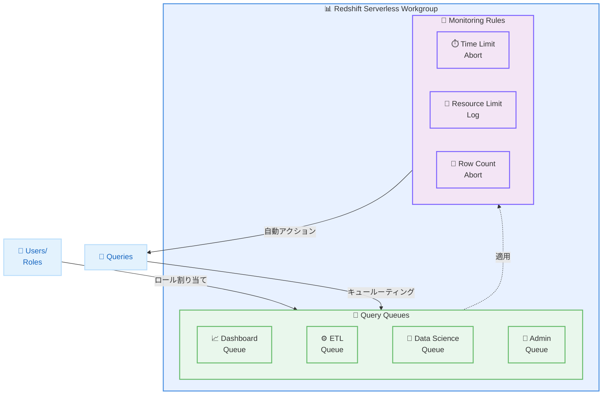

# Amazon Redshift Serverless - キューベースクエリリソース管理

**リリース日**: 2026年01月15日
**サービス**: Amazon Redshift Serverless
**機能**: キューベースクエリリソース管理

## 概要

Amazon Redshift Serverless は、キューベースクエリリソース管理機能を導入し、異なるワークロードに対してカスタマイズされたモニタリングルールを持つ専用クエリキューを作成できるようになりました。この機能により、リソース使用量をきめ細かく制御でき、メトリクスベースの述語と自動応答を設定できます。例えば、時間制限を超えたクエリや過剰なリソースを消費するクエリを自動的に中止するルールを設定できます。

従来、Query Monitoring Rules (QMR) は Redshift Serverless のワークグループレベルでのみ適用され、そのワークグループで実行されるすべてのクエリに均一に影響していました。新しいキューベースのアプローチでは、独自のモニタリングルールを持つキューを作成し、特定のユーザーロールやクエリグループに割り当てることができます。各キューは独立して動作し、ルールはそのキュー内のクエリにのみ影響します。

この機能は、Amazon Redshift Serverless をサポートするすべての AWS リージョンで利用可能です。AWS コンソールと Redshift API を使用して、キューを持つ QMR を管理できます。

**アップデート前の課題**

- Query Monitoring Rules がワークグループレベルでのみ適用され、すべてのクエリに同じルールが適用されていた
- 異なるワークロード (ダッシュボード、ETL、データサイエンス) に対して、個別のリソース制限を設定できなかった
- 重要なビジネスクエリが、リソースを大量に消費する他のクエリの影響を受ける可能性があった

**アップデート後の改善**

- ワークロードタイプごとに専用のキューを作成し、それぞれに異なるモニタリングルールを設定できるようになった
- ユーザーロールやクエリグループに基づいてキューを割り当て、きめ細かいアクセス制御が可能になった
- 各キューが独立して動作するため、重要なワークロードを他のワークロードから保護できるようになった

## アーキテクチャ図



異なるワークロードに対して専用のキューを作成し、それぞれにカスタマイズされたモニタリングルールを適用することで、リソース使用量をきめ細かく制御できます。

## サービスアップデートの詳細

### 主要機能

1. **専用クエリキューの作成**
   - ワークロードタイプ (ダッシュボード、ETL、データサイエンス、管理) ごとに専用キューを作成
   - 各キューに独自のモニタリングルールを設定
   - キューはユーザーロールやクエリグループに基づいて割り当て可能

2. **メトリクスベースの述語と自動応答**
   - クエリ実行時間、CPU 使用率、メモリ使用量、スキャン行数などのメトリクスに基づいて述語を設定
   - 閾値を超えたクエリに対して、自動的にログ記録または中止するアクションを設定
   - 10 秒ごとにルールが評価され、リアルタイムでアクションが実行される

3. **独立したキュー運用**
   - 各キューは独立して動作し、他のキューの影響を受けない
   - ルールはそのキュー内のクエリにのみ適用される
   - 重要なビジネスクエリを他のワークロードから保護可能

## 技術仕様

### サポートされるモニタリングメトリクス

| メトリクス | 説明 |
|-----------|------|
| query_cpu_time | クエリの CPU 時間 (秒) |
| query_blocks_read | クエリが読み取ったブロック数 |
| scan_row_count | スキャンされた行数 |
| query_execution_time | クエリ実行時間 (秒) |
| query_queue_time | キュー待機時間 (秒) |
| cpu_usage | CPU 使用率 (%) |
| memory_to_disk | ディスクに書き込まれたメモリ量 (MB) |
| cpu_skew | CPU スキュー (%) |
| io_skew | I/O スキュー (%) |
| rows_joined | 結合された行数 |
| nested_loop_join_row_count | ネストループ結合の行数 |
| return_row_count | 返された行数 |

### キュー設定例

```json
{
  "query_queues": [
    {
      "name": "dashboard",
      "user_roles": ["dashboard_user"],
      "rules": [
        {
          "predicate": [
            {
              "metric_name": "query_execution_time",
              "operator": ">",
              "value": 30
            }
          ],
          "action": "abort"
        }
      ]
    },
    {
      "name": "etl",
      "query_group": ["etl_group"],
      "rules": [
        {
          "predicate": [
            {
              "metric_name": "query_execution_time",
              "operator": ">",
              "value": 3600
            }
          ],
          "action": "log"
        },
        {
          "predicate": [
            {
              "metric_name": "scan_row_count",
              "operator": ">",
              "value": 1000000000
            }
          ],
          "action": "abort"
        }
      ]
    },
    {
      "name": "admin",
      "user_roles": ["admin"],
      "rules": []
    }
  ]
}
```

### サポートされていない WLM 設定キー

Redshift Serverless のキューでは、以下の WLM 設定キーとアクションはサポートされていません。

- `max_execution_time`
- `short_query_queue`
- `auto_wlm`
- `concurrency_scaling`
- `priority`
- `queue_type`
- `query_concurrency`
- `memory_percent_to_use`
- `user_group`
- `user_group_wild_card`
- `hop` アクション
- `change_query_priority` アクション

## 設定方法

### 前提条件

1. Amazon Redshift Serverless ワークグループが作成されている
2. 適切な IAM 権限が設定されている (redshift-serverless:UpdateWorkgroup)
3. ワークロードタイプとユーザーロール/クエリグループが定義されている

### 手順

#### ステップ1: ワークロードタイプの特定

```bash
# ワークロードタイプの例:
# - ダッシュボード (短時間、高頻度)
# - ETL/ELT (長時間、リソース集約的)
# - データサイエンス (変動的なリソース要求)
# - 管理タスク (メンテナンス、バックアップ)
```

#### ステップ2: キュー設定の作成

```bash
aws redshift-serverless update-workgroup \
  --workgroup-name my-workgroup \
  --config-parameters ParameterKey=wlm_json_configuration,ParameterValue='{"query_queues":[{"name":"dashboard","user_roles":["dashboard_user"],"rules":[{"predicate":[{"metric_name":"query_execution_time","operator":">","value":30}],"action":"abort"}]},{"name":"etl","query_group":["etl_group"],"rules":[{"predicate":[{"metric_name":"query_execution_time","operator":">","value":3600}],"action":"log"}]}]}'
```

このコマンドは、ダッシュボードキューと ETL キューを作成し、それぞれにモニタリングルールを設定します。

#### ステップ3: ユーザーロールへの割り当て

```sql
-- ユーザーにロールを付与
GRANT ROLE dashboard_user TO user1;
GRANT ROLE dashboard_user TO user2;

-- クエリグループを設定
SET query_group TO 'etl_group';
```

このコマンドは、ユーザーにロールを付与し、クエリをキューにルーティングします。

#### ステップ4: モニタリングとログの確認

```sql
-- キューのステータスを確認
SELECT * FROM svv_query_queue_info;

-- QMR アクションログを確認
SELECT * FROM stl_wlm_rule_action
WHERE action_time > CURRENT_TIMESTAMP - INTERVAL '1 hour';
```

このクエリは、キューのステータスと QMR アクションログを確認します。

## メリット

### ビジネス面

- **SLA 保証**: 重要なビジネスクエリに対して、厳格な時間制限とリソース保証を提供し、SLA を満たしやすくなる
- **コスト最適化**: リソースを大量に消費するクエリを制限し、無駄なコンピューティングコストを削減できる
- **パフォーマンス予測可能性**: ワークロードごとに独立したキューを使用することで、パフォーマンスが予測可能になる

### 技術面

- **きめ細かいリソース制御**: ワークロードタイプごとに異なるリソース制限を設定し、最適なパフォーマンスを実現
- **自動化されたクエリ管理**: 閾値を超えたクエリを自動的に中止またはログ記録し、手動介入を削減
- **ワークロードの分離**: 各キューが独立して動作するため、他のワークロードの影響を受けない

## デメリット・制約事項

### 制限事項

- 一部の WLM 設定キーとアクション (hop、change_query_priority など) はサポートされていない
- プロビジョニングされた Redshift クラスターの WLM とは設定方法が異なる
- キューの最大数はドキュメントで明示されていない

### 考慮すべき点

- シンプルな閾値から始め、クエリの動作と使用パターンに基づいて調整する必要がある
- ワークロード要件が明確に異なる場合にのみ、別々のキューを使用すべき
- 本番環境に適用する前に、テスト環境でルールを検証する必要がある

## ユースケース

### ユースケース1: ダッシュボードクエリの保護

**シナリオ**: ビジネスダッシュボードのクエリが、長時間実行される ETL ジョブの影響を受けないようにしたい。

**実装例**:
```json
{
  "query_queues": [
    {
      "name": "dashboard",
      "user_roles": ["dashboard_user"],
      "rules": [
        {
          "predicate": [
            {
              "metric_name": "query_execution_time",
              "operator": ">",
              "value": 30
            }
          ],
          "action": "abort"
        }
      ]
    }
  ]
}
```

**効果**: ダッシュボードクエリが 30 秒以内に完了することを保証し、ユーザーエクスペリエンスを向上させます。

### ユースケース2: ETL ジョブのリソース制限

**シナリオ**: ETL ジョブがリソースを過剰に消費し、他のワークロードに影響を与えないようにしたい。

**実装例**:
```json
{
  "query_queues": [
    {
      "name": "etl",
      "query_group": ["etl_group"],
      "rules": [
        {
          "predicate": [
            {
              "metric_name": "scan_row_count",
              "operator": ">",
              "value": 10000000000
            }
          ],
          "action": "abort"
        },
        {
          "predicate": [
            {
              "metric_name": "cpu_usage",
              "operator": ">",
              "value": 90
            }
          ],
          "action": "log"
        }
      ]
    }
  ]
}
```

**効果**: ETL ジョブが過剰なリソースを消費する場合に自動的に中止またはログ記録し、他のワークロードを保護します。

### ユースケース3: データサイエンスワークロードの管理

**シナリオ**: データサイエンスチームが実行する探索的クエリを管理し、長時間実行されるクエリを制限したい。

**実装例**:
```json
{
  "query_queues": [
    {
      "name": "data_science",
      "user_roles": ["data_scientist"],
      "rules": [
        {
          "predicate": [
            {
              "metric_name": "query_execution_time",
              "operator": ">",
              "value": 1800
            }
          ],
          "action": "log"
        },
        {
          "predicate": [
            {
              "metric_name": "nested_loop_join_row_count",
              "operator": ">",
              "value": 1000000
            }
          ],
          "action": "abort"
        }
      ]
    }
  ]
}
```

**効果**: データサイエンスチームが探索的分析を実行しつつ、非効率なクエリが自動的に中止されます。

## 料金

キューベースクエリリソース管理機能に追加料金は発生しません。Amazon Redshift Serverless の通常の料金が適用されます。

### 料金例

| 使用量 | 月額料金 (概算) |
|--------|------------------|
| 8 RPU (Redshift Processing Units) | $0.36/時間 ($259.20/月) |
| 16 RPU | $0.72/時間 ($518.40/月) |
| 32 RPU | $1.44/時間 ($1,036.80/月) |

*料金は変動する可能性があります。最新の料金については AWS 料金ページを参照してください。

## 利用可能リージョン

Amazon Redshift Serverless をサポートするすべての AWS リージョンで利用可能です。

## 関連サービス・機能

- **Amazon Redshift (プロビジョニングされたクラスター)**: WLM を使用したより高度なワークロード管理機能を提供
- **Amazon Redshift Query Editor V2**: クエリキューの設定とモニタリングを視覚的に管理できる
- **Amazon CloudWatch**: Redshift Serverless のメトリクスとログをモニタリングし、アラートを設定できる

## 参考リンク

- [公式発表 (What's New)](https://aws.amazon.com/about-aws/whats-new/2026/01/amazon-redshift-serverless-queue-based-query-resource-management/)
- [AWS Blog](https://aws.amazon.com/blogs/big-data/unlock-granular-resource-control-with-queue-based-qmr-in-amazon-redshift-serverless/)
- [ドキュメント - クエリキューの設定](https://docs.aws.amazon.com/redshift/latest/mgmt/serverless-workgroup-query-queues.html)
- [ドキュメント - クエリモニタリングルール](https://docs.aws.amazon.com/redshift/latest/dg/cm-c-wlm-query-monitoring-rules.html)

## まとめ

Amazon Redshift Serverless のキューベースクエリリソース管理は、異なるワークロードに対してきめ細かいリソース制御を提供し、重要なビジネスクエリを保護しながら、パフォーマンスの予測可能性を向上させます。ワークロードタイプごとに専用のキューを作成し、カスタマイズされたモニタリングルールを設定することで、リソースの無駄を削減し、SLA を満たしやすくなります。この機能は、サーバーレスのシンプルさときめ細かいワークロード制御のギャップを埋め、Amazon Redshift Serverless をより柔軟で強力なデータウェアハウスソリューションにします。
