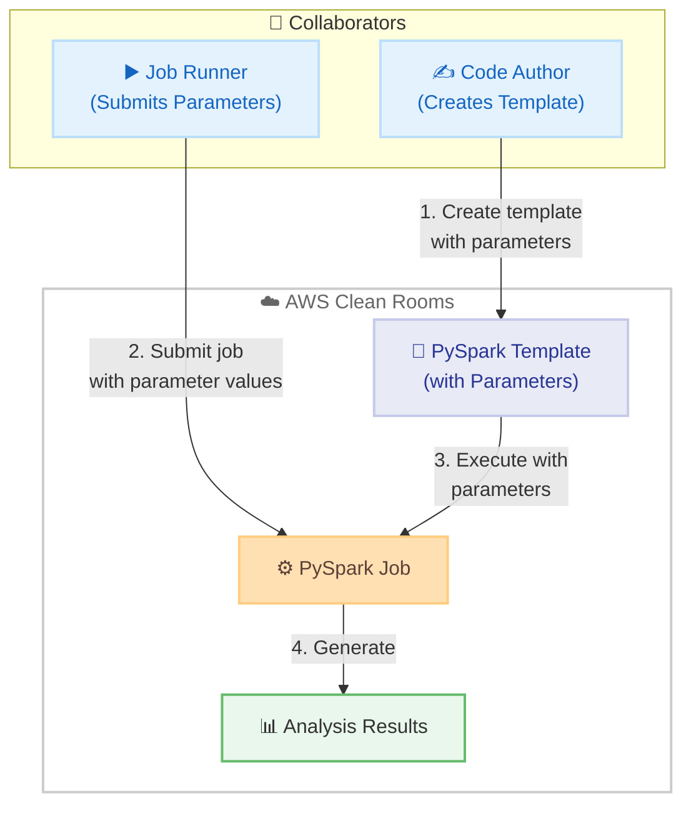

# AWS Clean Rooms - PySpark 分析テンプレートのパラメータサポート

**リリース日**: 2026年01月15日
**サービス**: AWS Clean Rooms
**機能**: PySpark 分析テンプレートのパラメータサポート

## 概要

AWS Clean Rooms が PySpark 分析テンプレートでのパラメータサポートを発表しました。この機能により、組織とそのパートナーがプライバシー強化されたデータコラボレーションのユースケースをスケールする柔軟性が向上します。このリリースにより、単一の PySpark 分析テンプレートを作成し、テンプレートコードを変更することなく、ジョブ実行時に Clean Rooms コラボレーターが異なる値を提供できるようになります。

パラメータを使用した PySpark 分析テンプレートでは、コード作成者がパラメータをサポートする PySpark テンプレートを作成し、承認されて実行する際に、ジョブ実行者がパラメータ値を直接 PySpark ジョブに送信します。例えば、広告キャンペーンのアトリビューション分析を実行する測定会社は、時間枠や地理的リージョンを動的に入力して、キャンペーンの最適化やメディアプランニングを推進するインサイトを迅速に表示できます。

**アップデート前の課題**

- PySpark 分析テンプレートで異なるパラメータ値を使用するには、テンプレートコードを毎回変更する必要があった
- 同じロジックを異なる条件 (時間枠、地理的リージョンなど) で実行するために、複数のテンプレートを作成・管理する必要があった
- テンプレートの変更には再承認が必要で、インサイト取得までの時間が長くなっていた
- 動的なパラメータ入力ができないため、データコラボレーションのスケーラビリティが制限されていた

**アップデート後の改善**

- 単一の PySpark 分析テンプレートで、ジョブ実行時に異なるパラメータ値を提供できるようになった
- テンプレートコードを変更せずに、動的にパラメータを入力してインサイトを取得できるようになった
- テンプレートの再作成や再承認が不要になり、インサイト取得までの時間が短縮された
- データコラボレーションのスケーラビリティと柔軟性が大幅に向上した

## アーキテクチャ図



コード作成者がパラメータ付きテンプレートを作成し、ジョブ実行者がパラメータ値を送信して動的に分析を実行します。

## サービスアップデートの詳細

### 主要機能

1. **パラメータのサポート**
   - PySpark 分析テンプレートにパラメータを定義できる
   - ジョブ実行時に、コラボレーターがパラメータ値を提供
   - テンプレートコードを変更せずに、異なる値で分析を実行可能

2. **動的なインサイト生成**
   - 時間枠、地理的リージョン、その他の条件を動的に入力
   - 同じロジックを異なる条件で実行し、迅速にインサイトを取得
   - 例: 広告キャンペーンのアトリビューション分析で、異なる期間やリージョンを動的に指定

3. **安全なパラメータ処理**
   - パラメータは `context["analysisParameters"]` ディクショナリからアクセス
   - すべてのパラメータ値は文字列として扱われる
   - 安全な検証と型変換が推奨される

## 技術仕様

### パラメータの定義と使用

| 項目 | 詳細 |
|------|------|
| パラメータ名 | 文字またはアンダースコアで始まり、英数字またはアンダースコアで構成 |
| パラメータ値 | すべて文字列として扱われる |
| デフォルト値 | オプションで設定可能 |
| アクセス方法 | `context["analysisParameters"]` ディクショナリからアクセス |

### API 変更履歴

| 日付 | サービス | 変更内容 |
|------|----------|----------|
| 2026/01/15 | [AWS Clean Rooms Service](https://awsapichanges.com/archive/changes/b64df2-cleanrooms.html) | 3 updated api methods - PySpark 分析テンプレートのパラメータサポート追加 |

### パラメータの安全な使用例

```python
# パラメータへのアクセス
params = context["analysisParameters"]

# パラメータの検証と型変換
start_date = params.get("start_date", "2026-01-01")
end_date = params.get("end_date", "2026-01-31")
region = params.get("region", "us-east-1")

# DataFrame 操作での使用
filtered_df = df.filter(
    (col("date") >= start_date) &
    (col("date") <= end_date) &
    (col("region") == region)
)
```

## 設定方法

### 前提条件

1. アクティブな AWS Clean Rooms コラボレーションへのメンバーシップ
2. 少なくとも 1 つの設定済みテーブルへのアクセス
3. 分析テンプレートを作成する権限
4. S3 バケットに保存された Python ユーザースクリプトと仮想環境
5. S3 バケットからコードを読み取る権限

### 手順

#### ステップ1: パラメータ付き PySpark スクリプトを作成

```python
from pyspark.sql import SparkSession
from pyspark.sql.functions import col

# Spark セッションの取得
spark = context["spark"]

# パラメータの取得
params = context["analysisParameters"]
start_date = params.get("start_date")
end_date = params.get("end_date")
region = params.get("region")

# テーブルの読み込み
df = spark.table("campaign_data")

# パラメータを使用したフィルタリング
filtered_df = df.filter(
    (col("date") >= start_date) &
    (col("date") <= end_date) &
    (col("region") == region)
)

# 集計
result = filtered_df.groupBy("campaign_id").agg(
    {"impressions": "sum", "clicks": "sum", "conversions": "sum"}
)

# 結果の保存
result.write.mode("overwrite").saveAsTable("analysis_results")
```

スクリプトを S3 バケットにアップロードします。

#### ステップ2: PySpark 分析テンプレートを作成

```bash
# AWS CLI で分析テンプレートを作成
aws cleanrooms create-analysis-template \
    --collaboration-identifier <collaboration-id> \
    --name "Campaign Attribution Analysis" \
    --description "Attribution analysis with dynamic parameters" \
    --format PYSPARK \
    --source s3://my-bucket/scripts/attribution_analysis.py \
    --parameters ParameterName=start_date,DefaultValue=2026-01-01 \
                 ParameterName=end_date,DefaultValue=2026-01-31 \
                 ParameterName=region,DefaultValue=us-east-1
```

コンソールまたは CLI でテンプレートを作成し、パラメータを定義します。

#### ステップ3: ジョブ実行時にパラメータ値を提供

```bash
# ジョブ実行時にパラメータ値を指定
aws cleanrooms start-protected-query \
    --membership-identifier <membership-id> \
    --sql-parameters analysisParameters={start_date=2026-01-15,end_date=2026-01-31,region=eu-west-1}
```

ジョブ実行者が、実行時に動的にパラメータ値を提供します。

## メリット

### ビジネス面

- **インサイト取得の加速**: テンプレートコードの変更や再承認が不要になり、インサイト取得までの時間を短縮
- **スケーラビリティの向上**: 単一のテンプレートで複数の条件を動的に実行でき、データコラボレーションのスケールが容易
- **コスト削減**: テンプレートの重複作成や管理が不要になり、運用コストを削減

### 技術面

- **柔軟性の向上**: 同じロジックを異なるパラメータで実行でき、分析の柔軟性が向上
- **コード再利用**: 単一のテンプレートで複数のシナリオに対応でき、コードの再利用性が向上
- **安全な実行**: パラメータの検証と型変換により、安全にジョブを実行

## デメリット・制約事項

### 制限事項

- パラメータ名は文字またはアンダースコアで始まり、英数字またはアンダースコアで構成される必要がある
- すべてのパラメータ値は文字列として扱われ、型変換が必要
- パラメータの不適切な使用 (例: `eval()` や `exec()` での実行) はセキュリティリスクとなる

### 考慮すべき点

- パラメータの検証と型変換を適切に実装する必要がある
- SQL インジェクションやコードインジェクションを防ぐため、安全なパラメータ処理パターンを使用する
- テンプレート作成後にアーティファクト (ユーザースクリプトや仮想環境) を変更または削除すると、すべての将来のジョブが失敗する

## ユースケース

### ユースケース1: 広告キャンペーンのアトリビューション分析

**シナリオ**: 測定会社が広告キャンペーンのアトリビューション分析を実行し、異なる時間枠と地理的リージョンでインサイトを取得したい。

**実装例**:
```python
# パラメータの取得
params = context["analysisParameters"]
start_date = params.get("start_date", "2026-01-01")
end_date = params.get("end_date", "2026-01-31")
region = params.get("region", "us-east-1")

# キャンペーンデータのフィルタリング
filtered_campaigns = campaign_df.filter(
    (col("date") >= start_date) &
    (col("date") <= end_date) &
    (col("region") == region)
)

# アトリビューション分析
attribution_results = filtered_campaigns.groupBy("campaign_id", "channel").agg(
    {"conversions": "sum", "revenue": "sum"}
)
```

**効果**: 時間枠とリージョンを動的に変更してキャンペーンパフォーマンスを迅速に分析し、メディアプランニングを最適化。

### ユースケース2: 顧客セグメント分析

**シナリオ**: 小売企業が顧客セグメントごとの購買行動を分析し、異なる期間や製品カテゴリで比較したい。

**実装例**:
```python
# パラメータの取得
params = context["analysisParameters"]
start_date = params.get("start_date")
end_date = params.get("end_date")
category = params.get("category", "all")

# 顧客購買データのフィルタリング
filtered_purchases = purchase_df.filter(
    (col("purchase_date") >= start_date) &
    (col("purchase_date") <= end_date)
)

if category != "all":
    filtered_purchases = filtered_purchases.filter(col("category") == category)

# セグメント分析
segment_analysis = filtered_purchases.groupBy("customer_segment").agg(
    {"amount": "sum", "quantity": "sum"}
)
```

**効果**: 異なる期間や製品カテゴリで顧客セグメントの購買行動を動的に分析し、マーケティング戦略を最適化。

### ユースケース3: 投資判断のためのデータ分析

**シナリオ**: 投資会社が異なる市場セクターや期間でポートフォリオパフォーマンスを分析したい。

**実装例**:
```python
# パラメータの取得
params = context["analysisParameters"]
start_date = params.get("start_date")
end_date = params.get("end_date")
sector = params.get("sector", "all")

# ポートフォリオデータのフィルタリング
filtered_portfolio = portfolio_df.filter(
    (col("date") >= start_date) &
    (col("date") <= end_date)
)

if sector != "all":
    filtered_portfolio = filtered_portfolio.filter(col("sector") == sector)

# パフォーマンス分析
performance = filtered_portfolio.groupBy("asset_id").agg(
    {"return": "avg", "volatility": "stddev"}
)
```

**効果**: 異なる市場セクターや期間でポートフォリオパフォーマンスを動的に分析し、投資判断を加速。

## 料金

AWS Clean Rooms の料金は、以下の要素に基づいて計算されます:

- スキャンされたデータ量 (TB あたり)
- 処理されたクエリ数
- データストレージ (S3 ストレージ料金)

パラメータサポート自体に追加料金はかかりません。詳細な料金情報は [AWS Clean Rooms 料金ページ](https://aws.amazon.com/clean-rooms/pricing/) を参照してください。

## 利用可能リージョン

AWS Clean Rooms は以下のリージョンで利用可能です:

- US East (N. Virginia)
- US East (Ohio)
- US West (Oregon)
- Europe (Ireland)
- Europe (Frankfurt)
- Europe (London)
- Asia Pacific (Tokyo)
- Asia Pacific (Seoul)
- Asia Pacific (Singapore)
- Asia Pacific (Sydney)

詳細なリージョン情報は [AWS Regions テーブル](https://docs.aws.amazon.com/general/latest/gr/clean-rooms.html#clean-rooms_region) を参照してください。

## 関連サービス・機能

- **Amazon S3**: PySpark スクリプトと仮想環境を保存
- **AWS Glue**: データカタログとデータ統合
- **Amazon Athena**: SQL クエリによるデータ分析
- **AWS Lake Formation**: データレイクのセキュリティとガバナンス

## 参考リンク

- [公式発表 (What's New)](https://aws.amazon.com/about-aws/whats-new/2026/01/aws-clean-rooms-parameters-pyspark-analysis-templates/)
- [ドキュメント: PySpark analysis templates](https://docs.aws.amazon.com/clean-rooms/latest/userguide/pyspark-analysis-templates.html)
- [ドキュメント: Working with parameters in PySpark analysis templates](https://docs.aws.amazon.com/clean-rooms/latest/userguide/pyspark-parameter-handling.html)
- [AWS Clean Rooms](https://aws.amazon.com/clean-rooms/)
- [AWS Clean Rooms 料金ページ](https://aws.amazon.com/clean-rooms/pricing/)

## まとめ

AWS Clean Rooms の PySpark 分析テンプレートでパラメータサポートが追加され、単一のテンプレートで異なる条件を動的に実行できるようになりました。これにより、テンプレートコードの変更や再承認が不要になり、インサイト取得までの時間が大幅に短縮されます。広告キャンペーンのアトリビューション分析、顧客セグメント分析、投資判断など、幅広いデータコラボレーションのユースケースでスケーラビリティと柔軟性が向上します。安全なパラメータ処理パターンを使用することで、セキュリティリスクを回避しながら、プライバシー強化されたデータコラボレーションを実現できます。
