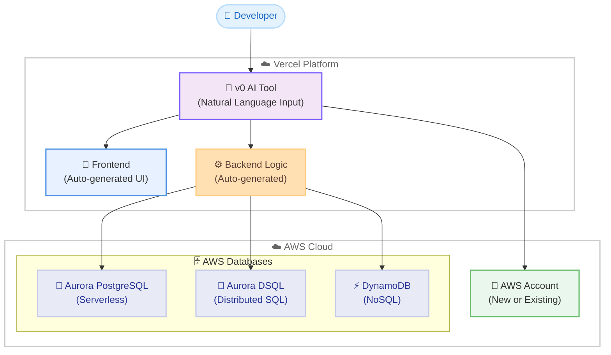

# AWS Databases - Vercel v0 統合

**リリース日**: 2026年01月15日
**サービス**: AWS Databases (Amazon Aurora PostgreSQL, Amazon Aurora DSQL, Amazon DynamoDB)
**機能**: Vercel v0 による AI 駆動型データベース統合

## 概要

Amazon Aurora PostgreSQL、Amazon Aurora DSQL、Amazon DynamoDB のサーバーレスデータベースが Vercel の v0 プラットフォームで利用可能になりました。v0 は、自然言語のプロンプトからフルスタックの Web アプリケーションを数分で生成する AI 駆動型ツールです。このリリースにより、開発者は v0 内で自然言語を使用してアプリケーションを構築しながら、AWS データベースを直接作成・接続できるようになります。

v0 は、フロントエンドのユーザーインターフェースとバックエンドのロジックを自動生成し、アプリケーションのニーズに最適な AWS データベースにデータを保存します。エンドツーエンドのセットアップ体験を提供し、新規 AWS アカウントの作成またはアカウントのリンクが v0 インターフェースから直接実行できます。Vercel から作成された新規 AWS アカウントには、3 つのデータベースすべてへのアクセスと、最大 6 ヶ月間使用できる 100 USD のクレジットが含まれます。

**アップデート前の課題**

- フルスタックアプリケーションの開発では、フロントエンド開発、バックエンドロジック、データベース設定を個別に構成する必要があった
- データベースプロビジョニングには AWS コンソールへの切り替えと手動設定が必要だった
- プロトタイピングから本番環境へのスケールアップにはインフラ管理の知識が必要だった
- 複数のツールとプラットフォームを行き来することで、開発速度が低下していた

**アップデート後の改善**

- 自然言語のプロンプトだけで、フロントエンド、バックエンド、データベースを含む完全なアプリケーションを構築できる
- v0 インターフェース内で AWS アカウントの作成とデータベース設定が完結する
- サーバーレスデータベースが自動的にスケールダウンし、使用していないときはゼロまでスケールすることでコストを削減できる
- 100 USD のクレジットにより、プロトタイピングと初期開発のコストを最小化できる

## アーキテクチャ図



v0 は開発者の自然言語入力から UI とバックエンドロジックを自動生成し、AWS データベースと直接統合します。

## サービスアップデートの詳細

### 主要機能

1. **自然言語によるアプリケーション生成**
   - 開発者は「何を作りたいか」を自然言語で記述するだけで、v0 が完全なアプリケーションを生成
   - フロントエンド UI、バックエンドロジック、データベースの選択と接続を自動化
   - コーディングやインフラ設定の知識がなくても本番レベルのアプリケーションを構築可能

2. **統合された AWS アカウント管理**
   - v0 インターフェース内で新規 AWS アカウントの作成が可能
   - 既存の AWS アカウントへのリンクもサポート
   - Vercel ダッシュボードから AWS 設定ポータルにアクセスし、プラン管理、支払い情報の追加、使用状況の確認が可能

3. **3 つのサーバーレスデータベースオプション**
   - **Amazon Aurora PostgreSQL**: リレーショナルデータベースのサーバーレスオプション
   - **Amazon Aurora DSQL**: 分散 SQL データベース
   - **Amazon DynamoDB**: NoSQL データベース
   - すべてのデータベースがインフラ管理不要で、使用していないときは自動的にゼロまでスケールダウン

4. **100 USD のクレジット**
   - Vercel から作成された新規 AWS アカウントには、3 つのデータベースすべてで使用できる 100 USD のクレジットが含まれる
   - 最大 6 ヶ月間有効
   - プロトタイピングや初期開発のコスト削減に貢献

## 技術仕様

### 対応データベース

| データベース | タイプ | 特徴 | 主なユースケース |
|-------------|--------|------|-----------------|
| Amazon Aurora PostgreSQL | リレーショナル (PostgreSQL 互換) | サーバーレス、自動スケーリング | トランザクション処理、複雑なクエリ |
| Amazon Aurora DSQL | 分散 SQL | 高可用性、分散トランザクション | グローバルアプリケーション、マルチリージョン |
| Amazon DynamoDB | NoSQL (キーバリュー、ドキュメント) | ミリ秒レイテンシ、サーバーレス | 高スループット、低レイテンシアプリケーション |

### API 変更履歴

関連する API 変更はありません。

### 統合設定

Vercel ダッシュボードから AWS 設定ポータルにアクセスすることで、以下の管理が可能:

- プラン管理
- 支払い情報の追加
- 使用状況の確認
- データベースリソースの設定

## 設定方法

### 前提条件

1. Vercel アカウント
2. v0 へのアクセス (https://v0.app)
3. AWS アカウント (新規作成または既存のアカウントをリンク可能)

### 手順

#### ステップ1: v0 で自然言語プロンプトを入力

```
例: "ユーザー登録とログイン機能を持つタスク管理アプリケーションを作成してください"
```

v0 に作成したいアプリケーションの内容を自然言語で記述します。

#### ステップ2: データベースを選択

v0 が自動的にアプリケーションのニーズに基づいてデータベースを推奨します。以下から選択できます:

- Amazon Aurora PostgreSQL (リレーショナルデータが必要な場合)
- Amazon Aurora DSQL (分散トランザクションが必要な場合)
- Amazon DynamoDB (高スループット、低レイテンシが必要な場合)

#### ステップ3: AWS アカウントを設定

v0 インターフェース内で以下のいずれかを選択:

1. **新規 AWS アカウントの作成**: v0 が自動的にアカウントをプロビジョニングし、100 USD のクレジットを付与
2. **既存アカウントのリンク**: AWS アカウントの認証情報を使用してリンク

#### ステップ4: アプリケーションのデプロイ

v0 が自動的に:
- フロントエンド UI を生成
- バックエンドロジックを実装
- 選択したデータベースへの接続を設定
- アプリケーションをデプロイ

## メリット

### ビジネス面

- **開発速度の向上**: 自然言語プロンプトからフルスタックアプリケーションを数分で生成し、市場投入までの時間を短縮
- **コスト削減**: サーバーレスデータベースが使用していないときは自動的にゼロまでスケールダウンし、無駄なコストを削減。新規アカウントには 100 USD のクレジットが付与される
- **参入障壁の低下**: インフラやデータベース管理の専門知識がなくても、本番レベルのアプリケーションを構築できる

### 技術面

- **シームレスな統合**: v0 インターフェース内で AWS アカウント作成、データベース設定、アプリケーションデプロイが完結
- **自動スケーリング**: サーバーレスデータベースがトラフィックに応じて自動的にスケール
- **セキュリティと信頼性**: AWS のエンタープライズグレードのセキュリティ、信頼性、パフォーマンスを活用

## デメリット・制約事項

### 制限事項

- 対応リージョンは現在 7 リージョンに限定: US East (N. Virginia)、US East (Ohio)、US West (Oregon)、Europe (Ireland)、Europe (Frankfurt)、Asia Pacific (Tokyo)、Asia Pacific (Mumbai)
- 100 USD のクレジットは新規 AWS アカウントのみが対象
- クレジットの有効期限は最大 6 ヶ月

### 考慮すべき点

- v0 が自動生成するコードやアーキテクチャのカスタマイズには追加の学習が必要な場合がある
- 複雑なエンタープライズ要件には、自動生成されたアプリケーションのカスタマイズが必要になる可能性がある

## ユースケース

### ユースケース1: スタートアップの MVP 開発

**シナリオ**: スタートアップが新しいアイデアを素早く検証するために MVP (Minimum Viable Product) を構築したい。

**実装例**:
```
v0 プロンプト: "ユーザーがプロフィールを作成し、記事を投稿・共有できるソーシャルプラットフォームを作成してください"
```

v0 が自動的に:
- ユーザー登録/ログイン UI を生成
- プロフィール管理機能を実装
- 記事投稿・共有機能を実装
- Amazon Aurora PostgreSQL でユーザーデータと記事データを管理

**効果**: 数週間かかっていた MVP 開発が数時間に短縮され、100 USD のクレジットで初期コストを最小化。

### ユースケース2: イベント駆動型アプリケーション

**シナリオ**: 高スループットでリアルタイムデータ処理が必要なイベント駆動型アプリケーションを構築したい。

**実装例**:
```
v0 プロンプト: "リアルタイムで IoT センサーデータを収集し、ダッシュボードで可視化するアプリケーションを作成してください"
```

v0 が自動的に:
- センサーデータ受信用の API を生成
- データ可視化ダッシュボードを実装
- Amazon DynamoDB でセンサーデータを高速保存・取得

**効果**: ミリ秒レイテンシで大量のセンサーデータを処理し、リアルタイム可視化を実現。

### ユースケース3: グローバル E コマースプラットフォーム

**シナリオ**: 複数リージョンにまたがるグローバル E コマースプラットフォームを構築したい。

**実装例**:
```
v0 プロンプト: "商品カタログ、カート、注文管理機能を持つ E コマースプラットフォームを作成してください"
```

v0 が自動的に:
- 商品カタログ UI を生成
- カート・注文管理機能を実装
- Amazon Aurora DSQL で複数リージョンにまたがるトランザクション処理を実現

**効果**: グローバルスケールで一貫性のあるトランザクション処理を実現し、ユーザー体験を向上。

## 料金

各データベースのサーバーレスオプションは、使用した分だけ課金されます。使用していないときは自動的にゼロまでスケールダウンするため、無駄なコストが発生しません。

### 料金例

| データベース | 課金モデル | 特徴 |
|-------------|-----------|------|
| Amazon Aurora PostgreSQL Serverless | ACU (Aurora Capacity Unit) 時間 + ストレージ | 使用していないときは自動停止 |
| Amazon Aurora DSQL | 処理されたデータ量とストレージ | 分散トランザクション処理に最適化 |
| Amazon DynamoDB | リクエスト数 + ストレージ | オンデマンドまたはプロビジョニングモード |

**100 USD クレジット**: Vercel から作成された新規 AWS アカウントには、いずれのデータベースでも使用できる 100 USD のクレジットが付与され、最大 6 ヶ月間有効です。

詳細な料金情報は、各データベースの料金ページを参照してください。

## 利用可能リージョン

以下の AWS リージョンでデータベースを作成できます:

- US East (N. Virginia)
- US East (Ohio)
- US West (Oregon)
- Europe (Ireland)
- Europe (Frankfurt)
- Asia Pacific (Tokyo)
- Asia Pacific (Mumbai)

## 関連サービス・機能

- **Amazon Aurora PostgreSQL**: PostgreSQL 互換のリレーショナルデータベース。高可用性とスケーラビリティを提供
- **Amazon Aurora DSQL**: 分散 SQL データベース。複数リージョンにまたがる一貫性のあるトランザクション処理を実現
- **Amazon DynamoDB**: NoSQL データベース。ミリ秒レイテンシで高スループットを実現
- **Vercel**: フロントエンドフレームワークのデプロイとホスティングプラットフォーム

## 参考リンク

- [公式発表 (What's New)](https://aws.amazon.com/about-aws/whats-new/2026/01/aws-databases-available-vercel-v0/)
- [v0 by Vercel](https://v0.app)
- [Vercel Marketplace - AWS](https://vercel.com/marketplace/aws)
- [AWS Databases](https://aws.amazon.com/products/databases/)
- [Amazon Aurora](https://aws.amazon.com/rds/aurora/)
- [Amazon Aurora DSQL](https://aws.amazon.com/rds/aurora/dsql/)
- [Amazon DynamoDB](https://aws.amazon.com/dynamodb/)

## まとめ

AWS Databases と Vercel v0 の統合により、開発者は自然言語プロンプトだけでフルスタックアプリケーションを構築できるようになりました。フロントエンド、バックエンド、データベースの設定が v0 インターフェース内で完結し、開発速度が大幅に向上します。サーバーレスデータベースの自動スケーリングと 100 USD のクレジットにより、プロトタイピングから本番環境へのスケールアップがコスト効率的に実現できます。スタートアップから大規模アプリケーションまで、幅広いユースケースに対応可能です。
