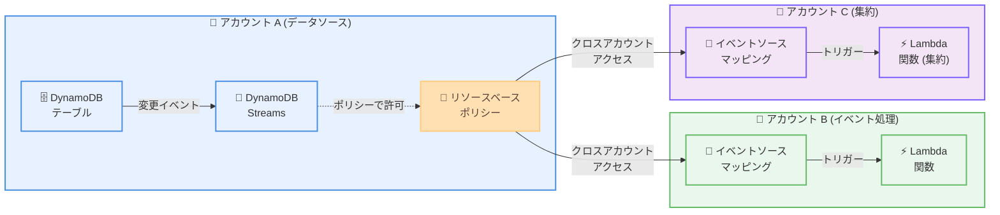

# AWS Lambda - DynamoDB Streams のクロスアカウントアクセスサポート

**リリース日**: 2026年1月15日
**サービス**: AWS Lambda
**機能**: DynamoDB Streams イベントソースマッピングのクロスアカウントアクセス

## 概要

AWS Lambda が、Amazon DynamoDB Streams のイベントソースマッピング (ESM) におけるクロスアカウントアクセスをサポートするようになりました。これにより、あるアカウントの DynamoDB Streams から別のアカウントの Lambda 関数をトリガーできるようになります。

お客様は、Lambda の完全マネージド型 DynamoDB Streams ESM を使用して、DynamoDB テーブルからの変更イベントをポーリングし、Lambda 関数をトリガーするイベント駆動型アプリケーションを構築しています。マルチアカウントアーキテクチャを実装する組織では、イベント処理を集約したり、パートナーチームとイベントを共有したりする際に、これまでは複雑なデータレプリケーションソリューションを構築する必要があり、運用オーバーヘッドが発生していました。

今回のローンチにより、DynamoDB Stream にリソースベースポリシーを設定することで、別のアカウントの Lambda 関数から DynamoDB Stream にアクセスできるようになりました。これにより、各アカウントでレプリケーションソリューションを構築するオーバーヘッドなしに、アカウント間のストリーミングアプリケーションを簡素化できます。

**アップデート前の課題**

- マルチアカウント環境で DynamoDB Streams のイベントを別のアカウントの Lambda 関数で処理するには、複雑なデータレプリケーションソリューションが必要だった
- イベント処理を集約するために、各アカウントで DynamoDB テーブルをレプリケートする必要があり、運用オーバーヘッドが増大していた
- パートナーチームやサードパーティとイベントを共有する際に、複雑なアーキテクチャが必要だった
- レプリケーションソリューションにより、データの一貫性やレイテンシの問題が発生する可能性があった

**アップデート後の改善**

- DynamoDB Stream にリソースベースポリシーを設定するだけで、別のアカウントの Lambda 関数から直接アクセスできるようになった
- データレプリケーションソリューションが不要になり、アーキテクチャが大幅に簡素化された
- イベント処理を集約するセントラルアカウントを設けることが容易になった
- パートナーチームやサードパーティとのイベント共有が簡単になった
- データの一貫性が保たれ、レイテンシが削減された

## アーキテクチャ図

この図は、アカウント A の DynamoDB Streams から、アカウント B とアカウント C の Lambda 関数をトリガーするクロスアカウントアクセスの仕組みを示しています。リソースベースポリシーにより、複数のアカウントから同じストリームにアクセスできます。

## まとめ

AWS Lambda の DynamoDB Streams クロスアカウントアクセスにより、マルチアカウントアーキテクチャでのイベント駆動型アプリケーションの構築が大幅に簡素化されました。複雑なデータレプリケーションソリューションが不要になり、リソースベースポリシーを設定するだけで、別のアカウントの Lambda 関数から DynamoDB Streams に直接アクセスできます。イベント処理の集約、パートナーとのイベント共有、マイクロサービスアーキテクチャなど、さまざまなユースケースで活用できます。マルチアカウント環境でイベント駆動型アプリケーションを構築しているお客様は、この機能を活用してアーキテクチャを簡素化することをお勧めします。

## 参考リンク

- [公式発表 (What's New)](https://aws.amazon.com/about-aws/whats-new/2026/01/aws-lambda-cross-account-access-dynamodb-streams/)
- [Lambda ESM ドキュメント: クロスアカウントアクセス](https://docs.aws.amazon.com/lambda/latest/dg/services-dynamodb-eventsourcemapping.html#services-dynamodb-eventsourcemapping-cross-account)
- [DynamoDB リソースベースポリシー](https://docs.aws.amazon.com/amazondynamodb/latest/developerguide/access-control-resource-based.html)
- [AWS Lambda デベロッパーガイド](https://docs.aws.amazon.com/lambda/latest/dg/)
