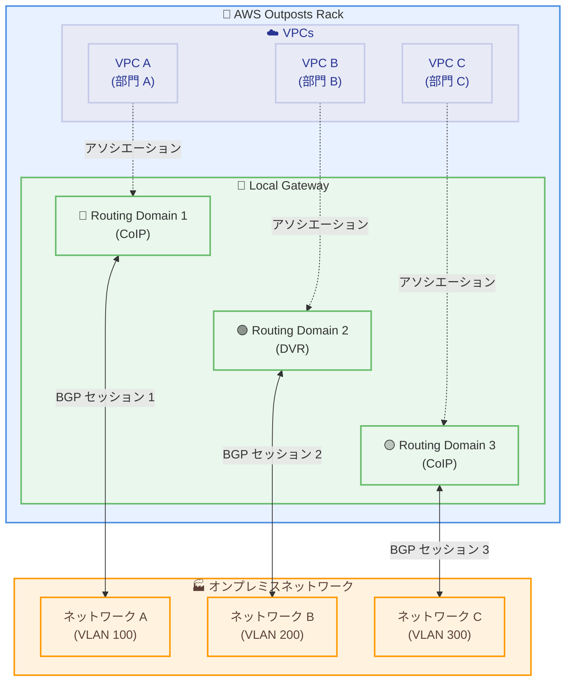

# AWS Outposts - 複数 LGW ルーティングドメイン

**リリース日**: 2026年01月16日
**サービス**: AWS Outposts
**機能**: 複数ローカルゲートウェイ (LGW) ルーティングドメイン

## 概要

AWS Outposts ラックは、複数のローカルゲートウェイ (LGW) ルーティングドメインをサポートし、Outpost ごとに最大 10 個の分離されたルーティングドメインを作成できるようになりました。各ルーティングドメインは、独立したルートテーブルと BGP セッションをオンプレミスネットワークに持ち、ルーティングドメイン間でトラフィックを分離できます。また、同じ Outpost 上で顧客所有 IP (CoIP) モードと直接 VPC ルーティング (DVR) モードの両方を使用できるようになりました。

複数の LGW ルーティングドメインを使用することで、Outpost を共有する異なる部門やビジネスユニットのオンプレミスネットワーク接続をセグメント化できます。各ルーティングドメインは、独自の LGW VIF グループ、LGW ルートテーブル、VPC アソシエーションを維持し、ドメイン間でトラフィックが交差するのを防ぎます。複数の LGW ルーティングドメインは、AWS Management Console または AWS CLI を使用して設定できます。

この機能は、第 2 世代 Outposts ラックで追加料金なしで利用可能です。

**アップデート前の課題**

- 1 つの Outpost につき 1 つのルーティングドメインしか作成できず、異なる部門やビジネスユニット間でネットワークトラフィックを分離できなかった
- CoIP モードと DVR モードを同じ Outpost で同時に使用できなかった
- オンプレミスネットワークへの接続が単一のルートテーブルと BGP セッションに制限されていた

**アップデート後の改善**

- 最大 10 個の分離されたルーティングドメインを作成し、部門やビジネスユニットごとにネットワークトラフィックをセグメント化できるようになった
- 同じ Outpost 上で CoIP モードと DVR モードを同時に使用できるようになった
- 各ルーティングドメインが独立したルートテーブルと BGP セッションを持つため、きめ細かいネットワーク制御が可能になった

## アーキテクチャ図



各ルーティングドメインは独立したルートテーブルと BGP セッションを持ち、オンプレミスネットワークの異なるセグメントと接続します。

## サービスアップデートの詳細

### 主要機能

1. **最大 10 個の分離されたルーティングドメイン**
   - Outpost ごとに最大 10 個のルーティングドメインを作成可能
   - 各ルーティングドメインは独立したネットワークセグメントとして動作
   - ルーティングドメイン間でトラフィックが交差しないように論理的およびデータプレーンレベルで分離

2. **独立したルートテーブルと BGP セッション**
   - 各ルーティングドメインに独自の LGW ルートテーブルと LGW VIF グループを設定
   - オンプレミスネットワークへの独立した BGP セッションを確立
   - ルートテーブルとルーティングポリシーをルーティングドメインごとに個別に設定可能

3. **CoIP モードと DVR モードの混在サポート**
   - 同じ Outpost 上で CoIP モードと DVR モードを同時に使用可能
   - ルーティングドメインごとに CoIP または DVR を個別に設定
   - 柔軟なネットワークアーキテクチャの実装が可能

## 技術仕様

### ルーティングドメインのコンポーネント

| コンポーネント | 説明 |
|---------------|------|
| LGW ルートテーブル | ルーティングドメイン内のルーティングポリシーを定義 |
| LGW VIF グループ | オンプレミスネットワークへの物理的な接続を管理 |
| VPC アソシエーション | ルーティングドメインに接続される VPC を定義 |
| BGP セッション | オンプレミスネットワークとのルーティング情報交換 |

### ルーティングドメインの制限事項

| 項目 | 制限 |
|------|------|
| 最大ルーティングドメイン数 | 10 個/Outpost |
| VIF グループのアソシエーション | 1 つの VIF グループは 1 つのルーティングドメインにのみ関連付け可能 |
| ルーティングモード | ルーティングドメインごとに CoIP または DVR のいずれか |
| IP アドレス範囲 | ルーティングドメイン間で IP アドレス範囲の重複を避ける必要がある |

### ルーティングドメイン設定例

```bash
# ステップ1: VIF グループを作成
aws outposts create-local-gateway-virtual-interface-group \
  --local-gateway-id lgw-1234567890abcdef0 \
  --vlan-id 100 \
  --bgp-asn 65000

# ステップ2: ルートテーブルを作成
aws outposts create-local-gateway-route-table \
  --local-gateway-id lgw-1234567890abcdef0 \
  --mode coip

# ステップ3: ルーティングドメインを作成
aws outposts create-local-gateway-routing-domain \
  --local-gateway-id lgw-1234567890abcdef0 \
  --local-gateway-route-table-id lgw-rtb-1234567890abcdef0 \
  --local-gateway-virtual-interface-group-id lgw-vifg-1234567890abcdef0
```

## 設定方法

### 前提条件

1. 第 2 世代 AWS Outposts ラックが展開されている
2. オンプレミスネットワークインフラストラクチャが準備されている (VLAN、BGP 設定)
3. 適切な IAM 権限が設定されている

### 手順

#### ステップ1: ネットワークセグメンテーション要件の特定

```bash
# ルーティングドメインの例:
# - 部門 A: VLAN 100、BGP ASN 65000、CoIP モード
# - 部門 B: VLAN 200、BGP ASN 65001、DVR モード
# - 部門 C: VLAN 300、BGP ASN 65002、CoIP モード
```

各部門やビジネスユニットのネットワークセグメンテーション要件を特定します。

#### ステップ2: LGW VIF グループの作成

```bash
aws outposts create-local-gateway-virtual-interface-group \
  --local-gateway-id lgw-1234567890abcdef0 \
  --vlan-id 100 \
  --bgp-asn 65000 \
  --tags Key=Name,Value=DepartmentA-VIF-Group
```

このコマンドは、部門 A 用の VIF グループを作成します。VLAN ID と BGP ASN を指定します。

#### ステップ3: LGW ルートテーブルの作成

```bash
aws outposts create-local-gateway-route-table \
  --local-gateway-id lgw-1234567890abcdef0 \
  --mode coip \
  --tags Key=Name,Value=DepartmentA-Route-Table
```

このコマンドは、部門 A 用のルートテーブルを作成します。CoIP または DVR モードを指定します。

#### ステップ4: ルーティングドメインの作成

```bash
aws outposts create-local-gateway-routing-domain \
  --local-gateway-id lgw-1234567890abcdef0 \
  --local-gateway-route-table-id lgw-rtb-1234567890abcdef0 \
  --local-gateway-virtual-interface-group-id lgw-vifg-1234567890abcdef0 \
  --tags Key=Name,Value=DepartmentA-Routing-Domain
```

このコマンドは、ルートテーブルと VIF グループを関連付けてルーティングドメインを作成します。

#### ステップ5: VPC のルーティングドメインへのアソシエーション

```bash
aws ec2 associate-local-gateway-route-table-vpc-association \
  --local-gateway-route-table-id lgw-rtb-1234567890abcdef0 \
  --vpc-id vpc-1234567890abcdef0
```

このコマンドは、VPC をルーティングドメインに関連付けます。

## メリット

### ビジネス面

- **マルチテナント対応**: 複数の部門やビジネスユニットが同じ Outpost を安全に共有できる
- **コンプライアンス対応**: ネットワークトラフィックを分離し、規制要件やコンプライアンス基準を満たしやすくなる
- **柔軟なネットワークアーキテクチャ**: CoIP と DVR を同時に使用し、異なるネットワーク要件に対応できる

### 技術面

- **トラフィック分離**: ルーティングドメイン間でトラフィックが交差しないため、セキュリティとパフォーマンスが向上する
- **きめ細かいルーティング制御**: ルーティングドメインごとに独立したルートテーブルと BGP セッションを設定できる
- **スケーラビリティ**: 最大 10 個のルーティングドメインをサポートし、複雑なネットワークアーキテクチャに対応できる

## デメリット・制約事項

### 制限事項

- 第 2 世代 Outposts ラックでのみ利用可能 (第 1 世代では利用不可)
- 最大 10 個のルーティングドメインまで
- 1 つの VIF グループは 1 つのルーティングドメインにのみ関連付け可能
- ルーティングドメイン間で IP アドレス範囲の重複を避ける必要がある

### 考慮すべき点

- 各ルーティングドメインに十分な VIF を計画する必要がある
- オンプレミスネットワークインフラストラクチャが複数の VLAN と BGP セッションをサポートする必要がある
- ルーティングドメインの設定と管理には、明確なドキュメントとネットワーク設計が必要

## ユースケース

### ユースケース1: マルチテナント環境

**シナリオ**: 複数の部門が同じ Outpost を共有し、それぞれの部門が独立したネットワークセグメントを必要とする。

**実装例**:
```bash
# 部門 A 用のルーティングドメイン (CoIP モード)
aws outposts create-local-gateway-routing-domain \
  --local-gateway-id lgw-1234567890abcdef0 \
  --local-gateway-route-table-id lgw-rtb-dept-a \
  --local-gateway-virtual-interface-group-id lgw-vifg-dept-a

# 部門 B 用のルーティングドメイン (DVR モード)
aws outposts create-local-gateway-routing-domain \
  --local-gateway-id lgw-1234567890abcdef0 \
  --local-gateway-route-table-id lgw-rtb-dept-b \
  --local-gateway-virtual-interface-group-id lgw-vifg-dept-b
```

**効果**: 各部門が独立したネットワークセグメントを持ち、トラフィックが他の部門と分離されます。

### ユースケース2: 本番環境と開発環境の分離

**シナリオ**: 同じ Outpost 上で本番環境と開発環境を実行し、それぞれのネットワークトラフィックを分離したい。

**実装例**:
```bash
# 本番環境用のルーティングドメイン
aws outposts create-local-gateway-routing-domain \
  --local-gateway-id lgw-1234567890abcdef0 \
  --local-gateway-route-table-id lgw-rtb-production \
  --local-gateway-virtual-interface-group-id lgw-vifg-production

# 開発環境用のルーティングドメイン
aws outposts create-local-gateway-routing-domain \
  --local-gateway-id lgw-1234567890abcdef0 \
  --local-gateway-route-table-id lgw-rtb-development \
  --local-gateway-virtual-interface-group-id lgw-vifg-development
```

**効果**: 本番環境と開発環境のネットワークトラフィックが完全に分離され、セキュリティとパフォーマンスが向上します。

### ユースケース3: CoIP と DVR の混在使用

**シナリオ**: 一部のアプリケーションは顧客所有 IP (CoIP) を使用し、他のアプリケーションは直接 VPC ルーティング (DVR) を使用したい。

**実装例**:
```bash
# CoIP モードのルーティングドメイン
aws outposts create-local-gateway-route-table \
  --local-gateway-id lgw-1234567890abcdef0 \
  --mode coip

# DVR モードのルーティングドメイン
aws outposts create-local-gateway-route-table \
  --local-gateway-id lgw-1234567890abcdef0 \
  --mode dvr
```

**効果**: 同じ Outpost 上で CoIP と DVR を同時に使用し、アプリケーションの要件に応じて柔軟にネットワークを構成できます。

## 料金

複数の LGW ルーティングドメイン機能に追加料金は発生しません。AWS Outposts の通常の料金が適用されます。

### 料金例

| Outpost 構成 | 月額料金 (概算) |
|-------------|------------------|
| 第 2 世代 Outposts ラック (42U) | $200,000+ (ハードウェアとサービス料金) |
| 複数 LGW ルーティングドメイン | 追加料金なし |

*料金は変動する可能性があります。最新の料金については AWS 料金ページを参照してください。

## 利用可能リージョン

第 2 世代 Outposts ラックをサポートするすべての AWS リージョンで利用可能です。詳細については、[Outposts ラック FAQ](https://aws.amazon.com/outposts/rack/faqs/) を参照してください。

## 関連サービス・機能

- **AWS Direct Connect**: Outpost と AWS リージョン間の専用ネットワーク接続を提供
- **AWS Transit Gateway**: 複数の VPC と Outpost 間のネットワークトラフィックを一元管理
- **Amazon VPC**: Outpost 上で実行されるワークロードの仮想ネットワークを提供

## 参考リンク

- [公式発表 (What's New)](https://aws.amazon.com/about-aws/whats-new/2026/01/aws-outposts-multiple-lgw-routing-domain/)
- [AWS Blog](https://aws.amazon.com/blogs/compute/simplify-network-segmentation-for-aws-outposts-racks-with-multiple-local-gateway-routing-domains/)
- [技術ドキュメント](https://docs.aws.amazon.com/outposts/latest/network-userguide/routing-domains.html)
- [Outposts ラック FAQ](https://aws.amazon.com/outposts/rack/faqs/)

## まとめ

AWS Outposts の複数 LGW ルーティングドメイン機能は、オンプレミス環境でのネットワークセグメンテーションを簡素化し、マルチテナント環境やコンプライアンス要件に対応します。最大 10 個の分離されたルーティングドメインを作成し、各ドメインに独立したルートテーブルと BGP セッションを設定することで、きめ細かいネットワーク制御が可能になります。また、同じ Outpost 上で CoIP と DVR を同時に使用できるため、柔軟なネットワークアーキテクチャを実装できます。この機能は、第 2 世代 Outposts ラックで追加料金なしで利用可能です。
