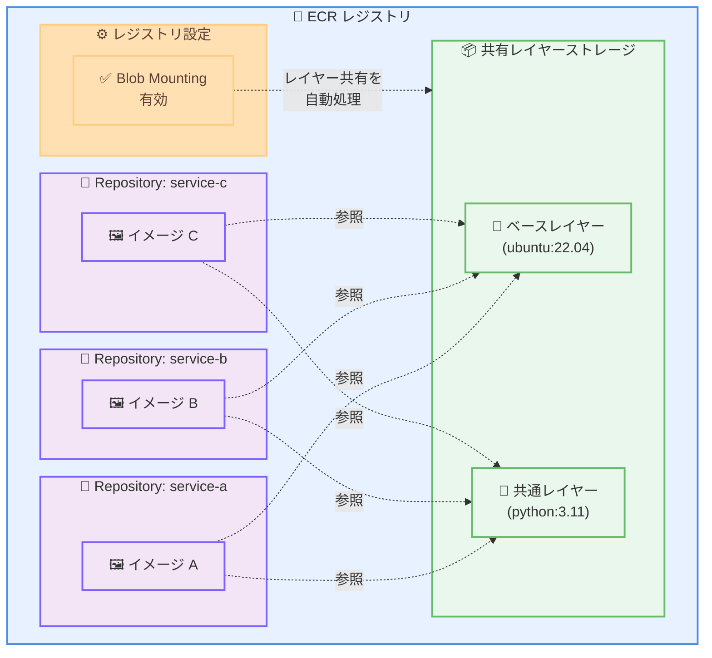

# Amazon ECR - クロスリポジトリレイヤー共有によるストレージ最適化とプッシュパフォーマンス向上

**リリース日**: 2026年1月20日
**サービス**: Amazon Elastic Container Registry (ECR)
**機能**: Blob Mounting によるクロスリポジトリレイヤー共有

## 概要

Amazon Elastic Container Registry (ECR) が、レジストリ内のリポジトリ間で共通のイメージレイヤーを共有できる Blob Mounting 機能をサポートするようになりました。この機能は、共通のベースイメージから構築された複数のマイクロサービスやアプリケーションを管理している場合に特に有効です。

Blob Mounting により、同一コンテンツを再アップロードする代わりに既存のレイヤーを再利用することで、イメージプッシュを高速化し、共通レイヤーを一度だけ保存してリポジトリ間で参照することでストレージコストを削減できます。

開始方法は簡単で、ECR コンソールまたは AWS CLI でレジストリレベルの設定を有効にするだけです。有効化すると、ECR はイメージプッシュ時にレイヤー共有を自動的に処理します。

**アップデート前の課題**

- 同じベースイメージから構築された複数のマイクロサービスで、同一のイメージレイヤーが各リポジトリに重複して保存されていた
- イメージプッシュ時に、既に他のリポジトリに存在する同一レイヤーを再度アップロードする必要があり、時間とネットワーク帯域を無駄にしていた
- ストレージコストが、重複するレイヤーの分だけ余分に発生していた
- 多数のマイクロサービスを持つ環境では、ストレージとプッシュ時間の問題が顕著だった

**アップデート後の改善**

- 共通のイメージレイヤーを一度だけ保存し、複数のリポジトリから参照できるようになり、ストレージコストが削減された
- 既存のレイヤーを再利用することで、イメージプッシュが高速化され、開発サイクルが短縮された
- レジストリレベルの設定を有効にするだけで、ECR が自動的にレイヤー共有を処理するようになった
- ネットワーク帯域の使用量が削減され、特に CI/CD パイプラインでのビルド時間が短縮された

## アーキテクチャ図



この図は、Blob Mounting により、複数のリポジトリが共通のベースレイヤーを参照する仕組みを示しています。共有レイヤーストレージに一度だけ保存され、各リポジトリのイメージから参照されます。

## サービスアップデートの詳細

### 主要機能

1. **Blob Mounting (クロスリポジトリレイヤー共有)**
   - レジストリ内の異なるリポジトリ間で、同一のイメージレイヤーを共有
   - 共通レイヤーを一度だけ保存し、複数のリポジトリから参照

2. **自動的なレイヤー共有処理**
   - レジストリレベルの設定を有効にするだけで、ECR が自動的にレイヤー共有を処理
   - アプリケーションやビルドプロセスの変更は不要

3. **高速なイメージプッシュ**
   - 既存のレイヤーを再利用することで、同一レイヤーの再アップロードが不要
   - CI/CD パイプラインでのビルド時間が短縮

4. **ストレージコストの削減**
   - 重複するレイヤーを排除し、ストレージ使用量を削減
   - 共通ベースイメージを使用するマイクロサービスが多いほど効果が大きい

## 設定方法

### 前提条件

1. Amazon ECR レジストリが作成されている
2. 適切な IAM 権限 (ECR レジストリ設定の変更権限) が付与されている

### 手順

#### ステップ1: AWS CLI で Blob Mounting を有効化

```bash
aws ecr put-registry-scanning-configuration \
  --registry-id <your-registry-id> \
  --blob-mount enabled
```

このコマンドは、レジストリレベルで Blob Mounting を有効化します。

#### ステップ2: 設定の確認

```bash
aws ecr describe-registry
```

レジストリ設定を確認し、Blob Mounting が有効になっていることを確認します。

#### ステップ3: イメージをプッシュ

```bash
# 既存の Docker イメージをビルド
docker build -t my-service:v1 .

# ECR にタグ付け
docker tag my-service:v1 <account-id>.dkr.ecr.us-east-1.amazonaws.com/my-service:v1

# イメージをプッシュ (ECR が自動的にレイヤー共有を処理)
docker push <account-id>.dkr.ecr.us-east-1.amazonaws.com/my-service:v1
```

Blob Mounting が有効な場合、ECR は既存のレイヤーを検出し、自動的に再利用します。

## メリット

### ビジネス面

- **コスト削減**: ストレージコストが削減され、特に多数のマイクロサービスを持つ環境で効果が大きい
- **開発速度の向上**: イメージプッシュが高速化され、CI/CD パイプラインの実行時間が短縮される
- **スケーラビリティの向上**: ストレージ使用量の増加を抑え、より多くのマイクロサービスをホストできる

### 技術面

- **ネットワーク帯域の節約**: 同一レイヤーの再アップロードが不要になり、ネットワーク帯域を節約
- **自動化**: レイヤー共有が自動的に処理され、手動での管理が不要
- **互換性**: 既存の Docker ワークフローやツールとの互換性を維持

## 利用可能リージョン

Blob Mounting は、以下のリージョンで利用可能です。

- すべての AWS Commercial リージョン
- AWS GovCloud (US) リージョン

## 関連サービス・機能

- **Amazon ECS**: ECR に保存されたコンテナイメージを使用してタスクを実行
- **Amazon EKS**: ECR に保存されたコンテナイメージを使用して Kubernetes ポッドを実行
- **AWS CodePipeline**: CI/CD パイプラインで ECR を使用してコンテナイメージをビルドとデプロイ

## 参考リンク

- [公式発表 (What's New)](https://aws.amazon.com/about-aws/whats-new/2026/01/amazon-ecr-cross-repository-layer-sharing/)
- [ECR レジストリ設定ドキュメント](https://docs.aws.amazon.com/AmazonECR/latest/userguide/registry-settings.html)
- [Amazon ECR ユーザーガイド](https://docs.aws.amazon.com/AmazonECR/latest/userguide/)

## まとめ

Amazon ECR の Blob Mounting 機能により、レジストリ内のリポジトリ間で共通のイメージレイヤーを共有できるようになりました。これにより、ストレージコストを削減し、イメージプッシュを高速化できます。レジストリレベルの設定を有効にするだけで、ECR が自動的にレイヤー共有を処理します。共通のベースイメージから構築された複数のマイクロサービスを管理しているお客様は、この機能を活用してコストと時間を削減することをお勧めします。
