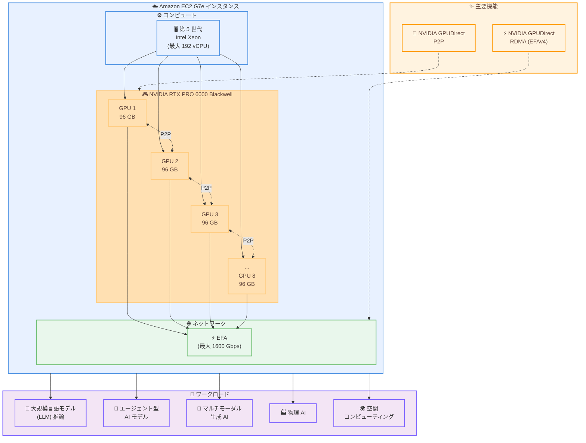

# Amazon EC2 G7e インスタンス - 一般提供開始

**リリース日**: 2026年1月20日
**サービス**: Amazon EC2
**機能**: G7e インスタンスの一般提供 (GA)

## 概要

Amazon は、NVIDIA RTX PRO 6000 Blackwell Server Edition GPU を搭載した Amazon Elastic Compute Cloud (Amazon EC2) G7e インスタンスの一般提供を発表しました。G7e インスタンスは、前世代の G6e と比較して最大 2.3 倍の推論パフォーマンスを提供します。

G7e インスタンスは、大規模言語モデル (LLM)、エージェント型 AI モデル、マルチモーダル生成 AI モデル、物理 AI モデルのデプロイに最適です。空間コンピューティングワークロード、およびグラフィックスと AI 処理の両方を必要とするワークロードで最高のパフォーマンスを発揮します。

G7e インスタンスは、最大 8 基の NVIDIA RTX PRO 6000 Blackwell Server Edition GPU (GPU あたり 96 GB のメモリ) と第 5 世代 Intel Xeon プロセッサを搭載しています。最大 192 個の仮想 CPU (vCPU) と最大 1600 Gbps の Elastic Fabric Adapter (EFA) ネットワーク帯域幅をサポートしています。

**アップデート前の課題**

- グラフィックスと AI 推論を同時に必要とするワークロードでは、前世代の G6e インスタンスでは性能が不足していた
- 大規模な LLM や マルチモーダル AI モデルの推論には、より高いメモリ容量と GPU パフォーマンスが必要だった
- 空間コンピューティングや物理 AI などの新しいワークロードに対応できる GPU が限られていた
- マルチ GPU ワークロードでの GPU 間通信のレイテンシが課題だった

**アップデート後の改善**

- G6e と比較して最大 2.3 倍の推論パフォーマンスを実現し、より高速な AI モデルの実行が可能になった
- GPU あたり 96 GB のメモリにより、より大規模なモデルをデプロイできるようになった
- NVIDIA GPUDirect P2P により、マルチ GPU ワークロードのパフォーマンスが向上した
- EFAv4 と NVIDIA GPUDirect RDMA により、EC2 UltraClusters でのマルチノードワークロードのレイテンシが削減された
- グラフィックスと AI 処理を同時に実行する空間コンピューティングワークロードで最高のパフォーマンスを提供

## アーキテクチャ図



この図は、G7e インスタンスの主要なアーキテクチャコンポーネントと、サポートされるワークロードを示しています。最大 8 基の NVIDIA RTX PRO 6000 Blackwell GPU が GPUDirect P2P で相互接続され、EFAv4 を介した高速ネットワーク通信をサポートしています。

## サービスアップデートの詳細

### 主要機能

1. **NVIDIA RTX PRO 6000 Blackwell Server Edition GPU**
   - 最新の NVIDIA Blackwell アーキテクチャを採用
   - GPU あたり 96 GB のメモリを搭載
   - 最大 8 基の GPU を搭載可能
   - G6e と比較して最大 2.3 倍の推論パフォーマンス

2. **第 5 世代 Intel Xeon プロセッサ**
   - 最大 192 個の仮想 CPU (vCPU) をサポート
   - 高性能な CPU と GPU の組み合わせにより、複雑なワークロードに対応

3. **高速ネットワーク接続**
   - Elastic Fabric Adapter (EFA) で最大 1600 Gbps のネットワーク帯域幅
   - NVIDIA GPUDirect Peer to Peer (P2P) によるマルチ GPU ワークロードの性能向上
   - NVIDIA GPUDirect RDMA with EFAv4 により、EC2 UltraClusters でのマルチノードワークロードのレイテンシを削減

4. **多様な購入オプション**
   - オンデマンドインスタンス
   - スポットインスタンス
   - Savings Plans

## 技術仕様

### インスタンススペック

| 項目 | 仕様 |
|------|------|
| GPU | NVIDIA RTX PRO 6000 Blackwell Server Edition (最大 8 基) |
| GPU メモリ | 96 GB/GPU |
| CPU | 第 5 世代 Intel Xeon プロセッサ |
| vCPU | 最大 192 |
| ネットワーク帯域幅 | 最大 1600 Gbps (EFA) |
| GPU 間通信 | NVIDIA GPUDirect P2P |
| マルチノード通信 | NVIDIA GPUDirect RDMA (EFAv4) |

### パフォーマンス比較

| 項目 | G7e | G6e |
|------|-----|-----|
| 推論パフォーマンス | 基準 | G7e の約 43% |
| GPU アーキテクチャ | NVIDIA Blackwell | 前世代 |
| GPU メモリ | 96 GB/GPU | 前世代より少ない |

## 設定方法

### 前提条件

1. AWS アカウントが作成されている
2. 適切な IAM 権限 (EC2 インスタンスの起動権限) が付与されている
3. G7e インスタンスが利用可能なリージョン (US East (N. Virginia), US East (Ohio)) を使用

### 手順

#### ステップ1: AWS コンソールからインスタンスを起動

1. AWS Management Console にログイン
2. EC2 ダッシュボードに移動
3. 「インスタンスを起動」をクリック
4. インスタンスタイプで「G7e」を検索して選択
5. AMI (Amazon Machine Image) を選択 (Deep Learning AMI 推奨)
6. ネットワーク設定、セキュリティグループを構成
7. 「インスタンスを起動」をクリック

#### ステップ2: AWS CLI からインスタンスを起動

```bash
aws ec2 run-instances \
  --image-id ami-xxxxxxxxx \
  --instance-type g7e.xlarge \
  --key-name your-key-pair \
  --security-group-ids sg-xxxxxxxxx \
  --subnet-id subnet-xxxxxxxxx
```

このコマンドは、指定した AMI、キーペア、セキュリティグループを使用して G7e インスタンスを起動します。

#### ステップ3: GPU の確認

```bash
# インスタンスにログイン後、GPU の状態を確認
nvidia-smi
```

NVIDIA System Management Interface (nvidia-smi) を使用して、GPU が正しく認識されているか確認します。

#### ステップ4: マルチ GPU ワークロードの設定 (オプション)

```python
# PyTorch でマルチ GPU を使用する例
import torch

# 利用可能な GPU 数を確認
num_gpus = torch.cuda.device_count()
print(f"利用可能な GPU 数: {num_gpus}")

# DataParallel を使用してモデルを複数 GPU に分散
model = YourModel()
if num_gpus > 1:
    model = torch.nn.DataParallel(model)
model = model.cuda()
```

## メリット

### ビジネス面

- **高速な AI 推論**: G6e と比較して最大 2.3 倍の推論パフォーマンスにより、エンドユーザーへのレスポンス時間が短縮され、顧客体験が向上
- **コスト効率**: より高速な推論により、同じワークロードをより少ないインスタンスで処理でき、コストを削減
- **新しいユースケースへの対応**: 空間コンピューティングや物理 AI などの新しいワークロードに対応し、ビジネスの幅を広げることが可能

### 技術面

- **大規模モデルのサポート**: GPU あたり 96 GB のメモリにより、より大規模な LLM やマルチモーダルモデルをデプロイ可能
- **マルチ GPU パフォーマンス**: NVIDIA GPUDirect P2P により、GPU 間のデータ転送が高速化され、マルチ GPU ワークロードの効率が向上
- **低レイテンシなマルチノード通信**: EFAv4 と NVIDIA GPUDirect RDMA により、EC2 UltraClusters でのマルチノードワークロードのレイテンシが削減
- **グラフィックスと AI の統合**: グラフィックスレンダリングと AI 推論を同時に実行でき、空間コンピューティングなどの新しいアプリケーションに最適

## デメリット・制約事項

### 制限事項

- 現在、US East (N. Virginia) と US East (Ohio) の 2 つのリージョンでのみ利用可能
- GPU メモリは 96 GB/GPU に固定されており、増減はできない
- EFAv4 と NVIDIA GPUDirect RDMA は EC2 UltraClusters でのみサポート

### 考慮すべき点

- G7e インスタンスは高性能な分、コストも高い (オンデマンド料金が高額)
- スポットインスタンスを使用する場合、中断のリスクがある
- Savings Plans を利用することで、オンデマンドと比較してコストを削減できるが、長期的なコミットメントが必要
- マルチ GPU ワークロードを最大限に活用するには、アプリケーション側でのコード最適化が必要

## ユースケース

### ユースケース1: 大規模言語モデル (LLM) の推論

**シナリオ**: チャットボットやコンテンツ生成アプリケーションで、数百億パラメータの LLM をリアルタイムで推論したい。

**実装例**:
```python
from transformers import AutoModelForCausalLM, AutoTokenizer
import torch

# モデルとトークナイザーをロード
model_name = "meta-llama/Llama-3-70B"
tokenizer = AutoTokenizer.from_pretrained(model_name)
model = AutoModelForCausalLM.from_pretrained(
    model_name,
    torch_dtype=torch.float16,
    device_map="auto"  # 複数 GPU に自動分散
)

# 推論の実行
prompt = "人工知能の未来について教えてください。"
inputs = tokenizer(prompt, return_tensors="pt").to("cuda")
outputs = model.generate(**inputs, max_length=200)
response = tokenizer.decode(outputs[0], skip_special_tokens=True)
print(response)
```

**効果**: 大規模な LLM を高速に推論でき、エンドユーザーへの応答時間を短縮できる。

### ユースケース2: マルチモーダル生成 AI

**シナリオ**: テキストから画像を生成する生成 AI アプリケーションで、高解像度の画像を短時間で生成したい。

**実装例**:
```python
from diffusers import StableDiffusionXLPipeline
import torch

# Stable Diffusion XL パイプラインをロード
pipe = StableDiffusionXLPipeline.from_pretrained(
    "stabilityai/stable-diffusion-xl-base-1.0",
    torch_dtype=torch.float16,
    variant="fp16"
)
pipe = pipe.to("cuda")

# 画像生成
prompt = "A futuristic city with flying cars and neon lights"
image = pipe(prompt, num_inference_steps=50).images[0]
image.save("generated_image.png")
```

**効果**: G6e と比較して最大 2.3 倍高速に画像を生成でき、ユーザー体験が向上する。

### ユースケース3: 空間コンピューティング

**シナリオ**: VR/AR アプリケーションで、リアルタイムのグラフィックスレンダリングと AI による物体認識を同時に実行したい。

**実装例**:
```python
# グラフィックスレンダリング (OpenGL/Vulkan) と AI 推論 (PyTorch) を並行実行
import threading

def render_graphics():
    # OpenGL/Vulkan でグラフィックスをレンダリング
    pass

def ai_inference():
    # PyTorch で物体認識を実行
    model = load_yolo_model()
    while True:
        frame = get_camera_frame()
        detections = model.predict(frame)
        update_scene_with_detections(detections)

# 並行実行
graphics_thread = threading.Thread(target=render_graphics)
ai_thread = threading.Thread(target=ai_inference)

graphics_thread.start()
ai_thread.start()
```

**効果**: グラフィックスと AI 処理を同時に高速実行でき、没入型の VR/AR 体験を提供できる。

## 料金

G7e インスタンスの料金は、インスタンスタイプ、購入オプション、リージョンによって異なります。

### 購入オプション

| 購入オプション | 特徴 | コスト削減 |
|--------------|------|-----------|
| オンデマンドインスタンス | 柔軟性が高く、長期コミットメント不要 | なし (定価) |
| スポットインスタンス | 未使用の EC2 容量を利用、中断のリスクあり | 最大 90% 削減 |
| Savings Plans | 1 年または 3 年のコミットメント | 最大 72% 削減 |

### 料金例 (概算)

料金の詳細は [Amazon EC2 料金ページ](https://aws.amazon.com/ec2/pricing/) を参照してください。

## 利用可能リージョン

G7e インスタンスは、以下のリージョンで利用可能です。

- **US East (N. Virginia)**: us-east-1
- **US East (Ohio)**: us-east-2

今後、他のリージョンへの展開が予定されています。

## 関連サービス・機能

- **Amazon EC2 UltraClusters**: EFAv4 と NVIDIA GPUDirect RDMA を活用した低レイテンシなマルチノードクラスター
- **AWS Deep Learning AMI**: GPU インスタンス向けの事前設定された機械学習フレームワークを含む AMI
- **Amazon SageMaker**: G7e インスタンスを使用してモデルのトレーニングとデプロイを簡素化
- **Elastic Fabric Adapter (EFA)**: 高性能なネットワークインターフェース

## 参考リンク

- [公式発表 (What's New)](https://aws.amazon.com/about-aws/whats-new/2026/01/amazon-g7e-instances-generally-available/)
- [G7e インスタンス詳細ページ](https://aws.amazon.com/ec2/instance-types/g7e/)
- [Amazon EC2 料金ページ](https://aws.amazon.com/ec2/pricing/)
- [AWS Management Console](https://console.aws.amazon.com/)

## まとめ

Amazon EC2 G7e インスタンスは、NVIDIA RTX PRO 6000 Blackwell Server Edition GPU を搭載し、G6e と比較して最大 2.3 倍の推論パフォーマンスを提供します。大規模言語モデル、マルチモーダル生成 AI、空間コンピューティングなどの高度な AI ワークロードに最適です。現在、US East (N. Virginia) と US East (Ohio) で利用可能で、オンデマンド、スポット、Savings Plans の購入オプションから選択できます。高性能な AI 推論が必要なお客様は、G7e インスタンスを検討することをお勧めします。
