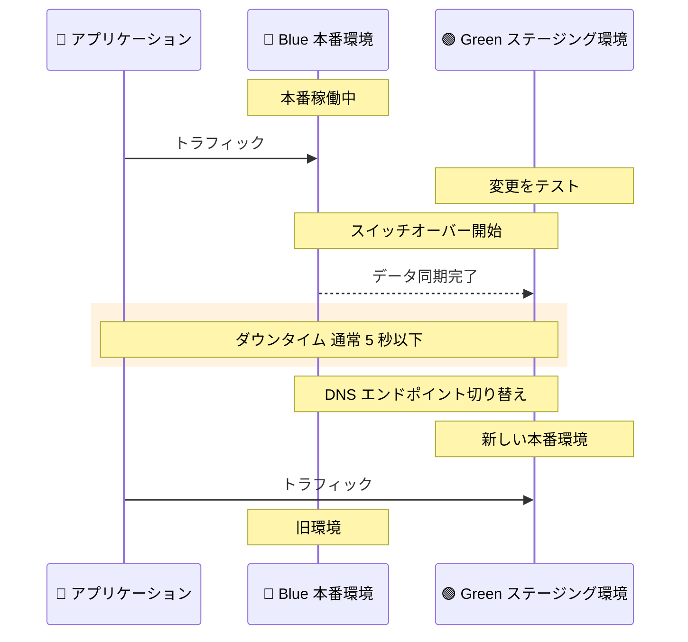

# Amazon RDS Blue/Green Deployments - ダウンタイムを 5 秒未満に短縮

**リリース日**: 2026年1月20日
**サービス**: Amazon RDS
**機能**: Blue/Green Deployments の高速スイッチオーバー

## 概要

Amazon Relational Database Service (Amazon RDS) が、Blue/Green Deployments のスイッチオーバーを高速化し、シングルリージョン構成でプライマリデータベース (ライターノード) のアップグレードダウンタイムを通常 5 秒以下に短縮しました。Blue/Green Deployment は、本番環境 (Blue) を安全に保ちながら、ステージング環境 (Green) で変更をテストし、アプリケーションエンドポイントの変更なしにシームレスなスイッチオーバーを可能にします。

スイッチオーバー中のデータベースライターインスタンスのダウンタイムは、接続方法によって異なります。シングルリージョン構成では、データベースエンドポイントに直接接続するアプリケーションは通常 5 秒以下のダウンタイムを経験し、AWS Advanced JDBC Driver を使用するアプリケーションは DNS 伝播遅延が解消されるため、通常 2 秒以下のダウンタイムとなります。

**アップデート前の課題**

- Blue/Green Deployments のスイッチオーバー時のダウンタイムが長く、メンテナンスウィンドウの確保が必要だった
- メジャーバージョンアップグレードやメンテナンス更新時に、アプリケーションへの影響が大きかった
- DNS 伝播遅延により、接続方法によってはさらに長いダウンタイムが発生していた

**アップデート後の改善**

- シングルリージョン構成でダウンタイムが通常 5 秒以下に短縮され、ほぼダウンタイムなしでアップグレードが可能になった
- AWS Advanced JDBC Driver を使用することで、ダウンタイムをさらに 2 秒以下に削減できるようになった
- メジャーバージョンアップグレード、メンテナンス更新、インスタンススケーリングなどの変更を、より柔軟に実施できるようになった

## アーキテクチャ図

この図は、Blue/Green Deployments のスイッチオーバープロセスを示しています。Green 環境でテストが完了後、わずか数秒のダウンタイムでトラフィックを切り替えます。

## サービスアップデートの詳細

### 主要機能

1. **5 秒以下の高速スイッチオーバー**
   - シングルリージョン構成でライターインスタンスのダウンタイムを通常 5 秒以下に短縮
   - データベースエンドポイントに直接接続する場合の標準的なダウンタイム

2. **AWS Advanced JDBC Driver で 2 秒以下**
   - AWS Advanced JDBC Driver を使用することで、DNS 伝播遅延を解消
   - ダウンタイムをさらに 2 秒以下に削減

3. **幅広い適用範囲**
   - メジャーバージョンのデータベースエンジンアップグレード
   - メンテナンス更新
   - インスタンススケーリング

4. **サポートするデータベースエンジン**
   - Amazon Aurora (PostgreSQL および MySQL 互換)
   - Amazon RDS for PostgreSQL
   - Amazon RDS for MySQL
   - Amazon RDS for MariaDB

## メリット

### ビジネス面

- **ビジネス継続性の向上**: わずか数秒のダウンタイムで、メンテナンスやアップグレードを実施でき、ビジネスへの影響を最小限に抑えられる
- **柔軟なメンテナンスウィンドウ**: ダウンタイムが短いため、メンテナンスウィンドウの確保が容易になり、運用の柔軟性が向上する

### 技術面

- **安全なアップグレード**: Green 環境で変更をテストしてから本番環境に適用できるため、リスクを最小限に抑えられる
- **アプリケーション変更不要**: エンドポイントの変更が不要で、アプリケーション側の修正なしでスイッチオーバーが可能
- **高速なロールバック**: 問題が発生した場合、すぐに Blue 環境に戻すことができる

## 利用可能リージョン

この機能は、すべての AWS リージョンで利用可能です。

## 関連サービス・機能

- **Amazon RDS**: マネージド型リレーショナルデータベースサービス
- **Amazon Aurora**: AWS が開発した高性能なクラウドネイティブデータベース
- **AWS Advanced JDBC Driver**: DNS 伝播遅延を解消する高度な JDBC ドライバー

## 参考リンク

- [公式発表 (What's New)](https://aws.amazon.com/about-aws/whats-new/2026/01/amazon-rds-blue-green-deployments-reduces-downtime/)
- [RDS Blue/Green Deployments ドキュメント](https://docs.aws.amazon.com/AmazonRDS/latest/AuroraUserGuide/blue-green-deployments-overview.html)
- [Blue/Green Deployment の作成方法](https://docs.aws.amazon.com/AmazonRDS/latest/AuroraUserGuide/blue-green-deployments-creating.html)
- [Amazon RDS コンソール](https://console.aws.amazon.com/rds/home)

## まとめ

Amazon RDS Blue/Green Deployments の高速スイッチオーバーにより、シングルリージョン構成でのダウンタイムが通常 5 秒以下に短縮されました。AWS Advanced JDBC Driver を使用することで、さらに 2 秒以下まで削減できます。メジャーバージョンアップグレードやメンテナンス更新を、ビジネスへの影響を最小限に抑えながら実施できるようになりました。データベースのアップグレードやメンテナンスを頻繁に行うお客様は、この機能を活用してダウンタイムを大幅に削減することをお勧めします。
