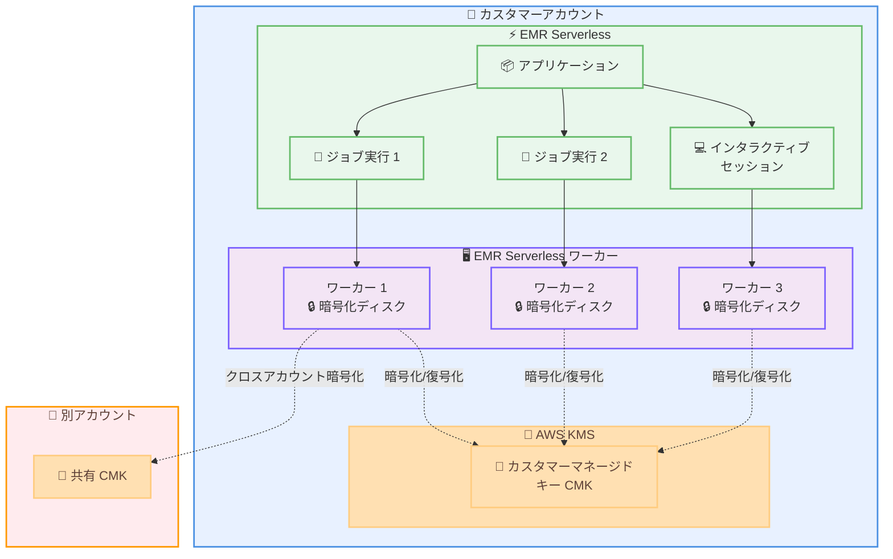

# Amazon EMR Serverless - AWS KMS カスタマーマネージド キーによるローカルディスク暗号化サポート

**リリース日**: 2026年1月21日
**サービス**: Amazon EMR Serverless
**機能**: AWS KMS カスタマーマネージド キーによるローカルディスク暗号化

## 概要

Amazon EMR Serverless が、ローカルディスクの暗号化に AWS Key Management Service (KMS) カスタマーマネージド キー (CMK) をサポートするようになりました。このアップデートにより、デフォルトの AWS 所有キーに加えて、より厳格な規制およびコンプライアンス要件を満たすための暗号化オプションが追加され、暗号化戦略をより細かく制御できるようになりました。

Amazon EMR Serverless は、クラスターやサーバーの構成、管理、スケーリングを行うことなく、データエンジニアやデータサイエンティストがオープンソースのビッグデータ分析フレームワークを簡単に実行できる Amazon EMR のデプロイオプションです。EMR Serverless ワーカーのローカルディスクは、デフォルトで AWS 所有キーを使用して暗号化されていましたが、今回のローンチにより、厳格な規制およびコンプライアンス要件を持つお客様は、同じアカウントまたは別のアカウントの AWS KMS カスタマーマネージド キー (CMK) を使用してローカルディスクを暗号化できるようになりました。

この機能は、新規または既存の EMR Serverless アプリケーションでサポートされ、すべてのサポートされている EMR リリースバージョンで利用できます。AWS KMS カスタマーマネージド キーは、アプリケーションレベルで指定してアプリケーション上のすべてのワークロードに適用することも、特定のジョブ実行またはインタラクティブセッションに対して指定することもできます。

**アップデート前の課題**

- EMR Serverless のローカルディスクは AWS 所有キーでのみ暗号化でき、カスタマーマネージド キーを使用できなかった
- 金融、医療、政府機関など、厳格な規制要件を持つ組織では、暗号化キーの完全な制御とポリシー管理が求められるが、それに対応できなかった
- 暗号化キーのローテーション、アクセス制御、監査ログを組織のセキュリティポリシーに従って管理することができなかった
- クロスアカウントでの暗号化キー共有が必要なマルチアカウント環境での運用が困難だった

**アップデート後の改善**

- AWS KMS カスタマーマネージド キー (CMK) を使用してローカルディスクを暗号化できるようになり、暗号化戦略を完全に制御可能になった
- 同じアカウント内のキーだけでなく、別のアカウントのキーも使用できるようになり、マルチアカウント環境での柔軟性が向上した
- アプリケーションレベル、またはジョブ実行・インタラクティブセッション単位で暗号化キーを指定でき、ワークロードごとに異なる暗号化ポリシーを適用できるようになった
- AWS CloudTrail を通じて KMS キーの使用状況を監視し、特定の EMR Serverless リソースがどのキーを使用したかを追跡できるようになった

## アーキテクチャ図



この図は、EMR Serverless アプリケーションがカスタマーマネージド キーを使用してワーカーノードのローカルディスクを暗号化する仕組みを示しています。アプリケーションレベル、または個別のジョブ実行・セッションレベルでキーを指定でき、別アカウントのキーも使用できます。

## サービスアップデートの詳細

### 主要機能

1. **カスタマーマネージド キー (CMK) によるローカルディスク暗号化**
   - EMR Serverless ワーカーのローカルディスクを AWS KMS カスタマーマネージド キーで暗号化
   - デフォルトの AWS 所有キーから、お客様が管理する CMK への切り替えが可能
   - 対称 KMS キーのみサポート

2. **クロスアカウント暗号化のサポート**
   - 同じアカウント内の KMS キーだけでなく、別のアカウントの KMS キーも使用可能
   - マルチアカウント環境での集中管理されたキー管理戦略を実現
   - 異なるチームや部門間でのキー共有が容易に

3. **柔軟なキー指定オプション**
   - **アプリケーションレベル**: アプリケーション作成時または更新時に `diskEncryptionConfiguration` を指定し、すべてのジョブ実行とセッションに適用
   - **ジョブ実行レベル**: 特定のジョブ実行に対して異なるキーを指定
   - **インタラクティブセッションレベル**: 特定のセッションに対して異なるキーを指定

4. **暗号化コンテキストのサポート**
   - 追加の認証データとして暗号化コンテキストを指定可能
   - AWS CloudTrail ログで暗号化操作を識別しやすくなる
   - 最大 8 つのキーと値のペアを設定可能

## 技術仕様

### 暗号化構成パラメータ

| パラメータ | 説明 | 必須 | 制限 |
|-----------|------|------|------|
| `encryptionKeyArn` | AWS KMS カスタマーマネージド キーの ARN | いいえ | 20〜2048 文字 |
| `encryptionContext` | 暗号化の追加認証データ (キーと値のマップ) | いいえ | 最大 8 ペア、キー: 1〜128 文字、値: 1〜384 文字 |

### KMS キーポリシーの要件

EMR Serverless が KMS キーを使用できるようにするには、以下のアクションを許可する必要があります。

```json
{
  "Version": "2012-10-17",
  "Statement": [
    {
      "Effect": "Allow",
      "Principal": {
        "Service": "emr-serverless.amazonaws.com"
      },
      "Action": [
        "kms:GenerateDataKey",
        "kms:Decrypt"
      ],
      "Resource": "*",
      "Condition": {
        "StringEquals": {
          "kms:EncryptionContext:aws:emr-serverless:application-id": "アプリケーション ID"
        }
      }
    }
  ]
}
```

### ジョブランタイムロールの権限

ジョブランタイムロールには、KMS キーを使用するための権限が必要です。

```json
{
  "Version": "2012-10-17",
  "Statement": [
    {
      "Effect": "Allow",
      "Action": [
        "kms:Decrypt",
        "kms:GenerateDataKey"
      ],
      "Resource": "arn:aws:kms:region:account-id:key/key-id"
    }
  ]
}
```

## 設定方法

### 前提条件

1. EMR Serverless アプリケーションが作成されている、または新規作成する準備ができている
2. AWS KMS カスタマーマネージド キーが作成されている
3. KMS キーポリシーに EMR Serverless サービスプリンシパルへの権限が設定されている
4. ジョブランタイムロールに KMS キーへのアクセス権限が付与されている

### 手順

#### ステップ1: KMS キーの作成 (既存のキーがない場合)

```bash
aws kms create-key \
  --description "EMR Serverless local disk encryption key" \
  --key-policy file://key-policy.json
```

このコマンドは、EMR Serverless のローカルディスク暗号化用の新しい KMS カスタマーマネージド キーを作成します。

#### ステップ2: アプリケーションレベルでの暗号化設定 (新規アプリケーション)

```bash
aws emr-serverless create-application \
  --name "my-spark-application" \
  --type SPARK \
  --release-label emr-7.0.0 \
  --disk-encryption-configuration '{
    "encryptionKeyArn": "arn:aws:kms:us-east-1:123456789012:key/abcd1234-5678-90ab-cdef-EXAMPLE11111",
    "encryptionContext": {
      "project": "data-analytics",
      "environment": "production"
    }
  }'
```

このコマンドは、指定した KMS キーでローカルディスクを暗号化する新しい EMR Serverless アプリケーションを作成します。暗号化コンテキストは監査目的で使用されます。

#### ステップ3: 既存アプリケーションの暗号化設定更新

```bash
aws emr-serverless update-application \
  --application-id <application-id> \
  --disk-encryption-configuration '{
    "encryptionKeyArn": "arn:aws:kms:us-east-1:123456789012:key/abcd1234-5678-90ab-cdef-EXAMPLE11111"
  }'
```

既存のアプリケーションに暗号化設定を追加または更新します。この設定は、次回のジョブ実行から適用されます。

#### ステップ4: ジョブ実行時に異なるキーを指定

```bash
aws emr-serverless start-job-run \
  --application-id <application-id> \
  --execution-role-arn <job-role-arn> \
  --job-driver '{
    "sparkSubmit": {
      "entryPoint": "s3://bucket/my-spark-job.py"
    }
  }' \
  --configuration-overrides '{
    "diskEncryptionConfiguration": {
      "encryptionKeyArn": "arn:aws:kms:us-east-1:123456789012:key/xyz789-different-key"
    }
  }'
```

特定のジョブ実行に対して、アプリケーションレベルとは異なる KMS キーを使用します。

## メリット

### ビジネス面

- **規制コンプライアンスの達成**: 金融、医療、政府機関などの厳格な規制要件に対応し、監査に合格しやすくなる
- **セキュリティポリシーの統一**: 組織全体で統一された暗号化キー管理ポリシーを適用でき、セキュリティガバナンスが向上する
- **運用コストの削減**: 暗号化キーの自動ローテーション、アクセス制御、監査ログにより、手動での管理作業が減少する

### 技術面

- **きめ細かなアクセス制御**: KMS キーポリシーと IAM ポリシーを組み合わせて、誰がどのデータにアクセスできるかを詳細に制御できる
- **監査とコンプライアンスの追跡**: AWS CloudTrail により、すべての暗号化操作を記録し、誰がいつどのキーを使用したかを追跡できる
- **マルチアカウント対応**: 異なるアカウント間でキーを共有し、集中管理されたセキュリティモデルを実現できる
- **柔軟な暗号化戦略**: アプリケーション、ジョブ、セッションごとに異なるキーを使用でき、ワークロードの要件に応じた暗号化設定が可能

## デメリット・制約事項

### 制限事項

- 対称 KMS キーのみサポート (非対称キーは使用不可)
- 暗号化コンテキストは最大 8 つのキーと値のペアまで
- 既に実行中のジョブには新しい暗号化設定は適用されない (次回のジョブ実行から有効)

### 考慮すべき点

- KMS キーの使用には追加コストが発生する (リクエストごとの料金)
- クロスアカウントキーを使用する場合、KMS キーポリシーとリソースポリシーの両方を正しく設定する必要がある
- KMS キーが削除または無効化された場合、そのキーで暗号化されたディスクを持つワーカーは起動できなくなる
- KMS キーへのアクセス権限が不適切な場合、ジョブの起動に失敗する可能性がある

## ユースケース

### ユースケース1: 金融機関でのコンプライアンス要件対応

**シナリオ**: 金融機関が PCI DSS や SOC 2 などのコンプライアンス要件を満たすため、すべてのデータ処理基盤でカスタマーマネージド キーによる暗号化が必要。

**実装例**:
```bash
# コンプライアンスチーム管理の KMS キーを使用
aws emr-serverless create-application \
  --name "financial-analytics" \
  --type SPARK \
  --release-label emr-7.0.0 \
  --disk-encryption-configuration '{
    "encryptionKeyArn": "arn:aws:kms:us-east-1:123456789012:key/compliance-key",
    "encryptionContext": {
      "compliance": "PCI-DSS",
      "data-classification": "highly-sensitive"
    }
  }'
```

**効果**: 監査時に CloudTrail ログで暗号化キーの使用状況を証明でき、コンプライアンス監査に合格しやすくなる。

### ユースケース2: マルチアカウント環境での集中管理

**シナリオ**: 複数の AWS アカウントで EMR Serverless を使用しているが、暗号化キーはセキュリティチームが管理する専用アカウントで一元管理したい。

**実装例**:
```bash
# セキュリティアカウントの KMS キーを使用
aws emr-serverless create-application \
  --name "cross-account-app" \
  --type SPARK \
  --release-label emr-7.0.0 \
  --disk-encryption-configuration '{
    "encryptionKeyArn": "arn:aws:kms:us-east-1:999999999999:key/centralized-key"
  }'
```

**効果**: セキュリティチームがすべてのアカウントの暗号化キーを一元管理でき、セキュリティポリシーの適用が容易になる。

### ユースケース3: ワークロードごとの異なる暗号化ポリシー

**シナリオ**: 同じアプリケーションで、本番環境と開発環境のジョブを実行するが、本番環境のジョブにはより厳格な暗号化キーを使用したい。

**実装例**:
```bash
# 本番環境のジョブ実行 (厳格なキー)
aws emr-serverless start-job-run \
  --application-id app-123 \
  --configuration-overrides '{
    "diskEncryptionConfiguration": {
      "encryptionKeyArn": "arn:aws:kms:us-east-1:123456789012:key/production-key",
      "encryptionContext": {"environment": "production"}
    }
  }' \
  --job-driver '{"sparkSubmit": {"entryPoint": "s3://bucket/prod-job.py"}}'

# 開発環境のジョブ実行 (標準キー)
aws emr-serverless start-job-run \
  --application-id app-123 \
  --configuration-overrides '{
    "diskEncryptionConfiguration": {
      "encryptionKeyArn": "arn:aws:kms:us-east-1:123456789012:key/dev-key",
      "encryptionContext": {"environment": "development"}
    }
  }' \
  --job-driver '{"sparkSubmit": {"entryPoint": "s3://bucket/dev-job.py"}}'
```

**効果**: 環境ごとに異なるセキュリティポリシーを適用でき、本番環境のデータをより厳格に保護できる。

## 料金

### KMS 料金

AWS KMS カスタマーマネージド キーの使用には以下の料金が発生します。

- **キーの保管**: $1.00/月 (キーごと)
- **暗号化/復号化リクエスト**: $0.03/10,000 リクエスト (最初の 100 万リクエストまで無料枠あり)

### EMR Serverless 料金

EMR Serverless 自体の料金は変わりませんが、KMS キーの使用により以下の追加コストが発生します。

| 使用量 | 月額 KMS 料金（概算） |
|--------|----------------------|
| キー 1 つ + 100,000 リクエスト | $1.30 |
| キー 1 つ + 1,000,000 リクエスト | $1.00 (キー保管のみ、無料枠内) |
| キー 3 つ + 500,000 リクエスト | $3.00 |

※ワーカーノードの起動・停止時に暗号化・復号化リクエストが発生します。

## 利用可能リージョン

この機能は、以下のリージョンで利用可能です。

- すべてのサポートされている EMR リリースおよび EMR Serverless が利用可能なすべての AWS リージョン
- AWS GovCloud (US) リージョン
- 中国リージョン

詳細は [AWS リージョン表](https://aws.amazon.com/about-aws/global-infrastructure/regional-product-services/) を参照してください。

## 関連サービス・機能

- **AWS Key Management Service (KMS)**: 暗号化キーの作成と管理を行うマネージドサービス
- **AWS CloudTrail**: KMS キーの使用状況を監視し、監査ログを記録するサービス
- **AWS Secrets Manager**: EMR Serverless で使用するシークレット (データベース認証情報など) を安全に保管し、KMS で暗号化
- **Amazon S3**: EMR Serverless と連携し、S3 に保存されるデータも KMS キーで暗号化可能

## 参考リンク

- [公式発表 (What's New)](https://aws.amazon.com/about-aws/whats-new/2026/01/amazon-emr-serverless-aws-kms-customer-managed/)
- [ドキュメント: Local Disk Encryption with AWS KMS CMK](https://docs.aws.amazon.com/emr/latest/EMR-Serverless-UserGuide/disk-encryption-cmk.html)
- [Amazon EMR Serverless ユーザーガイド](https://docs.aws.amazon.com/emr/latest/EMR-Serverless-UserGuide/)
- [AWS KMS デベロッパーガイド](https://docs.aws.amazon.com/kms/latest/developerguide/)

## まとめ

Amazon EMR Serverless の AWS KMS カスタマーマネージド キーサポートにより、厳格な規制・コンプライアンス要件を持つ組織でも、ローカルディスクの暗号化を完全に制御できるようになりました。アプリケーション、ジョブ、セッションごとに異なるキーを指定でき、マルチアカウント環境での集中管理も可能です。金融、医療、政府機関などのお客様は、この機能を活用して、セキュリティポリシーに準拠したデータ処理基盤を構築することをお勧めします。
